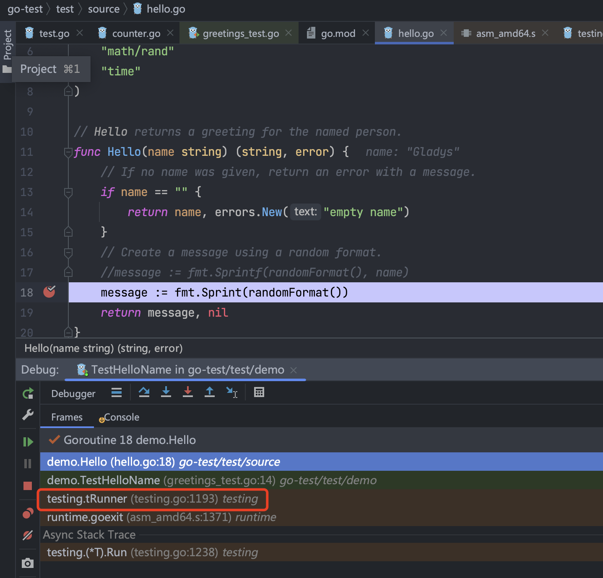

- # go test

Go 以内置单元测试。具体来说，使用命名约定、Go 的`testing`包和`go test`命令，您可以快速编写和执行测试。  

## 创建目录，文件已`*_test.go`命名  

`greetings_test.go`  

```go
package greetings

import (
    "testing"
    "regexp"
)

// TestHelloName calls greetings.Hello with a name, checking
// for a valid return value.
func TestHelloName(t *testing.T) {
    name := "Gladys"
    want := regexp.MustCompile(`\b`+name+`\b`)
    msg, err := Hello("Gladys")
    if !want.MatchString(msg) || err != nil {
        t.Fatalf(`Hello("Gladys") = %q, %v, want match for %#q, nil`, msg, err, want)
    }
}

// TestHelloEmpty calls greetings.Hello with an empty string,
// checking for an error.
func TestHelloEmpty(t *testing.T) {
    msg, err := Hello("")
    if msg != "" || err == nil {
        t.Fatalf(`Hello("") = %q, %v, want "", error`, msg, err)
    }
}
```

`Hello`函数
```go
// Hello returns a greeting for the named person.
func Hello(name string) (string, error) {
    // If no name was given, return an error with a message.
    if name == "" {
        return name, errors.New("empty name")
    }
    // Create a message using a random format.
    message := fmt.Sprintf(randomFormat(), name)
    return message, nil
}
```

## 测试函数`TestXxx`  
测试函数格式
```go
func TestHelloEmpty(t *testing.T) {
    // ToDo 
}
```

## `go test`运行测试  

```shell
$ go test
PASS
ok      example.com/greetings   0.364s

$ go test -v
=== RUN   TestHelloName
--- PASS: TestHelloName (0.00s)
=== RUN   TestHelloEmpty
--- PASS: TestHelloEmpty (0.00s)
PASS
ok      example.com/greetings   0.372s
```

测试指定函数
```shell
go test -v greetings_test.go -test.run TestHelloEmpty
```

## 测试失败时函数断点  
`greetings.Hello`  

可以Debug模式启动测试，在想要测试的地方进行断点调式  

<br>
<div align=center>
    </img>  
</div>
<br>


## 增加Flag  

```go
var (
	enableSysTests = flag.Bool("run_system_tests", false, "Run tests that operate against the live kernel")
)
```

```shell
go test -v -run_system_tests true -cpuprofile=prof.out
```

内置flag
-cpu 1,2,4   
指定执行测试或基准的 GOMAXPROCS 值的列表。默认为GOMAXPROCS的当前值。

-failfast  
第一次测试失败后，不要再开始新的测试。

-list regexp  
列出与正则表达式匹配的测试、基准或示例。


