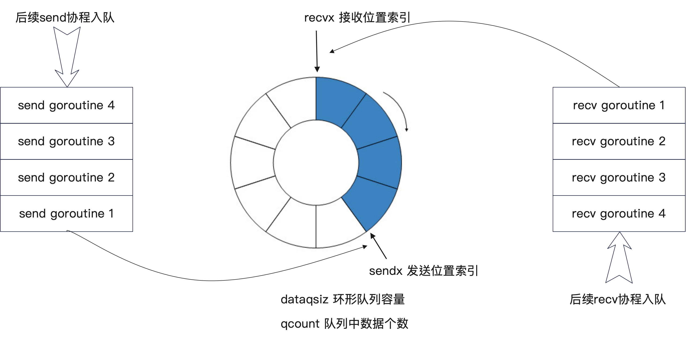

# Channel实现 
## 测试demo
```go
package main

import (
	"fmt"
	"time"
)

func main() {
	ch := make(chan string)

	go func() {
		ch <- "hello channel"
		ch <- "!"
		ch <- "quit"
	}()

	//需要延迟一段时间，要不然接收不到数据
	time.Sleep(time.Second)

	str := <-ch
	fmt.Println("recv:", str)

	for { //
		select {
		case str := <-ch:
			fmt.Println(str)
			if str == "quit" {
				goto end
			}
		default:
			fmt.Println("default")
		}
	}
end:
}
```

## 数据结构 

`chan`的数据结构在`go/src/runtime/chan.go`
```go
type hchan struct {
	qcount   uint           // total data in the queue
	dataqsiz uint           // size of the circular queue
	buf      unsafe.Pointer // points to an array of dataqsiz elements
	elemsize uint16
	closed   uint32
	elemtype *_type // element type
	sendx    uint   // send index
	recvx    uint   // receive index
	recvq    waitq  // list of recv waiters
	sendq    waitq  // list of send waiters

	// lock protects all fields in hchan, as well as several
	// fields in sudogs blocked on this channel.
	//
	// Do not change another G's status while holding this lock
	// (in particular, do not ready a G), as this can deadlock
	// with stack shrinking.
	lock mutex
}

type waitq struct {
    first *sudog
    last  *sudog
}

``` 

- `qcount` — Channel 中的元素个数；
- `dataqsiz` — Channel 中的循环队列的长度；
- `buf` — Channel 的缓冲区数据指针(环形队列数据区)；
- `sendx` — Channel 的发送操作处理到的位置；
- `recvx` — Channel 的接收操作处理到的位置；

/Users/ymm/work/mygithub/golang-cookbook/

## 架构图

<br>
<div align=center>
    </img>  
</div>
<br>

## 实现原理 
源码实现在`go/src/runtime/chan.go`，目前主要关注**收发**的实现  
先看发送的实现，`ch <- "hello channel"`的调用栈如下
```shell
runtime.chansend (chan.go:158) runtime
runtime.chansend1 (chan.go:143) runtime
main.main.func1 (base-select.go:12) main
runtime.goexit (asm_amd64.s:1371) runtime
- Async Stack Trace
main.main (base-select.go:11) main
``` 

调用函数
> // sudog represents a g in a wait list, such as for sending/receiving on a channel.  
> 处于等待状态的goroutine 

```go
// entry point for c <- x from compiled code
//go:nosplit
func chansend1(c *hchan, elem unsafe.Pointer) {
	chansend(c, elem, true, getcallerpc())
}

// 主要逻辑
func chansend(c *hchan, ep unsafe.Pointer, block bool, callerpc uintptr) bool {
    if c.closed != 0 {
        unlock(&c.lock)
        panic(plainError("send on closed channel"))
    }
	
	if sg := c.recvq.dequeue(); sg != nil { // 如果有等待接收的Goroutine，直接发送 
		// Found a waiting receiver. We pass the value we want to send
		// directly to the receiver, bypassing the channel buffer (if any).
		send(c, sg, ep, func() { unlock(&c.lock) }, 3) //
		return true
	}

    // Block on the channel. Some receiver will complete our operation for us.
    gp := getg() // returns the pointer to the current g.
    mysg := acquireSudog() // 
    mysg.releasetime = 0
    if t0 != 0 {
    	mysg.releasetime = -1
    }
    // No stack splits between assigning elem and enqueuing mysg
    // on gp.waiting where copystack can find it.
    mysg.elem = ep
    mysg.waitlink = nil
    mysg.g = gp
    mysg.isSelect = false
    mysg.c = c
    gp.waiting = mysg
    gp.param = nil
    c.sendq.enqueue(mysg)
    // Signal to anyone trying to shrink our stack that we're about
    // to park on a channel. The window between when this G's status
    // changes and when we set gp.activeStackChans is not safe for
    // stack shrinking.
    atomic.Store8(&gp.parkingOnChan, 1)
	// 阻塞goroutine
    gopark(chanparkcommit, unsafe.Pointer(&c.lock), waitReasonChanSend, traceEvGoBlockSend, 2) 
	
}
```  
如果`recvq`队列中有等待接收的`Goroutine`, 会直接发送`Goroutine`的`elem unsafe.Pointer // data element (may point to stack)` 中  
如果没有等待接收的`Goroutine`, 存储的代码`mysg := acquireSudog(); mysg.elem = ep; c.sendq.enqueue(mysg)`, 数据会存储在发送队列`sendq`中,
其实`sendq`就是待发送的协程等待队列，比如A、B两个协程往C协程发送数据，C处理不过来，这是按照先后顺序排队(堵塞)，等`channel`队列大小可用时，再按顺序发送  

> 比如有一个channel,大小为1，有1000个协程发送数据，2个协程接收数据，很多发送协程处于block状态  

`chan_demo2`  
```go
package main

import (
	"fmt"
	"net/http"
	_ "net/http/pprof"
	"strconv"
	"time"
)

func main() {
	msgQueue := make(chan string, 1)
	go listenQueue(msgQueue, "queue1")
	go listenQueue(msgQueue, "queue2")
	
	num := 1000
	i := 0
	for i < num {
		go func() {
			msgQueue <- "data" + strconv.Itoa(i)
		}()
		i++
	}

	fmt.Println("queue len=", len(msgQueue), ",cap=", cap(msgQueue))
	err := http.ListenAndServe("0.0.0.0:6080", nil)
	if err != nil {
		fmt.Println(err.Error())
		return
	}
	fmt.Println(" == done == ")
}

func listenQueue(queue chan string, tag string) {
	fmt.Println("queue=", len(queue))
	for {
		select {
		case msg := <-queue:
			fmt.Println(tag, " data:", msg)
			time.Sleep(time.Millisecond * 100)
		}
	}
}
```

查看打印信息`887`线程处于发送状态
`http://127.0.0.1:6080/debug/pprof/goroutine?debug=1`
```shell
goroutine profile: total 892
887 @ 0x103b8a5 0x1006e7a 0x1006bd5 0x128e567 0x10715e1
#	0x128e566	main.main.func1+0xa6	/Users/ymm/work/mygithub/unixsoket-mysql-prof/test/chan_demo2/chan_demo2.go:23
```

查看协程栈详情信息，看到`goroutine 175 [chan send]`状态  
`http://127.0.0.1:6080/debug/pprof/goroutine?debug=2`
```shell
goroutine 175 [chan send]:
main.main.func1(0xc0001067e0, 0xc00001e9e0)
	/Users/ymm/work/mygithub/unixsoket-mysql-prof/test/chan_demo2/chan_demo2.go:20 +0xa7
created by main.main
	/Users/ymm/work/mygithub/unixsoket-mysql-prof/test/chan_demo2/chan_demo2.go:19 +0xf9
```


下面查看如何接收数据
```go
select {
		case str := <-ch:
// 调用栈信息:
runtime.chanrecv (chan.go:454) runtime
runtime.selectnbrecv (chan.go:708) runtime
main.main (base-select.go:22) main
runtime.main (proc.go:225) runtime
runtime.goexit (asm_amd64.s:1371) runtime
- Async Stack Trace
runtime.rt0_go (asm_amd64.s:226) runtime
```  

主要实现代码  
```go
func chanrecv(c *hchan, ep unsafe.Pointer, block bool) (selected, received bool) {
    if c.closed != 0 && c.qcount == 0 {
		// 
    }
	
    if sg := c.sendq.dequeue(); sg != nil {
        // Found a waiting sender. If buffer is size 0, receive value
        // directly from sender. Otherwise, receive from head of queue
        // and add sender's value to the tail of the queue (both map to
        // the same buffer slot because the queue is full).
        recv(c, sg, ep, func() { unlock(&c.lock) }, 3)
        return true, true
    }
}
//结束c.sendq.dequeue() 的数据
func recv(c *hchan, sg *sudog, ep unsafe.Pointer, unlockf func(), skip int) {
	if c.dataqsiz == 0 {
		if raceenabled {
			racesync(c, sg)
		}
		if ep != nil {
			// copy data from sender
			recvDirect(c.elemtype, sg, ep)
		}
	} else {
		...
    }
	
    unlockf()
    gp.param = unsafe.Pointer(sg)
    sg.success = true
    if sg.releasetime != 0 {
        sg.releasetime = cputicks()
    }
	// 唤醒
    goready(gp, skip+1)
}
//直接把dequeue的数据赋值被接收的变量  
func recvDirect(t *_type, sg *sudog, dst unsafe.Pointer) {
	// dst is on our stack or the heap, src is on another stack.
	// The channel is locked, so src will not move during this
	// operation.
	src := sg.elem
	typeBitsBulkBarrier(t, uintptr(dst), uintptr(src), t.size)
	memmove(dst, src, t.size)
}
```  
从以上代码可以看出，数据没有存储到`环形队列`中，要不是直接发送到目标`Goroutine`的`elem`中，要不就是`sendq`与`recvq`直接数据拷贝。  

从代码可以看出，有没有往队列中存储的关键在于`c.dataqsiz = uint(size)`，创建`channel`时设置的`func makechan(t *chantype, size int) *hchan`  
现在把测试代码中`ch := make(chan string)` 修改为`ch := make(chan string， 1)`  
多次接收数据会调用如下:  
```go
func chansend(c *hchan, ep unsafe.Pointer, block bool, callerpc uintptr) bool {

	// 如果环形队列满了，就会存储到 sendq中(双向链表)  
 	if c.qcount < c.dataqsiz { //c.qcount = 0 ; c.dataqsiz = 1
		// Space is available in the channel buffer. Enqueue the element to send.
		qp := chanbuf(c, c.sendx)
		if raceenabled {
			racenotify(c, c.sendx, nil)
		}
		typedmemmove(c.elemtype, qp, ep)
		c.sendx++
		if c.sendx == c.dataqsiz {
			c.sendx = 0
		}
		c.qcount++ // 1
		unlock(&c.lock)
		return true
	}
}
```  
目前往`channel`中发送数据时，如果有等待接收的`goroutine`会直接发送到`elem`中，
如果没有接收的`goroutine`, 会再判断`环形队列`有没有满，如果没满，先存放队列中，如果队列满了或者没有空间，最终放到`sendq`中。  


