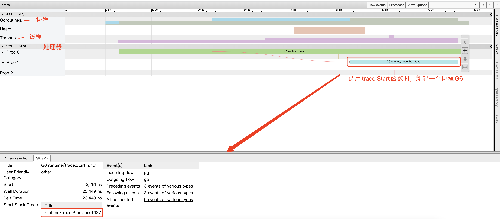
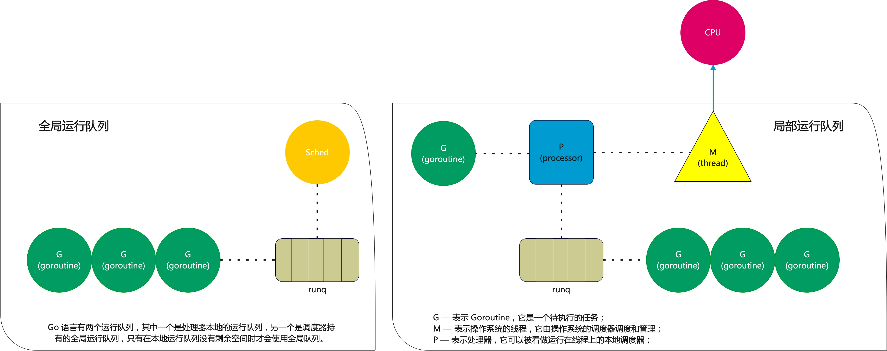

- # goroutine 
  
- [测试代码](#测试代码)
- [数据结构](#数据结构)
- [协程Goroutine](#协程goroutine)
	- [多个协程是否在一个线程中呢? 由调度器决定](#多个协程是否在一个线程中呢-由调度器决定)
	- [协程id获取](#协程id获取)
- [main函数的执行流程](#main函数的执行流程)
- [GMP 模型](#gmp-模型)
	- [GMP 调试](#gmp-调试)
	- [GMP之间的关系](#gmp之间的关系)
## 测试代码
```go
func main() {
	for i := 0; i < 10; i++ {
		tag := i

		go func() {
			for {
				fmt.Println("goroutine:", tag)
				time.Sleep(time.Microsecond * 100)
			}
		}()
	}
	time.Sleep(time.Minute)
}
```

## 数据结构 
源码文件`go/src/runtime/runtime2.go`  
``` go
type g struct {
	// Stack parameters.
	// stack describes the actual stack memory: [stack.lo, stack.hi).
	// stackguard0 is the stack pointer compared in the Go stack growth prologue.
	// It is stack.lo+StackGuard normally, but can be StackPreempt to trigger a preemption.
	// stackguard1 is the stack pointer compared in the C stack growth prologue.
	// It is stack.lo+StackGuard on g0 and gsignal stacks.
	// It is ~0 on other goroutine stacks, to trigger a call to morestackc (and crash).
	stack       stack   // offset known to runtime/cgo
	stackguard0 uintptr // offset known to liblink
	stackguard1 uintptr // offset known to liblink

	_panic       *_panic // innermost panic - offset known to liblink
	_defer       *_defer // innermost defer
	m            *m      // current m; offset known to arm liblink
	sched        gobuf
	syscallsp    uintptr        // if status==Gsyscall, syscallsp = sched.sp to use during gc
	syscallpc    uintptr        // if status==Gsyscall, syscallpc = sched.pc to use during gc
	stktopsp     uintptr        // expected sp at top of stack, to check in traceback
	param        unsafe.Pointer // passed parameter on wakeup
	atomicstatus uint32
	stackLock    uint32 // sigprof/scang lock; TODO: fold in to atomicstatus
	goid         int64
	schedlink    guintptr
	waitsince    int64      // approx time when the g become blocked
	waitreason   waitReason // if status==Gwaiting

	preempt       bool // preemption signal, duplicates stackguard0 = stackpreempt
	preemptStop   bool // transition to _Gpreempted on preemption; otherwise, just deschedule
	preemptShrink bool // shrink stack at synchronous safe point

	// asyncSafePoint is set if g is stopped at an asynchronous
	// safe point. This means there are frames on the stack
	// without precise pointer information.
	asyncSafePoint bool

	paniconfault bool // panic (instead of crash) on unexpected fault address
	gcscandone   bool // g has scanned stack; protected by _Gscan bit in status
	throwsplit   bool // must not split stack
	// activeStackChans indicates that there are unlocked channels
	// pointing into this goroutine's stack. If true, stack
	// copying needs to acquire channel locks to protect these
	// areas of the stack.
	activeStackChans bool
	// parkingOnChan indicates that the goroutine is about to
	// park on a chansend or chanrecv. Used to signal an unsafe point
	// for stack shrinking. It's a boolean value, but is updated atomically.
	parkingOnChan uint8

	raceignore     int8     // ignore race detection events
	sysblocktraced bool     // StartTrace has emitted EvGoInSyscall about this goroutine
	sysexitticks   int64    // cputicks when syscall has returned (for tracing)
	traceseq       uint64   // trace event sequencer
	tracelastp     puintptr // last P emitted an event for this goroutine
	lockedm        muintptr
	sig            uint32
	writebuf       []byte
	sigcode0       uintptr
	sigcode1       uintptr
	sigpc          uintptr
	gopc           uintptr         // pc of go statement that created this goroutine
	ancestors      *[]ancestorInfo // ancestor information goroutine(s) that created this goroutine (only used if debug.tracebackancestors)
	startpc        uintptr         // pc of goroutine function
	racectx        uintptr
	waiting        *sudog         // sudog structures this g is waiting on (that have a valid elem ptr); in lock order
	cgoCtxt        []uintptr      // cgo traceback context
	labels         unsafe.Pointer // profiler labels
	timer          *timer         // cached timer for time.Sleep
	selectDone     uint32         // are we participating in a select and did someone win the race?

	// Per-G GC state

	// gcAssistBytes is this G's GC assist credit in terms of
	// bytes allocated. If this is positive, then the G has credit
	// to allocate gcAssistBytes bytes without assisting. If this
	// is negative, then the G must correct this by performing
	// scan work. We track this in bytes to make it fast to update
	// and check for debt in the malloc hot path. The assist ratio
	// determines how this corresponds to scan work debt.
	gcAssistBytes int64
}
```

内存中的`goroutine`结构  
```
gp = {*runtime.g | 0xc000082480} 
 stack = {runtime.stack} 
 stackguard0 = {uintptr} 18446744073709550302
 stackguard1 = {uintptr} 18446744073709551615
 _panic = {*runtime._panic | 0x0} nil
 _defer = {*runtime._defer | 0x0} nil
 m = {*runtime.m | 0x1175440} 
 sched = {runtime.gobuf} 
 syscallsp = {uintptr} 0
 syscallpc = {uintptr} 0
 stktopsp = {uintptr} 824633911256
 param = {unsafe.Pointer} 
 atomicstatus = {uint32} 2
 stackLock = {uint32} 0
 goid = {int64} 18
 schedlink = {runtime.guintptr} 824633721216
 waitsince = {int64} 0
 waitreason = {runtime.waitReason} waitReasonZero (0)
 preempt = {bool} true
 preemptStop = {bool} false
 preemptShrink = {bool} false
 asyncSafePoint = {bool} false
 paniconfault = {bool} false
 gcscandone = {bool} false
 throwsplit = {bool} false
 activeStackChans = {bool} false
 parkingOnChan = {uint8} 0
 raceignore = {int8} 0
 sysblocktraced = {bool} false
 sysexitticks = {int64} 0
 traceseq = {uint64} 0
 tracelastp = {runtime.puintptr} 0
 lockedm = {runtime.muintptr} 0
 sig = {uint32} 0
 writebuf = {[]uint8} nil
 sigcode0 = {uintptr} 0
 sigcode1 = {uintptr} 0
 sigpc = {uintptr} 0
 gopc = {uintptr} 17612210
 ancestors = {*[]runtime.ancestorInfo | 0x0} nil
 startpc = {uintptr} 17613184
 racectx = {uintptr} 0
 waiting = {*runtime.sudog | 0x0} nil
 cgoCtxt = {[]uintptr} nil
 labels = {unsafe.Pointer} 
 timer = {*runtime.timer | 0x0} nil
 selectDone = {uint32} 0
 gcAssistBytes = {int64} 0 
``` 

## 协程Goroutine  
- 轻量级"线程"
- 非抢占式多任务处理, 由协程主动交出控制权
- 编译器/解释器/虚拟机层面的多任务(Go有着自己的调度器, 不是操作系统层面的)
- 多个协程可能在一个或多个线程上运行
- 手动交出控制权: runtime.Gosched()   

### 多个协程是否在一个线程中呢? 由调度器决定 
手动开启10个协程，查看协程数
```go
package main

import (
	"fmt"
	"time"
)

func main() {
	for i := 0; i < 10; i++ {
		tag := i

		go func() {
			for {
				fmt.Println("goroutine:", tag)
				time.Sleep(time.Microsecond * 100)
			}
		}()
	}
	time.Sleep(time.Minute)
}

```

输出:  
```
...
goroutine: 8
goroutine: 7
goroutine: 2
goroutine: 6
goroutine: 5
goroutine: 4
goroutine: 1
goroutine: 3
goroutine: 8
goroutine: 0
goroutine: 1
goroutine: 7
goroutine: 3
goroutine: 2
goroutine: 6
goroutine: 5
goroutine: 4
goroutine: 9
goroutine: 7
goroutine: 8
goroutine: 2
goroutine: 9
goroutine: 5
goroutine: 1
goroutine: 3
goroutine: 0
goroutine: 4
goroutine: 6
goroutine: 6
goroutine: 4
goroutine: 7
goroutine: 1
```

`idea`占用的线程数也不固定:
> `#TH`表示线程，总线程数/活跃线程数，75/5 表示总线程数是75，活跃线程数是5.
```
PID    COMMAND      %CPU  TIME     #TH   #WQ  #PORT MEM    PURG   CMPRS  PGRP  PPID  STATE    BOOSTS 
19219  idea         126.6 32:44.40 75/5  2    568   3580M+ 1536K  229M-  19219 1     running  *0[782]

19219  idea         130.9 34:05.62 80/2  4    580-  3595M- 1556K  218M-  19219 1     running  *0[804]

19219  idea         157.1 34:33.44 82/4  5/2  585-  3644M+ 3840K  210M-  19219 1     running  *0-[807

19219  idea         129.1 34:53.57 82/3  5    585   3619M+ 5468K  210M-  19219 1     running  *0[811]
```  

### 协程id获取
```go
package main

import (
    "bytes"
    "fmt"
    "runtime"
    "strconv"
)

func main() {
    fmt.Println(GetGID())
}

func GetGID() uint64 {
    b := make([]byte, 64)
    b = b[:runtime.Stack(b, false)]
    b = bytes.TrimPrefix(b, []byte("goroutine "))
    b = b[:bytes.IndexByte(b, ' ')]
    n, _ := strconv.ParseUint(string(b), 10, 64)
    return n
}
```

输出
```shell
1
```

## main函数的执行流程  
```go
package main

func main() {
	// code
}
```

函数调用栈
```shell
main.main (base-goroutine.go:9) main
runtime.main (proc.go:225) runtime
runtime.goexit (asm_amd64.s:1371) runtime
 - Async Stack Trace
runtime.rt0_go (asm_amd64.s:226) runtime
``` 

`go/src/runtime/proc.go`调用`自己实现的main函数`, 启动的也是一个`协程`，
名称为`Goroutine 1 main.main`, idea也可以查看当前协程所在的线程`Thread 253720 main.main`  
```go
// The main goroutine.
func main() {
	g := getg()

	// Racectx of m0->g0 is used only as the parent of the main goroutine.
	// It must not be used for anything else.
	g.m.g0.racectx = 0

	// Max stack size is 1 GB on 64-bit, 250 MB on 32-bit.
	// Using decimal instead of binary GB and MB because
	// they look nicer in the stack overflow failure message.
	if sys.PtrSize == 8 {
		maxstacksize = 1000000000
	} else {
		maxstacksize = 250000000
	}
	
    fn := main_main // make an indirect call, as the linker doesn't know the address of the main package when laying down the runtime
	fn()
	if raceenabled {
		racefini()
	}
	...
```  

## GMP 模型
```go
g := getg()  // 获取当前协程

func acquireSudog() *sudog {
    mp := acquirem() //return _g_.m 当前goroutine所在的线程(M)
	pp := mp.p.ptr() // 获取当前goroutine所在的调度器(P)
}
``` 

`go/src/runtime/proc.go`注释写到  
```
// Goroutine scheduler
// The scheduler's job is to distribute ready-to-run goroutines over worker threads.
//
// The main concepts are:
// G - goroutine.
// M - worker thread, or machine.
// P - processor, a resource that is required to execute Go code.
//     M must have an associated P to execute Go code, however it can be
//     blocked or in a syscall w/o an associated P.
//
// Design doc at https://golang.org/s/go11sched.
```  

官方介绍及翻译   
```
Worker thread parking/unparking.
We need to balance between keeping enough running worker threads to utilize available hardware parallelism and parking excessive running worker threads to conserve CPU resources and power. This is not simple for two reasons:
(1) scheduler state is intentionally distributed (in particular, per-P work queues), so it is not possible to compute global predicates on fast paths;
(2) for optimal thread management we would need to know the future (don't park a worker thread when a new goroutine will be readied in near future).

Three rejected approaches that would work badly:
1. Centralize all scheduler state (would inhibit scalability).
2. Direct goroutine handoff. That is, when we ready a new goroutine and there is a spare P, unpark a thread and handoff it the thread and the goroutine.
   This would lead to thread state thrashing, as the thread that readied the goroutine can be out of work the very next moment, we will need to park it.
   Also, it would destroy locality of computation as we want to preserve dependent goroutines on the same thread; and introduce additional latency.
3. Unpark an additional thread whenever we ready a goroutine and there is an idle P, but don't do handoff. This would lead to excessive thread parking/unparking as the additional threads will instantly park without discovering any work to do.

The current approach:
We unpark an additional thread when we ready a goroutine if (1) there is an idle P and there are no "spinning" worker threads. A worker thread is considered spinning if it is out of local work and did not find work in global run queue/netpoller; 
the spinning state is denoted in m.spinning and in sched.nmspinning.
Threads unparked this way are also considered spinning; we don't do goroutine handoff so such threads are out of work initially. 
Spinning threads do some spinning looking for work in per-P run queues before parking. 
If a spinning thread finds work it takes itself out of the spinning state and proceeds toexecution. 
If it does not find work it takes itself out of the spinning state and then parks.
If there is at least one spinning thread (sched.nmspinning>1), we don't unpark new threads when readying goroutines. To compensate for that, if the last spinning thread finds work and stops spinning, it must unpark a new spinning thread.
This approach smooths out unjustified spikes of thread unparking,but at the same time guarantees eventual maximal CPU parallelism utilization.

The main implementation complication is that we need to be very careful during spinning->non-spinning thread transition. 
This transition can race with submission of a new goroutine, and either one part or another needs to unpark another worker thread. 
If they both fail to do that, we can end up with semi-persistent CPU underutilization. 
The general pattern for goroutine readying is: submit a goroutine to local work queue, #StoreLoad-style memory barrier, check sched.nmspinning.
The general pattern for spinning->non-spinning transition is: decrement nmspinning,#StoreLoad-style memory barrier, check all per-P work queues for new work.
Note that all this complexity does not apply to global run queue as we are not sloppy about thread unparking when submitting to global queue. 
Also see comments for nmspinning manipulation.

工人线程停放/取消停放。
我们需要在保持足够运行的工作线程以利用可用的硬件并行性和停放过多运行的工作线程以节省 CPU 资源和功率之间取得平衡。这并不简单，原因有二：
(1)调度器状态是有意分布的（特别是per-P工作队列），所以不可能在快速路径上计算全局谓词；
(2) 为了优化线程管理，我们需要知道未来（当新的 goroutine 在不久的将来准备就绪时，不要停放工作线程）。

三种被拒绝的方法会很糟糕：
1. 集中所有调度程序状态（会抑制可扩展性）。
2.直接goroutine切换。也就是说，当我们准备好一个新的 goroutine 并且有一个空闲的 P 时，解锁一个线程并将线程和 goroutine 交给它。
   这将导致线程状态抖动，因为准备 goroutine 的线程可能会在下一刻停止工作，我们需要将其停放。
   此外，它会破坏计算的局部性，因为我们希望在同一线程上保留依赖的 goroutine；并引入额外的延迟。
3. 每当我们准备好一个 goroutine 并且有一个空闲的 P 时，就解除一个额外的线程，但不要进行切换。这将导致过多的线程停放/取消停放，因为额外的线程会立即停放而不会发现任何工作要做。

目前的做法：
如果 (1) 有一个空闲的 P 并且没有“旋转”工作线程，我们在准备一个 goroutine 时解锁一个额外的线程。如果工作线程不在本地工作中并且在全局运行队列/netpoller 中没有找到工作，则认为它在旋转；
自旋状态用 m.spinning 和 sched.nmspinning 表示。
以这种方式解除停放的线程也被认为是旋转的；我们不进行 goroutine 切换，因此此类线程最初无法工作。
旋转线程会在停车之前进行一些旋转，以在 per-P 运行队列中寻找工作。
如果一个自旋线程找到工作，它就会退出自旋状态并继续执行。
如果它没有找到工作，它就会退出旋转状态，然后停车。
如果至少有一个自旋线程（sched.nmspinning>1），我们不会在准备 goroutine 时解除新线程。为了弥补这一点，如果最后一个纺纱线程找到工作并停止纺纱，它必须取消停放一个新的纺纱线程。
这种方法消除了不合理的线程解除峰值，但同时保证了最终的最大 CPU 并行度利用率。

主要的实现复杂性是我们在自旋->非自旋线程转换期间需要非常小心。
这种转换可以与新 goroutine 的提交竞争，并且其中一部分或另一部分需要解锁另一个工作线程。
如果他们都没有做到这一点，我们最终可能会出现半持久的 CPU 利用率不足的情况。
goroutine 准备的一般模式是：将一个 goroutine 提交到本地工作队列，#StoreLoad-style 内存屏障，检查 sched.nmspinning。
Spinning->non-spinning 转换的一般模式是：递减 nmspinning，#StoreLoad-style 内存屏障，检查所有 per-P 工作队列是否有新工作。
请注意，所有这些复杂性并不适用于全局运行队列，因为我们在提交到全局队列时对线程解停并不草率。
另请参阅有关 nmspinning 操作的评论。
```  

M的结构`go/src/runtime/runtime2.go` 
```go
type m struct {
	g0          *g			// 用于执行调度指令的 Goroutine
	gsignal     *g			// 处理 signal 的 g
	tls         [6]uintptr	// 线程本地存储
	curg        *g			// 当前运行的用户 Goroutine
	p           puintptr	// 执行 go 代码时持有的 p (如果没有执行则为 nil)
	spinning    bool		// m 当前没有运行 work 且正处于寻找 work 的活跃状态
	cgoCallers  *cgoCallers	// cgo 调用崩溃的 cgo 回溯
	alllink     *m			// 在 allm 上
	mcache      *mcache

	...
}
``` 

P的结构`go/src/runtime/runtime2.go`
P 只是处理器的抽象，而非处理器本身，它存在的意义在于实现工作窃取（work stealing）算法。 简单来说，每个 P 持有一个 G 的本地队列。
```go
type p struct {
	id           int32
	status       uint32 // p 的状态 pidle/prunning/...
	link         puintptr
	m            muintptr   // 反向链接到关联的 m （nil 则表示 idle）
	mcache       *mcache
	pcache       pageCache
	deferpool    [5][]*_defer // 不同大小的可用的 defer 结构池
	deferpoolbuf [5][32]*_defer
	runqhead     uint32	// 可运行的 Goroutine 队列，可无锁访问
	runqtail     uint32
	runq         [256]guintptr
	runnext      guintptr
	timersLock   mutex
	timers       []*timer
	preempt      bool
	...
}
```

调度器 `sched` 结构  
```go
type schedt struct {
	lock mutex

	pidle      puintptr	// 空闲 p 链表
	npidle     uint32	// 空闲 p 数量
	nmspinning uint32	// 自旋状态的 M 的数量
	runq       gQueue	// 全局 runnable G 队列
	runqsize   int32
	gFree struct {		// 有效 dead G 的全局缓存.
		lock    mutex
		stack   gList	// 包含栈的 Gs
		noStack gList	// 没有栈的 Gs
		n       int32
	}
	sudoglock  mutex	// sudog 结构的集中缓存
	sudogcache *sudog
	deferlock  mutex	// 不同大小的有效的 defer 结构的池
	deferpool  [5]*_defer
	
	...
}
```  

### GMP 调试
1. `go tool trace`
```go
package main

import (
	"fmt"
	"os"
	"runtime/trace"
)

func main() {
	
	//创建trace文件
	f, err := os.Create("trace.out")
	if err != nil {
		panic(err)
	}

	defer f.Close()

	//启动trace goroutine
	err = trace.Start(f)
	if err != nil {
		panic(err)
	}
	defer trace.Stop()

	//main
	fmt.Println("Hello World")
}
```

授权运行程序生成`trace.out`, 然后运行`go tool trace trace.out`
```shell
▶ go tool trace trace.out 
2022/01/04 19:45:59 Parsing trace...
2022/01/04 19:45:59 Splitting trace...
2022/01/04 19:45:59 Opening browser. Trace viewer is listening on http://127.0.0.1:60339
```

  

2. debug trace 

```go
package main

import (
    "fmt"
    "time"
)

func main() {
    for i := 0; i < 20; i++ {
        time.Sleep(time.Second)
        fmt.Println("Hello Go")
    }
}
``` 

```shell
go build trace2.go

GODEBUG=schedtrace=1000 ./trace2 

SCHED 0ms: gomaxprocs=4 idleprocs=2 threads=4 spinningthreads=1 idlethreads=0 runqueue=1 [0 0 0 0]
SCHED 1001ms: gomaxprocs=4 idleprocs=4 threads=6 spinningthreads=0 idlethreads=4 runqueue=0 [0 0 0 0]
Hello Go
Hello Go
SCHED 2006ms: gomaxprocs=4 idleprocs=4 threads=6 spinningthreads=0 idlethreads=4 runqueue=0 [0 0 0 0]
Hello Go
SCHED 3012ms: gomaxprocs=4 idleprocs=4 threads=6 spinningthreads=0 idlethreads=4 runqueue=0 [0 0 0 0]
Hello Go
SCHED 4023ms: gomaxprocs=4 idleprocs=4 threads=6 spinningthreads=0 idlethreads=4 runqueue=0 [0 0 0 0]
Hello Go
SCHED 5027ms: gomaxprocs=4 idleprocs=4 threads=6 spinningthreads=0 idlethreads=4 runqueue=0 [0 0 0 0]
Hello Go
SCHED 6034ms: gomaxprocs=4 idleprocs=4 threads=6 spinningthreads=0 idlethreads=4 runqueue=0 [0 0 0 0]
Hello Go
SCHED 7045ms: gomaxprocs=4 idleprocs=4 threads=6 spinningthreads=0 idlethreads=4 runqueue=0 [0 0 0 0]
Hello Go
SCHED 8050ms: gomaxprocs=4 idleprocs=4 threads=6 spinningthreads=0 idlethreads=4 runqueue=0 [0 0 0 0]
Hello Go
SCHED 9051ms: gomaxprocs=4 idleprocs=4 threads=6 spinningthreads=0 idlethreads=4 runqueue=0 [0 0 0 0]
Hello Go
SCHED 10056ms: gomaxprocs=4 idleprocs=4 threads=6 spinningthreads=0 idlethreads=4 runqueue=0 [0 0 0 0]
Hello Go

``` 

- `SCHED`：调试信息输出标志字符串，代表本行是 goroutine 调度器的输出；
- `0ms`：即从程序启动到输出这行日志的时间；
- `gomaxprocs`: P 的数量，本例有 4 个 P, 因为默认的 P 的属性是和 cpu 核心数量默认一致，当然也可以通过 GOMAXPROCS 来设置；
- `idleprocs`: 处于 idle 状态的 P 的数量；通过 gomaxprocs 和 idleprocs 的差值，我们就可知道执行 go 代码的 P 的数量；
- `threads`: os threads/M 的数量，包含 scheduler 使用的 m 数量，加上 runtime 自用的类似 sysmon 这样的 thread 的数量；
- `spinningthreads`: 处于自旋状态的 os thread 数量；
- `idlethread`: 处于 idle 状态的 os thread 的数量；
- `runqueue`=0： Scheduler 全局队列中 G 的数量；
- `[0 0 0 0]`: 分别为 4 个 P 的 local queue 中的 G 的数量。  

### GMP之间的关系  

  


[摘抄自](https://draveness.me/golang/docs/part3-runtime/ch06-concurrency/golang-goroutine/)  
Go 语言调度器有着优异的性能，但是如果我们回头看 Go 语言的 0.x 版本的调度器会发现最初的调度器不仅实现非常简陋，也无法支撑高并发的服务。调度器经过几个大版本的迭代才有今天的优异性能，历史上几个不同版本的调度器引入了不同的改进，也存在着不同的缺陷:
- 单线程调度器 · 0.x
  - 只包含 40 多行代码；
  - 程序中只能存在一个活跃线程，由 G-M 模型组成；
- 多线程调度器 · 1.0
  - 允许运行多线程的程序；
  - 全局锁导致竞争严重；
- 任务窃取调度器 · 1.1
  - 引入了处理器 P，构成了目前的 G-M-P 模型；
  - 在处理器 P 的基础上实现了基于工作窃取的调度器；
  - 在某些情况下，Goroutine 不会让出线程，进而造成饥饿问题；
  - 时间过长的垃圾回收（Stop-the-world，STW）会导致程序长时间无法工作；
- 抢占式调度器 · 1.2 ~ 至今
  - 基于协作的抢占式调度器 - 1.2 ~ 1.13
    - 通过编译器在函数调用时插入抢占检查指令，在函数调用时检查当前 Goroutine 是否发起了抢占请求，实现基于协作的抢占式调度；
    - Goroutine 可能会因为垃圾回收和循环长时间占用资源导致程序暂停；
  - 基于信号的抢占式调度器 - 1.14 ~ 至今
    - 实现基于信号的真抢占式调度；
    - 垃圾回收在扫描栈时会触发抢占调度；
    - 抢占的时间点不够多，还不能覆盖全部的边缘情况；
- 非均匀存储访问调度器 · 提案
  - 对运行时的各种资源进行分区；
  - 实现非常复杂，到今天还没有提上日程；  

除了多线程、任务窃取和抢占式调度器之外，Go 语言社区目前还有一个非均匀存储访问（Non-uniform memory access，NUMA）调度器的提案。在这一节中，我们将依次介绍不同版本调度器的实现原理以及未来可能会实现的调度器提案。


