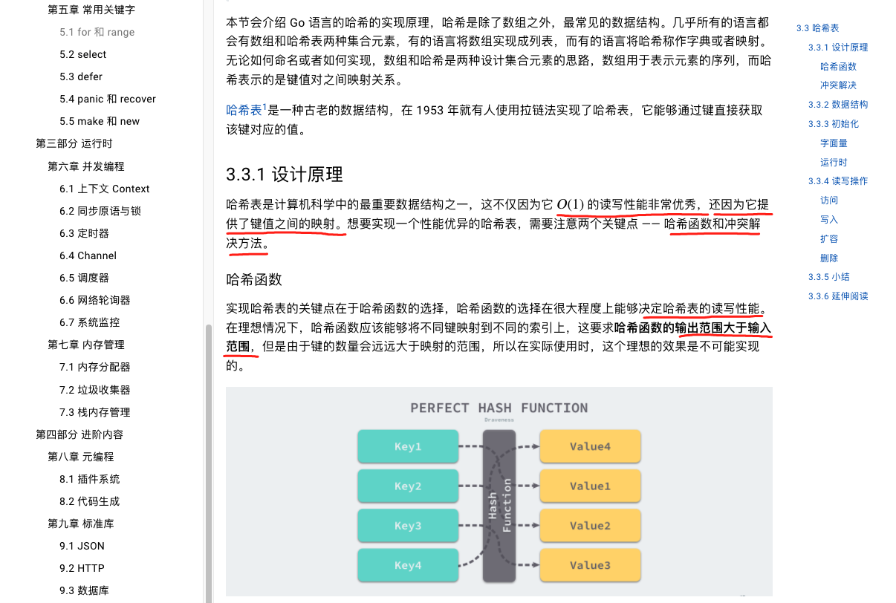
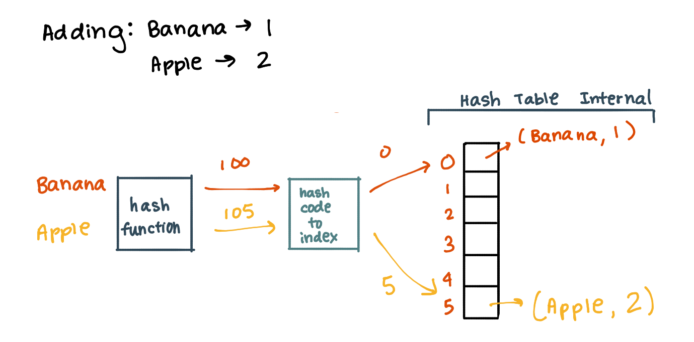
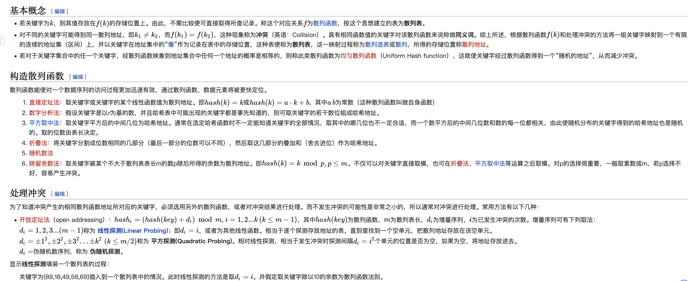
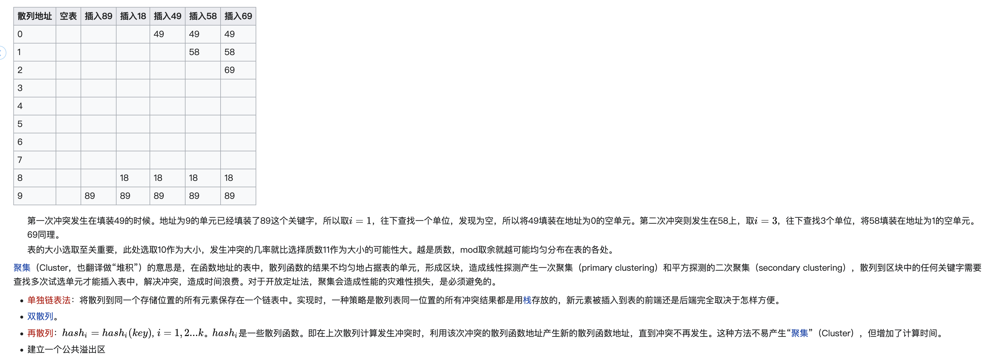
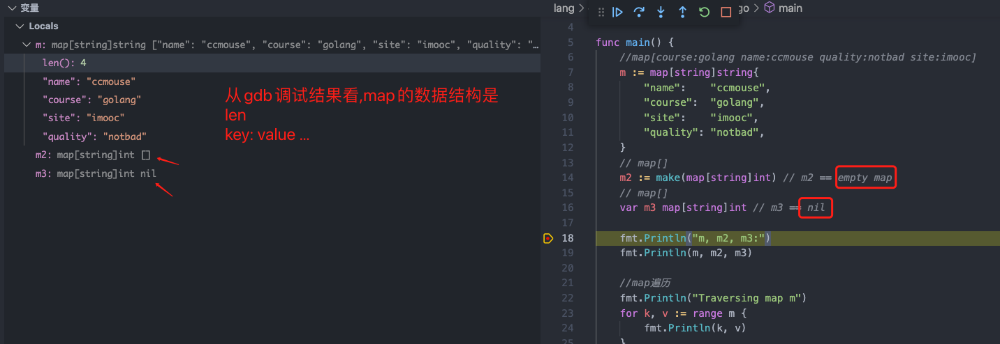
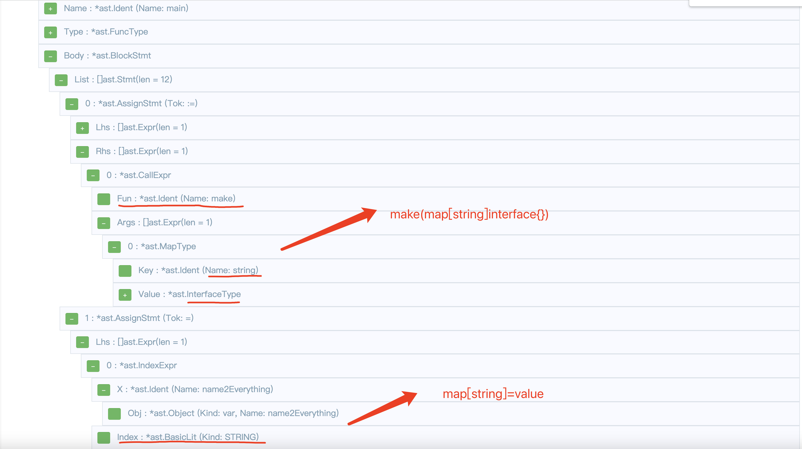
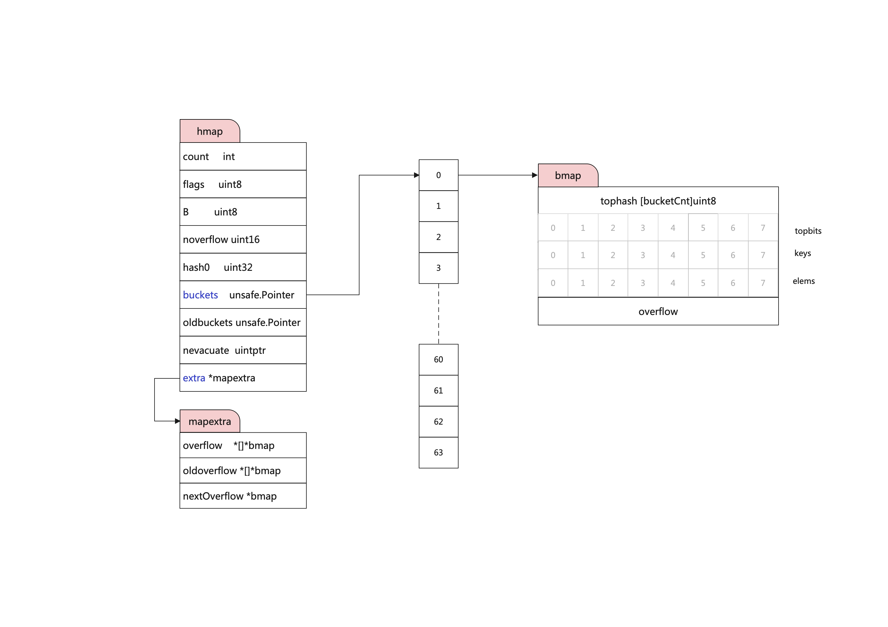

# Map 
## 数据结构
[参考文章](https://draveness.me/golang/docs/part2-foundation/ch03-datastructure/golang-hashmap/)  
      

### [散列表(Hash Table)](https://zh.wikipedia.org/wiki/%E5%93%88%E5%B8%8C%E8%A1%A8)    

  

<br>

  

  

### gdb 查看map数据结构 
  

### 源码查看map数据结构
[源码](https://github.com/golang/go/blob/master/src/runtime/map.go) 路径: src/runtime/map.go  

```
// This file contains the implementation of Go's map type.
//
// A map is just a hash table. The data is arranged
// into an array of buckets. Each bucket contains up to
// 8 key/elem pairs. The low-order bits of the hash are
// used to select a bucket. Each bucket contains a few
// high-order bits of each hash to distinguish the entries
// within a single bucket.
//
// If more than 8 keys hash to a bucket, we chain on
// extra buckets.
//
// When the hashtable grows, we allocate a new array
// of buckets twice as big. Buckets are incrementally
// copied from the old bucket array to the new bucket array.
//
// Map iterators walk through the array of buckets and
// return the keys in walk order (bucket #, then overflow
// chain order, then bucket index).  To maintain iteration
// semantics, we never move keys within their bucket (if
// we did, keys might be returned 0 or 2 times).  When
// growing the table, iterators remain iterating through the
// old table and must check the new table if the bucket
// they are iterating through has been moved ("evacuated")
// to the new table.
```  

### 通过debug源码查看map结构  

```go
package main

import "fmt"

func main() {
	name2Everything := make(map[string]interface{})
	name2Everything["xiaoming"] = "100"
	name2Everything["age"] = "200"
	name2Everything["1"] = 1
	name2Everything["2"] = 2
	name2Everything["3"] = 3
	name2Everything["4"] = 4
	name2Everything["5"] = 5
	name2Everything["6"] = 6
	name2Everything["7"] = 7
	name2Everything["8"] = 8
	fmt.Println(name2Everything)
}
```

断点加在go1.16.9源码的src/runtime/map.go:293 `makemap_small() *hmap`方法上  
查看编译器参数已经禁止编译器优化: `go build -o go_build_map_struct_go -gcflags "all=-N -l"ap_struct.go #gosetup`  

make创建map调用的代码是:  
```go
// makemap_small implements Go map creation for make(map[k]v) and
// make(map[k]v, hint) when hint is known to be at most bucketCnt
// at compile time and the map needs to be allocated on the heap.
func makemap_small() *hmap {
	h := new(hmap)
	h.hash0 = fastrand()
	return h
}
```  
[make与new的区别](https://draveness.me/golang/docs/part2-foundation/ch05-keyword/golang-make-and-new/)  

其中需要注意buckets 是一个指针，最终它指向的是一个结构体：
```go
type bmap struct {
    tophash [bucketCnt]uint8
}
```
但这只是表面的结构，编译期间会给它加料，动态地创建一个新的结构：
go1.16.9/src/cmd/compile/internal/gc/reflect.go:83 
[golang 哈希表网文](https://draveness.me/golang/docs/part2-foundation/ch03-datastructure/golang-hashmap/)  

```go
// bmap makes the map bucket type given the type of the map.
func bmap(t *types.Type) *types.Type {
	if t.MapType().Bucket != nil {
		return t.MapType().Bucket
	}

	bucket := types.New(TSTRUCT)
	keytype := t.Key()
	elemtype := t.Elem()
	dowidth(keytype)
	dowidth(elemtype)
	if keytype.Width > MAXKEYSIZE {
		keytype = types.NewPtr(keytype)
	}
	if elemtype.Width > MAXELEMSIZE {
		elemtype = types.NewPtr(elemtype)
	}
...
```


  
```go
type bmap struct {
    topbits  [8]uint8
    keys     [8]keytype
    values   [8]valuetype
    pad      uintptr
    overflow uintptr
}
```
bmap 就是我们常说的“桶”，桶里面会最多装 8 个 key，这些 key 之所以会落入同一个桶，是因为它们经过哈希计算后，哈希结果是“一类”的。在桶内，又会根据 key 计算出来的 hash 值的高 8 位来决定 key 到底落入桶内的哪个位置（一个桶内最多有8个位置）。  

[断点调试map的编译过程](https://github.com/ymm135/golang-cookbook/blob/master/md/base/source/debug.md) ，首先看下调用栈:  
```shell
cmd_local/compile/internal/gc.bmap at reflect.go:90
cmd_local/compile/internal/gc.hmap at reflect.go:199
cmd_local/compile/internal/gc.walkexpr at walk.go:1207
cmd_local/compile/internal/gc.walkexpr at walk.go:626
cmd_local/compile/internal/gc.litas at sinit.go:385
cmd_local/compile/internal/gc.maplit at sinit.go:758
cmd_local/compile/internal/gc.anylit at sinit.go:949
cmd_local/compile/internal/gc.oaslit at sinit.go:981
cmd_local/compile/internal/gc.walkexpr at walk.go:611
cmd_local/compile/internal/gc.walkstmt at walk.go:149
cmd_local/compile/internal/gc.walkstmtlist at walk.go:81
cmd_local/compile/internal/gc.walk at walk.go:65
cmd_local/compile/internal/gc.compile at pgen.go:239
cmd_local/compile/internal/gc.funccompile at pgen.go:220
cmd_local/compile/internal/gc.Main at main.go:762
main.main at main.go:52
runtime.main at proc.go:225
runtime.goexit at asm_amd64.s:1371
 - Async stack trace
runtime.rt0_go at asm_amd64.s:226
```

其中转换的部分在`cmd_local/compile/internal/gc.walkexpr` 
在编译的类型检查期间，make(map[]) 以及类似的操作都会被转换成哈希的 `OMAKEMAP` 操作，
中间代码生成阶段会在 `cmd/compile/internal/gc.walkexpr` 函数中将这些 `OMAKEMAP` 操作转换成如下的代码：

- 第一种map创建方式
```go
// Call runtime.makehmap to allocate an
// hmap on the heap and initialize hmap's hash0 field.
fn := syslook("makemap_small")
fn = substArgTypes(fn, t.Key(), t.Elem())
n = mkcall1(fn, n.Type, init)
```
 
- 第二种map创建方式
```go
// var h *hmap
var h *Node

// Allocate hmap on stack.
// var hv hmap
hv := temp(hmapType)

// h = &hv
h = nod(OADDR, hv, nil)

// In case hint is larger than BUCKETSIZE runtime.makemap
// will allocate the buckets on the heap, see #20184
//
// if hint <= BUCKETSIZE {
//     var bv bmap
//     b = &bv
//     h.buckets = b
// }
nif := nod(OIF, nod(OLE, hint, nodintconst(BUCKETSIZE)), nil)
nif.SetLikely(true)

// var bv bmap
bv := temp(bmap(t))
zero = nod(OAS, bv, nil)
nif.Nbody.Append(zero)

// b = &bv
b := nod(OADDR, bv, nil)

// h.buckets = b
bsym := hmapType.Field(5).Sym // hmap.buckets see reflect.go:hmap
na := nod(OAS, nodSym(ODOT, h, bsym), b)
nif.Nbody.Append(na)

nif = typecheck(nif, ctxStmt)
nif = walkstmt(nif)
init.Append(nif)

```

**从以上代码可以看出，`make(map[string]interface{})`被解析成多条语句**  
- 第一种map创建方式
```go
// make(map[string]interface{})
func makemap_small() (hmap map[any]any)
```

- 第二种map创建方式
```go
// make(map[string]interface{})
var h *hmap
var hv hmap
h = &hv

if hint <= BUCKETSIZE {
     var bv bmap
     b = &bv
     h.buckets = b
}
```

到这里map就已经创建完毕了. 已经修改了原来的语法树了
```
default:
			n.Right = walkexpr(n.Right, init)

# 增加的节点在追加到init节点上
init.Append(nif)  
```  
 
> OMAKEMAP 是 Node ops， 代表含义:  make(Type, Left) (type is map)   
> 在编译时，所有的操作都是在语法树上进行的，每个节点叫做Node，操作叫做OADD、OMAKEMAP 

- **那可以看一下makemap之前和之后，语法树的差异?**  
可以先查看`map.go`语法树的情况，在查看编译之后的语法树.  

编译前的语法树:  
  

`Dump("make NODE", n)` Dump节点:
```
make before [0xc0003c1a00]
.   MAKEMAP l(6) esc(h) tc(1) MAP-map[string]interface {}
.   .   LITERAL-0 l(6) untyped int

--------------------------------------------------------------------

make after [0xc0005b7a80]
.   CALLFUNC l(6) tc(1) hascall MAP-map[string]interface {}
.   .   NAME-runtime.makemap_small x(0) class(PFUNC) tc(1) used FUNC-func() map[string]interface {}
```

编译后的语法树把MAP-map[string]interface转换为具体的创建语句 NAME-runtime.makemap_small  

可以通过编译期间查看bmap的具体结构是通过`reflect.go`中的`func bmap(t *types.Type) *types.Type`,返回的bucket结构为:  

```
field := make([]*types.Field, 0, 5)

field = append(field, makefield("topbits", arr))
keys := makefield("keys", arr)
elems := makefield("elems", arr)
overflow := makefield("overflow", otyp)

```

结构体为:
```go
// (64-bit, 8 byte keys and elems)
//	maxKeySize  = 128
//	maxElemSize = 128
type bmap struct {
    topbits  [8]uint8
    keys     [8]keytype
    elems    [8]valuetype
    overflow uintptr
}
```

与`compile/internal/gc/reflect.go`中描述的一样
```go
// A bucket for a Go map.
type bmap struct {
	// tophash generally contains the top byte of the hash value
	// for each key in this bucket. If tophash[0] < minTopHash,
	// tophash[0] is a bucket evacuation state instead.
	tophash [bucketCnt]uint8
	// Followed by bucketCnt keys and then bucketCnt elems.
	// NOTE: packing all the keys together and then all the elems together makes the
	// code a bit more complicated than alternating key/elem/key/elem/... but it allows
	// us to eliminate padding which would be needed for, e.g., map[int64]int8.
	// Followed by an overflow pointer.
}
```
> // Followed by bucketCnt keys and then bucketCnt elems.  
> // Followed by an overflow pointer.   

    
  
## Hash函数

## MAP基本操作
### 增加、写入

map的创建代码是在编译时候完成的，相当于在堆上申请一块内存，创建了map结构，但是如何填充数据的呢？  


### 读取
### 删除
### 扩容

## 通过IDEA调试map源码
如果想要连接map编译过程，可以使用编译器断点调试go compile源码。[断点调试源码教程](https://github.com/ymm135/golang-cookbook/blob/master/md/base/source/debug.md)   
 

