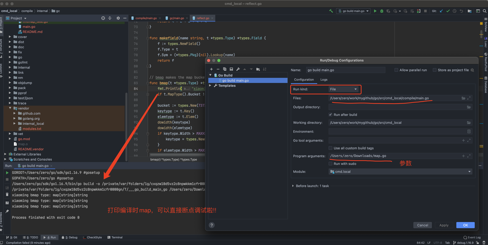
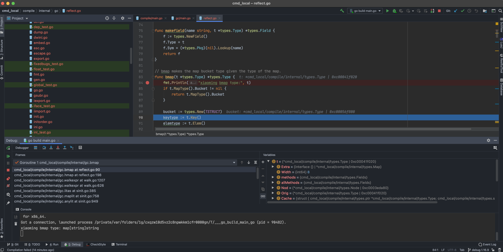

# 源码调试 

## 编译源码  
go源码下载地址`https://go.dev/dl/go1.16.9.src.tar.gz`, 放到到路径为`/Users/zero/go/sdk/source`，go源码路径为`/Users/zero/go/sdk/source1.16.9/go`  

从官网下载源码，修改源码，比如`source1.16.9/go/src/fmt/print.go`下`Println`函数    
```go
func Println(a ...interface{}) (n int, err error) {
	println("_xiao_")
	return Fprintln(os.Stdout, a...)
}
```

进入源码src目录，执行`./make.bash` 或者 `./all.bash`   
```shell
Building Go cmd/dist using /Users/zero/go/sdk/go1.16.9. (go1.16.9 darwin/amd64)
Building Go toolchain1 using /Users/zero/go/sdk/go1.16.9.
Building Go bootstrap cmd/go (go_bootstrap) using Go toolchain1.
Building Go toolchain2 using go_bootstrap and Go toolchain1.
Building Go toolchain3 using go_bootstrap and Go toolchain2.
Building packages and commands for darwin/amd64.
---
Installed Go for darwin/amd64 in /Users/zero/Downloads/go
Installed commands in /Users/zero/Downloads/go/bin
```  

把当前的GOROOT切换为编译好的路径: `export GOROOT=/Users/zero/go/sdk/source1.16.9/go`

```go
package main

import "fmt"

func main() {
	fmt.Println("Hello World")
}
```
`go run main.go` 或者 `$GOPATH/src/github.com/golang/go/bin/go run main.go` 
```shell
_xiao_
Hello World
```  

## 调试编译过程  
就是用map创建时bmap明确的过程，源码版本是1.16.9，代码位置是 `source1.16.9/go/src/cmd/compile/internal/gc/reflect.go:83`  

在源码处增加map类型打印`fmt.Println("_bmap_", t)`:  

```go
// bmap makes the map bucket type given the type of the map.
func bmap(t *types.Type) *types.Type {

	fmt.Println("_bmap_", t)
	if t.MapType().Bucket != nil {
		return t.MapType().Bucket
	}
...
```
demo文件:  
```go
package main

import "fmt"

func main() {
	m := map[string]string{
		"name":    "ccmouse",
		"course":  "golang",
		"site":    "imooc",
		"quality": "notbad",
	}
	delete(m, "name")
	fmt.Println(m)
}
```
`go build -x map.go `编译输出: 
> 这个`go build`使用的是源码中的`build`可执行文件，这里通过修改`export GOROOT`实现  
```
# 使用库的位置, 比如fmt : packagefile fmt=/Users/zero/go/sdk/test/pkg/darwin_amd64/fmt.a 
zerodeMacBook-Pro:Downloads zero$ go build -x map.go 
WORK=/var/folders/1g/cxqzw10d5vz2c8npwkkm1cfr0000gn/T/go-build1238239978
cat /Users/zero/Library/Caches/go-build/19/19476a0a2d49e836f7566ccc51859414f6e2ed77740ccacbb953b4673efc87e1-d  # internal
# command-line-arguments
_xiao_
_bmap_ map[string]string
_xiao_
_bmap_ map[string]string
_xiao_
_bmap_ map[string]string
mkdir -p $WORK/b001/
cat >$WORK/b001/importcfg.link << 'EOF' # internal
packagefile command-line-arguments=/Users/zero/Library/Caches/go-build/ba/baef7897677499e2de076bc3e09e05cf86ff26184487063203a25fddd6d7d38c-d
packagefile fmt=/Users/zero/go/sdk/test/pkg/darwin_amd64/fmt.a
packagefile runtime=/Users/zero/go/sdk/test/pkg/darwin_amd64/runtime.a
packagefile errors=/Users/zero/go/sdk/test/pkg/darwin_amd64/errors.a
packagefile internal/fmtsort=/Users/zero/go/sdk/test/pkg/darwin_amd64/internal/fmtsort.a

...

```  

> **实现源码可以使用ide断点调试，编译的源码能不能使用ide断点调试呢?**
> 既然编译器也是使用go写的，那就需要找到编译后的可执行文件(cmd compile)，然后传入参数调试？
> 查看cmd/compile的README,可以看到 `cmd/compile/internal/gc` (create compiler AST, type checking, AST transformations, converting to SSA)    
> 能不能调试`cmd/compile/main.go`？  

源码pkg编译后文件列表: 

```shell
└── pkg
    ├── darwin_amd64  #darwin_amd64 平台静态库 current ar archive 
    │   ├── cmd
    │   │   ├── asm
    │   │   │   └── internal
    │   │   │       └── asm.a
    │   │   ├── compile
    │   │   │   └── internal
    │   │   │       ├── amd64.a
    │   │   │       ├── arm.a
    │   │   │       ├── arm64.a
    │   │   │       ├── gc.a
    │   │   │       ├── ssa.a
    │   │   │       └── x86.a
    │   │   ├── go
    │   │   │   └── internal
    │   │   │       └── auth.a
    │   │   ├── internal
    │   │   │   └── obj.a
    │   │   ├── link
    │   │   │   └── internal
    │   │   │       ├── amd64.a
    │   │   │       └── x86.a
    │   │   └── vendor
    │   │       ├── github.com
    │   │       │   ├── google
    │   │       │   │   └── pprof
    │   │       │   │       └── driver.a
    │   │       │   └── ianlancetaylor
    │   │       │       └── demangle.a
    │   │       └── golang.org
    │   │           └── x
    │   ├── fmt.a   
    │   └── go
    │       ├── ast.a
    │       └── types.a
    ├── include
    │   ├── asm_ppc64x.h
    │   ├── funcdata.h
    │   └── textflag.h
    ├── obj
    └── tool                         
        └── darwin_amd64    # 工具   
            ├── addr2line
            ├── api
            ├── asm
            ├── buildid
            ├── cgo
            ├── compile    # 编译工具，对应源码为cmd/compile/main.go 
            ├── cover
            ├── dist
            ├── doc
            ├── fix
            ├── link
            ├── nm
            ├── objdump
            ├── pack
            ├── pprof
            ├── test2json
            ├── trace
            └── vet
```

其中.a的是go编译过程中的静态库，可以查看静态库的内容:  
```shell
$ ar -v -t pkg/darwin_amd64/fmt.a 
rw-r--r--       0/0         11894 Jan  1 08:00 1970 __.PKGDEF
rw-r--r--       0/0        754130 Jan  1 08:00 1970 _go_.o 

# 解压后，查看_go_.o 格式
$ ar -x pkg/darwin_amd64/fmt.a

# 如果不解压，也可以直接查看fmt.a文件，基本一样的:vim fmt.a
1 !<arch>                                                         # 压缩文件格式
2 __.PKGDEF       0           0     0     644     11894     `     # __.PKGDEF文件
3 go object darwin amd64 go1.16.9 X:none
4 build id "RlfCTK6S1eFmY7vzQP2e/HhLM8RlkNVokumyWo3n0"            # build id 

 115 _go_.o          0           0     0     644     754130    `  #  _go_.o文件
 116 go object darwin amd64 go1.16.9 X:none
 117 build id "RlfCTK6S1eFmY7vzQP2e/HhLM8RlkNVokumyWo3n0"    

# 用go tool compile 编译出二进制文件
# 用go tool pack 打包成静态库
# go tool compile

go build || go run     
```  

Go 语言的**编译器**入口在 `src/cmd/compile/internal/gc/main.go` 文件中，
其中 600 多行的 `cmd/compile/internal/gc.Main` 就是 Go 语言编译器的主程序，
该函数会先获取命令行传入的参数并更新编译选项和配置，随后会调用 `cmd/compile/internal/gc.parseFiles` 
对输入的文件进行词法与语法分析得到对应的抽象语法树：

```go
func Main(archInit func(*Arch)) {
	...

	lines := parseFiles(flag.Args())
``` 

可以使用pkg/tool/compile的可执行文件编译指定文件
```shell
./compile ~/Downloads/map.go
```

如果把src/cmd在idea中打开，调试compile源码:
```shell
# 包导入的有问题
use of internal package cmd/compile/internal/amd64 not allowed
```

如果把当前模块的名称从`cmd`改为`cmd.local`, 然后把依赖替换为`cmd.local/compile/internal/amd64`
但是依赖于源码其他文件也会提示不能使用内部包，这个该如何解决呢？比如目前依赖`exec "internal/execabs"`可以把internal
复制一份，修改为`internal.local`,导入这个包  

问题是使用的不是GOROOT/src下的internal,而是vendor中的依赖库
```shell
../internal/dwarf/dwarf.go:15:2: cannot find package "." in:
	/Users/zero/work/mygithub/go/src/cmd_local/vendor/internal_local/execabs
```
 
然后把文件夹放到vendor下
```shell
drwxr-xr-x   4 zero  staff   128 Nov 23 15:31 github.com
drwxr-xr-x   3 zero  staff    96 Nov 23 15:31 golang.org
drwxr-xr-x  28 zero  staff   896 Nov 23 15:01 internal_local
-rw-r--r--   1 zero  staff  3626 Nov 23 15:31 modules.txt
```

这样就行了，可以直接编译，断点调试  
[可调试的golang源码](git@github.com:ymm135/go.git)  

  

<br>

  

<br>

[仓库地址](https://github.com/ymm135/go/tree/debug.1.16.9)  使用IDEA打开工程`src/cmd_local/`, 就开始源码编译模块debug吧! :smiley:   
 


