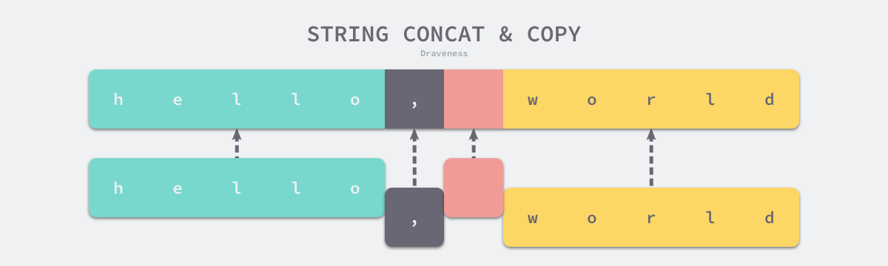

# string  
[参考文章](https://draveness.me/golang/docs/part2-foundation/ch03-datastructure/golang-string/)

## 字符串声明
两种方式:**双引号**和**反引号**  
```go
str1 := "this is a string"
str2 := `this is another
string`

json := `{"author": "draven", "tags": ["golang"]}`  
```


## 数据结构  
源码在`go1.16.9/src/reflect/value.go`  

```go
// StringHeader is the runtime representation of a string.
// It cannot be used safely or portably and its representation may
// change in a later release.
// Moreover, the Data field is not sufficient to guarantee the data
// it references will not be garbage collected, so programs must keep
// a separate, correctly typed pointer to the underlying data.
type StringHeader struct {
	Data uintptr
	Len  int
}
```  
与切片的结构体相比，字符串只少了一个表示容量的 Cap 字段，而正是因为切片在 Go 语言的运行时表示与字符串高度相似，所以我们经常会说字符串是一个只读的切片类型。  
```go
type SliceHeader struct {
	Data uintptr
	Len  int
	Cap  int
}
```
因为字符串作为只读的类型，我们并不会直接向字符串直接追加元素改变其本身的内存空间，所有在字符串上的写入操作都是通过拷贝实现的。  

## 字符串内容可修改  

```go
import "fmt"

func main() {
	s := "HelloWorld!"
	sm := modifyString(s)
	fmt.Println("source(", &s, "):", s, ",midify(", &s, "):", sm)
}

func modifyString(s string) string {
	bs := []byte(s)
	bs[0] = 77
	return string(bs)
}
```

输出结果:  
```shell
source( 0xc000010240 ): HelloWorld! ,midify( 0xc000010240 ): MelloWorld!
```

## 字符串赋值  
string-equal.go  
```go
func main() {
	s1 := "Hello World"
	s2 := s1
	s1 = "Hello Go"
	println("s1:", s1, ",s2:", s2)
}
```  

刚开始我还有点怀疑是引用传递还是值传递，忘记了Go中只有值传递，并且字符串中包含的是数据的指针和长度
所以`s2 := s1`时，相当于s2是s1指向内容的**副本**，也就是同时指向`"Hello World"`的内存地址及字符长度
使用dlv编译器查看字符串的内存结构，正好验证这个问题吧  

`dlv debug string-equal.go`  
```shell
▶ dlv debug string-equal.go 
Type 'help' for list of commands.
(dlv) b string-equal.go:8
Breakpoint 1 set at 0x10cbaf2 for main.main() ./string-equal.go:8
(dlv) c
> main.main() ./string-equal.go:8 (hits goroutine(1):1 total:1) (PC: 0x10cbaf2)
     3:	import "fmt"
     4:	
     5:	func main() {
     6:		s1 := "Hello World"
     7:		s2 := s1
=>   8:		s1 = "Hello Go"
     9:		fmt.Println("s1:", s1, ",s2:", s2)
    10:	}
    
(dlv) print s1
"Hello World"
(dlv) print s2
"Hello World"
(dlv) print &s1
(*string)(0xc000061f10)     
(dlv) print &s2
(*string)(0xc000061f00)   // s1与s2变量地址相连，相差16字节

(dlv) x -fmt hex -count 24 -size 1 0xc000061f10   //查看s1内存内容,第一行8个字节代表指向字符地址0x010f0f6e
0xc000061f10:   0x1a   0x16   0x0f   0x01   0x00   0x00   0x00   0x00   
0xc000061f18:   0x0b   0x00   0x00   0x00   0x00   0x00   0x00   0x00   
0xc000061f20:   0x38   0x1f   0x06   0x00   0xc0   0x00   0x00   0x00 


(dlv) x -fmt hex -count 16 -size 1 0xc000061f00   //查看s2内存内容，狄航指向的字符地址与s1一直，第二行0x0b代表11个字符
0xc000061f00:   0x1a   0x16   0x0f   0x01   0x00   0x00   0x00   0x00   
0xc000061f08:   0x0b   0x00   0x00   0x00   0x00   0x00   0x00   0x00

//查看s1/s2指向字符地址的内容,只好是"Hello World"对应的16进制表示    
// "Hello World" 对应的16进制=> 48 65 6c 6c 6f 20 57 6f 72 6c 64
(dlv) x -fmt hex -count 24 -size 1 0x010f161a
0x10f161a:   0x48   0x65   0x6c   0x6c   0x6f   0x20   0x57   0x6f   
0x10f1622:   0x72   0x6c   0x64   0x49   0x64   0x65   0x6f   0x67   
0x10f162a:   0x72   0x61   0x70   0x68   0x69   0x63   0x4d   0x65 

```

`s1`重新赋值 
```shell
(dlv) n
> main.main() ./string-equal.go:9 (PC: 0x10cbb07)
     4:	
     5:	func main() {
     6:		s1 := "Hello World"
     7:		s2 := s1
     8:		s1 = "Hello Go"
=>   9:		fmt.Println("s1:", s1, ",s2:", s2)
    10:	}
(dlv) print &s1
(*string)(0xc000061f10)
(dlv) print &s2
(*string)(0xc000061f00)

(dlv) x -fmt hex -count 24 -size 1 0xc000061f10   //s1赋值后指向内存地址变为0x010f0f6e, 指向"Hello Go"内存地址
0xc000061f10:   0x6e   0x0f   0x0f   0x01   0x00   0x00   0x00   0x00   
0xc000061f18:   0x08   0x00   0x00   0x00   0x00   0x00   0x00   0x00   
0xc000061f20:   0x38   0x1f   0x06   0x00   0xc0   0x00   0x00   0x00  
```

从此可以看出字符串之前相互赋值，相当于字符串结构拷贝，拷贝的内容包含字符串内容指针(uintptr 8个字节)和字符长度(int 8字节)  

## 字符串类型拼接  

> 字符串相应函数实现都在`go/src/runtime/string.go`

string-join.go
```
package main

import "fmt"

func main() {
	s1 := "Hello "
	s2 := "World!"
	s := s1 + s2
	fmt.Println(s)
}
```  
[调用源码](../../../md/base/source/debug.md)  

执行编译指令: `src/cmd_local/compile/main.go file/path/string-join.go`  

Go 语言拼接字符串会使用 `+` 符号，编译器会将该符号对应的 OADD 节点转换成 OADDSTR 类型的节点，
随后在 `cmd/compile/internal/gc.walkexpr` 中调用 `cmd/compile/internal/gc.addstr` 
函数生成用于拼接字符串的代码： 

```go
func walkexpr(n *Node, init *Nodes) *Node {
	switch n.Op {
	...
	case OADDSTR:
		n = addstr(n, init)
	}
}
```  

`cmd/compile/internal/gc.addstr` 能帮助我们在编译期间选择合适的函数对字符串进行拼接，
该函数会根据带拼接的字符串数量选择不同的逻辑：  

- 如果小于或者等于 5 个，那么会调用 concatstring{2,3,4,5} 等一系列函数；
- 如果超过 5 个，那么会选择 runtime.concatstrings 传入一个数组切片；

```go
func addstr(n *Node, init *Nodes) *Node { 
    ...
    var fn string // concatstring2
	if c <= 5 {
		// small numbers of strings use direct runtime helpers.
		// note: order.expr knows this cutoff too.
		fn = fmt.Sprintf("concatstring%d", c)
	} else {
		// large numbers of strings are passed to the runtime as a slice.
		fn = "concatstrings"

		t := types.NewSlice(types.Types[TSTRING])
		slice := nod(OCOMPLIT, nil, typenod(t))
		if prealloc[n] != nil {
			prealloc[slice] = prealloc[n]
		}
		slice.List.Set(args[1:]) // skip buf arg
		args = []*Node{buf, slice}
		slice.Esc = EscNone
	}
	
	cat := syslook(fn)
	r := nod(OCALL, cat, nil)
	r.List.Set(args)
	r = typecheck(r, ctxExpr)
	r = walkexpr(r, init)
	r.Type = n.Type
    ...
}
```    

这里调用的是`concatstring2` 说明是两个参数，这个函数的实现在`src/runtime/string.go`中

```
func concatstring2(buf *tmpBuf, a [2]string) string {
	return concatstrings(buf, a[:])
}

func concatstring3(buf *tmpBuf, a [3]string) string {
	return concatstrings(buf, a[:])
}

func concatstring4(buf *tmpBuf, a [4]string) string {
	return concatstrings(buf, a[:])
}

func concatstring5(buf *tmpBuf, a [5]string) string {
	return concatstrings(buf, a[:])
}
```  

`src/runtime/string.go`中`concatstrings`实现  
```go
// concatstrings implements a Go string concatenation x+y+z+...
// The operands are passed in the slice a.
// If buf != nil, the compiler has determined that the result does not
// escape the calling function, so the string data can be stored in buf
// if small enough.
func concatstrings(buf *tmpBuf, a []string) string {
	idx := 0
	l := 0
	count := 0
	for i, x := range a {
		n := len(x)
		if n == 0 {
			continue
		}
		if l+n < l {
			throw("string concatenation too long")
		}
		l += n
		count++
		idx = i
	}
	if count == 0 {
		return ""
	}

	// If there is just one string and either it is not on the stack
	// or our result does not escape the calling frame (buf != nil),
	// then we can return that string directly.
	if count == 1 && (buf != nil || !stringDataOnStack(a[idx])) {
		return a[idx]
	}
	s, b := rawstringtmp(buf, l)
	for _, x := range a {
		copy(b, x)
		b = b[len(x):]
	}
	return s
}
```  
[参考文章:Go 语言设计与实现-字符串](https://draveness.me/golang/docs/part2-foundation/ch03-datastructure/golang-string/)  
如果非空字符串的数量为 1 并且当前的字符串不在栈上，就可以直接返回该字符串，不需要做出额外操作。  

  

但是在正常情况下，运行时会调用 copy 将输入的多个字符串拷贝到目标字符串所在的内存空间。
新的字符串是一片新的内存空间，与原来的字符串也没有任何关联，一旦需要拼接的字符串非常大，
拷贝带来的性能损失是无法忽略的。  

## 类型转换(参考Go 语言设计与实现)  
类型转换相应实现都在`go/src/runtime/string.go`中:  
```go
// slicebytetostring
func stringtoslicebyte(buf *tmpBuf, s string) []byte {
func slicebytetostring(buf *tmpBuf, ptr *byte, n int) (str string) {
``` 

测试代码  
```go
package main

import "fmt"

func main() {
	s := "HelloWorld!"
	sm := modifyString(s)
	fmt.Println("source(", &s, "):", s, ",midify(", &s, "):", sm)
}

func modifyString(s string) string {
	bs := []byte(s)
	bs[0] = 77
	return string(bs)
}
```  

使用IDEA调试时，很多状态不对，使用`dlv`试试  

```shell
> runtime.stringtoslicebyte() /usr/local/go/src/runtime/string.go:167 (PC: 0x10554a1)
Warning: debugging optimized function
   162:		return
   163:	}
   164:	
   165:	func stringtoslicebyte(buf *tmpBuf, s string) []byte {
   166:		var b []byte
=> 167:		if buf != nil && len(s) <= len(buf) {
   168:			*buf = tmpBuf{}
   169:			b = buf[:len(s)]
   170:		} else {
   171:			b = rawbyteslice(len(s))
   172:		}
   173:		copy(b, s)
   174:		return b
   175:	}
(dlv) print s
(unreadable empty OP stack)  
```

> const tmpStringBufSize = 32  
> type tmpBuf [tmpStringBufSize]byte   

也是一样，`s string`参数没有值，`buf`不为空需要初始化，初始化为`[]byte`, 
最终调用`copy(b, s)`是汇编指令的实现:  

```shell
> runtime.memmove() /usr/local/go/src/runtime/memmove_amd64.s:36 (PC: 0x106f840)
Warning: debugging optimized function
    31:	// See memmove Go doc for important implementation constraints.
    32:	
    33:	// func memmove(to, from unsafe.Pointer, n uintptr)
    34:	TEXT runtime·memmove(SB), NOSPLIT, $0-24
    35:	
=>  36:		MOVQ	to+0(FP), DI
    37:		MOVQ	from+8(FP), SI
    38:		MOVQ	n+16(FP), BX
```  

string转[]byte的最终实现就是通过内存拷贝实现`copy(byte,string)`,字节级别的拷贝。  


