[学习课程链接](https://coding.imooc.com/learn/list/414.html)  

### 目录
- [基础语法](#基础语法)
  - [c++概况](#c概况)
  - [编译型语言](#编译型语言)
  - [数据类型](#数据类型)
  - [常量与变量](#常量与变量)
- [运算符与表达式](#运算符与表达式)
  - [算数运算](#算数运算)
  - [关系运算符](#关系运算符)
  - [逻辑运算符](#逻辑运算符)
  - [赋值运算符](#赋值运算符)
  - [位运算符](#位运算符)
  - [算数优先级](#算数优先级)
  - [补码](#补码)
- [容器](#容器)
  - [概念](#概念)
  - [数组](#数组)
  - [动态数组Vector](#动态数组vector)
    - [vector的数据结构](#vector的数据结构)
  - [字符串](#字符串)
    - [unicode编码](#unicode编码)
    - [字符串指针](#字符串指针)
  - [字符串基本操作](#字符串基本操作)
- [指针](#指针)
  - [数组指针和指针数组](#数组指针和指针数组)
  - [const与指针](#const与指针)
  - [二级指针和野指针](#二级指针和野指针)
  - [指针的基本操作](#指针的基本操作)
  - [CPP程序的存储区域划分](#cpp程序的存储区域划分)
  - [RAII 资源获取即初始化（Resource Acquisition Is Initialization）](#raii-资源获取即初始化resource-acquisition-is-initialization)
  - [智能指针](#智能指针)
    - [auto_prt (c++11标准已经废弃，c++17已经正式删除)](#auto_prt-c11标准已经废弃c17已经正式删除)
    - [unique_ptr](#unique_ptr)
    - [shared_prt](#shared_prt)
    - [weak_ptr](#weak_ptr)
  - [引用(指向变量地址的指针)](#引用指向变量地址的指针)
- [基础句法](#基础句法)
  - [图灵机和三种基本结构](#图灵机和三种基本结构)
  - [if与switch对比](#if与switch对比)
  - [枚举](#枚举)
  - [结构体和联合体](#结构体和联合体)
  - [循环语句的比较](#循环语句的比较)
  - [函数](#函数)
    - [函数重载(overload)和命名空间](#函数重载overload和命名空间)
    - [函数指针和指针函数](#函数指针和指针函数)
    - [函数Hack之栈变化](#函数hack之栈变化)
    - [内联(inline)函数](#内联inline函数)
    - [递归及优化](#递归及优化)
- [高级语法](#高级语法)
  - [类与结构体比较](#类与结构体比较)
  - [类的访问权限及友元](#类的访问权限及友元)
  - [类的运算符重载](#类的运算符重载)
  - [拷贝构造及深浅拷贝](#拷贝构造及深浅拷贝)
  - [I/O](#io)
    - [I/O基础](#io基础)
    - [I/O缓冲区](#io缓冲区)
    - [文件I/O基本操作](#文件io基本操作)
- [编程思想](#编程思想)
  - [泛型编程思想](#泛型编程思想)
- [进阶编程](#进阶编程)
  - [STL标准模板库(Standard Template Library)](#stl标准模板库standard-template-library)
  - [容器](#容器-1)
  - [序列式容器的基本使用](#序列式容器的基本使用)
- [GUI开发](#gui开发)
- [陷阱与经验](#陷阱与经验)

## 基础语法
### c++概况 
- 大型桌面应用 PS/Chrome/Microsoft Office
- 大型网站后台 搜索引擎
- 大型游戏后台 王章荣耀
- 大型游戏引擎 Unity
- 编译器/解释器 Java虚拟机/JS引擎  

2011年中期C++标准(C++11)完成新的标准,Boost库项目对新标准
产生了相当大的影响。  

[ :bookmark: 返回目录](#目录)

### 编译型语言
源程序 => 编译器 => 目标程序 => 链接器 => 可执行程序

[ :bookmark: 返回目录](#目录)
### 数据类型

| 类型  | 位   | 范围  |
|-----|-----|-----|
|  char   |  1 个字节   |  -128 到 127 或者 0 到 255   |
|  unsigned char   |  1 个字节   |  0 到 255   |
|  signed char   |  1 个字节   |  -128 到 127   |
|   int  |   4 个字节  |  -2147483648 到 2147483647   |
|  unsigned int   |  4 个字节   |  0 到 4294967295   |
|  signed int   |  4 个字节   |  -2147483648 到 2147483647   |
|   short int  |  	2 个字节   |  -32768 到 32767   |
|  long int   |  8 个字节   |  	-9,223,372,036,854,775,808 到 9,223,372,036,854,775,807   |
|   float  |   4 个字节  |  精度型占4个字节（32位）内存空间，+/- 3.4e +/- 38 (~7 个数字)   |
|   double  |  8 个字节   |   双精度型占8 个字节（64位）内存空间，+/- 1.7e +/- 308 (~15 个数字)  |
|  long double   |  16 个字节   |   长双精度型 16 个字节（128位）内存空间，可提供18-19位有效数字。  |
|  wchar_t   |  	2 或 4 个字节   |   个宽字符   |

[ :bookmark: 返回目录](#目录)
### 常量与变量  
- define 编译时替换  
- const 编译时检测，推荐使用该方法    


```c++
#include <iostream>

#define NUMBER2 2

int main() {
    const int NUMBER1 = 1;
    int a = NUMBER2;
    std::cout << a << std::endl;
    return 0;
}
```
通过clion内存视图看到`NUMBER1`的内存为`01 00 00 00`，占用4个字节的变量。通过gdb窗口`disass /m`查看汇编  
> 通过`~/.gdbinit`设置汇编格式为inter，设置参数为:`set disassembly-flavor intel`  
> 在macos系统的clion中，可以通过设置toolchains的Debugger，设置调试器为GDB而不是LLDB。   

```sh
6	    const int NUMBER1 = 1;
=> 0x00005596401801b5 <+12>:	mov    DWORD PTR [rbp-0x8],0x1   #汇编可以看出常量与变量没有区别,都仅仅是一个地址

7	    int a = NUMBER2;  
   0x00005596401801bc <+19>:	mov    DWORD PTR [rbp-0x4],0x2  # define宏定义在编译时已经被替换为2  
```

[ :bookmark: 返回目录](#目录)
## 运算符与表达式

### 算数运算  
| 运算符 | 描述               | 实例             |
|-----|------------------|----------------|
| +	| 把两个操作数相加         | A + B 将得到 30   |
| -	| 从第一个操作数中减去第二个操作数 | A - B 将得到 -10  |
| *	| 把两个操作数相乘         | 	A * B 将得到 200 |
 |   /	| 分子除以分母           | B / A 将得到 2    |  
 |   %	| 取模运算符，整除后的余数	    | B % A 将得到 0    |
 |   ++	| 自增运算符，整数值增加 1	   | A++ 将得到 11     |
 |   --	| 自减运算符，整数值减少 1	   | A-- 将得到 9      |  

实例  
```c++
#include <iostream>

int main()
{
    int a = 10, b= 20;
    int r1 = a + b;
    int r2 = a - b;
    int r3 = a * b;   
    int r4 = a / b;  // 从汇编中可以看出eax存储整除结果,edx存储余数
    int r5 = a % b;  // 获取edx的值
    int r6 = a++;    // 先加载a的值到eax，再把eax的值给r6. 最终把a的值+1 
    int r7 = ++a;    // 先把a的值加1，再把a的值加载到eax中赋给r7  
    int r8 = a--;
    int r9 = --a;

    return 0;
}
```

汇编指令
```c++
Dump of assembler code for function main():
4	{
   0x000055d35ad4b25f <+0>:	endbr64 
   0x000055d35ad4b263 <+4>:	push   rbp
   0x000055d35ad4b264 <+5>:	mov    rbp,rsp                        //函数栈操作

5	    int a = 10, b= 20;
   0x000055d35ad4b267 <+8>:	mov    DWORD PTR [rbp-0x2c],0xa      //a变量地址 [rbp-0x2c]
   0x000055d35ad4b26e <+15>:	mov    DWORD PTR [rbp-0x28],0x14 //b变量地址 [rbp-0x28]

6	    int r1 = a + b;
   0x000055d35ad4b275 <+22>:	mov    edx,DWORD PTR [rbp-0x2c]
   0x000055d35ad4b278 <+25>:	mov    eax,DWORD PTR [rbp-0x28]
   0x000055d35ad4b27b <+28>:	add    eax,edx                  // a + b
   0x000055d35ad4b27d <+30>:	mov    DWORD PTR [rbp-0x24],eax // 结果赋值给r1 [rbp-0x24]

7	    int r2 = a - b;
   0x000055d35ad4b280 <+33>:	mov    eax,DWORD PTR [rbp-0x2c]
   0x000055d35ad4b283 <+36>:	sub    eax,DWORD PTR [rbp-0x28] // sub 减法
   0x000055d35ad4b286 <+39>:	mov    DWORD PTR [rbp-0x20],eax

8	    int r3 = a * b;
   0x000055d35ad4b289 <+42>:	mov    eax,DWORD PTR [rbp-0x2c]
   0x000055d35ad4b28c <+45>:	imul   eax,DWORD PTR [rbp-0x28] // imul 乘法 
   0x000055d35ad4b290 <+49>:	mov    DWORD PTR [rbp-0x1c],eax

9	    int r4 = a / b;   // divisor 除数 signed divide (idic) 有符号的整除  
   0x000055d35ad4b293 <+52>:	mov    eax,DWORD PTR [rbp-0x2c] // 加载变量a->eax=0xa; rdz=0xa
   0x000055d35ad4b296 <+55>:	cdq                             // edx=0x0 : eax=0xa  
   0x000055d35ad4b297 <+56>:	idiv   DWORD PTR [rbp-0x28]     // edx=0xa(余数) : eax=0x0(除数)
   0x000055d35ad4b29a <+59>:	mov    DWORD PTR [rbp-0x18],eax // 整除结果在eax中 

10	    int r5 = a % b;
   0x000055d35ad4b29d <+62>:	mov    eax,DWORD PTR [rbp-0x2c]
   0x000055d35ad4b2a0 <+65>:	cdq    
   0x000055d35ad4b2a1 <+66>:	idiv   DWORD PTR [rbp-0x28]
   0x000055d35ad4b2a4 <+69>:	mov    DWORD PTR [rbp-0x14],edx // 整除结果在edx中 

11	    int r6 = a++;  // 先加载a的值，再把a的值给r6. 最终把a的值+1
   0x000055d35ad4b2a7 <+72>:	mov    eax,DWORD PTR [rbp-0x2c] // 加载变量a->eax
   0x000055d35ad4b2aa <+75>:	lea    edx,[rax+0x1]            // 0xa + 0x1 = 0xb
   0x000055d35ad4b2ad <+78>:	mov    DWORD PTR [rbp-0x2c],edx // a = 0xb
   0x000055d35ad4b2b0 <+81>:	mov    DWORD PTR [rbp-0x10],eax // r6 = 0xa

12	    int r7 = ++a;  // 先把a的值加1，再把a的值赋给r7 
   0x000055d35ad4b2b3 <+84>:	add    DWORD PTR [rbp-0x2c],0x1 // 先把a的值加1 
   0x000055d35ad4b2b7 <+88>:	mov    eax,DWORD PTR [rbp-0x2c]
   0x000055d35ad4b2ba <+91>:	mov    DWORD PTR [rbp-0xc],eax

13	    int r8 = a--;
   0x000055d35ad4b2bd <+94>:	mov    eax,DWORD PTR [rbp-0x2c] // 加载a的值在eax中
   0x000055d35ad4b2c0 <+97>:	lea    edx,[rax-0x1]            // a的值减一存储到edx
   0x000055d35ad4b2c3 <+100>:	mov    DWORD PTR [rbp-0x2c],edx // 把edx的值赋给a变量
   0x000055d35ad4b2c6 <+103>:	mov    DWORD PTR [rbp-0x8],eax // 把eax的值赋给r8 

14	    int r9 = --a;
=> 0x000055d35ad4b2c9 <+106>:	sub    DWORD PTR [rbp-0x2c],0x1
   0x000055d35ad4b2cd <+110>:	mov    eax,DWORD PTR [rbp-0x2c]
   0x000055d35ad4b2d0 <+113>:	mov    DWORD PTR [rbp-0x4],eax

15	
16	    return 0;
   0x000055d35ad4b2d3 <+116>:	mov    eax,0x0

17	}
   0x000055d35ad4b2d8 <+121>:	pop    rbp
   0x000055d35ad4b2d9 <+122>:	ret  
```

> 正如广泛宣传的那样，现代的x86_64处理器具有64位寄存器，可以以向后兼容的方式用作32位寄存器，16位寄存器甚至8位寄存器，例如：  
```
0x1122334455667788
  ================ rax (64 bits)
          ======== eax (32 bits)
              ====  ax (16 bits)
              ==    ah (8 bits)
                ==  al (8 bits)
```

> 可以从字面上采用这样的方案，即，为了读取或写入的目的，总是可以使用指定的名称始终仅访问寄存器的一部分，这将是高度逻辑的。实际上，对于所有32位以下的系统都是这样：  
```
mov  eax, 0x11112222 ; eax = 0x11112222
mov  ax, 0x3333      ; eax = 0x11113333 (works, only low 16 bits changed)
mov  al, 0x44        ; eax = 0x11113344 (works, only low 8 bits changed)
mov  ah, 0x55        ; eax = 0x11115544 (works, only high 8 bits changed)
xor  ah, ah          ; eax = 0x11110044 (works, only high 8 bits cleared)
mov  eax, 0x11112222 ; eax = 0x11112222
xor  al, al          ; eax = 0x11112200 (works, only low 8 bits cleared)
mov  eax, 0x11112222 ; eax = 0x11112222
xor  ax, ax          ; eax = 0x11110000 (works, only low 16 bits cleared)
```

> [CBW, CWD, CDQ 介绍](http://www.c-jump.com/CIS77/MLabs/M11arithmetic/M11_0110_cbw_cwd_cdq.htm)  

[ :bookmark: 返回目录](#目录)

### 关系运算符

| 运算符	 | 描述                              | 	实例 |    
|------|---------------------------------|-----|  
| ==	  | 检查两个操作数的值是否相等，如果相等则条件为真。        | 	(A == B) 不为真。 |
| !=	  | 检查两个操作数的值是否相等，如果不相等则条件为真。       |	(A != B) 为真。 |
| \>   | 检查左操作数的值是否大于右操作数的值，如果是则条件为真。    |	(A > B) 不为真。 |
| <	   | 检查左操作数的值是否小于右操作数的值，如果是则条件为真。    |	(A < B) 为真。 |
| >=	  | 检查左操作数的值是否大于或等于右操作数的值，如果是则条件为真。 |	(A >= B) 不为真。 |
| <=	  | 检查左操作数的值是否小于或等于右操作数的值，如果是则条件为真。 |	(A <= B) 为真。 |


实例  
```c++
#include <iostream>
using namespace std;

int main()
{
    int a = 21;
    int b = 10;
    int c ;

    if( a == b )
    {
        cout << "Line 1 - a 等于 b" << endl ;
    }

    if ( a < b )
    {
        cout << "Line 2 - a 小于 b" << endl ;
    }

    return 0;
}
```

汇编指令:
```c++
10	    if( a == b )
=> 0x000055b442ab4299 <+26>:	mov    eax,DWORD PTR [rbp-0x8]
   0x000055b442ab429c <+29>:	cmp    eax,DWORD PTR [rbp-0x4]
   0x000055b442ab429f <+32>:	jne    0x55b442ab42cc <main()+77>  // jne

15	    if ( a < b )
   0x000055b442ab42cc <+77>:	mov    eax,DWORD PTR [rbp-0x8]
   0x000055b442ab42cf <+80>:	cmp    eax,DWORD PTR [rbp-0x4]
   0x000055b442ab42d2 <+83>:	jge    0x55b442ab42ff <main()+128>  // jge 
```

- cmp 进行比较两个操作数的大小
- test 两个操作数的按位AND运算，并根据结果设置标志寄存器  
- je 当ZF标志位为零,就跳转 jump When Equal  
- jge 大于或者等于 jump when greater or equal 
- jb 低于,即不高于且不等于则转移

[ :bookmark: 返回目录](#目录)

### 逻辑运算符
| 运算符	         | 描述	                                                | 实例                          |  
|--------------|----------------------------------------------------|-----------------------------|  
| &&	          | 称为逻辑与运算符。如果两个操作数都 true，则条件为 true。                  | 	(A && B) 为 false。          |  
| &#124;&#124; |	称为逻辑或运算符。如果两个操作数中有任意一个 true，则条件为 true。| 	(A &#124;&#124; B) 为 true。 |  
| !	           | 称为逻辑非运算符。用来逆转操作数的逻辑状态，如果条件为 true 则逻辑非运算符将使其为 false。 | 	!(A && B) 为 true。          |  


实例
```c++
int main()
{
    int a = 21;
    int b = 10;
    int c ;

    c = a && b;
    c = a || b;
    c = !a;

    return 0;
}
```

汇编实现
```c++
6	    int a = 21;
   0x00005642644cd267 <+8>:	mov    DWORD PTR [rbp-0xc],0x15

7	    int b = 10;
   0x00005642644cd26e <+15>:	mov    DWORD PTR [rbp-0x8],0xa
   
10	    c = a && b; 
=> 0x00005642644cd275 <+22>:	cmp    DWORD PTR [rbp-0xc],0x0     // 把a与0进行比较 
   0x00005642644cd279 <+26>:	je     0x5642644cd288 <main()+41>  // 如果a等于0, 跳转到<main()+41> 结果为0
   0x00005642644cd27b <+28>:	cmp    DWORD PTR [rbp-0x8],0x0     // 把b与0进行比较
   0x00005642644cd27f <+32>:	je     0x5642644cd288 <main()+41>  // 如果b等于0, 跳转到<main()+41> 结果为0
   0x00005642644cd281 <+34>:	mov    eax,0x1                     // 如果a与b都不等于0，结果为1  
   0x00005642644cd286 <+39>:	jmp    0x5642644cd28d <main()+46>  // 结束了，结果为1
   0x00005642644cd288 <+41>:	mov    eax,0x0                     // 如果a、b有一个为0，就跳转到这，结果为0
   0x00005642644cd28d <+46>:	movzx  eax,al
   0x00005642644cd290 <+49>:	mov    DWORD PTR [rbp-0x4],eax

11	    c = a || b;
   0x00005642644cd293 <+52>:	cmp    DWORD PTR [rbp-0xc],0x0
   0x00005642644cd297 <+56>:	jne    0x5642644cd29f <main()+64>
   0x00005642644cd299 <+58>:	cmp    DWORD PTR [rbp-0x8],0x0
   0x00005642644cd29d <+62>:	je     0x5642644cd2a6 <main()+71>
   0x00005642644cd29f <+64>:	mov    eax,0x1
   0x00005642644cd2a4 <+69>:	jmp    0x5642644cd2ab <main()+76>
   0x00005642644cd2a6 <+71>:	mov    eax,0x0
   0x00005642644cd2ab <+76>:	movzx  eax,al
   0x00005642644cd2ae <+79>:	mov    DWORD PTR [rbp-0x4],eax

12	    c = !a;
   0x00005642644cd2b1 <+82>:	cmp    DWORD PTR [rbp-0xc],0x0
   0x00005642644cd2b5 <+86>:	sete   al
   0x00005642644cd2b8 <+89>:	movzx  eax,al
   0x00005642644cd2bb <+92>:	mov    DWORD PTR [rbp-0x4],eax
```

从汇编实现中可以看出，两个逻辑运算数，都会检验各自是否为0(false)，如果满足条件跳转到对应位置即可。  

[ :bookmark: 返回目录](#目录)

### 赋值运算符  
| 运算符 | 	描述 | 实例                        |  
|-------|---------------|---------------------------|
| =	| 简单的赋值运算符，把右边操作数的值赋给左边操作数 | C = A + B 将把 A + B 的值赋给 C |
| +=	 | 加且赋值运算符，把右边操作数加上左边操作数的结果赋值给左边操作数	| C += A 相当于 C = C + A      |
| -=	 | 减且赋值运算符，把左边操作数减去右边操作数的结果赋值给左边操作数	| C -= A 相当于 C = C - A      |
| *=	 | 乘且赋值运算符，把右边操作数乘以左边操作数的结果赋值给左边操作数	| C *= A 相当于 C = C * A      |
| /=	 | 除且赋值运算符，把左边操作数除以右边操作数的结果赋值给左边操作数	| C /= A 相当于 C = C / A      |
| %=	 | 求模且赋值运算符，求两个操作数的模赋值给左边操作数	C %= A | 相当于 C = C % A             |
| <<= | 	左移且赋值运算符	 | C <<= 2 等同于 C = C << 2    |
| &gt;&gt;= | 	右移且赋值运算符	 | C >>= 2 等同于 C = C >> 2    |
| &=	 | 按位与且赋值运算符	 | C &= 2 等同于 C = C & 2      |
| ^=	 | 按位异或且赋值运算符	 | C ^= 2 等同于 C = C ^ 2      |
| &#124;=	 | 按位或且赋值运算符	 | C &#124;= 2 等同于 C = C     | 2 |  

实例及汇编实现
```c++
6	    int a = 21;
   0x0000556c23ef6267 <+8>:	mov    DWORD PTR [rbp-0xc],0x15

7	    int b = 10;
   0x0000556c23ef626e <+15>:	mov    DWORD PTR [rbp-0x8],0xa

8	    int c ;
9	
10	    c += a;
=> 0x0000556c23ef6275 <+22>:	mov    eax,DWORD PTR [rbp-0xc]  // 加载a
   0x0000556c23ef6278 <+25>:	add    DWORD PTR [rbp-0x4],eax  // 计算c + a

11	    c &= a;
   0x0000556c23ef627b <+28>:	mov    eax,DWORD PTR [rbp-0xc]
   0x0000556c23ef627e <+31>:	and    DWORD PTR [rbp-0x4],eax
```

[ :bookmark: 返回目录](#目录)

### 位运算符  
| 运算符 | 描述 | 实例 |
|----------|----------|--------|
| &        | 	按位与操作，按二进制位进行"与"运算。 | A & B) 将得到 12，即为 0000 1100 |
| &#124;   | 按位或运算符，按二进制位进行"或"运算。| (A | B) 将得到 61，即为 0011 1101 |
| ^	       | 异或运算符，按二进制位进行"异或"运算。 | (A ^ B) 将得到 49，即为 0011 0001 |
| ~	       | 取反运算符，按二进制位进行"取反"运算。 | (~A ) 将得到 -61，即为 1100 0011，一个有符号二进制数的补码形式。 |
| <<       | 二进制左移运算符。将一个运算对象的各二进制位全部左移若干位（左边的二进制位丢弃，右边补0）| A << 2 将得到 240，即为 1111 0000 |
| &gt;&gt; | 二进制右移运算符。将一个数的各二进制位全部右移若干位，正数左补0，负数左补1，右边丢弃。| A >> 2 将得到 15，即为 0000 1111 |


实例及汇编实现
```c++
6	    int a = 21;
   0x00005636333c6267 <+8>:	mov    DWORD PTR [rbp-0xc],0x15

7	    int b = 10;
   0x00005636333c626e <+15>:	mov    DWORD PTR [rbp-0x8],0xa

8	    int c ;
9	
10	    c = a >> 2;
=> 0x00005636333c6275 <+22>:	mov    eax,DWORD PTR [rbp-0xc]  
   0x00005636333c6278 <+25>:	sar    eax,0x2                  // SAR destination, count 右移操作符
   0x00005636333c627b <+28>:	mov    DWORD PTR [rbp-0x4],eax

11	    c = a & b;
   0x00005636333c627e <+31>:	mov    eax,DWORD PTR [rbp-0xc]
   0x00005636333c6281 <+34>:	and    eax,DWORD PTR [rbp-0x8]  // 与 
   0x00005636333c6284 <+37>:	mov    DWORD PTR [rbp-0x4],eax
```

[ :bookmark: 返回目录](#目录)

### 算数优先级
- 一元运算符的优先级高于二级运算符。
- 弄不清优先级的，加括号。

### 补码  
> 有没有一种办法用加法来计算减法 ？ 


## 容器
### 概念  
- 代表内存里一组连续的同类型存储区  
- 可以用来把多个存储区合并成一个整体   

[ :bookmark: 返回目录](#目录)

### 数组  

```c++
6	    int a[] = {1,2,3,4,5,6,7,8};
=> 0x000055f61bcd829a <+27>:	mov    DWORD PTR [rbp-0x30],0x1  // [rbp-0x30] 既是数组a的地址，也是a[0]的地址 
   0x000055f61bcd82a1 <+34>:	mov    DWORD PTR [rbp-0x2c],0x2  // 以后每个元素4个字节 
   0x000055f61bcd82a8 <+41>:	mov    DWORD PTR [rbp-0x28],0x3  
   0x000055f61bcd82af <+48>:	mov    DWORD PTR [rbp-0x24],0x4
   0x000055f61bcd82b6 <+55>:	mov    DWORD PTR [rbp-0x20],0x5
   0x000055f61bcd82bd <+62>:	mov    DWORD PTR [rbp-0x1c],0x6
   0x000055f61bcd82c4 <+69>:	mov    DWORD PTR [rbp-0x18],0x7
   0x000055f61bcd82cb <+76>:	mov    DWORD PTR [rbp-0x14],0x8

7	    int b = a[2];
   0x000055f61bcd82d2 <+83>:	mov    eax,DWORD PTR [rbp-0x28]  // 直接使用数组偏移后的位置[rbp-0x30] [rbp-0x28] 
   0x000055f61bcd82d5 <+86>:	mov    DWORD PTR [rbp-0x34],eax
```

> 数组下标从0开始的原因就是地址的偏移量为0  

*二维数组*

实例及汇编实现  
```
6	    int a[2][4] = {{1,2,3,4},{5,6,7,8}};
=> 0x0000560568ded29a <+27>:	mov    DWORD PTR [rbp-0x30],0x1
   0x0000560568ded2a1 <+34>:	mov    DWORD PTR [rbp-0x2c],0x2
   0x0000560568ded2a8 <+41>:	mov    DWORD PTR [rbp-0x28],0x3
   0x0000560568ded2af <+48>:	mov    DWORD PTR [rbp-0x24],0x4
   0x0000560568ded2b6 <+55>:	mov    DWORD PTR [rbp-0x20],0x5
   0x0000560568ded2bd <+62>:	mov    DWORD PTR [rbp-0x1c],0x6
   0x0000560568ded2c4 <+69>:	mov    DWORD PTR [rbp-0x18],0x7
   0x0000560568ded2cb <+76>:	mov    DWORD PTR [rbp-0x14],0x8

7	    int b = a[2][3];
   0x0000560568ded2d2 <+83>:	mov    eax,DWORD PTR [rbp-0x4]
   0x0000560568ded2d5 <+86>:	mov    DWORD PTR [rbp-0x34],eax
```

可以看出一维数组与二维数组的内存排列是一致的，也是线性排列的，只有有两个索引位置，需要计算行列的值。  

[ :bookmark: 返回目录](#目录)

### 动态数组Vector  
- 面向对象方式的动态数组

#### vector的数据结构
不同操作系统表示的方式不同。以下是MACOS系统Clion的  
源码路径:`/Library/Developer/CommandLineTools/SDKs/MacOSX11.3.sdk/usr/include/c++/v1/vector`    
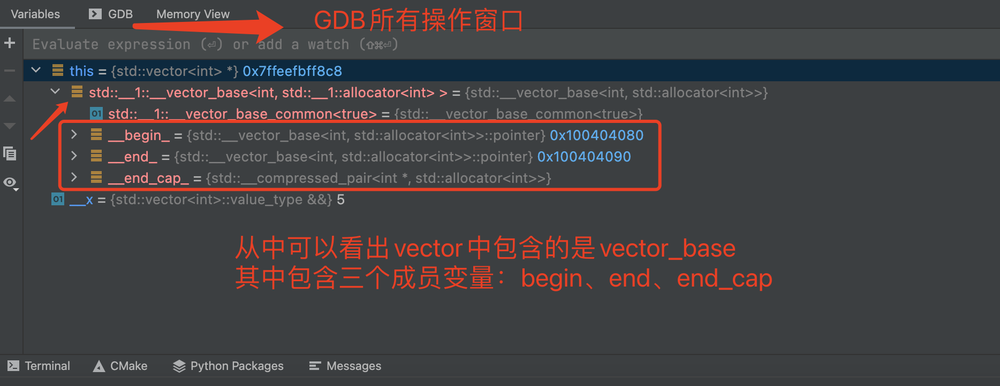  

Centos的VSCODE的  
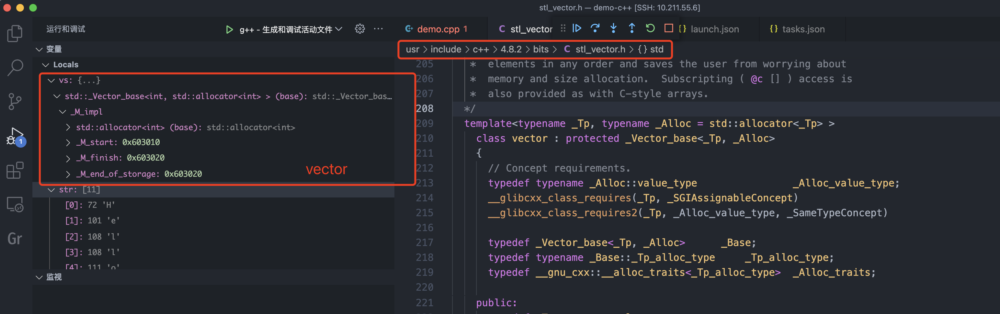  

数据结构如下:
```
(vector)._M_impl
((vector)._M_impl)._M_start
((vector)._M_impl)._M_finish
((vector)._M_impl)._M_end_of_storage

```

Ubuntu的Clion的, Ubuntu的vscode也是这样的:scream:      
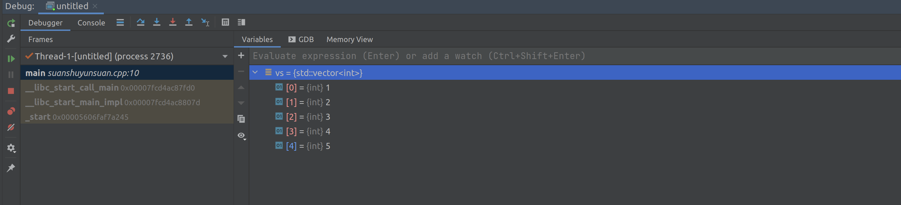

> 不同系统及不同版本的汇编实现都是有差异的  


实例
```c++
#include <iostream>
#include <vector>
using namespace std;

void printVec(string tag, vector<int> vs)
{
    cout << tag << " ";
    for(int i=0; i < vs.size(); i++)
    {
        if(i == vs.size() - 1)
        {
            cout << vs[i] << endl;
        }else
        {
            cout << vs[i] << ",";
        }
    }

    cout << "size:" << vs.size() << ",cap:" << vs.capacity() << endl;
}


int main() {
    vector<int> vs = {1,2,3,4};
    vs.push_back(5);
    printVec("init", vs);

    vs.insert(--vs.end(), 6);
    printVec("insert", vs);

    vs.pop_back();
    vs.erase(vs.end() - 2);
    printVec("delete", vs);

    return 0;
}
```

初始化和插入元素的汇编实现`macos clion`
```c++
Dump of assembler code for function main():
4	int main() {
   0x0000000100002260 <+0>:	push   rbp
   0x0000000100002261 <+1>:	mov    rbp,rsp
   0x0000000100002264 <+4>:	sub    rsp,0x70
   0x0000000100002268 <+8>:	mov    rax,QWORD PTR [rip+0x1db1]        # 0x100004020
   0x000000010000226f <+15>:	mov    rax,QWORD PTR [rax]
   0x0000000100002272 <+18>:	mov    QWORD PTR [rbp-0x8],rax
   0x0000000100002276 <+22>:	mov    DWORD PTR [rbp-0x1c],0x0

5	    vector<int> vs = {1,2,3,4};
=> 0x000000010000227d <+29>:	mov    DWORD PTR [rbp-0x18],0x1  // [rbp-0x18]是数组的地址
   0x0000000100002284 <+36>:	mov    DWORD PTR [rbp-0x14],0x2
   0x000000010000228b <+43>:	mov    DWORD PTR [rbp-0x10],0x3
   0x0000000100002292 <+50>:	mov    DWORD PTR [rbp-0xc],0x4
   0x0000000100002299 <+57>:	lea    rax,[rbp-0x18]            //[rbp-0x18] 赋值给rax 
   0x000000010000229d <+61>:	mov    QWORD PTR [rbp-0x48],rax  // rax-> [rbp-0x48]
   0x00000001000022a1 <+65>:	mov    QWORD PTR [rbp-0x40],0x4  // 元素个数为4 
   0x00000001000022a9 <+73>:	mov    rsi,QWORD PTR [rbp-0x48]
   0x00000001000022ad <+77>:	mov    rdx,QWORD PTR [rbp-0x40]
   0x00000001000022b1 <+81>:	lea    rax,[rbp-0x38]            // 第三个变量 [rbp-0x38] 
   0x00000001000022b5 <+85>:	mov    rdi,rax
   0x00000001000022b8 <+88>:	mov    QWORD PTR [rbp-0x68],rax  // 本地变量vs (vector<int> vs)
   0x00000001000022bc <+92>:	call   0x100002340 <std::__1::vector<int, std::__1::allocator<int> >::vector(std::initializer_list<int>)>

6	    vs.push_back(5);
   0x00000001000022c1 <+97>:	mov    DWORD PTR [rbp-0x4c],0x5  // 加载5为[rbp-0x4c]
   0x00000001000022c8 <+104>:	lea    rsi,[rbp-0x4c]
   0x00000001000022cc <+108>:	mov    rdi,QWORD PTR [rbp-0x68]  // 变量vs , push_back方法传递两个变量 this和5  
   0x00000001000022d0 <+112>:	call   0x100002370 <std::__1::vector<int, std::__1::allocator<int> >::push_back(int&&)>
   0x00000001000022d5 <+117>:	jmp    0x1000022da <main()+122>

7	
8	    return 0;
   0x00000001000022da <+122>:	mov    DWORD PTR [rbp-0x1c],0x0

9	}  // 在方法结束时，调用了vector的析构函数  
   0x00000001000022e1 <+129>:	lea    rdi,[rbp-0x38]
   0x00000001000022e5 <+133>:	call   0x1000023e0 <std::__1::vector<int, std::__1::allocator<int> >::~vector()>
   0x00000001000022ea <+138>:	mov    eax,DWORD PTR [rbp-0x1c]
   0x00000001000022ed <+141>:	mov    rcx,QWORD PTR [rip+0x1d2c]        # 0x100004020
   0x00000001000022f4 <+148>:	mov    rcx,QWORD PTR [rcx]
   0x00000001000022f7 <+151>:	mov    rdx,QWORD PTR [rbp-0x8]
   0x00000001000022fb <+155>:	cmp    rcx,rdx
   0x00000001000022fe <+158>:	mov    DWORD PTR [rbp-0x6c],eax
   0x0000000100002301 <+161>:	jne    0x10000232b <main()+203>
   0x0000000100002307 <+167>:	mov    eax,DWORD PTR [rbp-0x6c]
   0x000000010000230a <+170>:	add    rsp,0x70
   0x000000010000230e <+174>:	pop    rbp
   0x000000010000230f <+175>:	ret    
   0x0000000100002310 <+176>:	mov    QWORD PTR [rbp-0x58],rax
   0x0000000100002314 <+180>:	mov    DWORD PTR [rbp-0x5c],edx
   0x0000000100002317 <+183>:	lea    rdi,[rbp-0x38]
   0x000000010000231b <+187>:	call   0x1000023e0 <std::__1::vector<int, std::__1::allocator<int> >::~vector()>
   0x0000000100002320 <+192>:	mov    rdi,QWORD PTR [rbp-0x58]
   0x0000000100002324 <+196>:	call   0x100003cfe
   0x0000000100002329 <+201>:	ud2    
   0x000000010000232b <+203>:	call   0x100003d5e
   0x0000000100002330 <+208>:	ud2    
   0x0000000100002332 <+210>:	nop    WORD PTR cs:[rax+rax*1+0x0]
   0x000000010000233c <+220>:	nop    DWORD PTR [rax+0x0]

End of assembler dump.
```  

从clion中可以看出方法的原始名称不需要转换，如果使用vscode连接centos7虚拟机的汇编实现如下:
```c++
-exec disass /m
Dump of assembler code for function main():
23	int main() {
   0x0000000000400dc6 <+0>:	push   rbp
   0x0000000000400dc7 <+1>:	mov    rbp,rsp
   0x0000000000400dca <+4>:	push   r13
   0x0000000000400dcc <+6>:	push   r12
   0x0000000000400dce <+8>:	push   rbx
   0x0000000000400dcf <+9>:	sub    rsp,0x28

24	    vector<int> vs = {1,2,3,4};
   0x0000000000400dd3 <+13>:	lea    rax,[rbp-0x25]
   0x0000000000400dd7 <+17>:	mov    rdi,rax
   0x0000000000400dda <+20>:	call   0x400f58 <_ZNSaIiEC2Ev>  // std::allocator<int>::allocator()
   0x0000000000400ddf <+25>:	mov    r12d,0x401ec0
   0x0000000000400de5 <+31>:	mov    r13d,0x4
   0x0000000000400deb <+37>:	lea    rdi,[rbp-0x25]
   0x0000000000400def <+41>:	mov    rcx,r12
   0x0000000000400df2 <+44>:	mov    rbx,r13
   0x0000000000400df5 <+47>:	mov    rax,r12
   0x0000000000400df8 <+50>:	mov    rdx,r13
   0x0000000000400dfb <+53>:	mov    rsi,rcx
   0x0000000000400dfe <+56>:	lea    rax,[rbp-0x40]
   0x0000000000400e02 <+60>:	mov    rcx,rdi
   0x0000000000400e05 <+63>:	mov    rdi,rax
   0x0000000000400e08 <+66>:	call   0x400fe6 <_ZNSt6vectorIiSaIiEEC2ESt16initializer_listIiERKS0_>  //std::vector<int, std::allocator<int> >::vector(std::initializer_list<int>, std::allocator<int> const&)
   0x0000000000400e0d <+71>:	lea    rax,[rbp-0x25]
   0x0000000000400e11 <+75>:	mov    rdi,rax
   0x0000000000400e14 <+78>:	call   0x400f72 <_ZNSaIiED2Ev> // std::allocator<int>::~allocator() 

25	    vs.push_back(5);
   0x0000000000400e19 <+83>:	mov    DWORD PTR [rbp-0x24],0x5
   0x0000000000400e20 <+90>:	lea    rdx,[rbp-0x24]
   0x0000000000400e24 <+94>:	lea    rax,[rbp-0x40]
   0x0000000000400e28 <+98>:	mov    rsi,rdx
   0x0000000000400e2b <+101>:	mov    rdi,rax
   0x0000000000400e2e <+104>:	call   0x4010c8 <_ZNSt6vectorIiSaIiEE9push_backEOi> // std::vector<int, std::allocator<int> >::push_back(int&&)
   
26	
27	    return 0;
=> 0x0000000000400e33 <+109>:	mov    ebx,0x0
   0x0000000000400e38 <+114>:	lea    rax,[rbp-0x40]
   0x0000000000400e3c <+118>:	mov    rdi,rax
   0x0000000000400e3f <+121>:	call   0x401076 <_ZNSt6vectorIiSaIiEED2Ev>   // std::vector<int, std::allocator<int> >::~vector()  
   0x0000000000400e44 <+126>:	mov    eax,ebx
   0x0000000000400e46 <+128>:	jmp    0x400e7c <main()+182>
   0x0000000000400e48 <+130>:	mov    rbx,rax
   0x0000000000400e4b <+133>:	lea    rax,[rbp-0x25]
   0x0000000000400e4f <+137>:	mov    rdi,rax
   0x0000000000400e52 <+140>:	call   0x400f72 <_ZNSaIiED2Ev>  // std::allocator<int>::~allocator()
   0x0000000000400e57 <+145>:	mov    rax,rbx
   0x0000000000400e5a <+148>:	mov    rdi,rax
   0x0000000000400e5d <+151>:	call   0x400b80 <_Unwind_Resume@plt>
   0x0000000000400e62 <+156>:	mov    rbx,rax
   0x0000000000400e65 <+159>:	lea    rax,[rbp-0x40]
   0x0000000000400e69 <+163>:	mov    rdi,rax
   0x0000000000400e6c <+166>:	call   0x401076 <_ZNSt6vectorIiSaIiEED2Ev> // std::vector<int, std::allocator<int> >::~vector()  
   0x0000000000400e71 <+171>:	mov    rax,rbx
   0x0000000000400e74 <+174>:	mov    rdi,rax
   0x0000000000400e77 <+177>:	call   0x400b80 <_Unwind_Resume@plt>

28	}
   0x0000000000400e7c <+182>:	add    rsp,0x28
   0x0000000000400e80 <+186>:	pop    rbx
   0x0000000000400e81 <+187>:	pop    r12
   0x0000000000400e83 <+189>:	pop    r13
   0x0000000000400e85 <+191>:	pop    rbp
   0x0000000000400e86 <+192>:	ret    
End of assembler dump.
```

可以使用`c++filt`工具，centos安装指令`yum install binutils`
```shell
c++filt _ZNSt6vectorIiSaIiEEC2ESt16initializer_listIiERKS0_
std::vector<int, std::allocator<int> >::vector(std::initializer_list<int>, std::allocator<int> const&)
```
做一个 [小工具]() 自动转换该指令，翻译后的结果就是正常的函数名了  
```go
package main

import (
	"container/list"
	"fmt"
	"io/ioutil"
	"os"
	"os/exec"
	"strings"
)

func main() {

	// 读取输入文件
	currPath, _ := os.Getwd()

	// 输入文件路径, 使用os.Stdin vscode命令行无法交互输入
	file, err := os.Open(currPath + "/inputfile")
	if err != nil {
		panic(err)
	}
	defer file.Close()

	contents, err := ioutil.ReadAll(file)
	strs := string(contents)
	lines := strings.Split(strs, "\n")
	results := list.New()

	// 解析数据
	for _, line := range lines {
		if strings.Contains(line, "<_ZN") {
			start := strings.Index(line, "<_ZN")
			end := strings.LastIndex(line, ">")

			funcSymbol := line[start+1 : end]
			// 执行c++filt 命令
			cmd := exec.Command("/usr/bin/c++filt", funcSymbol)
			out, _ := cmd.CombinedOutput()
			funcName := string(out)

			line = line[:start] + funcName
		}
		results.PushBack(line)
	}

	for i := results.Front(); i != nil; i = i.Next() {
		fmt.Println(i.Value)
	}
```

目前可以看到`vector`的内存创建与`std::allocator<int>::allocator()`和`std::initializer_list<int>`有关系  

> 需要注意c++源码的版本，目前在centos使用`gcc-g++ 4.8.5`版本，对应的源码为gcc-g++-4.8.2-x86_64-1.txz
> 路径是"/usr/include/c++/4.8.2/bits/stl_vector.h"  

> vs版本、gcc版本、c++版本之间的关系   
> c++版本是一个标准，需要编译器支持。比如c++11标准, `gcc4.8.1`及以上可以完全支持。`vs2015`可以完全支持。  


`c++/v1/vector`文件中vector的创建及`push_back`方法  
创建方法
```
template <class _Tp, class _Allocator>
inline _LIBCPP_INLINE_VISIBILITY
vector<_Tp, _Allocator>::vector(initializer_list<value_type> __il)
{
#if _LIBCPP_DEBUG_LEVEL >= 2
    __get_db()->__insert_c(this);
#endif
    if (__il.size() > 0)
    {
        __vallocate(__il.size());
        __construct_at_end(__il.begin(), __il.end(), __il.size());
    }
}
```  

添加元素方法  
```c++
template <class _Tp, class _Allocator>
inline _LIBCPP_INLINE_VISIBILITY
void
vector<_Tp, _Allocator>::push_back(value_type&& __x)
{
    if (this->__end_ < this->__end_cap())
    {
        __construct_one_at_end(_VSTD::move(__x));
    }
    else
        __push_back_slow_path(_VSTD::move(__x));
}
```

[ :bookmark: 返回目录](#目录)

### 字符串  
- 以字符'\0'结束  

汇编实现
```c++
35	    char str[] = {"HelloWorld"};
                                // 编译器在解释字符串时，就在最后增加了'\0'结束符
   0x0000000100003dfc <+652>:	mov    rax,QWORD PTR [rip+0x3fd4]       # 0x100007dd7 => "HelloWorld\0" 
   0x0000000100003e03 <+659>:	mov    QWORD PTR [rbp-0x23],rax
   0x0000000100003e07 <+663>:	mov    cx,WORD PTR [rip+0x3fd1]        # 0x100007ddf => allocator<T>...
   0x0000000100003e0e <+670>:	mov    WORD PTR [rbp-0x1b],cx
   0x0000000100003e12 <+674>:	mov    dl,BYTE PTR [rip+0x3fc9]        # 0x100007de1
   0x0000000100003e18 <+680>:	mov    BYTE PTR [rbp-0x19],dl
```

查看内存地址
```shell 
(gdb) x/32c 0x100007dd7    // 字符串结束时有个结束符'\0'  
0x100007dd7:	72 'H'	101 'e'	108 'l'	108 'l'	111 'o'	87 'W'	111 'o'	114 'r'
0x100007ddf:	108 'l'	100 'd'	0 '\000'	97 'a'	108 'l'	108 'l'	111 'o'	99 'c'
0x100007de7:	97 'a'	116 't'	111 'o'	114 'r'	60 '<'	84 'T'	62 '>'	58 ':'
0x100007def:	58 ':'	97 'a'	108 'l'	108 'l'	111 'o'	99 'c'	97 'a'	116 't'

(gdb) x/32s 0x100007ddf
0x100007ddf:	"ld"
0x100007de2:	"allocator<T>::allocate(size_t n) 'n' exceeds maximum supported size"
0x100007e26:	""
0x100007e27:	""
0x100007e28:	"\001"

(gdb) x/32s 0x100007de1
0x100007de1:	""
0x100007de2:	"allocator<T>::allocate(size_t n) 'n' exceeds maximum supported size"
0x100007e26:	""
0x100007e27:	""
0x100007e28:	"\001"
```

> 字符串创建时"HelloWorld\0"已经存在，接着调用`allocator<T>::allocate(size_t n)`，`vector创建时`也会调用该方法 ？  

查看不同0值的含义  
```c++
#include <iostream>
using namespace std;

int main()
{
    char a1 = 0;    // 0x00
    char a2= '\0';  // 0x00
    char a3 = '0';  // 0x30
    return 0;
}
```

通过gdb查看内存值  
```
-exec x/bb &a1
0x7fffffffdcff:	0x00

-exec x/bb &a2
0x7fffffffdcfe:	0x00

-exec x/bb &a3
0x7fffffffdcfd:	0x30

-exec x/db &a3        // d 十进制显示   b显示单位为byte  
0x7fffffffdcfd:	48
```

从中可以看出`0`与`'\0'`是等价的  

[ :bookmark: 返回目录](#目录)

#### unicode编码  
- Unicode编码:最初的目的是把世界上的文字都映射到一套字符空间中  
- 为了表示Unicode字符集，有3种(确切的说是5种)Unicode的编码方式:  
  - UTF-8: 1 byte来表示字符，可以兼容ASCII码; 特点是存储效率高，变长(不方便内部随机访问)，无字节序问题(可作为外部编码)  
  - UTF-16:分为UTF-16BE(big endian), UTF-16LE(ittle endian),特点是定长(方便内部随机访问), 有字节序问题(不可作为外部编码)  
  - UTF-32:分为UTF-32BE(big endian), UTF-32LE(ittle endian),特点是定长(方便内部随机访问), 有字节序问题(不可作为外部编码)
- 编码错误的根本原因在于编码方式和解码方式的不统一;  

> Windows的文件可能有BOM(byte order mark)如要在其他平台使用，可以去掉BOM  

```
// utf-8 格式
68 65 6C 6C 6F 77 6F 72 6C 64   |   helloworld  

//utf-16 LE   在utf-8的基础上增加一个byte 00 
68 00 65 00 6C 00 6C 00 6F 00 77 00 6F 00 72 00 6C 00 64 00   |     h⊙e⊙l⊙l⊙o⊙w⊙o⊙r⊙l⊙d⊙  

//utf-16 BE
00 68 00 65 00 6C 00 6C 00 6F 00 77 00 6F 00 72 00 6C 00 64   |     ⊙h⊙e⊙l⊙l⊙o⊙w⊙o⊙r⊙l⊙d  
```

[ :bookmark: 返回目录](#目录)

#### 字符串指针  
> 指向常量区的字符串指针，内容不能被修改。(常量区只读)。 golang中的字符串内容是可以修改的，没有常量区不能修改这一说。  

```c++
#include <string.h>
#include <iostream>
using namespace std;
int main()
{
    // 定义一个数组
    char strHelloWorld[11] = {"helloworld"}; // 这个定义可以, 字符存放到数组中  
    char *pStrHelloWrold = "helloworld";     // 常量区的值是不可以改变的
    pStrHelloWrold = strHelloWorld;
    //strHelloWorld = pStrHelloWrold;        // 数组变量的值不允许改变

    // 通过数组变量遍历修改数组中的元素值
    for (int index = 0; index < strlen(strHelloWorld); ++index)
    {
        strHelloWorld[index] += 1;
        std::cout << strHelloWorld[index];
    }
    cout << endl; // 换行  

    // 通过指针变量遍历修改数组中的元素值  
    for (int index = 0; index < strlen(strHelloWorld); ++index)
    {
        pStrHelloWrold[index] += 1;  
        std::cout << pStrHelloWrold[index];  
    }

    cout << endl; // 换行
    
    // 计算字符串长度
    cout << "字符串长度为: " << strlen(strHelloWorld) << endl;
    cout << "字符串占用空间为:  " << sizeof(strHelloWorld) << endl;

    return 0;
}
```

输出结果 
```
ifmmpxpsme
jgnnqyqtnf
字符串长度为: 10
字符串占用空间为:  11
```

[ :bookmark: 返回目录](#目录)

### 字符串基本操作  
```c++
/* Copy SRC to DEST.  */
extern char *strcpy (char *__restrict __dest, const char *__restrict __src)
/* Copy no more than N characters of SRC to DEST.  */
extern char *strncpy (char *__restrict __dest,const char *__restrict __src, size_t __n)

/* Append SRC onto DEST.  */
extern char *strcat (char *__restrict __dest, const char *__restrict __src)

/* Compare S1 and S2.  */  // 0 相等; 正数 S1 > S1; 负数 S1 < S1;  
extern int strcmp (const char *__s1, const char *__s2)

/* Return the length of S.  */
extern size_t strlen (const char *__s)

/* Find the first occurrence of C in S.  */   // 第一次出现char的位置  
extern char *strchr (char *__s, int __c)

/* Find the first occurrence of NEEDLE in HAYSTACK.  */  // 字符串查找  
extern char *strstr (char *__haystack, const char *__needle)


```

基础操作示例`<string.h> 使用C库的头文件`  
```
#include <string.h> //使用C库的头文件
#include <iostream>
using namespace std;
const unsigned int MAX_LEN_NUM = 16;
const unsigned int STR_LEN_NUM = 7;
const unsigned int NUM_TO_COPY = 2;
int main()
{
    char strHelloWorld1[] = {"hello"};
    char strHelloWorld2[STR_LEN_NUM] = {"world1"};
    char strHelloWorld3[MAX_LEN_NUM] = {0};

    // 字符串拷贝  (dest, src)
    strcpy(strHelloWorld3, strHelloWorld1); // hello
    // strcpy_s(strHelloWorld3, MAX_LEN_NUM, strHelloWorld1);

    int res = strcmp(strHelloWorld1, strHelloWorld2);
    cout << "cmp result:" << res << ";" << strHelloWorld1 << ":" << strHelloWorld2 << endl;

    strncpy(strHelloWorld3, strHelloWorld2, NUM_TO_COPY); // wollo
    // strncpy_s(strHelloWorld3, MAX_LEN_NUM,  strHelloWorld2, NUM_TO_COPY);

    // 字符串拼接(dest, src), 追加的方式    
    strcat(strHelloWorld3, strHelloWorld2); //  wolloworld1
    // strcat_s(strHelloWorld3, MAX_LEN_NUM, strHelloWorld2);

    unsigned int len = strlen(strHelloWorld3);
    // unsigned int len = strnlen_s(strHelloWorld3, MAX_LEN_NUM);
    for (unsigned int index = 0; index < len; ++index)
    {
        cout << strHelloWorld3[index] << "";
    }
    cout << endl;

    // 小心缓冲区溢出
    strcat(strHelloWorld2, "Welcome to C++");
    // strcat_s(strHelloWorld2, STR_LEN_NUM, "Welcome to C++");

    return 0;
}
```

> c中原始字符串的安全性和效率存在一定问题  
> 缓冲区溢出、strlen的效率可以提高(空间换时间)  
> redis字符串中增加了长度信息，可以直接查询    

```c
typedef char *sds;


struct sdshdr {

    // buf 已占用长度
    int len;

    // buf 剩余可用长度
    int free;

    // 实际保存字符串数据的地方
    char buf[];
};
```

另一种字符串`<string> Forward declarations -*- C++ -*-`文件名为`stringfwd.h`    
```
  /// A string of @c char
  typedef basic_string<char>    string;  
```

- c++标准库中提供了string类型专门表示字符串 `#include <string>` 
- 使用string可以更为方便和安全的管理字符串  
- 定义字符串变量的方式: `string s` 、`string s = "hello"`、`string s("helloworld")`  

基础操作示例:
```
#include <iostream>
#include <string>
using namespace std;
int main()
{
    // 字符串定义
    string s1;                //定义空字符串
    string s2 = "helloworld"; //定义并初始化
    string s3("helloworld");
    string s4 = string("helloworld");

    // 获取字符串长度  length与size 等价的
    cout << "length:" << s2.length() << endl;     // _M_length
    cout << "size:" << s2.size() << endl;         // _M_length
    cout << "capacity:" << s2.capacity() << endl; // _M_capacity

    // 字符串比较
    s1 = "hello", s2 = "world";
    cout << "(s1==s2):" << (s1 == s2) << endl;
    cout << "(s1!=s2):" << (s1 != s2) << endl;
    cout << "(s1<s2):" << (s1 < s2) << endl;

    //  转换成C风格的字符串
    const char *c_str1 = s1.c_str();
    cout << "The C-style string c_str1 is: " << c_str1 << endl;
    //  随机访问
    for (unsigned int index = 0; index < s1.length(); ++index)
    {
        cout << c_str1[index] << " ";
    }
    cout << endl;
    for (unsigned int index = 0; index < s1.length(); ++index)
    {
        cout << s1[index] << " ";
    }
    cout << endl;

    // 字符串拷贝
    s1 = "helloworld";
    s2 = s1;

    // 字符串连接
    s1 = "helllo", s2 = "world";
    s3 = s1 + s2; //s3: helloworld
    s1 += s2;     //s1: helloworld
    return 0;
}
```

> string 结合了C++的新特性，使用起来比原始的C风格方法更安全和方便，对性能要求不是特别高的场景可以使用。  

[ :bookmark: 返回目录](#目录)

## 指针
### 数组指针和指针数组 
- 数组的指针 `T (*pA)[]`   
- 指针的数组 `T* a[]`  

示例代码
```c++
#include <iostream>
using namespace std;

int main()
{
    int a[4] = {0x80000000, 0x000000FF, 3, 4};
    int *pA = a; // &a[0]  // 指针指向数组首地址
    cout << "a数组地址:" << a << ",pA[0]:" << pA[0] << ",pA[1]:" << pA[1] << endl;

    int* pArr[4] = {&a[0], &a[1], &a[2], &a[3]};  // 指针的数组   T pArr[4]  => T = int* 
    // 输出的是指针的地址 0x7fffffffdcd0  
    cout << "pArr[0]:" << pArr[0] << ",pArr[1]:" << pArr[1] << endl;
    cout << "*(pArr[0]):" << *(pArr[0]) << ",*(pArr[1):" << *(pArr[1]) << endl;

    // 指向int[4]数组的指针  a pointer to an array 
    int (*arrP)[4];    // 数组的指针  T (*pArr)[4] => T = int
    arrP = &a;         // 数组的个数必须一致  

    // arrP[0] 相当于指针的偏移操作，偏移量为0,那就指向a数组的地址  //arrP[1] 偏移16个字节(4字节x4个元素)  
    cout << "arrP[0]:" << arrP[0] << ",arrP[1]:" << arrP[1] << endl;
    // (*arrP) 是指向数组的地址，(*arrP)[0] 是指向数组地址的首个元素  
    cout << "(*arrP)[0]:" << (*arrP)[0] << ",(*arrP)[1]:" << (*arrP)[1] << endl;

}
```

打印输出 
```shell
a数组地址:0x7fffffffdcd0,pA[0]:-2147483648,pA[1]:255
pArr[0]:0x7fffffffdcd0,pArr[1]:0x7fffffffdcd4
arrP[0]:0x7fffffffdcd0,arrP[1]:0x7fffffffdce0       
(*arrP)[0]:-2147483648,(*arrP)[1]:255

a数组地址:0x7fffffffdcd0,pA[0]:-2147483648,pA[1]:255
pArr[0]:0x7fffffffdcd0,pArr[1]:0x7fffffffdcd4
*(pArr[0]):-2147483648,*(pArr[1):255                // pArr[0] 是数组的地址, *(pArr[0]) 取值  
arrP[0]:0x7fffffffdcd0,arrP[1]:0x7fffffffdce0       // arrP[0] 数组a的地址, arrP[0] 偏移16个字节的地址
(*arrP)[0]:-2147483648,(*arrP)[1]:255
```  

> 需要特别注意的是`c/c++`中指针(内存地址)是可以进行运算的，一种方式是`arrP + 1`，另一种方式是`arrP[1]` 含义是相同的  

[ :bookmark: 返回目录](#目录)

### const与指针  
- const pointer  
- pointer to const 

> 关于const修改部分，看左侧最近的部分，如果左侧没有，则看右侧。  
> **主要确认修改的部分是`(*p) 指向的内容`还是`(p) 指针`**    

```c++
#include <iostream>
#include <string.h>
using namespace std;
unsigned int MAX_LEN = 11;

int main()
{
    char strHelloworld[] = {"helloworld"};
    // const修饰谁，谁的内容就不可变，其他的都可变
    const char *pStr1 = "helloworld";       // 修饰的是(*pStr1) 指向的内容不能修改。 主要用于函数的形参，防止被修改  
    char *const pStr2 = strHelloworld;      // 修饰的是(pStr2)  指向不能修改
    const char *const pStr3 = "helloworld"; // 修饰的是(*pStr3)和(pStr3)  指向和指向的内容都不能修改

    pStr1 = strHelloworld; // 指向可以变，指向的内容不能变
    //pStr2 = strHelloworld;                // pStr2不可改
    //pStr3 = strHelloworld;                // pStr3不可改

    unsigned int len = strnlen(pStr2, MAX_LEN);
    cout << len << endl;
    for (unsigned int index = 0; index < len; ++index)
    {
        //pStr1[index] += 1;                               // pStr1里的值不可改
        pStr2[index] += 1;
        //pStr3[index] += 1;                               // pStr3里的值不可改
    }

    char a = 'a';
    const char *pA = &a;

    // 指针指向的内容不能修改， 但是a的值仍是可以修改的  
    // *pA = 'b'; // assignment of read-only location ‘* pA’
    a = 'c';      // (*pA)指向的内容就是变量a的地址，a变量仍然是可以修改的  
    cout << *pA << endl;

    return 0;
}
```

查看内存值
```shell
-exec x/16xb &strHelloworld
0x7fffffffdcd0:	0x68	0x65	0x6c	0x6c	0x6f	0x77	0x6f	0x72
0x7fffffffdcd8:	0x6c	0x64	0x00	0x00	0x00	0x00	0x00	0x00

-exec x/16xb &pStr1
0x7fffffffdcf0:	0xd0	0xdc	0xff	0xff	0xff	0x7f	0x00	0x00
0x7fffffffdcf8:	0x00	0x00	0x00	0x00	0x00	0x00	0x00	0x00

-exec x/16xb &pStr2
0x7fffffffdce8:	0xd0	0xdc	0xff	0xff	0xff	0x7f	0x00	0x00
0x7fffffffdcf0:	0xd0	0xdc	0xff	0xff	0xff	0x7f	0x00	0x00

-exec x/16xb &pStr3
0x7fffffffdce0:	0x81	0x09	0x40	0x00	0x00	0x00	0x00	0x00
0x7fffffffdce8:	0xd0	0xdc	0xff	0xff	0xff	0x7f	0x00	0x00

-exec x/16cb 0x400981
0x400981:	104 'h'	101 'e'	108 'l'	108 'l'	111 'o'	119 'w'	111 'o'	114 'r'
0x400989:	108 'l'	100 'd'	0 '\000'	1 '\001'	27 '\033'	3 '\003'	59 ';'	64 '@'
```

通过查看内存值可以画出如下关系:  

<br>
<div align=center>
    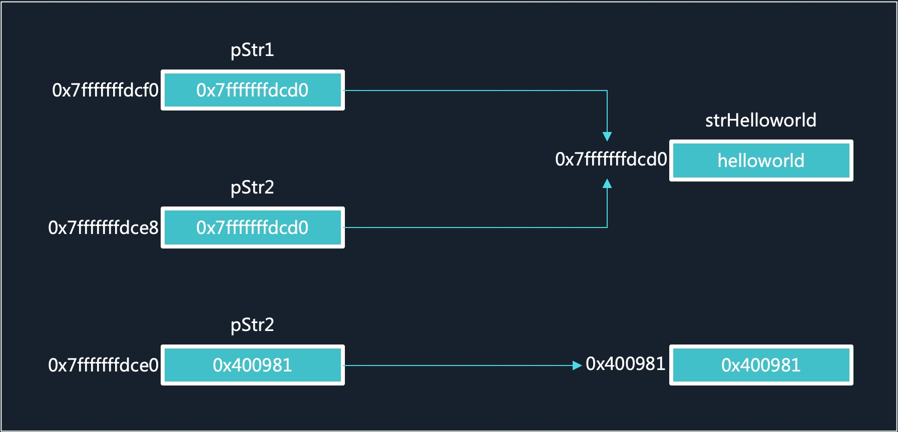</img>  
</div>
<br>

`pStr1`、`pStr2`、`pStr3`变量的地址是连续的，`pStr1`、`pStr2`指向  


`const`还是针对于编译器，可以从汇编实现看出，运行时与其他变量无异!  
- const 是由编译器进行处理，执行类型检查和作用域的检查；
- define 是由预处理器进行处理，只做简单的文本替换工作而已。

[ :bookmark: 返回目录](#目录)

### 二级指针和野指针  

指向指针的指针
```c++
#include <iostream>
using namespace std;

int main()
{
    int a = 123;
    int* b = &a;
    int** c = &b;

    cout << "&a=" << &a << ",b=" << b << ",c=" << c << endl;
}
```
输出结果  
```
&a=0x7fffffffdce4,b=0x7fffffffdce4,c=0x7fffffffdcd8
```

如果一个指针在声明时没有指定初始值，那系统分配的初始值可能是异常数据，最坏的情况是，地址可以访问，导致修改了其他有效数据。  

```
#include <iostream>
using namespace std;

int main()
{
    int *a;  // 分配的地址为 0x400730 ,可能是非法地址  
    cout << "a=" << a << ",&a=" << &a << endl;

    /*
    -exec x/16xb 0x400730
    0x400730 <_start>:	    0x31	0xed	0x49	0x89	0xd1	0x5e	0x48	0x89
    0x400738 <_start+8>:	0xe2	0x48	0x83	0xe4	0xf0	0x50	0x54	0x49
    */
    return 0;
}
```

> 指针在不适用的时候要把指针置空(NULL)  
> 在C++中建议使用nullptr替代NULL，因为在C++中NULL是: #define NULL 0 这样在整型重载的时候可能会有问题。而C++11加入了nullptr，可以保证在任何情况下都代表空指针， 所以比较安全。

```c++
#include <iostream>
using namespace std;
int main()
{
    // 指针的指针
    int a = 123;
    int *b = &a;
    int **c = &b;

    // NULL 的使用
    int *pA = NULL;
    pA = &a;
    if (pA != NULL) //  判断NULL指针
    {
        cout << (*pA) << endl;
    }
    pA = NULL; //  pA不用时，置为NULL

    return 0;
}
```

[ :bookmark: 返回目录](#目录)

**野指针**  
- 指向`垃圾`内存的指针， if判断对它没有作用，因为没有置空

一般有三种情况:  
- 指针变量没有初始化;
- 已经释放不用的指针没有置NULL, 如`delete`与`free`之后的指针;
- 指针操作超越了变量的作用范围;  

> 没有初始化的指针，不用或者超出作用范围的指针请把值置为NULL  


### 指针的基本操作  
- `&`和`*`
- `++`、`--`  
- 

```c++
#include <iostream>
using namespace std;
int main()
{
    char ch = 'a';

    // &操作符
    //&ch = 97;     // &ch左值不合法
    char *cp = &ch; // &ch右值
    //&cp = 97;     // &cp左值不合法
    char **cpp = &cp; // &cp右值

    // *操作符
    *cp = 'a';      // *cp左值取变量ch位置
    char ch2 = *cp; // *cp右值取变量ch存储的值
    //*cp + 1 = 'a'; //  *cp+1左值不合法的位置
    ch2 = *cp + 1;   //  *cp+1右值取到的字符做ASCII码+1操作
    *(cp + 1) = 'a'; //  *(cp+1)左值语法上合法，取ch后面位置
    ch2 = *(cp + 1); //  *(cp+1)右值语法上合法，取ch后面位置的值

    return 0;
}
```

```c++
int main()
{
    char ch = 'a';
    char *cp = &ch;
    // ++,--操作符
    char *cp2 = ++cp;
    char *cp3 = cp++;
    char *cp4 = --cp;
    char *cp5 = cp--;

    // ++ 左值
    //++cp2 = 97;
    //cp2++ = 97;

    // *++, ++*
    *++cp2 = 98;
    char ch3 = *++cp2;
    *cp2++ = 98;
    char ch4 = *cp2++;

    // ++++, ----操作符等
    int a = 1, b = 2, c, d;
    //c = a++b;               // error
    c = a++ + b;
    //d = a++++b;             // error
    char ch5 = ++*++cp;

    return 0;
}
```

[ :bookmark: 返回目录](#目录)

### CPP程序的存储区域划分  
- (stack)栈区  
- 常量区  
- (heap)堆区
- (text)代码区, 调用函数时使用代码区的地址  
- (GVAR)全局初始化区
- (bss)全局未初始化区

```c++
#include <string.h>
#include <iostream>
using namespace std;

int a = 0; //(GVAR)全局初始化区
int *p1;   //(bss)全局未初始化区

int main() //(text)代码区
{
    int b = 1;                //(stack)栈区变量
    char s[] = "abc";         //(stack)栈区变量
    int *p2 = NULL;           //(stack)栈区变量
    char *p3 = "123456";      //123456\0在常量区, p3在(stack)栈区
    static int c = 0;         //(GVAR)全局(静态)初始化区
    p1 = new int(10);         //(heap)堆区变量
    p2 = new int(20);         //(heap)堆区变量
    char *p4 = new char[7];   //(heap)堆区变量
    strncpy(p4, "123456", 7); //(text)代码区   strncpy方法名是代码区的地址  

    cout << "b=" << &b << ",s=" << &s << ",p1=" << p1 << ",p2=" << p2 << endl;
    cout << "&p3=" << &p3 << ",&p4=" << &p4 << ",(void*)p3=" << (void *)p3 << ",(void*)p4=" << (void *)p4 << ",p3=" << p3 << ",p4=" << p4 << endl;

    //(text)代码区
    if (p1 != NULL)
    {
        delete p1;
        p1 = NULL;
    }
    if (p2 != NULL)
    {
        delete p2;
        p2 = NULL;
    }
    if (p4 != NULL)
    {
        delete[] p4;
        p4 = NULL;
    }
    //(text)代码区
    return 0; //(text)代码区
}
```

输出结果:  
```shell
b=0x7fffffffdcd4,s=0x7fffffffdcd0,p1=0x603010,p2=0x603030
&p3=0x7fffffffdcc8,&p4=0x7fffffffdcc0,(void*)p3=0x400c61,(void*)p4=0x603050,p3=123456,p4=123456
```

`b`和`s`在同一栈区(0x7fffffff)，`p1`、`p2`、`p4`指向的内存地址在堆区(0x6030)，`p3`指向的内存地址在常量区(0x400c)  

> `p3`指向常量字符串，如何打印字符串的地址呢?  `(void*)p3`
```
-exec p p3
$1 = 0x400c61 "123456"

-exec p p4
$2 = 0x603050 "123456"
```

<br>
<div align=center>
    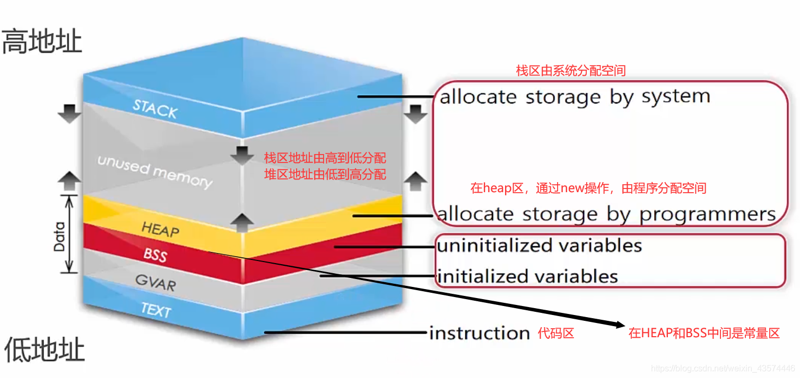</img>  
</div>
<br>

> 栈空间的地址是从高到底的，内存的申请及释放由系统管理；堆空间的地址是从低到高的，由程序员管理；  


<br>
<div align=center>
    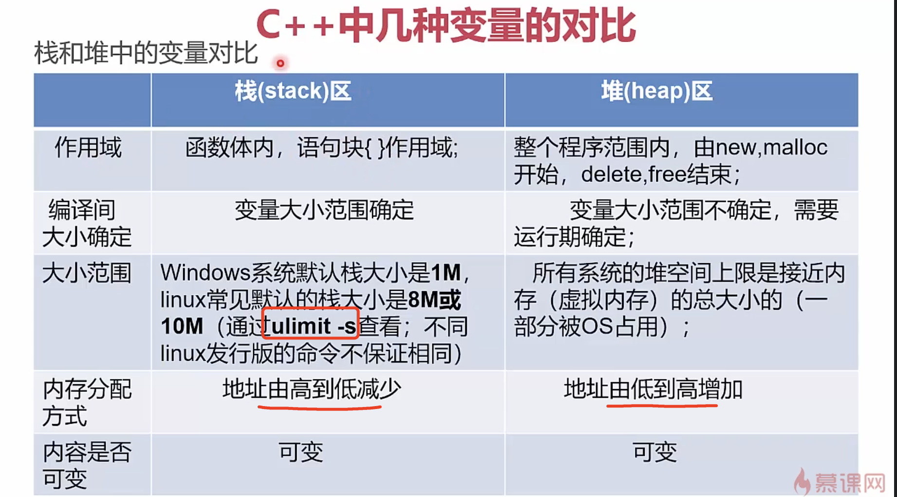</img>  
</div>
<br>

> 栈区的大小在编译时根据变量的个数及大小确定了，申请堆区的大小在编译时确定  
> 
> 
> <br>
<div align=center>
    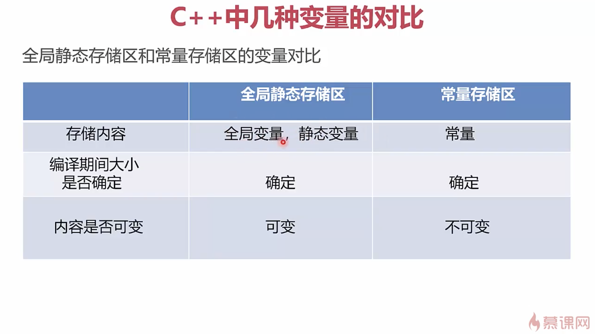</img>  
</div>
<br>

### RAII 资源获取即初始化（Resource Acquisition Is Initialization）

> [RAII要求](https://zh.wikipedia.org/wiki/RAII) ,资源的有效期与持有资源的对象的生命期严格绑定，即由对象的构造函数完成资源的分配（获取），同时由析构函数完成资源的释放。在这种要求下，只要对象能正确地析构，就不会出现资源泄露问题。    
> 虽然RAII和finally都能保证资源管理时的异常安全，但相对来说，使用RAII的代码相对更加简洁。 如比雅尼·斯特劳斯特鲁普所说，“在真实环境中，调用资源释放代码的次数远多于资源类型的个数，所以相对于使用finally来说，使用RAII能减少代码量。”  

[ :bookmark: 返回目录](#目录)

### 智能指针
比指针更安全的解决方案:  
- 使用更安全的指针----**智能指针**  
- 不使用指针，使用更安全的方式----**引用**

> 除非特殊场景，一般不建议自己对内存进行`new`和`delete`  

#### auto_prt (c++11标准已经废弃，c++17已经正式删除)

> `auto_prt`是一个类，在构造函数中申请内存，在析构函数中释放内存。(RAII)  

```
/**
       *  @brief  An %auto_ptr is usually constructed from a raw pointer.
       *  @param  __p  A pointer (defaults to NULL).
       *
       *  This object now @e owns the object pointed to by @a __p.
       */
      explicit
      auto_ptr(element_type* __p = 0) throw() : _M_ptr(__p) { }
      
/**
       *  When the %auto_ptr goes out of scope, the object it owns is
       *  deleted.  If it no longer owns anything (i.e., @c get() is
       *  @c NULL), then this has no effect.
       *
       *  The C++ standard says there is supposed to be an empty throw
       *  specification here, but omitting it is standard conforming.  Its
       *  presence can be detected only if _Tp::~_Tp() throws, but this is
       *  prohibited.  [17.4.3.6]/2
       */
      ~auto_ptr() { delete _M_ptr; }
```

示例代码:  
```c++
#include <string>
#include <iostream>
#include <memory>
using namespace std;
int main()
{
    { // 确定auto_ptr失效的范围
        // 对int使用
        auto_ptr<int> pI(new int(10));  // 必须从堆区申请，参数是个指针，不是数值 
        cout << *pI << endl; // 10

        // auto_ptr	C++ 17中移除	拥有严格对象所有权语义的智能指针
        // auto_ptr原理：在拷贝 / 赋值过程中，直接剥夺原对象对内存的控制权，转交给新对象，
        // 然后再将原对象指针置为nullptr（早期：NULL）。这种做法也叫管理权转移。
        // 他的缺点不言而喻，当我们再次去访问原对象时，程序就会报错，所以auto_ptr可以说实现的不好，
        // 很多企业在其库内也是要求不准使用auto_ptr。
        auto_ptr<string> languages[5] = {
            auto_ptr<string>(new string("C")),
            auto_ptr<string>(new string("Java")),
            auto_ptr<string>(new string("C++")),
            auto_ptr<string>(new string("Python")),
            auto_ptr<string>(new string("Rust"))};
        cout << "There are some computer languages here first time: \n";
        for (int i = 0; i < 5; ++i)
        {
            cout << *languages[i] << endl;
        }
        auto_ptr<string> pC;
        pC = languages[2]; // languges[2] loses ownership. 将所有权从languges[2]转让给pC，
        //此时languges[2]不再引用该字符串从而变成空指针
        cout << "There are some computer languages here second time: \n";
        for (int i = 0; i < 2; ++i)
        {
            cout << *languages[i] << endl;
        }
        cout << "The winner is " << *pC << endl;

        //cout << "There are some computer languages here third time: \n";
        //for (int i = 0; i < 5; ++i)
        //{
        //	cout << *languages[i] << endl;  // 第三个所有权转让了，languages[i]已经置为null了，会报错  
        //}
    }
    return 0;
}
```
输出结果:  
```
10
There are some computer languages here first time: 
C
Java
C++
Python
Rust
There are some computer languages here second time: 
C
Java
The winner is C++
```

[ :bookmark: 返回目录](#目录)

#### unique_ptr
- 专属所有权，unique_ptr管理内存，只能被一个对象持有，不支持复制和赋值  
- 移动语义, unique_ptr禁止了拷贝语义，但有时我们也需要转移所有权，于是提供了移动语义，即可以使用std::move进行所有权的转移  

析构函数-释放指针内存:  
```c++
    // Destructor.
    ~unique_ptr() noexcept
    {
      auto &__ptr = std::get<0>(_M_t);
      if (__ptr != nullptr)
        get_deleter()(__ptr);
      __ptr = pointer();
    }
```  

示例代码
```c++
#include <memory>
#include <iostream>
using namespace std;

int main()
{
    // 在这个范围之外，unique_ptr被释放
    {
        auto i = unique_ptr<int>(new int(10));
        cout << *i << endl;
    }

    // unique_ptr
    // auto w = std::make_unique<int>(10);  // 大多数C++编译器支持，centos gcc4.8.2不支持
    auto w = unique_ptr<int>(new int(10));
    cout << *(w.get()) << endl; // 10
    //auto w2 = w; // 编译错误如果想要把 w 复制给 w2, 是不可以的。
    //  因为复制从语义上来说，两个对象将共享同一块内存。

    // unique_ptr 只支持移动语义, 即如下
    auto w2 = std::move(w);                                     // w2 获得内存所有权，w 此时等于 nullptr
    cout << ((w.get() != nullptr) ? (*w.get()) : -1) << endl;   // -1
    cout << ((w2.get() != nullptr) ? (*w2.get()) : -1) << endl; // 10
    return 0;
}
```

输出结果:  
```shell
10
10
-1
10
```

> unique_ptr内存释放  

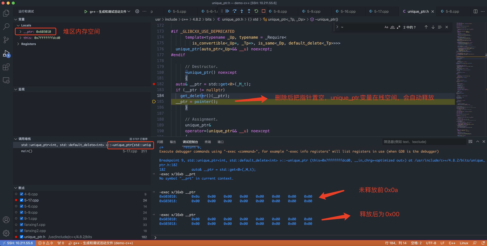  

[ :bookmark: 返回目录](#目录)

#### shared_prt 
- 通过引用计数共享一个对象，为了解决auto_ptr在对象所有权上的局限性    
- 当引用计数为0时，该对象没有被使用，可以进行析构  

> 循环引用: 相互引用，导致堆里的内存无法正常回收。  

```c++
#include <iostream>
#include <memory>
using namespace std;
int main()
{
    // shared_ptr
    {
        //shared_ptr 代表的是共享所有权，即多个 shared_ptr 可以共享同一块内存。
        auto wA = shared_ptr<int>(new int(20));
        {
            auto wA2 = wA;
            cout << ((wA2.get() != nullptr) ? (*wA2.get()) : -1) << endl; // 20
            cout << ((wA.get() != nullptr) ? (*wA.get()) : -1) << endl;   // 20
            cout << wA2.use_count() << endl;                              // 2
            cout << wA.use_count() << endl;                               // 2
        }
        //cout << wA2.use_count() << endl;
        cout << wA.use_count() << endl;                             // 1
        cout << ((wA.get() != nullptr) ? (*wA.get()) : -1) << endl; // 20
                                                                    //shared_ptr 内部是利用引用计数来实现内存的自动管理，每当复制一个 shared_ptr，
                                                                    //	引用计数会 + 1。当一个 shared_ptr 离开作用域时，引用计数会 - 1。
                                                                    //	当引用计数为 0 的时候，则 delete 内存。
    }

    // move 语法
    auto wAA = std::shared_ptr<int>(new int(30));
    auto wAA2 = std::move(wAA);                                     // 此时 wAA 等于 nullptr，wAA2.use_count() 等于 1
    cout << ((wAA.get() != nullptr) ? (*wAA.get()) : -1) << endl;   // -1
    cout << ((wAA2.get() != nullptr) ? (*wAA2.get()) : -1) << endl; // 30
    cout << wAA.use_count() << endl;                                // 0
    cout << wAA2.use_count() << endl;                               // 1
                                                                    //将 wAA 对象 move 给 wAA2，意味着 wAA 放弃了对内存的所有权和管理，此时 wAA对象等于 nullptr。
                                                                    //而 wAA2 获得了对象所有权，但因为此时 wAA 已不再持有对象，因此 wAA2 的引用计数为 1。

    return 0;
}
```

[ :bookmark: 返回目录](#目录)

#### weak_ptr 
- 被设计与`shared_ptr`共同工作，用一种观察模式工作。  
- `weak_ptr` 只对 `shared_ptr` 起到引用作用，而不改变引用计数。

```c++
#include <string>
#include <iostream>
#include <memory>
using namespace std;

struct B;
struct A
{
    shared_ptr<B> pb;
    ~A()                      // 结构体也有构造及析构，也可以有修饰符.  public: private 
    {
        cout << "~A()" << endl;
    }
};
struct B
{
    shared_ptr<A> pa;
    ~B()
    {
        cout << "~B()" << endl;
    }
};

// pa 和 pb 存在着循环引用，根据 shared_ptr 引用计数的原理，pa 和 pb 都无法被正常的释放。
// weak_ptr 是为了解决 shared_ptr 双向引用的问题。
struct BW;
struct AW
{
    shared_ptr<BW> pb;
    ~AW()
    {
        cout << "~AW()" << endl;
    }
};
struct BW
{
    weak_ptr<AW> pa;
    ~BW()
    {
        cout << "~BW()" << endl;
    }
};

void Test()
{
    cout << "Test shared_ptr and shared_ptr:  " << endl;
    shared_ptr<A> tA(new A()); // 1
    shared_ptr<B> tB(new B()); // 1
    cout << tA.use_count() << endl;
    cout << tB.use_count() << endl;
    tA->pb = tB;
    tB->pa = tA;
    cout << tA.use_count() << endl; // 2
    cout << tB.use_count() << endl; // 2
}
void Test2()
{
    cout << "Test weak_ptr and shared_ptr:  " << endl;
    shared_ptr<AW> tA(new AW());
    shared_ptr<BW> tB(new BW());
    cout << tA.use_count() << endl; // 1
    cout << tB.use_count() << endl; // 1
    tA->pb = tB;
    tB->pa = tA;
    cout << tA.use_count() << endl; // 1
    cout << tB.use_count() << endl; // 2
}

int main()
{
    Test();
    Test2();

    return 0;
}
```

输出结果:  
```
Test shared_ptr and shared_ptr:  
1
1
2
2
Test weak_ptr and shared_ptr:  
1
1
1
2
~AW()
~BW()
```

从结果显示，A/B结构体都没有释放，因为循环引用的问题；AW/BW结构体释放了，因为一个强引用一个弱引用。  

智能指针引用:  

<br>
<div align=center>
    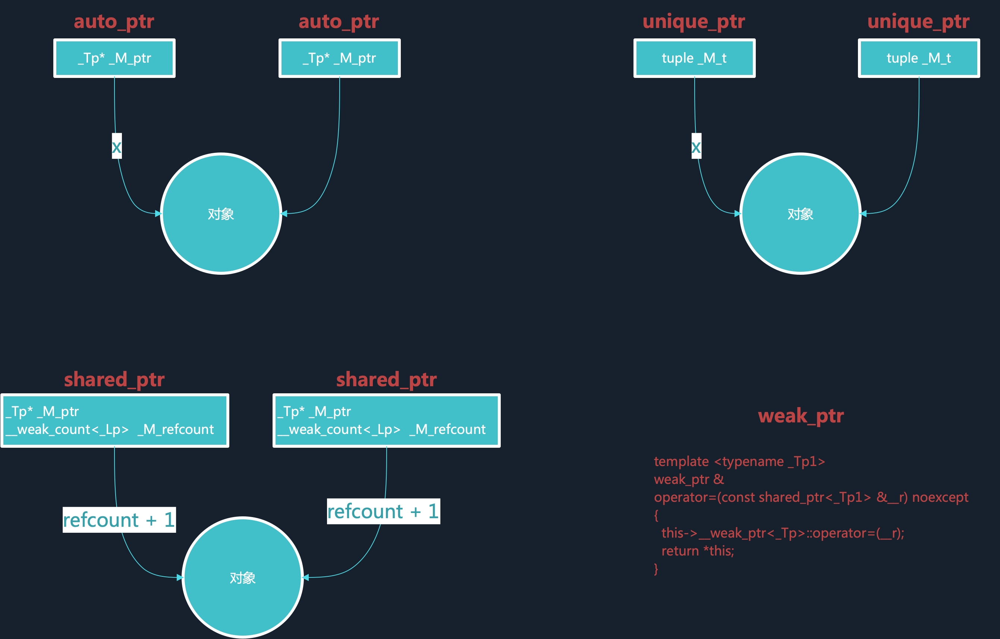</img>  
</div>
<br>

[ :bookmark: 返回目录](#目录)

### 引用(指向变量地址的指针)   
- 一种特殊的指针，不允许修改的指针(不允许运算)。相当于变量的别名(指向原变量的地址)  `int& rx = x`  

```
26	
27	    int x = 5;
   0x0000000000400e33 <+109>:	mov    DWORD PTR [rbp-0x54],0x5

28	    int& rx = x;
=> 0x0000000000400e3a <+116>:	lea    rax,[rbp-0x54]
   0x0000000000400e3e <+120>:	mov    QWORD PTR [rbp-0x28],rax
```  

从汇编实现中可以看出，引用就是原始变量的`副本`，存储原始指向变量的地址(也相当于`指针`)  

```c++
#include <iostream>
#include <assert.h>
using namespace std;

// 编写一个函数，输入两个int型变量a,b
// 实现在函数内部将a,b的值进行交换。
void swap(int &a, int &b)
{
    int tmp = a;
    a = b;
    b = tmp;
}
void swap2(int *a, int *b)
{
    int tmp = *a;
    *a = *b;
    *b = tmp;
}

int main()
{
    //int x = 1, x2 = 3;
    //int& rx = x;
    //rx = 2;
    //cout << x << endl;
    //cout << rx << endl;
    //rx = x2;
    //cout << x << endl;
    //cout << rx << endl;

    // 交换变量的测试
    int a = 3, b = 4;
    swap(a, b);
    assert(a == 4 && b == 3);

    a = 3, b = 4;
    swap2(&a, &b);
    assert(a == 4 && b == 3);

    return 0;
}
```

使用指针的坑: 空指针、野指针、不知不觉修改了指针的值，却继续使用。  
引用则不存在空引用，必须初始化，一个引用永远指向它初始化的那个对象。 

> 有了指针为什么还要有引用? 比如Java只有引用。  Bjarne Stroustrup的解释是:`为了支持函数运算符重载`  
> 有了引用为什么还需要指针? Bjarne Stroustrup 的解释是 `为了兼容C语言`  

> ? 目前业界很多大型工程中有很多思想，都尽可能避免使用裸指针。比如STL中的智能指针，微软的COM等等  

函数传递参数类型的说明:  
- 对于内置基础类型(int、double)而言，在函数中传递时`pass by value`更高效  
- 在OO面向对象中自定义类型而言，在函数中传递时`pass by reference to const`更高效 

> 本质都是传值，一种是存储的内容，一种是存储内容的地址  

[ :bookmark: 返回目录](#目录)

## 基础句法
### 图灵机和三种基本结构  

[图灵的基本思想](https://zh.wikipedia.org/wiki/%E5%9B%BE%E7%81%B5%E6%9C%BA) 是用机器来模拟人们用纸笔进行数学运算的过程，他把这样的过程看作下列两种简单的动作：
- 在纸上写上或擦除某个符号；  
- 把注意力从纸的一处移动到另一处；  

而在每个阶段，人要决定下一步的动作，依赖于（a）此人当前所关注的纸上某个位置的符号和（b）此人当前思维的状态。  

<br>
<div align=center>
    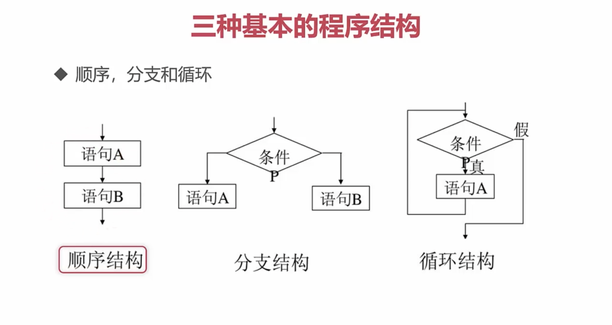</img>  
</div>
<br>

### if与switch对比 

示例代码
```c++
#include <iostream>
using namespace std;

typedef enum __COLOR
{
    RED,
    GREEN,
    BLUE,
    UNKOWN
} COLOR;

int main()
{
    // 多分支条件的if
    // if, else if, else
    COLOR color0;
    color0 = BLUE;
    int c0 = 0;
    if (color0 == RED)
    {
        c0 += 1;
    }
    else if (color0 == GREEN)
    {
        c0 += 2;
    }
    else if (color0 == BLUE)
    {
        c0 += 3;
    }
    else
    {
        c0 += 0;
    }

    // 多分支条件的switch
    // switch,case,default
    COLOR color1;
    color1 = GREEN;
    int c1 = 0;
    switch (color1)
    {
    case RED:
    {
        c1 += 1;
        break;
    }
    case GREEN:
    {
        c1 += 2;
        break;
    }
    case BLUE:
    {
        c1 += 3;
        break;
    }
    default:
    {
        c1 += 0;
        break;
    }
    }

    return 0;
}
```
汇编实现
```c++
Dump of assembler code for function main():
13	{
   0x000000000040064d <+0>:	push   rbp
   0x000000000040064e <+1>:	mov    rbp,rsp

14	    // 多分支条件的if
15	    // if, else if, else
16	    COLOR color0;
17	    color0 = BLUE;
   0x0000000000400651 <+4>:	mov    DWORD PTR [rbp-0x4],0x2       // [rbp-0x4]是变量[rbp-0x4]的地址，BLUE是0x2 

18	    int c0 = 0;
   0x0000000000400658 <+11>:	mov    DWORD PTR [rbp-0x8],0x0

19	    if (color0 == RED)
   0x000000000040065f <+18>:	cmp    DWORD PTR [rbp-0x4],0x0   // color0与RED进行比较
   0x0000000000400663 <+22>:	jne    0x40066b <main()+30>      // 如果不相等就跳转到0x40066b

20	    {
21	        c0 += 1;
   0x0000000000400665 <+24>:	add    DWORD PTR [rbp-0x8],0x1   // 如果color0与RED相等就执行
   0x0000000000400669 <+28>:	jmp    0x400681 <main()+52>      // 执行完成后跳转到0x400681，也就是跳出判断  

22	    }
23	    else if (color0 == GREEN)
   0x000000000040066b <+30>:	cmp    DWORD PTR [rbp-0x4],0x1
   0x000000000040066f <+34>:	jne    0x400677 <main()+42>

24	    {
25	        c0 += 2;
   0x0000000000400671 <+36>:	add    DWORD PTR [rbp-0x8],0x2
   0x0000000000400675 <+40>:	jmp    0x400681 <main()+52>

26	    }
27	    else if (color0 == BLUE)
   0x0000000000400677 <+42>:	cmp    DWORD PTR [rbp-0x4],0x2
   0x000000000040067b <+46>:	jne    0x400681 <main()+52>

28	    {
29	        c0 += 3;
   0x000000000040067d <+48>:	add    DWORD PTR [rbp-0x8],0x3

30	    }
31	    else
32	    {
33	        c0 += 0;
34	    }
35	
36	    // 多分支条件的switch
37	    // switch,case,default
38	    COLOR color1;
39	    color1 = GREEN;
   0x0000000000400681 <+52>:	mov    DWORD PTR [rbp-0xc],0x1    //[rbp-0xc]是变量color1 

40	    int c1 = 0;
   0x0000000000400688 <+59>:	mov    DWORD PTR [rbp-0x10],0x0

41	    switch (color1)
   0x000000000040068f <+66>:	mov    eax,DWORD PTR [rbp-0xc]  // 先把变量color1的值加载到寄存器eax  
   0x0000000000400692 <+69>:	cmp    eax,0x1                  // eax和0x1(GREEN)比较
   0x0000000000400695 <+72>:	je     0x4006a8 <main()+91>     // 如果eax等于0x1，就跳转到case GREEN:
   0x0000000000400697 <+74>:	cmp    eax,0x2
   0x000000000040069a <+77>:	je     0x4006ae <main()+97>
   0x000000000040069c <+79>:	test   eax,eax
   0x000000000040069e <+81>:	je     0x4006a2 <main()+85>

42	    {
43	    case RED:
44	    {
45	        c1 += 1;
   0x00000000004006a2 <+85>:	add    DWORD PTR [rbp-0x10],0x1

46	        break;
   0x00000000004006a6 <+89>:	jmp    0x4006b3 <main()+102>

47	    }
48	    case GREEN:
49	    {
50	        c1 += 2;
   0x00000000004006a8 <+91>:	add    DWORD PTR [rbp-0x10],0x2

51	        break;
   0x00000000004006ac <+95>:	jmp    0x4006b3 <main()+102>

52	    }
53	    case BLUE:
54	    {
55	        c1 += 3;
   0x00000000004006ae <+97>:	add    DWORD PTR [rbp-0x10],0x3

56	        break;
   0x00000000004006b2 <+101>:	nop

57	    }
58	    default:
59	    {
60	        c1 += 0;
61	        break;
   0x00000000004006a0 <+83>:	jmp    0x4006b3 <main()+102>

62	    }
63	    }
64	
65	    return 0;
=> 0x00000000004006b3 <+102>:	mov    eax,0x0

66	}
   0x00000000004006b8 <+107>:	pop    rbp
   0x00000000004006b9 <+108>:	ret    

End of assembler dump.
```  

从汇编实现中可以看出，if语句有嵌套关系，很像树结构，而switch语句就像表结构，首先和表里所有的元素进行对比，最终只跳转一次。  

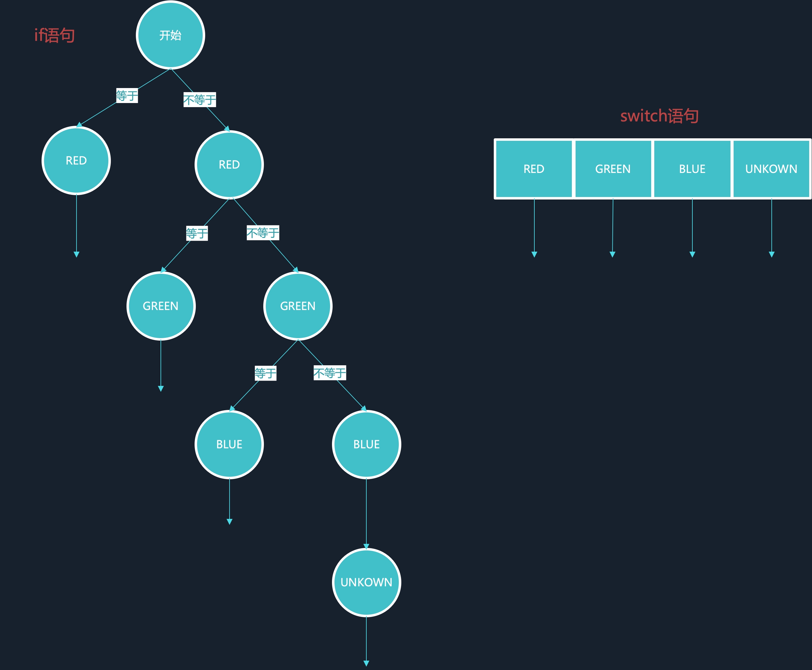  

> switch语句如果没有找到对应的值，所有的情况也都是要遍历一次。  

[ :bookmark: 返回目录](#目录)

### 枚举  

示例代码
```c++
#include <iostream>
using namespace std;
int main()
{
    enum wT
    {
        Monday,
        Tuesday,
        Wednesday,
        Thursday,
        Friday,
        Saturday,
        Sunday
    }; // 声明wT类型
    wT weekday;
    weekday = Monday;
    weekday = Tuesday;
    //weekday = 1;             // 不能直接给int值，只能赋值成wT定义好的类型值
    cout << weekday << endl;
    //Monday = 0;             // 类型值不能做左值
    int a = Wednesday;        // 枚举类型可以复制给非枚举变量  
    cout << a << endl;

    return 0;
}
```
汇编实现
```c++
-exec disass /m
Dump of assembler code for function main():
4	{
   0x00000000004007ad <+0>:	push   rbp
   0x00000000004007ae <+1>:	mov    rbp,rsp
   0x00000000004007b1 <+4>:	sub    rsp,0x10

5	    enum wT
6	    {
7	        Monday,
8	        Tuesday,
9	        Wednesday,
10	        Thursday,
11	        Friday,
12	        Saturday,
13	        Sunday
14	    }; // 声明wT类型
15	    wT weekday;
16	    weekday = Monday;
   0x00000000004007b5 <+8>:	mov    DWORD PTR [rbp-0x4],0x0     // 枚举声明时没有什么汇编代码，只有赋值时才有
                                                               // 说明枚举在编译时已经替换成数值了.  
17	    weekday = Tuesday;
   0x00000000004007bc <+15>:	mov    DWORD PTR [rbp-0x4],0x1

18	    //weekday = 1;             // 不能直接给int值，只能赋值成wT定义好的类型值
19	    cout << weekday << endl;
   0x00000000004007c3 <+22>:	mov    eax,DWORD PTR [rbp-0x4]
   0x00000000004007c6 <+25>:	mov    esi,eax
   0x00000000004007c8 <+27>:	mov    edi,0x601060
   0x00000000004007cd <+32>:	call   0x400640 <_ZNSolsEi@plt>
   0x00000000004007d2 <+37>:	mov    esi,0x4006b0
   0x00000000004007d7 <+42>:	mov    rdi,rax
   0x00000000004007da <+45>:	call   0x4006a0 <_ZNSolsEPFRSoS_E@plt>

20	    //Monday = 0;             // 类型值不能做左值
21	    int a = Wednesday;        // 枚举类型可以复制给非枚举变量  
   0x00000000004007df <+50>:	mov    DWORD PTR [rbp-0x8],0x2

22	    cout << a << endl;
   0x00000000004007e6 <+57>:	mov    eax,DWORD PTR [rbp-0x8]
   0x00000000004007e9 <+60>:	mov    esi,eax
   0x00000000004007eb <+62>:	mov    edi,0x601060
   0x00000000004007f0 <+67>:	call   0x400640 <_ZNSolsEi@plt>
   0x00000000004007f5 <+72>:	mov    esi,0x4006b0
   0x00000000004007fa <+77>:	mov    rdi,rax
   0x00000000004007fd <+80>:	call   0x4006a0 <_ZNSolsEPFRSoS_E@plt>

23	
24	    return 0;
=> 0x0000000000400802 <+85>:	mov    eax,0x0

25	}
   0x0000000000400807 <+90>:	leave  
   0x0000000000400808 <+91>:	ret    

End of assembler dump.
```

从枚举的汇编实现可以看出，枚举在定义是并没有分配内存(没有像数组那样的连续内存)，个人认为枚举应该是编译时替换。  

> 尽量使用const，enum，inline替换#define（**以编译器替换预处理器**）  

[ :bookmark: 返回目录](#目录)

### 结构体和联合体  

示例代码
```c++
#include <string.h>
#include <iostream>
using namespace std;

int main()
{
    union Score
    {
        double ds;  // 8
        char level; // 1
    };
    struct Student
    {
        char name[6]; 
        int age;      
        Score s;      
    };
    // cout << sizeof(Score) << endl; // 8

    Student s1;
    strcpy(s1.name, "lili");
    s1.age = 16;
    s1.s.ds = 95.5;
    s1.s.level = 'A';

    // cout << sizeof(Student) << endl; // 24不是18

    return 0;
}
```
输出结果为`Score`占用8个字节，`Student`占用24个字节  

汇编实现:  
```c++
Dump of assembler code for function main():
6	{
   0x000000000040064d <+0>:	push   rbp
   0x000000000040064e <+1>:	mov    rbp,rsp

7	    union Score
8	    {
9	        double ds;  // 8
10	        char level; // 1
11	    };
12	    struct Student
13	    {
14	        char name[6]; 
15	        int age;      
16	        Score s;      
17	    };
18	    // cout << sizeof(Score) << endl; // 8
19	
20	    Student s1;
21	    strcpy(s1.name, "lili");
   0x0000000000400651 <+4>:	lea    rax,[rbp-0x20]                 // s1变量的地址为[rbp-0x20] 
   0x0000000000400655 <+8>:	mov    DWORD PTR [rax],0x696c696c     
   0x000000000040065b <+14>:	mov    BYTE PTR [rax+0x4],0x0     // 存储name是偏移了4个字节,相当于[rax-0x1b]

22	    s1.age = 16;
   0x000000000040065f <+18>:	mov    DWORD PTR [rbp-0x18],0x10  // age占用的地址为[rbp-0x18] 

23	    s1.s.ds = 95.5;
   0x0000000000400666 <+25>:	movabs rax,0x4057e00000000000  
   0x0000000000400670 <+35>:	mov    QWORD PTR [rbp-0x10],rax   // Score占用的地址为[rbp-0x10]  

24	    s1.s.level = 'A';
   0x0000000000400674 <+39>:	mov    BYTE PTR [rbp-0x10],0x41

25	
26	    // cout << sizeof(Student) << endl; // 24不是18
27	
28	    return 0;
=> 0x0000000000400678 <+43>:	mov    eax,0x0

29	}
   0x000000000040067d <+48>:	pop    rbp
   0x000000000040067e <+49>:	ret    

End of assembler dump.
```

从汇编实现可以看出，`Student`结构体每个元素占用8个字节，一共24个字节?  

<br>
<div align=center>
    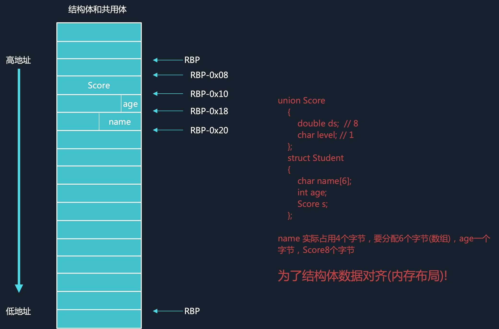</img>  
</div>
<br>

通过gdb查看内存分布:

<br>
<div align=center>
    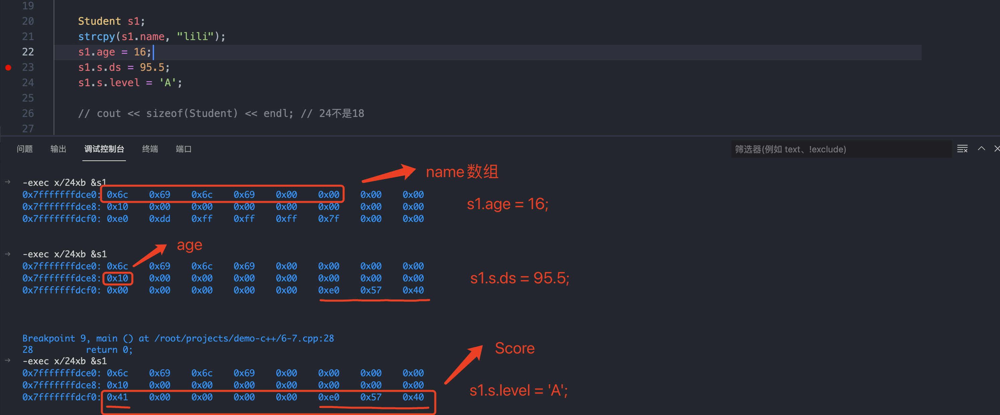</img>  
</div>
<br>

结构体中内存布局:  
<br>
<div align=center>
    </img>  
</div>
<br>

> 修改内存布局方式: vc++ `#pragma pack(n)` g++ `__attribute_(aligned(n))`  

[ :bookmark: 返回目录](#目录)

### 循环语句的比较  
- while 
- do while 
- for  

示例代码
```c++
#include <iostream>
using namespace std;

int main()
{   // TODO: 1+2+3+4...+100
    // while语句
    int sum = 0;
    int index = 1;
    while (index <= 100)
    {
        sum += index;
        index += 1;
    }

    // for语句
    //index = 1;
    sum = 0;
    for (index = 1; index <= 100; ++index)
    {
        sum += index;
    }

    // do-while语句
    sum = 0;
    index = 1;
    do
    {
        sum += index;
        index += 1;
    } while (index <= 100);

    return 0;
}
```

汇编实现:
```c++
-exec disass /m
Dump of assembler code for function main():
5  {   // TODO: 1+2+3+4...+100
   0x000000000040064d <+0>:   push   rbp
   0x000000000040064e <+1>:   mov    rbp,rsp

6      // while语句
7      int sum = 0;
   0x0000000000400651 <+4>:   mov    DWORD PTR [rbp-0x4],0x0

8      int index = 1;
   0x0000000000400658 <+11>:  mov    DWORD PTR [rbp-0x8],0x1

9      while (index <= 100)
   0x000000000040065f <+18>:  jmp    0x40066b <main()+30>
   0x000000000040066b <+30>:  cmp    DWORD PTR [rbp-0x8],0x64    // index与100比较
   0x000000000040066f <+34>:  jle    0x400661 <main()+20>        // 如果index小于等于100 跳转到0x400661
                                                                 // 如果不满足条件，顺序执行，从<+34>跳转到<+36>
10     {
11         sum += index;
   0x0000000000400661 <+20>:  mov    eax,DWORD PTR [rbp-0x8]
   0x0000000000400664 <+23>:  add    DWORD PTR [rbp-0x4],eax

12         index += 1;
   0x0000000000400667 <+26>:  add    DWORD PTR [rbp-0x8],0x1

13     }
14 
15     // for语句
16     //index = 1;
17     sum = 0;
   0x0000000000400671 <+36>:  mov    DWORD PTR [rbp-0x4],0x0

18     for (index = 1; index <= 100; ++index)
   0x0000000000400678 <+43>:  mov    DWORD PTR [rbp-0x8],0x1     // index = 1  
   0x000000000040067f <+50>:  jmp    0x40068b <main()+62>
   0x0000000000400687 <+58>:  add    DWORD PTR [rbp-0x8],0x1     // index += 1
   0x000000000040068b <+62>:  cmp    DWORD PTR [rbp-0x8],0x64    // index 与 100(0x64) 比较
   0x000000000040068f <+66>:  jle    0x400681 <main()+52>        // 如果 index <= 100 则跳转到0x400681
                                                                 // 如果不满足条件，则从<+66>跳转到<+68>
19     {
20         sum += index;
   0x0000000000400681 <+52>:  mov    eax,DWORD PTR [rbp-0x8]
   0x0000000000400684 <+55>:  add    DWORD PTR [rbp-0x4],eax

21     }
22 
23     // do-while语句
24     sum = 0;
   0x0000000000400691 <+68>:  mov    DWORD PTR [rbp-0x4],0x0

25     index = 1;
   0x0000000000400698 <+75>:  mov    DWORD PTR [rbp-0x8],0x1     // 执行该代码之后，执行<+82>，也就是do while循环体

26     do
   0x00000000004006a9 <+92>:  cmp    DWORD PTR [rbp-0x8],0x64    // index 与 100(0x64) 比较  
   0x00000000004006ad <+96>:  jle    0x40069f <main()+82>        // 如果 index <= 100 则跳转到 0x40069f

27     {
28         sum += index;
   0x000000000040069f <+82>:  mov    eax,DWORD PTR [rbp-0x8]
   0x00000000004006a2 <+85>:  add    DWORD PTR [rbp-0x4],eax

29         index += 1;
   0x00000000004006a5 <+88>:  add    DWORD PTR [rbp-0x8],0x1

30     } while (index <= 100);
31 
32     return 0;
=> 0x00000000004006af <+98>:  mov    eax,0x0

33 }
   0x00000000004006b4 <+103>: pop    rbp
   0x00000000004006b5 <+104>: ret    

End of assembler dump.
```

> gdb查看汇编指令`disass`,如果增加`/m`参数，会按照代码顺序显示汇编，这里的`do while`循环先显示do while的汇编实现，然后再是循环体，但是代码地址不一样，do while的代码要晚于循环体的执行，如果想按照循序排列，可以去掉`/m`参数  

```
    // do-while语句
    sum = 0;
    index = 1;
    do
    {
        sum += index;
        index += 1;
    } while (index <= 100);

   0x0000000000400691 <+68>:	mov    DWORD PTR [rbp-0x4],0x0   // sum = 0;
   0x0000000000400698 <+75>:	mov    DWORD PTR [rbp-0x8],0x1   // index = 1;
   0x000000000040069f <+82>:	mov    eax,DWORD PTR [rbp-0x8]    
   0x00000000004006a2 <+85>:	add    DWORD PTR [rbp-0x4],eax   // sum += index;
   0x00000000004006a5 <+88>:	add    DWORD PTR [rbp-0x8],0x1   // index += 1;
   0x00000000004006a9 <+92>:	cmp    DWORD PTR [rbp-0x8],0x64  // index <= 100
   0x00000000004006ad <+96>:	jle    0x40069f <main()+82>
```

[ :bookmark: 返回目录](#目录)

### 函数  
- 将一段逻辑封装起来，便于复用!  
- 函数名及参数列表一起构成了 **函数签名**  

#### 函数重载(overload)和命名空间    
- 函数重载后的`函数签名`不一样  

```
#include <iostream>

int test(int a)
{
    return a;
}

int test(double a)
{
    return int(a);
}

int test(int a, double b)
{
    return a + b;
}

namespace quickzhao
{
    int test(int a)
    {
        return a + 1;
    }
}

int main()
{   // 函数重载后的函数签名不一样的
    test(1);             // _Z4testi
    test(1.0);           // _Z4testd 
    test(1,2.0);         // _Z4testid

    // 命名空间  quickzhao 
    quickzhao::test(3);  // _ZN9quickzhao4testEi
    return 0;
}
```

[ :bookmark: 返回目录](#目录)

#### 函数指针和指针函数
- int (*p)(int) 函数指针  指向一个函数的指针
- int* p(int) 指针函数  返回值为指针的函数  

函数指针可以作为 **回调函数**  

```c++
#include <iostream>
using namespace std;
int MaxValue(int x, int y)
{
	return (x > y) ? x : y;
}
int MinValue(int x, int y)
{
	return (x < y) ? x : y;
}
int Add(int x, int y)
{
	return x+y;
}
bool ProcessNum(int x, int y, int(*p)(int a, int b))
{
	cout << p(x, y) << endl;
	return true;
}

int main()
{   
	int x = 10, y = 20;
	cout << ProcessNum(x, y, MaxValue) << endl;
	cout << ProcessNum(x, y, MinValue) << endl;
	cout << ProcessNum(x, y, Add) << endl;

    return 0;
}
```

[ :bookmark: 返回目录](#目录)

#### 函数Hack之栈变化  


#### 内联(inline)函数  
- 编译器优化，通过空间换时间(较少函数调用`call`、函数栈的操作)  
- 如果一个函数是内联函数，那么在编译期间把函数的**副本**放置在每个调用函数的地方  

> 增加内联不一定会起到作用，编译器会综合考虑，如果需要强制开启，在每个内联函数前增加`__attribute__((always_inline))`  

示例代码:  
```c++
#include <iostream>

__attribute__((always_inline))
inline int MaxValue(int a, int b)
{
	return (a > b) ? a : b;
}

inline int Fib(int n)
{
	if (n == 0)
	{
		return 0;
	}
	else if (n == 1)
	{
		return 1;
	}
	else
	{
		return Fib(n - 1) + Fib(n - 2);    // 递归函数不适合内联 
	}
}

int main()
{
	int x = 3, y = 4;
	MaxValue(x, y);

	Fib(5);

    return 0;
}
```

汇编实现: 
```c++
Dump of assembler code for function main():
   0x000000000040064d <+0>:	push   rbp
   0x000000000040064e <+1>:	mov    rbp,rsp
   0x0000000000400651 <+4>:	sub    rsp,0x10
   0x0000000000400655 <+8>:	mov    DWORD PTR [rbp-0x4],0x3
   0x000000000040065c <+15>:	mov    DWORD PTR [rbp-0x8],0x4
   0x0000000000400663 <+22>:	mov    eax,DWORD PTR [rbp-0x4]
   0x0000000000400666 <+25>:	mov    DWORD PTR [rbp-0xc],eax
   0x0000000000400669 <+28>:	mov    eax,DWORD PTR [rbp-0x8]
   0x000000000040066c <+31>:	mov    DWORD PTR [rbp-0x10],eax   
   0x000000000040066f <+34>:	mov    eax,DWORD PTR [rbp-0xc]   // MaxValue没有call
   0x0000000000400672 <+37>:	cmp    eax,DWORD PTR [rbp-0x10]  // 比较a 和 b 的值  
   0x0000000000400675 <+40>:	mov    edi,0x5
   0x000000000040067a <+45>:	call   0x4006d8 <_Z3Fibi>        // 调用了Fib函数
=> 0x000000000040067f <+50>:	mov    eax,0x0
   0x0000000000400684 <+55>:	leave  
   0x0000000000400685 <+56>:	ret    
End of assembler dump.
```

> 递归函数不适合内联  

[ :bookmark: 返回目录](#目录)

#### 递归及优化  

示例代码及优化:  
```c++
#include <assert.h>

#include <iostream>

int g_a[1000]; // 全局的数组，记录斐波那契数列的前1000个值

// 斐波那契数列的实现
// 方法一：递归
int Fib(int n)
{
    if (n == 0)
    {
        return 0;
    }
    else if (n == 1)
    {
        return 1;
    }
    else
    {
        return Fib(n - 1) + Fib(n - 2);
    }
}
// 尾递归
int Fib2(int n, int ret0, int ret1)
{
    if (n == 0)
    {
        return ret0;
    }
    else if (n == 1)
    {
        return ret1;
    }
    return Fib2(n - 1, ret1, ret0 + ret1);
}
// 循环
int Fib3(int n)
{
    if (n < 2)
    {
        return n;
    }
    int n0 = 0, n1 = 1;
    int temp;
    for (int i = 2; i <= n; i++)
    {
        temp = n0;
        n0 = n1;
        n1 = temp + n1;
    }
    return n1;
}
// 动态规划
int Fib4(int n)
{
    //assert(n >= 0);
    g_a[0] = 0;
    g_a[1] = 1;
    for (int i = 2; i <= n; i++)
    {
        if (g_a[i] == 0)
        {
            g_a[i] = g_a[i - 1] + g_a[i - 2];
        }
    }
    return g_a[n];
}

int main()
{
    //Fib(10);
    //std::cout  << Fib2(10, 0, 1);
    //std::cout << Fib(20) << std::endl;
    //std::cout << Fib2(20, 0, 1) << std::endl;
    //std::cout << Fib3(20) << std::endl;
    //std::cout << Fib4(20) << std::endl;
    assert(Fib(10) == 55);
    assert(Fib2(10, 0, 1) == 55);
    assert(Fib3(10) == 55);
    assert(Fib4(10) == 55);

    return 0;
}
```

- 普通递归  

```c++
int Fib(int n)
{
    if (n == 0)
    {
        return 0;
    }
    else if (n == 1)
    {
        return 1;
    }
    else
    {
        return Fib(n - 1) + Fib(n - 2);
    }
}
```  

汇编实现: 
```c++
1	        return Fib(n - 1) + Fib(n - 2);
=> 0x00000000004006c3 <+38>:	mov    eax,DWORD PTR [rbp-0x14]
   0x00000000004006c6 <+41>:	sub    eax,0x1
   0x00000000004006c9 <+44>:	mov    edi,eax
   0x00000000004006cb <+46>:	call   0x40069d <_Z3Fibi>
   0x00000000004006d0 <+51>:	mov    ebx,eax
   0x00000000004006d2 <+53>:	mov    eax,DWORD PTR [rbp-0x14]
   0x00000000004006d5 <+56>:	sub    eax,0x2
   0x00000000004006d8 <+59>:	mov    edi,eax
   0x00000000004006da <+61>:	call   0x40069d <_Z3Fibi>
   0x00000000004006df <+66>:	add    eax,ebx
```

一个函数中调用两次自己，多了两次调用(call),浪费时间及空间  


递归调用示例图(树形结构):  

<br>
<div align=center>
    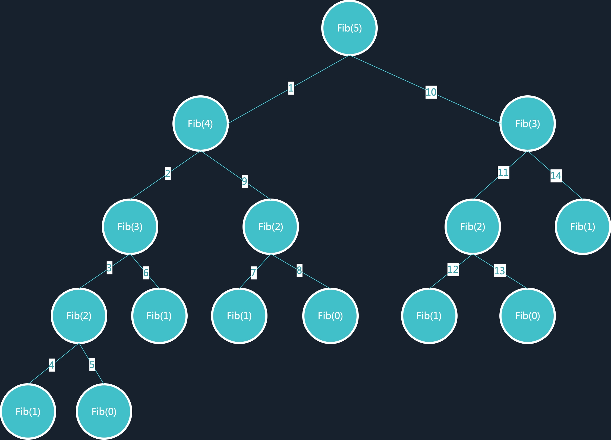</img>  
</div>
<br>


- for循环优化  

```c++
int Fib3(int n)
{
    if (n < 2)
    {
        return n;
    }
    int n0 = 0, n1 = 1;
    int temp;
    for (int i = 2; i <= n; i++)
    {
        temp = n0;
        n0 = n1;
        n1 = temp + n1;
    }
    return n1;
}
```  


- 尾递归 (递归调用在函数最后，之前的变量信息没有必要保存) 
```c++
// 尾递归
int Fib2(int n, int ret0, int ret1)
{
    if (n == 0)
    {
        return ret0;
    }
    else if (n == 1)
    {
        return ret1;
    }
    return Fib2(n - 1, ret1, ret0 + ret1);
}
```

汇编实现,开启编译器优化`-O2`  
```c++
-exec disass /m
Dump of assembler code for function main():
31	    else if (n == 1)  
   0x0000000000400684 <+36>:	sub    eax,0x1
   0x000000000040068a <+42>:	jne    0x400680 <main()+32>
   0x00000000004006cc <+108>:	sub    eax,0x1
   0x00000000004006d2 <+114>:	jne    0x4006c8 <main()+104>

32	    {
33	        return ret1;
34	    }
35	    return Fib2(n - 1, ret1, ret0 + ret1);
=> 0x0000000000400682 <+34>:	mov    edx,esi
   0x0000000000400687 <+39>:	lea    esi,[rcx+rdx*1]
   0x00000000004006ca <+106>:	mov    edx,esi
   0x00000000004006cf <+111>:	lea    esi,[rcx+rdx*1]
```  

可以从汇编实现中看出没有`call`调用，而是在处理完成之后跳转到函数的起点，相当于**循环**  


- 动态规划  

> [维基百科](https://zh.wikipedia.org/wiki/%E5%8A%A8%E6%80%81%E8%A7%84%E5%88%92) 动态规划背后的基本思想非常简单。大致上，若要解一个给定问题，我们需要解其不同部分（即子问题），再根据子问题的解以得出原问题的解。  

```c++
int g_a[1000]; // 全局的数组，记录斐波那契数列的前1000个值

int Fib4(int n)
{
    //assert(n >= 0);
    g_a[0] = 0;
    g_a[1] = 1;
    for (int i = 2; i <= n; i++)
    {
        if (g_a[i] == 0)
        {
            g_a[i] = g_a[i - 1] + g_a[i - 2];
        }
    }
    return g_a[n];
}
```

[ :bookmark: 返回目录](#目录)


## 高级语法  
### 类与结构体比较    
- struct默认权限时public  
- class默认权限时private  
- 除此之外，二者基本无差别  

下面展示结构体与类的构造析构及成员函数:  
```c++
#include <iostream>
using namespace std;

struct SMan
{
private:
    int age;
public:
    SMan() { cout << "Struct Con" << endl; }
    ~SMan() { cout << "Struct Des" << endl; }
    void SetAge(int a) { age = a; }
    int GetAge() { return age; }
};

class CMan
{
private:
    int age;  // 成员变量
public:
    CMan() { cout << "Class Con" << endl; }
    ~CMan() { cout << "Class Des" << endl; }
    void SetAge(int a) { age = a; }     // 成员函数  
    int GetAge() { return age; }
};

int main()
{
    struct SMan sMan;
    sMan.SetAge(5);
    cout << sMan.GetAge() << endl;

    CMan cMan;
    cMan.SetAge(10);
    cout << cMan.GetAge() << endl;

    return 0;
}
```

输出结果为: 
```
Struct Con   // 结构体构造函数
5
Class Con    // 类构造函数
10
Class Des    // 类构造函数
Struct Des   // 结构体析构函数
```

[ :bookmark: 返回目录](#目录)

### 类的访问权限及友元  
> 访问权限的检查是编译时，也就是编译器会在编译时检查数据的访问权限，如果非法访问，无法编译通过!  

非继承关系  

| 类中属性 | public | protected | private |
| ---- | ---- | ---- | ---- |
| 内部可见性 | 可见 | 可见 | 可见 |
| 外部可见性 | 可见 | 不可见 | 不可见 |

> 只有类和**友元函数**可以访问私有成员  
> 类可以允许其他类或者函数访问它的非公有成员，方法是令其他类或者函数成为它的友元(friend)    

- 友元函数(friend  返回值类型  函数名(参数表);)   
- 友元类(friend  class  类名;)  

```c++
class CCar
{
private:
    int price;
    friend class CDriver;  //声明 CDriver 为友元类
};
class CDriver
{
public:
    CCar myCar;
    void ModifyCar()  //改装汽车
    {
        myCar.price += 1000;  //因CDriver是CCar的友元类，故此处可以访问其私有成员
    }
};
int main()
{
    return 0;
}
```

public继承关系
| 类中属性 | public | protected | private |
| ---- | ---- | ---- | ---- |
| 继承类可见性 | 可见 | 可见 | 不可见 |
| 外部可见性 | 可见 | 不可见 | 不可见 |

> protected（受保护）成员在派生类（即子类）中是可访问的  


[ :bookmark: 返回目录](#目录)  

### 类的构造函数  
类的构造函数是类的一种特殊的成员函数，它会在每次创建类的新对象时执行。  
构造函数的名称与类的名称是完全相同的，并且不会返回任何类型，也不会返回 void。构造函数可用于为某些成员变量设置初始值。  

> 为什么类的构造函数没有返回值?  
> 为什么类的构造函数不会有拷贝构造的问题?  

示例代码:  
```c++
#include <iostream>
using namespace std;

class CMan
{
private:
    int age;

public:
    CMan(int age)
    {
        this->age = age;
    }
};

int main()
{
    CMan man1(4);
    return 0;
}
```

汇编实现:  
```c++
Dump of assembler code for function main():
17	{
   0x000000000040064d <+0>:	push   rbp
   0x000000000040064e <+1>:	mov    rbp,rsp                      // rbp=0x7fffffffdd00
   0x0000000000400651 <+4>:	sub    rsp,0x10                     // rsp=0x7fffffffdcf0  main函数栈空间16字节 [rbp-0x10] [rbp-0x08]

18	    CMan man1(4);
   0x0000000000400655 <+8>:	    lea    rax,[rbp-0x10]           // [rbp-0x10]=0x7fffffffdcf0,所以rax=0x7fffffffdcf0
                                                                // man变量地址是0x7fffffffdcf0，内存值是:0x7fffffffdde0
   0x0000000000400659 <+12>:	mov    esi,0x4                  // esi是参数4
   0x000000000040065e <+17>:	mov    rdi,rax                  // rdi的内容是0x7fffffffdcf0，这块地址目前存储的是0x7fffffffdde0，mov是获取寄存器或地址的值，这里寄存器存储的值就是0x7fffffffdcf0  
   0x0000000000400661 <+20>:	call   0x4006c0 CMan::CMan(int)  

19	    return 0;
=> 0x0000000000400666 <+25>:	mov    eax,0x0

20	}
   0x000000000040066b <+30>:	leave  
   0x000000000040066c <+31>:	ret    

End of assembler dump.

Dump of assembler code for function CMan::CMan(int):
10	    CMan(int age)
   0x00000000004006c0 <+0>:	push   rbp                         // rbp=0x7fffffffdce0
   0x00000000004006c1 <+1>:	mov    rbp,rsp                     // rsp=0x7fffffffdce0
   0x00000000004006c4 <+4>:	mov    QWORD PTR [rbp-0x8],rdi     // 接收变量地址man1(rdi)， rdi=0x7fffffffdcf0 ，[rbp-0x8]值为0x7fffffffdcd8,存储的值为0x7fffffffdcf0
   0x00000000004006c8 <+8>:	mov    DWORD PTR [rbp-0xc],esi     // 参数age  0x4， [rbp-0xc]值为0x7fffffffdcd4

11	    {
12	        this->age = age;
=> 0x00000000004006cb <+11>:	mov    rax,QWORD PTR [rbp-0x8] // [rbp-0x8]存储的值就是变量man1的地址0x7fffffffdcf0， rax=0x7fffffffdcf0
   0x00000000004006cf <+15>:	mov    edx,DWORD PTR [rbp-0xc] // [rbp-0xc]存储的值就是age参数的值0x4
   0x00000000004006d2 <+18>:	mov    DWORD PTR [rax],edx     // 把地址为0x7fffffffdcf0的初始化2个字节为0x4;这时0x7fffffffdcf0的内存值为0x04 0x00 0x00 0x00 (0xff 0x7f 0x00 0x00)
                                                               // man变量的大小就是两个字节(int)  
13	    }
   0x00000000004006d4 <+20>:	pop    rbp
   0x00000000004006d5 <+21>:	ret    

End of assembler dump.
```

从汇编实现中可以看出构造函数没有返回值，而是直接在声明的变量(栈上)操作，`CMan man1(4);` 构造函数直接把`man1`变量的地址作为对象的内存其实地址，再分配两个字节就是成员变量`age`的占用。不会像函数返回值那样，会有返回值(寄存器暂存)和接收变量的浅拷贝。(这就是构造函数没有返回值的原因，效率更高)    

> 这时想想构造函数虽然没有返回值，但是构造的对象直接通过像函数参数形式传入构造函数(this指针)，相当于c/c++中通过传入指针/引用作为参数接收返回值。这样的效率反而更高。  

面向对象的三大特征:  
- 封装性: 数据和代码捆绑在一起，避免外界的干扰和不确定的访问，封装可以使得代码模块化；(问题简化抽象)  
- 继承性: 让某种类型的对象可以获得另一种对象的属性和方法，继承可以扩展已有代码；(避免重复造轮子)  
- 多态性: 同一事物表现出不同事物的能力，即向不同对象会产生不同的行为，多态的目的是为了接口的重用；(便于功能扩充，提高效率)    

面向对象为我们便捷的开发出能适应变化的软件提供可能，但还不够，不是万能的。 (操作系统和数据库的开发更多的还是面向过程的，没有太多太快的变化)    

[ :bookmark: 返回目录](#目录)

### 类的运算符重载  
下面就实现CMan的`<<`和`>>`运算符重载(标准输入与输出的运算符重载)    

> `<<`和`>>` 箭头的方向是数据流向的方向  

```c++
#include <iostream>
using namespace std;

class CMan
{
private:
    int age;
public:
    CMan() { cout << "Class Con" << endl; }
    ~CMan() { cout << "Class Des" << endl; }
    void SetAge(int a) { age = a; }
    int GetAge() { return age; }

protected:
    friend ostream &operator<<(ostream& os, const CMan& m);
    friend istream &operator>>(istream& is, CMan& m);
};

// 必须声明在类外部
ostream &operator<<(ostream& os, const CMan& m)
{
    os << "age:" << m.age;  // 这里能够访问私有变量，是因为友元(friend)
    return os;
}

istream &operator>>(istream& is, CMan& m)
{
    is >> m.age;
    return is;
}

int main()
{
    CMan cMan;
    cin >> cMan;         // 输入一个参数作为age
    cout << cMan << endl;// 打印age:30  
    return 0;
}
```

还有其他算数运算符的重载(+、-、*、/、+=、-=、*=、/=、++、--)等  

下面就展示`++`前置和后置的运算符重载:  
示例代码:  
```c++
#include <iostream>
using namespace std;

class CMan
{
private:
    int age;

public:
    CMan() { cout << "Class Con" << endl; }
    CMan(int age) { this->age = age; cout << "Class Con Age" << endl;}
    ~CMan() { cout << "Class Des" << endl; }
    void SetAge(int a) { age = a; }
    int GetAge() { return age; }

    CMan &operator++() // 前置
    {
        ++age;
        return *this; // 返回的是引用，不需要拷贝，节省效率
    }

    CMan operator++(int) // 后置
    {
        return CMan(age++); // 不使用临时对象  
    }
};

int main()
{
    CMan man1(4);

    ++man1;
    cout << "++man1:" << man1.GetAge() << endl;

    CMan temp = man1++;
    cout << "temp:" << temp.GetAge() <<";man1++:" << man1.GetAge() << endl;

    return 0;
}
```
运行输出:  
```
Class Con Age
++man1:5
Class Con Age
temp:5;man1++:6    // 后置操作符返回一个当前对象，下次使用时，类的成员变量已经修改  
Class Des
Class Des
```

[ :bookmark: 返回目录](#目录)

### 拷贝构造及深浅拷贝  
- 通过函数返回临时对象，会触发拷贝构造(不是构造函数)  
- 通过一个对象创建另一个对象`CMan c(b)`也会触发拷贝构造  
- 不是绝对的，要看编译器优化，不同的编译器表现形式也不一样(GCC就对拷贝构造有优化)  

> 在函数体中创建的对象变量分配在栈上，函数退出后会销毁，这是系统会触发拷贝构造，创建一个副本。  
> 这时才理解为什么c++中函数通过指针/引用作为参数获取结果而不是通过函数返回值，省略创建临时对象创建及拷贝  

首先增加`CMan`的`+`号运算符重载:  
```c++
#include <iostream>
using namespace std;

class CMan
{
private:
    int age;

public:
    CMan() { cout << "Class Con" << endl; }
    CMan(int age)
    {
        this->age = age;
        cout << "Class Con Age" << endl;
    }
    CMan(const CMan &m)
    {
        age = m.age;
        cout << "Class Con Copy" << endl;
    }
    ~CMan() { cout << "Class Des" << endl; }
    void SetAge(int a) { age = a; }
    int GetAge() { return age; }

    CMan operator+(const CMan &m)
    {
        CMan temp;
        temp.age = age + m.age;
        return temp;           // 尽量不在函数中返回临时变量，可以直接返回 CMan(age + m.age)  
    }
};

int main()
{
    CMan man1(4);
    CMan man2(6);

    // 调用两次构造函数,一次+号，一次=号
    CMan man3;
    man3 = man1 + man2;
    cout << "man3:" << man3.GetAge() << endl;

    // 调用一次构造函数,一次+号
    CMan man4 = man1 + man2;
    cout << "man4:" << man4.GetAge() << endl;

    return 0;
}
```

如果直接运行，不会调用拷贝构造函数，因为GCC做了优化，需要通过编译选项`-fno-elide-constructors`关闭拷贝构造优化。  

另外可以从汇编实现中看出编译器默认实现了拷贝构造及赋值(=)操作符重载`CMan::operator=(CMan const&)`    
```c++
42	    man3 = man1 + man2;
   0x0000000000400954 <+55>:	lea    rax,[rbp-0x30]
   0x0000000000400958 <+59>:	lea    rdx,[rbp-0x50]
   0x000000000040095c <+63>:	lea    rcx,[rbp-0x40]
   0x0000000000400960 <+67>:	mov    rsi,rcx
   0x0000000000400963 <+70>:	mov    rdi,rax
   0x0000000000400966 <+73>:	call   0x400bec CMan::operator+(CMan const&)  //  自己实现的

   0x000000000040096b <+78>:	lea    rdx,[rbp-0x30]
   0x000000000040096f <+82>:	lea    rax,[rbp-0x60]
   0x0000000000400973 <+86>:	mov    rsi,rdx
   0x0000000000400976 <+89>:	mov    rdi,rax
   0x0000000000400979 <+92>:	call   0x400c66 CMan::operator=(CMan const&)  // 默认实现了=操作符重载 

   0x000000000040097e <+97>:	lea    rax,[rbp-0x30]
   0x0000000000400982 <+101>:	mov    rdi,rax
   0x0000000000400985 <+104>:	call   0x400bb2 CMan::~CMan()
```

>  `CMan man3;man3 = man1 + man2;`和`CMan man4 = man1 + man2;`两种方式在打开和关闭编译器关于拷贝构造函数的优化时，结果不同，具体差异还需要查看编译器优化详情。  


**深浅拷贝**  
浅拷贝相当于拷贝引用，如果所有的内存都是在栈上申请的，没有什么问题。一旦有内存在**堆上**申请，浅拷贝时，之后拷贝堆上内存的地址，拷贝的对象操作这个内存，会对拷贝后的对象造成影响。  

- 浅拷贝:只拷贝指针地址，C++默认拷贝构造函数与赋值运算符都是浅拷贝；减少空间，但容易引发多次释放问题；  
- 深拷贝:重新分配堆内存，拷贝指针指向的内容，这种操作浪费空间，但不会导致多次释放的问题；  

> 浅拷贝可以使用**引用计数**解决资源多次释放问题，但是引用计数需要有额外的开销，最好使用C++新标准中的`move移动`语义，资源所有权的转让，就像智能指针中的那样，这样既不会浪费更多空间，也不会引发资源多次释放的问题。  

```c++

char *m_data; // 用于保存字符串

// 移动(move)构造函数
String::String(String&& other)
{
	if (other.m_data != NULL)
	{
		// 资源让渡
		m_data = other.m_data;  // 不用new空间，直接使用原来的空间  
		other.m_data = NULL;    // 把原始对象的权限去掉  
	}
}
```  

> 右值引用的标志是&&，顾名思义，右值引用专门为右值而生，可以指向右值，不能指向左值：  
```c++
int &&ref_a_right = 5; // ok  
 
int a = 5;
int &&ref_a_left = a;  // 编译不过，右值引用不可以指向左值
 
ref_a_right = 6;       // 右值引用的用途：可以修改右值  
```

### 类的抽象及继承  
#### 继承  
当创建一个类时，您不需要重新编写新的 `数据成员和成员函数` ，只需指定新建的类继承了一个已有的类的成员即可。这个已有的类称为基类，新建的类称为派生类。  
继承代表了 is a 关系。例如，哺乳动物是动物，狗是哺乳动物，因此，狗是动物，等等。  

```c++
#include <iostream>
 
using namespace std;
 
// 基类
class Shape 
{
   public:
      void setWidth(int w)     // 基类的成员函数
      {
         width = w;
      }
      void setHeight(int h)
      {
         height = h;
      }
   protected:
      int width;              // 基类的成员变量 
      int height;
};
 
// 派生类
class Rectangle: public Shape
{
   public:
      int getArea()
      { 
         return (width * height); 
      }
};
 
int main(void)
{
   Rectangle Rect;
 
   Rect.setWidth(5);
   Rect.setHeight(7);
 
   // 输出对象的面积
   cout << "Total area: " << Rect.getArea() << endl;
 
   return 0;
}
```

一个类可以派生自多个类(多继承)，这意味着，它可以从多个基类继承数据和函数。定义一个派生类，我们使用一个类派生列表来指定基类。  

多继承代码示例:  
```c++
#include <iostream>
 
using namespace std;
 
// 基类 Shape
class Shape 
{
   public:
      void setWidth(int w)
      {
         width = w;
      }
      void setHeight(int h)
      {
         height = h;
      }
   protected:
      int width;
      int height;
};
 
// 基类 PaintCost
class PaintCost 
{
   public:
      int getCost(int area)
      {
         return area * 70;
      }
};
 
// 派生类
class Rectangle: public Shape, public PaintCost
{
   public:
      int getArea()
      { 
         return (width * height); 
      }
};
 
int main(void)
{
   Rectangle Rect;
   int area;
 
   Rect.setWidth(5);
   Rect.setHeight(7);
 
   area = Rect.getArea();
   
   // 输出对象的面积
   cout << "Total area: " << Rect.getArea() << endl;
 
   // 输出总花费
   cout << "Total paint cost: $" << Rect.getCost(area) << endl;
 
   return 0;
}
```

#### 虚函数、纯虚函数与虚表    

- 函数为虚函数，不代表函数为不被实现的函数。定义他为虚函数是为了允许用基类的指针来调用子类的这个函数。  
- 函数为纯虚函数，才代表函数没有被实现。定义纯虚函数是为了实现一个接口，起到一个规范的作用，规范继承这个类的程序员必须实现这个函数。  

> :question: 编译时还是运行时确定调用父类的虚函数还是调用子类函数?  

示例代码:  
```c++
#include <iostream>
using namespace std;

class A
{
public:
    virtual void foo()
    {
        cout << "A::foo() is called" << endl;
    }
};
class B : public A
{
public:
    void foo()
    {
        cout << "B::foo() is called" << endl;
    }
};
int main(void)
{
    A ao;
    ao.foo();
    
    A *a = new B();
    a->foo(); // 在这里，a虽然是指向A的指针，但是被调用的函数(foo)却是B的!

    B rb;
    A &ra = rb;
    ra.foo(); // 在这里，a虽然是指向A的指针，但是被调用的函数(foo)却是B的!

    return 0;
}
```
输出结果:  
```shell
A::foo() is called
B::foo() is called
B::foo() is called
```

通过汇编指令查看实现:  
```c++
-exec disass /m
Dump of assembler code for function main():
21	{

22	    A ao;
   0x00000000004008f6 <+9>:	mov    QWORD PTR [rbp-0x30],0x400b40

23	    ao.foo();
   0x00000000004008fe <+17>:	lea    rax,[rbp-0x30]
   0x0000000000400902 <+21>:	mov    rdi,rax
   0x0000000000400905 <+24>:	call   0x4009be A::foo()             // A对象调用自己foo函数，编译时确定了。  

24	    
25	    A *a = new B();
   0x000000000040090a <+29>:	mov    edi,0x8
   0x000000000040090f <+34>:	call   0x4007f0 <_Znwm@plt>
   0x0000000000400914 <+39>:	mov    rbx,rax
   0x0000000000400917 <+42>:	mov    QWORD PTR [rbx],0x0 
   0x000000000040091e <+49>:	mov    rdi,rbx                   
   0x0000000000400921 <+52>:	call   0x400a28 B::B()  
   0x0000000000400926 <+57>:	mov    QWORD PTR [rbp-0x18],rbx     // 函数返回值保存在rbx寄存器中，赋给指针a([rbp-0x18])作为内容    

26	    a->foo(); // 在这里，a虽然是指向A的指针，但是被调用的函数(foo)却是B的!
   0x000000000040092a <+61>:	mov    rax,QWORD PTR [rbp-0x18]     // rax 保存指针a指向的地址  rbp=0x7fffffffdcf0 [rbp-0x18]=0x7fffffffdcd8 ，0x7fffffffdcd8地址存储0x602010(this指针指向的地址)  
   0x000000000040092e <+65>:	mov    rax,QWORD PTR [rax]          // [rax]是取值操作(*rax), 0x602010地址存储的是0x400b20
   0x0000000000400931 <+68>:	mov    rax,QWORD PTR [rax]          // rax=0x4009e8， [0x400b20]存储的内容是0x4009e8 是<_ZTV1B+16> 内容是: vtable for B
   0x0000000000400934 <+71>:	mov    rdx,QWORD PTR [rbp-0x18]     // rdx=0x602010
   0x0000000000400938 <+75>:	mov    rdi,rdx                      // rdi=0x602010  this指针(对象)  
   0x000000000040093b <+78>:	call   rax                          // 运行时决定的，

27	
28	    B rb;
   0x000000000040093d <+80>:	mov    QWORD PTR [rbp-0x40],0x400b20

29	    A &ra = rb;
   0x0000000000400945 <+88>:	lea    rax,[rbp-0x40]
   0x0000000000400949 <+92>:	mov    QWORD PTR [rbp-0x20],rax

30	    ra.foo(); // 在这里，a虽然是指向A的指针，但是被调用的函数(foo)却是B的!
   0x000000000040094d <+96>:	mov    rax,QWORD PTR [rbp-0x20]
   0x0000000000400951 <+100>:	mov    rax,QWORD PTR [rax]
   0x0000000000400954 <+103>:	mov    rax,QWORD PTR [rax]
   0x0000000000400957 <+106>:	mov    rdx,QWORD PTR [rbp-0x20]
   0x000000000040095b <+110>:	mov    rdi,rdx
   0x000000000040095e <+113>:	call   rax

31	
32	    return 0;
=> 0x0000000000400960 <+115>:	mov    eax,0x0

33	}
...
End of assembler dump.
```

> :loudspeaker:  类的普通成员函数不需要保存在对象中，只需要在调用函数的时候把当前对象保存到寄存器中，函数直接从寄存器中获取。虚函数为什么要保存呢? 调用虚函数不一定是当前对象的实现，需要看具体实例化对象。编译时无法确定，只有在运行时可确定。  

如果类没有任何成员变量及虚函数，只占用1个字节，如果有虚函数，需要占用8个字节(虚表指针)，虚表指针指向所有的虚函数。  
C++虚函数的实现机制是把类实现的虚函数放到一张表中，再把虚函数表的指针放到对象的内部。这样在调用虚函数的时候，直接到对应实例化对象的内部查找即可(运行时查找)。     

`A *a = new B();`指针`a`指向`B`实例化的对象，其中就包含`B`对象的虚函数表，在调用方法的时候，自然回到`B`实例化对象中寻找。`A`对象中保存`vtable for A`,`B`对象中保存`vtable for B`.  

> 本质还是父类和子类的虚函数拥有相同的数据结构，在调用时流程是一样的，只是值(指向的虚表)不同而已。(多态适合解决变化的问题)     


[ :bookmark: 返回目录](#目录)  

#### 抽象类  
- `带有` `纯虚函数` 的类为抽象类  

接口描述了类的行为和功能，而不需要完成类的特定实现。  
C++ 接口是使用抽象类来实现的，抽象类与数据抽象互不混淆，数据抽象是一个把实现细节与相关的数据分离开的概念。  
如果类中至少有一个函数被声明为纯虚函数，则这个类就是抽象类。纯虚函数是通过在声明中使用 "= 0" 来指定的，如下所示：  
```
class Box
{
   public:
      // 纯虚函数
      virtual double getVolume() = 0;
   private:
      double length;      // 长度
      double breadth;     // 宽度
      double height;      // 高度
};
```

[ :bookmark: 返回目录](#目录)  

### I/O  
#### I/O基础  
传统C中I/O有printf,scanf,getch,gets等函数，它们的问题是:  
- 不可编程，仅仅能够识别固有的数据类型；
- 代码的移植性差，有很多坑  

C++中I/O流istream、ostream等:  
- 可编程，对于类库设计者很有用；
- 简化编程，能使得I/O的风格一致；  

C++ I/O关系图:  

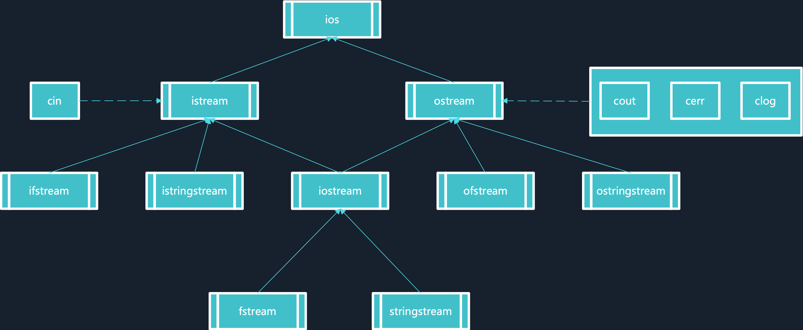  

#### I/O缓冲区    
- 按块缓存；比如文件系统，也叫全缓冲:当填满标准I/O缓存后才进行实际I/O操作。    
- 按行缓存；比如键盘操作，当在输入和输出中遇到换行符时，执行真正的I/O操作。    
- 不缓存； 标准输出错误stderr  

> 比如我们从磁盘里取信息，我们先把读出的数据放在**缓冲区**，计算机再直接从**缓冲区**中取数据，等**缓冲区**的数据取完后再去磁盘中读取，这样就可以减少磁盘的读写次数，再加上计算机对缓冲区的操作大大快于对磁盘的操作，故应用缓冲区可大大提高计算机的运行速度。  

缓冲区刷新情况:  
1. 缓冲区满时；
2. 执行flush语句；
3. 执行endl语句；
4. 关闭文件。

下面展示从缓存区读取到脏数据的实例:  
```c++
#include <iostream>
#include <limits>
using namespace std;

int main()
{
    int a;
    int index = 0;
    while (cin >> a)
    {
        cout << "The numbers are: " << a << endl;
        index++;
        if (index == 5)
        {
            break;
        }
    }

    // cin.ignore(numeric_limits<std::streamsize>::max(), '\n'); // 清空缓存区脏数据

    char ch;
    cin >> ch;
    cout << "the last char is: " << ch << endl;

    return 0;
}
```
输入数据`1 2 3 4 5 6`一次性输入6个数据之后加回车，输出的结果是:  
```
1 2 3 4 5 6
The numbers are: 1
The numbers are: 2
The numbers are: 3
The numbers are: 4
The numbers are: 5
the last char is: 6
```

> 输入6个数据，按回车键时，缓冲区的数据发送到程序中，`cin >> a`只接收了前5个数据，缓冲区中还有一个数据`6`,这时如果没有清除缓冲区，缓冲区的数据将发送到`cin >> ch`,读取到脏数据  

可以使用`cin.ignore(numeric_limits<std::streamsize>::max(), '\n');`清除缓冲区的数据，数字尽量大一些。  

[ :bookmark: 返回目录](#目录)  


#### 文件I/O基本操作    
- C++把每个文件看成是一个有序的字节序列，每个文件都以文件结束标志结束  

文件的基本操作:  
1. `open` 打开文件用于读写；
2. `fail` 检查文件是否打开成功；
3. `read/write` 读写操作；
4. `EOF(end of file)` 检查是否读完；
5. `close` 使用完成后关闭文件  

示例代码:  
```c++
#include <string>
#include <fstream>
#include <iostream>
using namespace std;

static const int bufferLen = 2048;
bool CopyFile(const string &src, const string &dst)
{
    // 打开源文件和目标文件
    // 源文件以二进制读的方式打开
    // 目标文件以二进制写的方式打开
    ifstream in(src.c_str(), ios::in | ios::binary);
    ofstream out(dst.c_str(), ios::out | ios::binary | ios::trunc);

    // 判断文件打开是否成功，失败返回false
    if (!in || !out)
    {
        return false;
    }

    // 从源文件中读取数据，写到目标文件中
    // 通过读取源文件的EOF来判断读写是否结束
    char temp[bufferLen];
    while (!in.eof())
    {
        in.read(temp, bufferLen);
        streamsize count = in.gcount();
        out.write(temp, count);
    }

    // 关闭源文件和目标文件
    in.close();
    out.close();

    return true;
}

int main()
{
    cout << CopyFile("Blue Daube.mp3", "Blue Daube2.mp3") << endl;
    return 0;
}
```

需要注意文件打开模式:  
| 模式标记 | 适用对象 | 作用 |
| ------ | -------- | --- |
| ios::in | ifstream fstream | 打开文件用于读取数据。如果文件不存在，则打开出错。 |
| ios::out | ofstream fstream | 打开文件用于写入数据。如果文件不存在，则新建该文件；如果文件原来就存在，则打开时清除原来的内容。 |
| ios::app | ofstream fstream | 打开文件，用于在其尾部添加数据。如果文件不存在，则新建该文件。 |
| ios::ate | ifstream | 打开一个已有的文件，并将文件读指针指向文件末尾，如果文件不存在，则打开出错。 | 
| ios:: trunc | ofstream | 打开文件时会清空内部存储的所有数据，单独使用时与 ios::out 相同。 | 
| ios::binary | ifstream ofstream fstream | 以二进制方式打开文件。若不指定此模式，则以文本模式打开。 | 
| ios::in \| ios::out | fstream | 打开已存在的文件，既可读取其内容，也可向其写入数据。文件刚打开时，原有内容保持不变。如果文件不存在，则打开出错。 | 
| ios::in \| ios::out | ofstream | 打开已存在的文件，可以向其写入数据。文件刚打开时，原有内容保持不变。如果文件不存在，则打开出错。| 
| ios::in \| ios::out \| ios::trunc | fstream | 打开文件，既可读取其内容，也可向其写入数据。如果文件本来就存在，则打开时清除原来的内容；如果文件不存在，则新建该文件。 | 

[ :bookmark: 返回目录](#目录)  

### 头文件重复包含问题  

为了同一个文件被多次include，有两种方式:  
1. `#ifndef __HEAD_FILE__ #define #endif `  
使用宏来防止同一个文件被多次包含，优点是移植性好，缺点是无法防止宏重名，难以排错。  

2. `#progma once`  
使用编译器来防止同一个文件被多次包含，优点是可以防止宏重名，易于排错，缺点是移植性不好。   

[ :bookmark: 返回目录](#目录)  


## 编程思想

### 泛型编程思想  
- 如果说面向对象是一种通过间接层来调用函数，以换取一种抽象，那么泛型编程则是更直接的抽象，它不会因为间接层而损失效率;
- 不同于面向对象的动态期多态，泛型编程是一种静态期多态，通过编译器生成最直接的代码；
- 泛型编程可以将算法与特定类型、结构剥离，尽可能复用代码；

样例
```c++
#include <iostream>
#include <string.h>
// 不能使用 using namespace std; 
template <typename V> // template <class V>  两种方式一样
V max(V a, V b)
{
    return a > b ? a : b;
}

// 特例  
template<>
char* max(char* a, char* b)
{
    return (strcmp(a, b) > 0 ? a : b);
}
// 两种不同类型比较  
template<typename V1, typename V2>
int max(V1 a, V2 b)
{
    return static_cast<int>(a > b ? a : b);
}

int main() 
{
    std::cout << max(2, 4) << std::endl;
    std::cout << max(7.1, 5.6) << std::endl;
    std::cout << max('a', 'b') << std::endl;

    char* x = "1234";
    char* y = "2345";
    std::cout << max(x, y) << std::endl;

    std::cout << max(10, 12.8) << std::endl;
    return 0;
}
```

输出结果:
```
4
7.1
b
2345
12
```

从汇编实现中可以看出`max`函数在编译时被替换成对应的类型   
比如:
- max(2, 4) => int max<int>(int, int)  
- max('a', 'b') => char max<char>(char, char)  
- max(10, 12.8) => int max<int, double>(int, double)  

以下是汇编实现  
```c++
Dump of assembler code for function main():
24	{
   0x0000000000400960 <+0>:	push   rbp
   0x0000000000400961 <+1>:	mov    rbp,rsp
   0x0000000000400964 <+4>:	sub    rsp,0x20

25	    std::cout << max(2, 4) << std::endl;
   0x0000000000400968 <+8>:	mov    esi,0x4
   0x000000000040096d <+13>:	mov    edi,0x2
   0x0000000000400972 <+18>:	call   0x400adb int max<int>(int, int)

   0x0000000000400977 <+23>:	mov    esi,eax
   0x0000000000400979 <+25>:	mov    edi,0x602080
   0x000000000040097e <+30>:	call   0x400790 _ZNSolsEi@plt

   0x0000000000400983 <+35>:	mov    esi,0x400830
   0x0000000000400988 <+40>:	mov    rdi,rax
   0x000000000040098b <+43>:	call   0x400820 _ZNSolsEPFRSoS_E@plt


26	    std::cout << max(7.1, 5.6) << std::endl;
   0x0000000000400990 <+48>:	movabs rdx,0x4016666666666666
   0x000000000040099a <+58>:	movabs rax,0x401c666666666666
   0x00000000004009a4 <+68>:	mov    QWORD PTR [rbp-0x18],rdx
   0x00000000004009a8 <+72>:	movsd  xmm1,QWORD PTR [rbp-0x18]
   0x00000000004009ad <+77>:	mov    QWORD PTR [rbp-0x18],rax
   0x00000000004009b1 <+81>:	movsd  xmm0,QWORD PTR [rbp-0x18]
   0x00000000004009b6 <+86>:	call   0x400af7 double max<double>(double, double)

   0x00000000004009bb <+91>:	movsd  QWORD PTR [rbp-0x18],xmm0
   0x00000000004009c0 <+96>:	mov    rax,QWORD PTR [rbp-0x18]
   0x00000000004009c4 <+100>:	mov    QWORD PTR [rbp-0x18],rax
   0x00000000004009c8 <+104>:	movsd  xmm0,QWORD PTR [rbp-0x18]
   0x00000000004009cd <+109>:	mov    edi,0x602080
   0x00000000004009d2 <+114>:	call   0x400780 _ZNSolsEd@plt

   0x00000000004009d7 <+119>:	mov    esi,0x400830
   0x00000000004009dc <+124>:	mov    rdi,rax
   0x00000000004009df <+127>:	call   0x400820 _ZNSolsEPFRSoS_E@plt


27	    std::cout << max('a', 'b') << std::endl;
   0x00000000004009e4 <+132>:	mov    esi,0x62
   0x00000000004009e9 <+137>:	mov    edi,0x61
   0x00000000004009ee <+142>:	call   0x400b26 char max<char>(char, char)

   0x00000000004009f3 <+147>:	movsx  eax,al
   0x00000000004009f6 <+150>:	mov    esi,eax
   0x00000000004009f8 <+152>:	mov    edi,0x602080
   0x00000000004009fd <+157>:	call   0x4007e0 _ZStlsISt11char_traitsIcEERSt13basic_ostreamIcT_ES5_c@plt

   0x0000000000400a02 <+162>:	mov    esi,0x400830
   0x0000000000400a07 <+167>:	mov    rdi,rax
   0x0000000000400a0a <+170>:	call   0x400820 _ZNSolsEPFRSoS_E@plt

28	
29	    char* x = "1234";
   0x0000000000400a0f <+175>:	mov    QWORD PTR [rbp-0x8],0x400c11

30	    char* y = "2345";
   0x0000000000400a17 <+183>:	mov    QWORD PTR [rbp-0x10],0x400c16

31	    std::cout << max(x, y) << std::endl;
   0x0000000000400a1f <+191>:	mov    rdx,QWORD PTR [rbp-0x10]
   0x0000000000400a23 <+195>:	mov    rax,QWORD PTR [rbp-0x8]
   0x0000000000400a27 <+199>:	mov    rsi,rdx
   0x0000000000400a2a <+202>:	mov    rdi,rax
   0x0000000000400a2d <+205>:	call   0x40092d char* max<char*>(char*, char*)

   0x0000000000400a32 <+210>:	mov    rsi,rax
   0x0000000000400a35 <+213>:	mov    edi,0x602080
   0x0000000000400a3a <+218>:	call   0x400800 _ZStlsISt11char_traitsIcEERSt13basic_ostreamIcT_ES5_PKc@plt

   0x0000000000400a3f <+223>:	mov    esi,0x400830
   0x0000000000400a44 <+228>:	mov    rdi,rax
   0x0000000000400a47 <+231>:	call   0x400820 _ZNSolsEPFRSoS_E@plt


32	
33	    std::cout << max(10, 12.8) << std::endl;
=> 0x0000000000400a4c <+236>:	movabs rax,0x402999999999999a
   0x0000000000400a56 <+246>:	mov    QWORD PTR [rbp-0x18],rax
   0x0000000000400a5a <+250>:	movsd  xmm0,QWORD PTR [rbp-0x18]
   0x0000000000400a5f <+255>:	mov    edi,0xa
   0x0000000000400a64 <+260>:	call   0x400b49 int max<int, double>(int, double)

   0x0000000000400a69 <+265>:	mov    esi,eax
   0x0000000000400a6b <+267>:	mov    edi,0x602080
   0x0000000000400a70 <+272>:	call   0x400790 _ZNSolsEi@plt

   0x0000000000400a75 <+277>:	mov    esi,0x400830
   0x0000000000400a7a <+282>:	mov    rdi,rax
   0x0000000000400a7d <+285>:	call   0x400820 _ZNSolsEPFRSoS_E@plt


34	    return 0;
   0x0000000000400a82 <+290>:	mov    eax,0x0

35	}
   0x0000000000400a87 <+295>:	leave  
   0x0000000000400a88 <+296>:	ret    

End of assembler dump.
```

泛型的优点是在编译期完成的，可以减少运行期的时间。  
```
#include <iostream>
using namespace std;
// 1+2+3...+100 ==> n*(n+1)/2 

template<int n>
struct Sum
{
	enum Value {N = Sum<n-1>::N+n}; // Sum(n) = Sum(n-1)+n
};
template<>
struct Sum<1>
{
	enum Value {N = 1};    // n=1
};

int main()
{
	cout << Sum<100>::N << endl;

    return 0;
}
```

汇编实现
```c++
Dump of assembler code for function main():
17	{
   0x00000000004007ad <+0>:	push   rbp
   0x00000000004007ae <+1>:	mov    rbp,rsp

18		cout << Sum<100>::N << endl;
=> 0x00000000004007b1 <+4>:	mov    esi,0x13ba    //编译时就已经计算完毕了， 5050  
   0x00000000004007b6 <+9>:	mov    edi,0x601060
   0x00000000004007bb <+14>:	call   0x400640 _ZNSolsEi@plt

   0x00000000004007c0 <+19>:	mov    esi,0x4006b0
   0x00000000004007c5 <+24>:	mov    rdi,rax
   0x00000000004007c8 <+27>:	call   0x4006a0 _ZNSolsEPFRSoS_E@plt

19	
20	    return 0;
   0x00000000004007cd <+32>:	mov    eax,0x0

21	}
   0x00000000004007d2 <+37>:	pop    rbp
   0x00000000004007d3 <+38>:	ret    

End of assembler dump.
```

[ :bookmark: 返回目录](#目录)


## 进阶编程
### STL标准模板库(Standard Template Library) 

- STL算法是泛型的(generic), 不与任何特定的数据结构和对象绑定，不必在环境类似的环境下重写代码；    
- STL算法可以量身定做，并且具有很高的效率；  
- STL可以进行扩充，你可以编写自己的组件并且能与STL标准的组件进行很好地融合；

> STL六大组件  

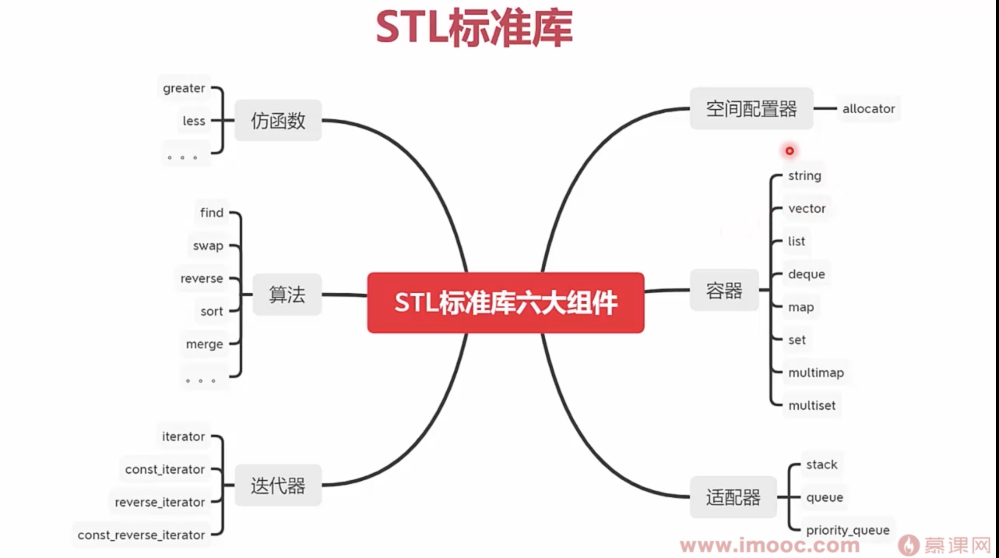
<br>

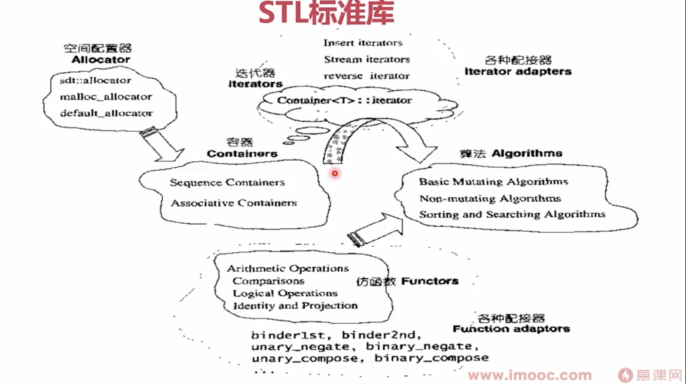

[ :bookmark: 返回目录](#目录)

### 容器  
容器用于存放数据; STL的容器分为两大类:
- 序列式容器(Sequence Containers):  
其中的元素都是可排序的(ordered),STL提供了vector, list, deque等序列式容器,而stack, queue, priority_ queue则是容器适配器;    
- 关联式容器(Associative Containers):  
每个数据元素都是由一-个键(key)和值(Value)组成，当元素被插入到容器时，按基键以某种特定规则放入适当位置;常见的STL关联容器如: set, multiset, map, multimap;

### 序列式容器的基本使用  
```c++
#include <vector>
#include <list>
#include <queue>
#include <stack>
#include <map>
#include <string>
#include <functional>
#include <algorithm>
#include <utility>
#include <iostream>
using namespace std;

struct Display
{
    void operator()(int i)
    {
        cout << i << " ";
    }
};

struct Display2
{
    void operator()(pair<string, double> info)
    {
        cout << info.first << ":  " << info.second << "  ";
    }
};

int main()
{
    int iArr[] = {1, 2, 3, 4, 5};

    vector<int> iVector(iArr, iArr + 4);
    list<int> iList(iArr, iArr + 4);
    deque<int> iDeque(iArr, iArr + 4);
    queue<int> iQueue(iDeque);                   // 队列 先进先出
    stack<int> iStack(iDeque);                   // 栈 先进后出
    priority_queue<int> iPQueue(iArr, iArr + 4); // 优先队列，按优先权

    for_each(iVector.begin(), iVector.end(), Display());
    cout << endl;
    for_each(iList.begin(), iList.end(), Display());
    cout << endl;
    for_each(iDeque.begin(), iDeque.end(), Display());
    cout << endl;

    while (!iQueue.empty())
    {
        cout << iQueue.front() << " "; // 1  2 3 4
        iQueue.pop();
    }
    cout << endl;

    while (!iStack.empty())
    {
        cout << iStack.top() << " "; // 4 3  2  1
        iStack.pop();
    }
    cout << endl;

    while (!iPQueue.empty())
    {
        cout << iPQueue.top() << " "; // 4 3 2 1
        iPQueue.pop();
    }
    cout << endl;

    return 0;
}
```

[ :bookmark: 返回目录](#目录)

## GUI开发
## 陷阱与经验