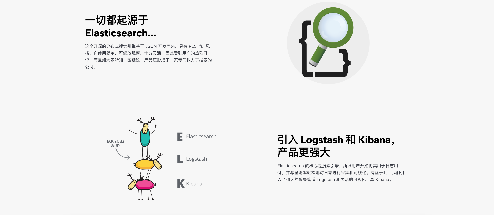

# ELK
## 结构
### [官网](https://www.elastic.co/cn/what-is/elk-stack)  
  

## 安装logstash
[官网](https://www.elastic.co/guide/en/logstash/6.8/installing-logstash.html)  

### linux 安装
```
sudo apt-get update && sudo apt-get install logstash  
```

### docker 安装


## logstash 指南
### [入门](https://www.elastic.co/guide/en/logstash/6.8/getting-started-with-logstash.html)  
### [原理](https://www.elastic.co/guide/en/logstash/6.8/pipeline.html)  
### JDBC Input Plugin

[原文](https://www.elastic.co/guide/en/logstash/6.8/plugins-inputs-jdbc.html)  

```shell
input {
  jdbc {
    jdbc_driver_library => "mysql-connector-java-5.1.36-bin.jar"
    jdbc_driver_class => "com.mysql.jdbc.Driver"
    jdbc_connection_string => "jdbc:mysql://localhost:3306/mydb"
    jdbc_user => "mysql"
    parameters => { "favorite_artist" => "Beethoven" }
    schedule => "* * * * *"
    statement => "SELECT * from songs where artist = :favorite_artist"
  }
}
```


输入日志文件，转发到`http rest` api接口  
```shell
input {
    jdbc {
      # mysql jdbc connection string to our backup databse
      jdbc_connection_string => "jdbc:mysql://ip:port/database?zeroDateTimeBehavior=convertToNull"

      # the user we wish to excute our statement as
      jdbc_user => "xxxx"
      jdbc_password => "xxxx"
      # the path to our downloaded jdbc driver
      jdbc_driver_library => "/home/admin/data/mysql-connector-java-5.1.36/mysql-connector-java-5.1.36-bin.jar"
      # the name of the driver class for mysql
      jdbc_driver_class => "com.mysql.jdbc.Driver"
      jdbc_paging_enabled => "true"
      jdbc_page_size => "50000"
      #statement_filepath => "jdbc.sql"
      statement => "SELECT * from mytable WHERE field = xx"
      type => "jdbc"
    }
}


output {
    http {
        url => "http://ip:port/xxxx"
        http_method => "post"
        format => "form"
        mapping => {"uid"=>"%{follwer_id}" "following_uid"=>"%{following_id}" "follow_source"=>1000}
    }
    stdout {
        codec => json_lines
    }
}
```

## mysql同步工具[canal](https://github.com/alibaba/canal)   

原理  
  

[docker安装](https://github.com/alibaba/canal/wiki/Docker-QuickStart)  


