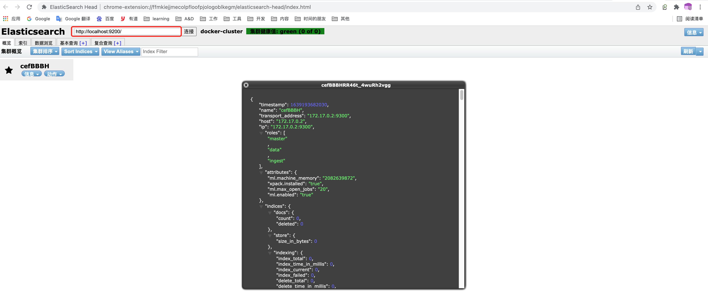
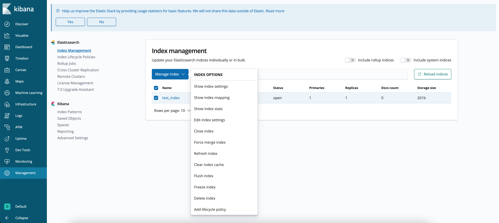

- # ES基础 

目录:  
- [docker搭建es 6.8](#docker搭建es-68)
- [使用elasticsearch head插件](#使用elasticsearch-head插件)
  - [查看节点信息](#查看节点信息)
  - [索引](#索引)
- [使用kibana](#使用kibana)
  - [安装](#安装)

- ## [官网安装](https://www.elastic.co/guide/en/elastic-stack/6.8/installing-elastic-stack.html) 

## docker搭建es 6.8

```shell
# 拉取镜像
docker pull docker.elastic.co/elasticsearch/elasticsearch:6.8.20

# 运行镜像
docker run -d --name elasticsearch -p 9200:9200 -p 9300:9300 -e "discovery.type=single-node" docker.elastic.co/elasticsearch/elasticsearch:6.8.20
```

访问`http://localhost:9200/`
```json
{
  "name" : "cefBBBH",
  "cluster_name" : "docker-cluster",
  "cluster_uuid" : "UsdiqEMZSNO-AqsOBtxF_Q",
  "version" : {
    "number" : "6.8.20",
    "build_flavor" : "default",
    "build_type" : "docker",
    "build_hash" : "c859302",
    "build_date" : "2021-10-07T22:00:24.085009Z",
    "build_snapshot" : false,
    "lucene_version" : "7.7.3",
    "minimum_wire_compatibility_version" : "5.6.0",
    "minimum_index_compatibility_version" : "5.0.0"
  },
  "tagline" : "You Know, for Search"
}
```

es集群`docker-compose.yml`  
```yaml
version: '3'
services:
  elasticsearch_n0:
    image: elasticsearch:6.8.20
    container_name: elasticsearch_n0
    privileged: true
    environment:
      - cluster.name=elasticsearch-cluster
      - node.name=node0
      - node.master=true
      - node.data=true
      - bootstrap.memory_lock=true
      - http.cors.enabled=true
      - http.cors.allow-origin=*
      - "ES_JAVA_OPTS=-Xms512m -Xmx512m"
      - "discovery.zen.ping.unicast.hosts=elasticsearch_n0,elasticsearch_n1,elasticsearch_n2"
      - "discovery.zen.minimum_master_nodes=2"
    ulimits:
      memlock:
        soft: -1
        hard: -1
    ports:
      - 9200:9200
  elasticsearch_n1:
    image: elasticsearch:6.8.20
    container_name: elasticsearch_n1
    privileged: true
    environment:
      - cluster.name=elasticsearch-cluster
      - node.name=node1
      - node.master=true
      - node.data=true
      - bootstrap.memory_lock=true
      - http.cors.enabled=true
      - http.cors.allow-origin=*
      - "ES_JAVA_OPTS=-Xms512m -Xmx512m"
      - "discovery.zen.ping.unicast.hosts=elasticsearch_n0,elasticsearch_n1,elasticsearch_n2"
      - "discovery.zen.minimum_master_nodes=2"
    volumes:
      - ./data/node1:/usr/share/elasticsearch/data
      - ./logs/node1:/usr/share/elasticsearch/logs
    ports:
      - 9201:9200
  elasticsearch_n2:
    image: elasticsearch:6.8.20
    container_name: elasticsearch_n2
    privileged: true
    environment:
      - cluster.name=docker-cluster
      - node.name=node2
      - node.master=true
      - node.data=true
      - bootstrap.memory_lock=true
      - http.cors.enabled=true
      - http.cors.allow-origin=*
      - "ES_JAVA_OPTS=-Xms512m -Xmx512m"
      - "discovery.zen.ping.unicast.hosts=elasticsearch_n0,elasticsearch_n1,elasticsearch_n2"
      - "discovery.zen.minimum_master_nodes=2"
    ulimits:
      memlock:
        soft: -1
        hard: -1
    ports:
      - 9202:9200
```

## 使用elasticsearch head插件

### 查看节点信息
  

### 索引

## 使用kibana  
### 安装 

```shell
# 拉取镜像
docker pull docker.elastic.co/kibana/kibana:6.8.20

# 启动并绑定es (--link elasticsearch 是容器名)
docker run -d --name kibana --link elasticsearch -p 5601:5601  docker.elastic.co/kibana/kibana:6.8.20
```

访问页面`http://localhost:5601/` , 访问manager，可以查看索引及端口 

  


