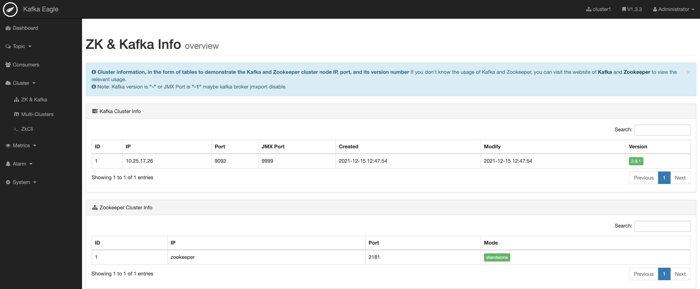
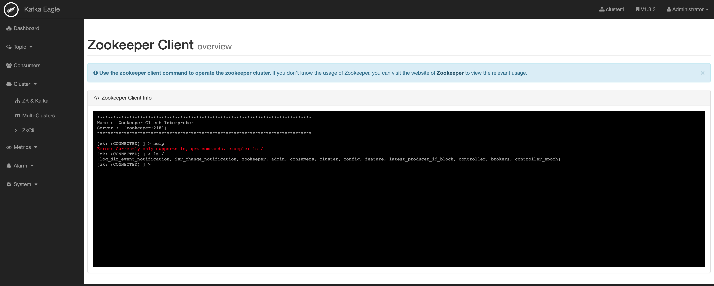
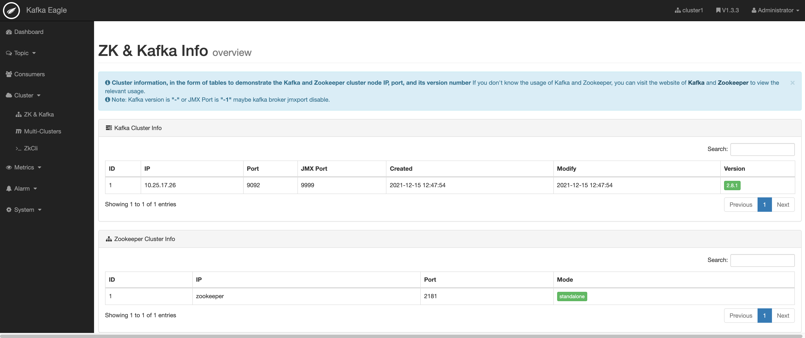
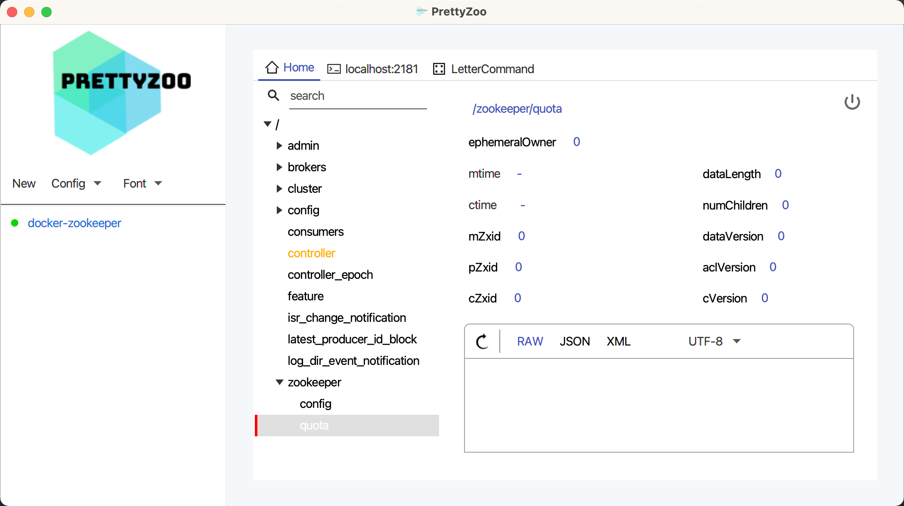
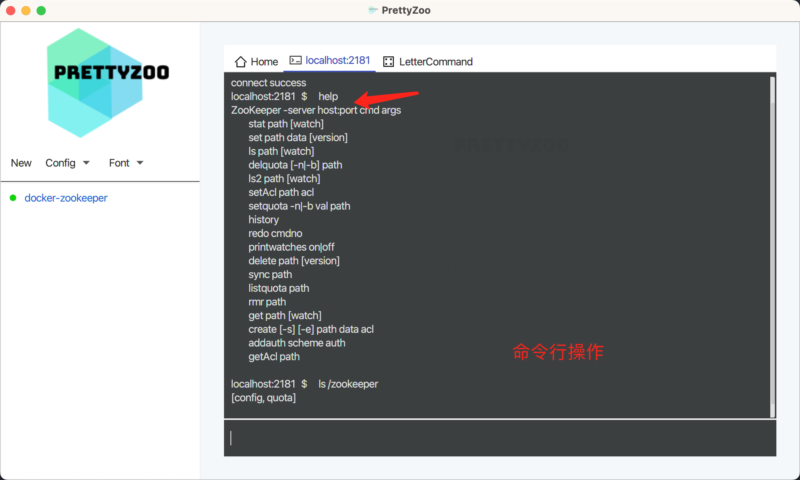
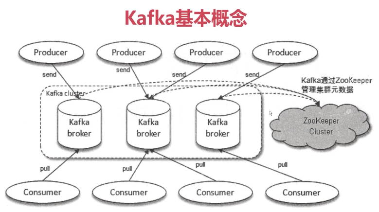
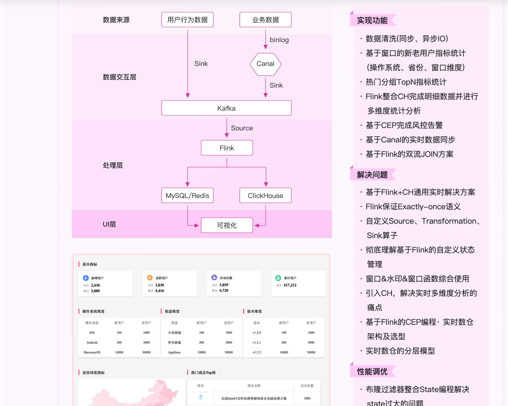
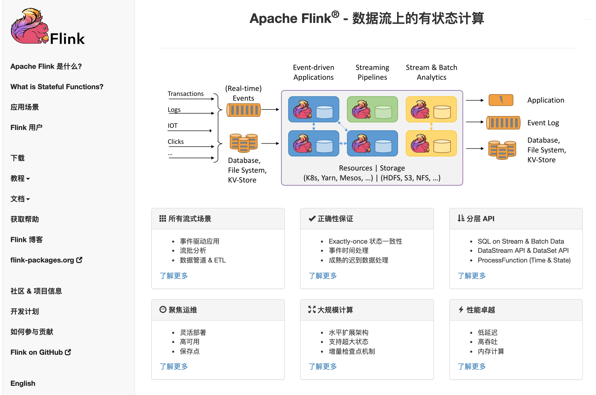
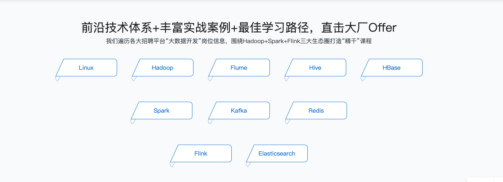

- # kafka基础
[官网](https://kafka.apache.org/)  

目录:  
- [docker 安装](#docker-安装)
- [kafka基本操作及指令](#kafka基本操作及指令)
  - [基本概念](#基本概念)
  - [实时分析模型](#实时分析模型)
  - [基本操作](#基本操作)
  - [应用](#应用)

## docker 安装  

或者通过[kafka-eagle](https://github.com/ymm135/docker_kafka_eagle) ,直接通过docker安装  

zookeeper状态  
    

zookeeper命令行   
  

kafka信息
  

也可以通过 [PrettyZoo](https://github.com/vran-dev/PrettyZoo) 测试`zookeeper`  

  

命令行操作:  
  

## kafka基本操作及指令  
### 基本概念
  

### 实时分析模型

  

  

大数据处理技术栈[来自慕课](https://class.imooc.com/sale/bigdata)    
  

### 基本操作
[kafka-go](https://github.com/segmentio/kafka-go)  
[kafka-spring](https://github.com/spring-projects/spring-kafka) 

### 应用 
kafka特点  
1. 消息系统：生存者消费者模型，先入先出（FIFO）。Partition内部是FIFO的，partition之间呢不是FIFO的，当然我们可以把topic设为一个partition，这样就是严格的FIFO。  

2. 持久化：可进行持久化操作。将消息持久化到磁盘，因此可用于批量消费，例如ETL，以及实时应用程序。通过将数据持久化到硬盘以及replication防止数据丢失。直接append到磁盘里去，这样的好处是直接持久化，数据不会丢失，第二个好处是顺序写，消费数据也是顺序读，所以持久化的同时还能保证顺序。

3. 分布式：易于向外扩展。所有的producer、broker和consumer都会有多个，均为分布式的。无需停机即可扩展机器。

4. 高吞吐量：同时为发布和订阅提供高吞吐量。据了解，Kafka每秒可以生产约25万消息（50 MB），每秒处理55万消息（110 MB）。
- 零拷贝技术
- 分布式存储
- 顺序读顺序写
- 批量读批量写  

Kafka的使用场景  

1. 消息系统
   Kafka被当作传统消息中间件的替代品。与大多数消息系统相比，Kafka具有更好的吞吐量，内置的分区，多副本和容错性，这使其成为大规模消息处理应用程序的良好解决方案。
   在我们的经验中，消息的使用通常是相对较低的吞吐量，但可能需要较低的端到端延迟，并且通常需要强大的持久性保证，这些Kafka都能提供。

2. 网站行为跟踪  
   Kafka的另一个应用场景是跟踪用户浏览页面、搜索及其他行为，以发布-订阅的模式实时记录到对应的topic里。那么这些结果被订阅者拿到后，就可以做进一步的实时处理，或实时监控，或放到hadoop/离线数据仓库里处理。  

3. 指标  
   用Kafka采集应用程序和服务器健康相关的指标，如CPU占用率、IO、内存、连接数、TPS、QPS等，然后将指标信息进行处理，从而构建一个具有监控仪表盘、曲线图等可视化监控系统。例如，很多公司采用Kafka与ELK（ElasticSearch、Logstash和Kibana）整合构建应用服务监控系统。

4. 日志聚合  
   其实开源产品有很多，包括Scribe、Apache Flume,很多人使用Kafka代替日志聚合（log aggregation）。
   日志聚合一般来说是从服务器上收集日志文件，然后放到一个集中的位置（文件服务器或HDFS）进行处理。然而Kafka忽略掉文件的细节，将其更清晰地抽象成一个个日志或事件的消息流。这就让Kafka处理过程延迟更低，更容易支持多数据源和分布式数据处理。比起以日志为中心的系统比如Scribe或者Flume来说，Kafka提供同样高效的性能和副本机制确保了更强的耐用性保，并且端到端延迟更低。

5. 流处理  
   保存收集流数据，以提供之后对接的Storm或其他流式计算框架进行处理。很多用户会将那些从原始topic来的数据进行 阶段性处理，汇总，扩充或者以其他的方式转换到新的topic下再继续后面的处理。
   例如一个文章推荐的处理流程，可能是先从RSS数据源中抓取文章的内 容，然后将其丢入一个叫做“文章”的topic中，后续操作可能是需要对这个内容进行清理，比如回复正常数据或者删除重复数据，最后再将内容匹配的结果返还给用户。
   从0.10.0.0版本开始，Apache Kafka提供了一个名为Kafka Streams的轻量级，但功能强大的流处理库，可执行如上所述的数据处理。除了Kafka Streams之外，替代开源流处理工具还包括Apache Storm和Apache Samza。

6. 事件源  
   事件源是一种应用程序设计的方式，该方式的状态转移被记录为按时间顺序排序的记录序列。Kafka可以存储大量的日志数据，这使得它成为一个对这种方式的应用来说绝佳的后台。比如动态汇总（News feed）。  

7. 提交日志  
   Kafka可以为一种外部的持久性日志的分布式系统提供服务。这种日志可以在节点间备份数据，并为故障节点数据回复提供一种重新同步的机制。Kafka中日志压缩功能为这种用法提供了条件。在这种用法中，Kafka类似于Apache BookKeeper项目。

  
