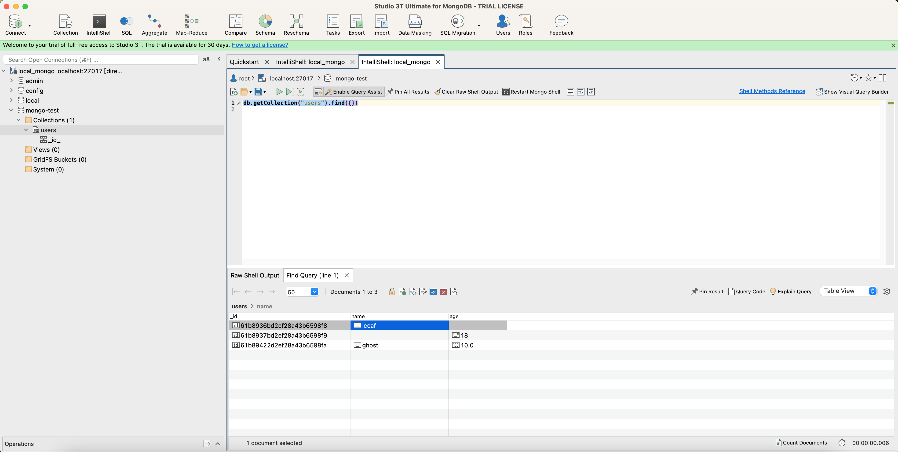

- # mongo基础  

目录:  
- [docker安装](#docker安装)
- [studio 3T](#studio-3t)
- [mongo指令](#mongo指令)


## docker安装  

```shell
docker pull mongo:4.0.26-xenial

# 不用加 --auth
docker run -itd --name mongo -p 27017:27017 --restart=always mongo:4.0.26-xenial 

# 登录设置密码
docker exec -it mongo mongo admin
# 创建管理员账号
> db.createUser({ user: 'root', pwd: 'root', roles: [ { role: "root", db: "admin" } ] });

# 使用管理员账号登录
> db.auth('root', 'root')

# 创建mongo-test数据库
> use mongo-test;

# 创建一个名为 root，密码为 root 的数据库用户。 
# readWrite 所有数据库
> db.createUser({ user: 'root', pwd: 'root', roles: [{ role: "readWrite", db: "mongo-test" }] });

# 查看表格
> show dbs;

# 查询所有角色权限(包含内置角色)
> db.runCommand({ rolesInfo: 1, showBuiltinRoles: true })
```


## [studio 3T](https://studio3t.com/download/)  
连接测试数据库:  
studio-3t.png




## mongo指令

```shell
## 基本指令  
mongo     进入mongodb命令行
show dbs;    显示数据库列表
use dbname;    切换/创建dbname数据库，大小写敏感
show collections;    显示数据库中的集合
db.createCollection('users');    创建users集合
db.users.drop()或db.runCommand({"drop","users"});    删除集合users
db.runCommand({"dropDatabase": 1});    删除当前数据库


## help指令  
odb.help();
odb.yourColl.help();
odb.youColl.find().help();
db.dropDatabase();    删除当前数据库
db.cloneDatabase(“127.0.0.1”);        从指定主机上克隆数据库 
db.copyDatabase("mydb", "temp", "127.0.0.1"); 从指定的机器上复制指定数据库数据到某个数据库，这里将本机的mydb的数据复制到temp数据库中
db 查看当前数据库
db.version();    查看数据库版本
db.getMongo();   查看当前db的链接机器


## 创建&新增save()
db.users.save({"name":"lecaf"});    
创建了名为users的集合，并新增了一条{"name":"lecaf"}的数据
{ 
    "_id" : ObjectId("61b8936bd2ef28a43b6598f8"), 
    "name" : "lecaf"
}

## insert()
db.users.insert({"name":"ghost", "age":10});    
在users集合中插入一条新数据，，如果没有users这个集合，mongodb会自动创建

## 删除  
db.users.remove();    删除users集合下所有数据
db.users.remove({"name": "lecaf"});    删除users集合下name=lecaf的数据

## 查找  
db.users.find();    查找users集合中所有数据
db.users.find({“name”:”feng”});    查找users集合中name=feng的所有数据
db.users.findOne();    查找users集合中的第一条数据
db.users.find({“name”:”feng”});    查找users集合中name=feng的数据集合中的第一条数据


# 修改
db.users.update({"name":"lecaf"}, {"age":10})    
修改name=lecaf的数据为age=10，第一个参数是查找条件，第二个参数是修改内容，除了主键，其他内容会被第二个参数的内容替换，主键不能修改，如图

```  

> save()和insert()也存在着些许区别：若新增的数据主键已经存在，insert()会不做操作并提示错误，而save() 则更改原来的内容为新内容。  