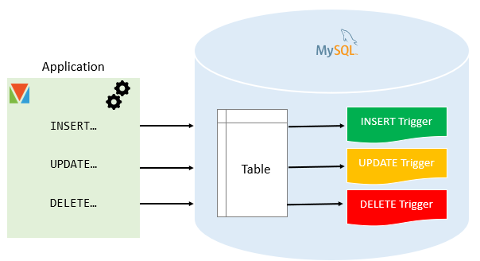

- # mysql 高级功能 

- [MySQL Triggers](#mysql-triggers)
- [MySQL Views](#mysql-views)
- [MySQL Index](#mysql-index)
  - [创建索引](#创建索引)
- [MySQL Full-Text Search](#mysql-full-text-search)
- [MySQL Tips](#mysql-tips)
  - [MySQL用户定义变量介绍](#mysql用户定义变量介绍)
  - [MySQLSELECT INTO Variable语法](#mysqlselect-into-variable语法)
  - [正则表达式搜索](#正则表达式搜索)
- [MySQL Administration](#mysql-administration)

## MySQL Triggers  
MySQL 触发器是自动执行的存储程序，以响应与表相关的特定事件，例如插入、更新或删除。本节向您展示如何有效地使用 MySQL 触发器。  
在 MySQL 中，触发器是自动调用的存储程序，以响应关联表中发生的插入、更新或删除等事件。例如，您可以定义在将新行插入表之前自动调用的触发器。

MySQL 支持为响应INSERT、UPDATE或DELETE事件而调用的触发器。

SQL 标准定义了两种类型的触发器：行级触发器和语句级触发器。

- 为插入、更新或删除的每一行激活一个行级触发器。例如，如果一个表插入、更新或删除了 100 行，则触发器会自动为受影响的 100 行调用 100 次。  
- 无论插入、更新或删除多少行，每个事务都会执行一次语句级触发器。  

MySQL 仅支持行级触发器。它不支持语句级触发器。  


<br>
<div align=center>
    </img>  
</div>
<br>

触发器的优点
- 触发器提供了另一种检查数据完整性的方法。
- 触发器处理来自数据库层的错误。
- 触发器提供了另一种运行计划任务的方法。通过使用触发器，您不必等待计划的事件运行，因为触发器会在对表中的数据进行更改之前或之后自动调用。
- 触发器可用于审计表中的数据更改。

触发器的缺点
- 触发器只能提供扩展验证，而不是所有验证。对于简单的验证，您可以使用、NOT NULL和UNIQUE约束。CHECKFOREIGN KEY
- 触发器可能难以排除故障，因为它们会在数据库中自动执行，而客户端应用程序可能无法看到这些触发器。
- 触发器可能会增加 MySQL 服务器的开销。

MySQLCREATE TRIGGER语句介绍 
该`CREATE TRIGGER`语句创建一个新触发器。以下是该`CREATE TRIGGER`语句的基本语法：  

```sql
CREATE TRIGGER trigger_name
{BEFORE | AFTER} {INSERT | UPDATE| DELETE }
ON table_name FOR EACH ROW
trigger_body;
```

下表说明了OLDandNEW修饰符的可用性：

| 触发事件 | OLD | NEW | 
| ------- | --- | --- | 
| INSERT | 不 | 是的 | 
| UPDATE | 是的 | 是的 | 
| DELETE | 是的 | 不 | 

示例:  
首先，创建一个名为`employees_audit`以保留对表的更改的新`employees` 表：  
```sql
CREATE TABLE employees_audit (
    id INT AUTO_INCREMENT PRIMARY KEY,
    employeeNumber INT NOT NULL,
    lastname VARCHAR(50) NOT NULL,
    changedat DATETIME DEFAULT NULL,
    action VARCHAR(50) DEFAULT NULL
);
```
接下来，创建一个在对表BEFORE UPDATE进行更改之前调用的触发器。`employees`
```sql
CREATE TRIGGER before_employee_update 
    BEFORE UPDATE ON employees
    FOR EACH ROW 
 INSERT INTO employees_audit
 SET action = 'update',
     employeeNumber = OLD.employeeNumber,
     lastname = OLD.lastname,
     changedat = NOW();
```

查看触发器: 
```shell
# 展示
SHOW TRIGGERS;  

# 删除
DROP TRIGGER before_employee_update
```

新建数据，然后更新，最后查看trigger表中数据
```sql
 INSERT INTO employees VALUES (0, 10, 'xiao', 'ming', 'email@qq.com')  
 
 SELECT * FROM employees
 
 UPDATE employees SET lastname = 'baibai' WHERE employeeNumber = 10
 
 SELECT * FROM employees
```

```
mysql>  SELECT * FROM employees_audit LIMIT 1;
+----+----------------+----------+---------------------+--------+
| id | employeeNumber | lastname | changedat           | action |
+----+----------------+----------+---------------------+--------+
|  1 |             10 | ming     | 2022-05-12 11:22:18 | update |
+----+----------------+----------+---------------------+--------+
```

## MySQL Views  
本教程向您介绍 MySQL 视图，它是存储在数据库中的命名查询，并逐步向您展示如何有效地管理视图。  

[视图原理](mysql-viewer.md)  

## MySQL Index  

MySQL 使用索引来快速查找具有特定列值的行。如果没有索引，MySQL 必须扫描整个表以定位相关行。表越大，搜索越慢。

在本节中，您将了解 MySQL 索引，包括创建索引、删除索引、列出表的所有索引以及 MySQL 中索引的其他重要特性。

- 创建索引——向您介绍索引概念，并向您展示如何为表的一个或多个列创建索引。
- 删除索引——向您展示如何删除表的现有索引。
- 列出表索引——为您提供列出表的所有索引或特定索引的语句。
- 唯一索引——使用唯一索引来确保存储在列中的不同值。
- 前缀索引——向您展示如何使用前缀索引为字符串列创建索引。
- 不可见索引——涵盖索引可见性并向您展示如何使索引可见或不可见。
- 降序索引——向您展示如何使用降序索引来提高查询性能。
- 复合索引——说明复合索引的应用，并向您展示何时使用它们来加快查询速度。
- 聚集索引——解释 InnoDB 表中的聚集索引。
- 索引基数——解释索引基数并向您展示如何使用 show index 命令查看它。
- USE INDEX 提示——向您展示如何使用 USE INDEX 提示来指示查询优化器使用指定- 索引的唯一列表来查找表中的行。
- FORCE INDEX 提示——向您展示如何使用 FORCE INDEX 提示来强制查询优化器使用- 指定的索引从表中选择数据。

### 创建索引 
索引是一种数据结构，例如 B-Tree，它提高了对表的数据检索速度，但需要额外的写入和存储来维护它。  
查询优化器可以使用索引来快速定位数据，而不必为给定查询扫描表中的每一行。  
当您使用主键或唯一键创建表时，MySQL 会自动创建一个名为. 该索引称为聚集索引。PRIMARY  
索引之所以特殊，PRIMARY是因为索引本身与数据一起存储在同一张表中。聚集索引强制执行表中的行顺序。    
索引以外的其他索引PRIMARY称为二级索引或非聚集索引。  

- 索引的优点

大大的提高查询速度  
可以显著的减少查询和排序的时间。  

- 索引的缺点

当对表中的数据进行增加，修改，删除的时候，索引要同时进行维护，数据量越大维护时间越长

## MySQL Full-Text Search  
- 定义
全文检索是指计算机索引程序通过扫描文章中的每一个词，对每一个词建立一个索引，指明该词在文章中出现的次数和位置，当用户查询时，检索程序就根据事先建立的索引进行查找，并将查找的结果反馈给用户的检索方式。这个过程类似于通过字典中的检索字表查字的过程。全文搜索搜索引擎数据库中的数据。  

在本节中，您将学习如何使用 MySQL 全文搜索功能。MySQL全文搜索提供了一种简单的方法来实现各种高级搜索技术，例如自然语言搜索、布尔文本搜索和查询扩展。

如果您使用过 Google 或 Bing 等搜索引擎，那么您使用的是全文搜索或 FTS。搜索引擎将网站上的内容收集到数据库中，并允许您根据关键字进行搜索。

除了搜索引擎之外，FTS 还为博客、新闻、电子商务等网站上的搜索结果提供支持。

全文搜索是一种搜索与搜索条件不完全匹配的文档的技术。文档是包含文本数据的数据库实体，例如产品描述、博客文章和文章。

比如你可以搜索 `Wood and Metal`，FTS可以返回单独包含搜索词的结果，只是Wood或Metal，或者包含不同顺序的词的结果`Word and Metal`，或者`Metal and Wood`。

从技术上讲，MySQL 支持使用LIKE 运算符和正则表达式进行部分文本搜索。但是，当文本列很大，表中的行数增加时，使用LIKEor正则表达式有一些限制：  


## MySQL Tips  
我们为您提供先进的 MySQL 技术和技巧，帮助您有效解决 MySQL 中最困难的挑战。  

### MySQL用户定义变量介绍
有时，您希望将值从 SQL 语句传递到另一个 SQL 语句。为此，您将值存储在第一个语句中的 MySQL 用户定义变量中，并在后续语句中引用它。

要创建用户定义的变量，请使用 format @variable_name，其中variable_name由字母数字字符组成。自 MySQL 5.7.5 起，用户定义变量的最大长度为 64 个字符

用户定义的变量不区分大小写。这意味着@id和@ID是相同的。  

您可以将用户定义的变量分配给特定的数据类型，例如整数、浮点、小数、字符串或NULL。  

由一个客户端定义的用户定义变量对其他客户端不可见。换句话说，用户定义的变量是特定于会话的。  

请注意，用户定义的变量是 MySQL 特定的 SQL 标准扩展。它们可能在其他数据库系统中不可用。  

- MySQL 变量赋值
```sql
SET @variable_name := value;
```

您可以使用 := 或 = 作为 SET 语句中的赋值运算符。例如，该语句将数字 100 分配给变量 @counter。  

```sql
SET @counter := 100;
```

给变量赋值的第二种方法是使用SELECT 语句。在这种情况下，您必须使用 := 赋值运算符，因为在 SELECT 语句中，MySQL 将 = 运算符视为等于运算符。

```sql
SELECT @variable_name := value;  
```
赋值后，您可以在允许表达式的后续语句中使用该变量，例如，在WHERE子句、INSERT或UPDATE语句中。  

- MySQL 变量示例
以下语句获取表中最昂贵的产品products并将价格分配给用户定义的变量@msrp： 

```sql
SELECT 
    @msrp:=MAX(msrp)
FROM
    products;
```
以下语句使用@msrp 变量查询最贵产品的信息。 

```sql
SELECT 
    productCode, productName, productLine, msrp
FROM
    products
WHERE
    msrp = @msrp;
``` 

有时，您想在表中插入一行，获取最后一个插入 id，并将其用于将数据插入到另一个表中。在这种情况下，您可以使用用户定义的变量来存储由AUTO_INCREMENT列生成的最新 id ，如下所示。  

```sql
SELECT @id:=LAST_INSERT_ID();
```

用户定义的变量只能保存一个值。如果 SELECT 语句返回多个值，则该变量将采用结果中最后一行的值。  

```sql
SELECT 
    @buyPrice:=buyprice
FROM
    products
WHERE
    buyprice > 95
ORDER BY buyprice;
```

### MySQLSELECT INTO Variable语法 
要将查询结果存储在一个或多个变量中，请使用以下SELECT INTO variable语法： 
```sql
SELECT 
    c1, c2, c3, ...
INTO 
    @v1, @v2, @v3,...
FROM 
    table_name
WHERE 
    condition;
```
在这种语法中：

- c1、c2 和 c3 是要选择并存储到变量中的列或表达式。
- @v1、@v2 和@v3 是存储来自c1、c2 和c3 的值的变量。
变量数必须与选择列表中的列数或表达式数相同。此外，查询必须返回零或一行。  

如果查询没有返回任何行，MySQL 会发出没有数据的警告，并且变量的值保持不变。  

如果查询返回多行，MySQL 会发出错误。为确保查询始终返回最多一行，您使用该LIMIT 1子句将结果集限制为单行。   

### 正则表达式搜索  

```
SELECT 
    *
FROM
    employees
WHERE
    email REGEXP '^(e|B|C)'
```

email 其实为e/B/C的记录:  
```
+----+----------------+-----------+----------+--------------+
| id | employeeNumber | firstname | lastname | email        |
+----+----------------+-----------+----------+--------------+
|  1 |             10 | xiao      | baibai   | email@qq.com |
+----+----------------+-----------+----------+--------------+
```

## MySQL Administration  
在本节中，您将找到许多有用的 MySQL 管理教程，包括 MySQL 服务器启动和关闭、MySQL 服务器安全、MySQL 数据库维护、备份和恢复。 


