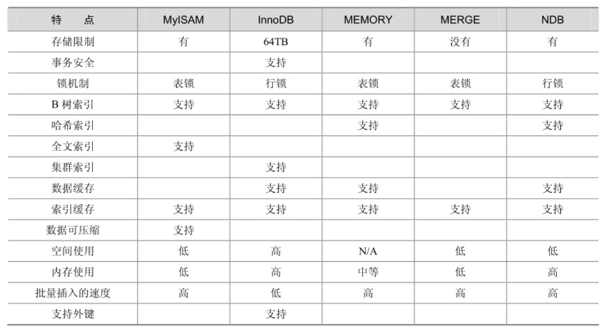

# mysql 基础知识  
[参考书籍《深入浅出MySQL：数据库开发、优化与管理维护(第2版)]()  

# 用于日常开发的知识  
## 存储引擎  
MySQL5.0支持的存储引擎包括 `MyISAM`、`InnoDB`、`BDB`、`MEMORY`、`MERGE`、`EXAMPLE`、`NDBCluster`、`ARCHIVE`、`CSV`、`BLACKHOLE`、`FEDERATED`等，其中I`nnoDB`和`BDB`提供事务安全表，其他存储引擎都是非事务安全表。  
创建新表时如果不指定存储引擎，那么系统就会使用默认存储引擎，MySQL5.5之前的默认存储引擎是MyISAM，5.5之后改为了`InnoDB`。如果要修改默认的存储引擎，可以在参数文件中设置default-table-type。查看当前的默认存储引擎，可以使用以下命令：  

```shell
mysql> show variables like '%storage_engine%';
+----------------------------------+--------+
| Variable_name                    | Value  |
+----------------------------------+--------+
| default_storage_engine           | InnoDB |
| default_tmp_storage_engine       | InnoDB |
| disabled_storage_engines         |        |
| internal_tmp_disk_storage_engine | InnoDB |
+----------------------------------+--------+
4 rows in set (0.01 sec)
```

查看所有支持的引擎及简介     
```
mysql> show engines;   
+--------------------+---------+----------------------------------------------------------------+--------------+------+------------+
| Engine             | Support | Comment                                                        | Transactions | XA   | Savepoints |
+--------------------+---------+----------------------------------------------------------------+--------------+------+------------+
| InnoDB             | DEFAULT | Supports transactions, row-level locking, and foreign keys     | YES          | YES  | YES        |
| MRG_MYISAM         | YES     | Collection of identical MyISAM tables                          | NO           | NO   | NO         |
| MEMORY             | YES     | Hash based, stored in memory, useful for temporary tables      | NO           | NO   | NO         |
| BLACKHOLE          | YES     | /dev/null storage engine (anything you write to it disappears) | NO           | NO   | NO         |
| MyISAM             | YES     | MyISAM storage engine                                          | NO           | NO   | NO         |
| CSV                | YES     | CSV storage engine                                             | NO           | NO   | NO         |
| ARCHIVE            | YES     | Archive storage engine                                         | NO           | NO   | NO         |
| PERFORMANCE_SCHEMA | YES     | Performance Schema                                             | NO           | NO   | NO         |
| FEDERATED          | NO      | Federated MySQL storage engine                                 | NULL         | NULL | NULL       |
+--------------------+---------+----------------------------------------------------------------+--------------+------+------------+
9 rows in set (0.00 sec)
```

<br>
<div align=center>
    </img>  
</div>
<br>


## 数据类型 

## 字符集  

## 索引的设计及使用  

## 视图  

- ### [视图原理](mysql-viewer.md)  

## 存储过程和函数  

## 触发器  

## 事务控制和锁定语句  


## 安装musql 

- ### CentOs7 安装 Mysql5.7 

下载mysql源安装包 
```shell
wget http://dev.mysql.com/get/mysql57-community-release-el7-8.noarch.rpm
```

安装mysql源
```shell
yum localinstall mysql57-community-release-el7-8.noarch.rpm
```

检查mysql源是否安装成功
```shell
yum repolist enabled | grep "mysql.*-community.*"
```

返回
```shell
mysql-connectors-community/x86_64 MySQL Connectors Community                 230
mysql-tools-community/x86_64      MySQL Tools Community                      138
mysql57-community/x86_64          MySQL 5.7 Community Server                 564
```

也可以修改 vim /etc/yum.repos.d/mysql-community.repo源，改变默认安装的mysql版本。比如要安装5.6版本，将5.7源的enabled=1改成enabled=0。然后再将5.6源的enabled=0改成enabled=1即可。改完之后的效果如下所示：  
```shell
..........
# Enable to use MySQL 5.5
[mysql55-community]
name=MySQL 5.5 Community Server
baseurl=http://repo.mysql.com/yum/mysql-5.5-community/el/7/$basearch/
enabled=0 # 这里 0表示不选
gpgcheck=1
gpgkey=file:///etc/pki/rpm-gpg/RPM-GPG-KEY-mysql

# Enable to use MySQL 5.6
[mysql56-community]
name=MySQL 5.6 Community Server
baseurl=http://repo.mysql.com/yum/mysql-5.6-community/el/7/$basearch/
enabled=0 # 这里 0表示不选
gpgcheck=1
gpgkey=file:///etc/pki/rpm-gpg/RPM-GPG-KEY-mysql

[mysql57-community]
name=MySQL 5.7 Community Server
baseurl=http://repo.mysql.com/yum/mysql-5.7-community/el/7/$basearch/
enabled=1 # 这里 1 表示 选中
gpgcheck=1 # 如果出现 GPG 失败，可以修改为gpgcheck = 0 
gpgkey=file:///etc/pki/rpm-gpg/RPM-GPG-KEY-mysql
..........
```

安装MySQL
```shell
yum install mysql-community-server
```

启动MySQL服务
```shell
systemctl start mysqld
```

查看MySQL的启动状态
```shell
# systemctl status mysqld
● mysqld.service - MySQL Server
   Loaded: loaded (/usr/lib/systemd/system/mysqld.service; enabled; vendor preset: disabled)
   Active: active (running) since 四 2018-08-23 15:27:28 CST; 1h 26min ago
     Docs: man:mysqld(8)
           http://dev.mysql.com/doc/refman/en/using-systemd.html
  Process: 21453 ExecStart=/usr/sbin/mysqld --daemonize --pid-file=/var/run/mysqld/mysqld.pid $MYSQLD_OPTS (code=exited, status=0/SUCCESS)
  Process: 21432 ExecStartPre=/usr/bin/mysqld_pre_systemd (code=exited, status=0/SUCCESS)
 Main PID: 21457 (mysqld)
   Memory: 202.1M
   CGroup: /system.slice/mysqld.service
           └─21457 /usr/sbin/mysqld --daemonize --pid-file=/var/run/mysqld/mysqld.pid
```

设置开机启动
```
systemctl enable mysqld
systemctl daemon-reload
```

获取root登陆密码
```
mysql安装完成之后，在/var/log/mysqld.log文件中给root生成了一个默认密码。通过下面的方式找到root默认密码，然后登录mysql进行修改：

#  grep 'temporary password' /var/log/mysqld.log
2022-04-13T08:17:37.040012Z 1 [Note] A temporary password is generated for root@localhost: #6we;/NBP3IP
```
ps:如果没有返回，找不到root密码，解决方案：
```
# 1删除原来安装过的mysql残留的数据（这一步非常重要，问题就出在这）
rm -rf /var/lib/mysql

# 2重启mysqld服务
systemctl restart mysqld

# 3再去找临时密码
grep 'temporary password' /var/log/mysqld.log
```
原因有可能是之前安装过一次，没有安装好。  

登陆 
```
[root@VM_18_105_centos ~]# mysql -uroot -p
---- 输入密码：thI/5wEl_chk
# 修改密码
mysql> ALTER USER 'root'@'localhost' IDENTIFIED BY '123456Aa!';   
```
MySql 默认密码级别一定要有大小写字母和特殊符号，所以比较麻烦。  

修改密码策略

在/etc/my.cnf文件添加validate_password_policy配置，指定密码策略  
```
# 0（LOW）：验证 Length
# 1（MEDIUM）：验证 Length; numeric, lowercase/uppercase, and special characters
# 2（STRONG）：验证 Length; numeric, lowercase/uppercase, and special characters; dictionary file
validate_password_policy=0
```

当然如果不需要密码策略，可以禁用：
在/etc/my.cnf文件添加
```
validate_password = off
```
重启生效：
```
systemctl restart mysqld
```

Mysql的root用户，只能本地访问，这里在创建一个远程可以访问的 用户。
```
GRANT ALL PRIVILEGES ON *.* TO 'user'@'%' IDENTIFIED BY '123456' WITH GRANT OPTION;
```

查看用户及权限: 
```
mysql> select User,authentication_string,Host from mysql.user;
+---------------+-------------------------------------------+-----------+
| User          | authentication_string                     | Host      |
+---------------+-------------------------------------------+-----------+
| root          | *5860629DEA0B537A9258E5B884D9A660887098D6 | localhost |
| mysql.session | *THISISNOTAVALIDPASSWORDTHATCANBEUSEDHERE | localhost |
| mysql.sys     | *THISISNOTAVALIDPASSWORDTHATCANBEUSEDHERE | localhost |
| root          | *81F5E21E35407D884A6CD4A731AEBFB6AF209E1B | %         |
+---------------+-------------------------------------------+-----------+
```


