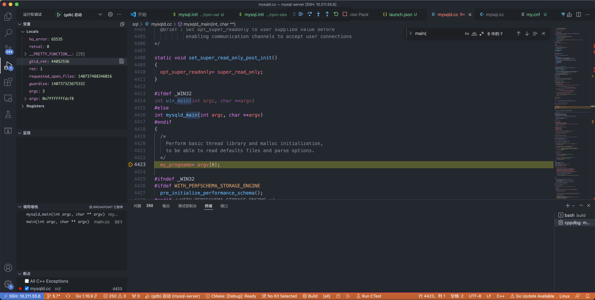
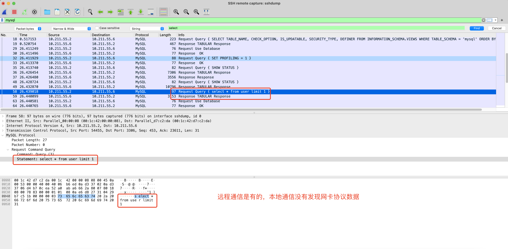

# mysql 5.7 源码调试  

## 环境搭建及源码编译  

- ### boost 安装(版本1_59_0)  

> 也可以不编译，直接使用 -DWITH_BOOST=/path/to/boost_1_59_0 

[1.59源码下载](https://www.boost.org/users/history/)  
```
# 进入源码目录
./bootstrap.sh
sudo ./b2 install  

# 查看库
ls -l /usr/local/lib/libboost_*  
ls -l /usr/local/include/boost/
```

- ### mysql 源码编译

```shell
git clone git@github.com:mysql/mysql-server.git -b 5.7 

# 编译参数 
cd build 
cmake .. -DCMAKE_INSTALL_PREFIX=/usr/local/mysql \
-DMYSQL_DATADIR=/data/mysql \
-DWITH_BOOST=/media/psf/Home/Downloads/boost_1_59_0 \
-DSYSCONFDIR=/etc \
-DEFAULT_CHARSET=utf8mb4 \
-DDEFAULT_COLLATION=utf8mb4_general_ci \
-DENABLED_LOCAL_INFILE=1 \
-DEXTRA_CHARSETS=all \
-DWITH_DEBUG=1 \
-DCMAKE_BUILD_TYPE=Debug 

make -j4

make install
```

编译输出文件:  
```shell
/usr/local/mysql/include/mysql.h 
...
/usr/local/mysql/bin/myisam_ftdump
/usr/local/mysql/bin/mysql
/usr/local/mysql/bin/mysqltest
/usr/local/mysql/bin/mysqldump
/usr/local/mysql/bin/mysqlbinlog
/usr/local/mysql/bin/mysql_install_db        # install db 
/usr/local/mysql/bin/mysql_ssl_rsa_setup
/usr/local/mysql/bin/mysqladmin
/usr/local/mysql/bin/mysqld
/usr/local/mysql/bin/mysql_config
/usr/local/mysql/bin/mysqld_safe
...
/usr/local/mysql/lib/plugin/mypluglib.so
...
/usr/local/mysql/mysql-test/suite/group_replication/my.cnf # 有很多不同场景的测试配置文件
...
 /usr/local/mysql/support-files/mysql.server # 服务器脚本 start reload stop 
...
```

> `/media/psf/Home/Downloads/boost_1_59_0` boost源码目录  

- ### 配置文件`my.cnf`  

mysql服务系统配置  
```
cp /usr/local/mysql/support-files/mysql.server /etc/init.d/mysqld
chkconfig --add mysqld     # 添加到系统服务
chkconfig mysqld on        # 开机启动
```

```conf
[mysqld]
user            = mysql

character-set-server=utf8mb4
explicit-defaults-for-timestamp=1
general-log=1
general-log-file=/var/log/mysql/mysqld.log
log_error = /var/log/mysql/error.log

[client]
default-character-set=utf8mb4
```

- ### 初始化数据库

参考文件: `BUILD/packaging/rpm-sles/mysql.init`

创建用户及组
```shell
useradd -m mysql 
passwd mysql     #xiaoming123!@#
```

```
cd /usr/local/mysql
chown -R mysql:mysql .
chown -R mysql:mysql /data/mysql/
chown -R mysql:mysql /var/log/mysql/

# 默认配置文件路径 /etc/my.cnf 如果需要跟换 --defaults-file=/path/to/conf
./bin/mysqld --initialize-insecure  --user=mysql --basedir=/usr/local/mysql --datadir=/data/mysql/data

# Generate certs if neded
./bin/mysql_ssl_rsa_setup --datadir=/data/mysql/data --uid=mysql

注意：如果使用–initialize参数初始化系统数据库之后，会在~/.mysql_secret文件中生成root用户的一个临时密码，同时也在初始化日志中打印出来了
```

> --initialize-insecure root用户没有密码， --initialize root用户随机密码  

初始化后的data目录: 
```shell
# ls -l /data/mysql/data
-rw-r----- 1 mysql mysql      215 4月   3 09:27 ib_buffer_pool
-rw-r----- 1 mysql mysql 12582912 4月   3 09:27 ibdata1
-rw-r----- 1 mysql mysql 50331648 4月   3 09:27 ib_logfile0
-rw-r----- 1 mysql mysql 50331648 4月   3 09:27 ib_logfile1
```

初始化日志: 
```shell
==> /var/log/mysql/error.log <==
2022-04-03T05:10:21.134694Z 0 [Warning] InnoDB: New log files created, LSN=45790
2022-04-03T05:10:21.252883Z 0 [Warning] InnoDB: Creating foreign key constraint system tables.

==> /var/log/mysql/mysqld.log <==
2022-04-03T05:10:21.841258Z	    1 Query	CREATE DATABASE mysql;

2022-04-03T05:10:21.841712Z	    1 Query	USE mysql;

2022-04-03T05:10:21.842139Z	    1 Query	set sql_mode='';

2022-04-03T05:10:21.842547Z	    1 Query	set default_storage_engine=myisam;

2022-04-03T05:10:21.843103Z	    1 Query	CREATE TABLE IF NOT EXISTS db (...
```

- #### 手动启动mysql 

```shell
# mysqld --verbose --help 

Usage: ./bin/mysqld [OPTIONS]

Default options are read from the following files in the given order:
/etc/mysql/my.cnf /etc/my.cnf ~/.my.cnf 

--gdb               Set up signals usable for debugging.
--innodb-master-thread-disabled-debug 
                    Disable master thread

Variables (--variable-name=value)
and boolean options {FALSE|TRUE}                             Value (after reading options)
debug                                                        (No default value)
console                                                      FALSE
daemonize                                                    FALSE
```

查看错误日志: `tailf /var/log/mysql/error.log`
```shell
2022-04-03T03:17:34.826955Z 0 [Note] InnoDB: If the mysqld execution user is authorized, page cleaner thread priority can be changed. See the man page of setpriority().
2022-04-03T03:17:34.837137Z 0 [Note] InnoDB: The first innodb_system data file 'ibdata1' did not exist. A new tablespace will be created!
2022-04-03T03:17:34.837443Z 0 [ERROR] InnoDB: Operating system error number 13 in a file operation.
2022-04-03T03:17:34.837461Z 0 [ERROR] InnoDB: The error means mysqld does not have the access rights to the directory.
2022-04-03T03:17:34.837471Z 0 [ERROR] InnoDB: Operating system error number 13 in a file operation.
2022-04-03T03:17:34.837478Z 0 [ERROR] InnoDB: The error means mysqld does not have the access rights to the directory.
2022-04-03T03:17:34.837488Z 0 [ERROR] InnoDB: Cannot open datafile './ibdata1'
```

> 没有权限访问数据库db文件, /data/mysql/data, `chown -R mysql:mysql /data/mysql/`  

```
2022-04-03T05:04:16.233981Z 0 [ERROR] Fatal error: Can't open and lock privilege tables: Table 'mysql.user' doesn't exist
2022-04-03T05:04:16.234064Z 0 [ERROR] Fatal error: Failed to initialize ACL/grant/time zones structures or failed to remove temporary table files.
2022-04-03T05:04:16.234161Z 0 [ERROR] Aborting
```

> 没有找到数据库，需要增加参数 `./bin/mysqld --defaults-file=/etc/my.cnf  --datadir=/data/mysql/data`  

## mysql 用户管理(`mysql.user`表)    

- ### 新增、修改、删除用户  

新增
```
mysql> CREATE USER 'user_name'@'host' IDENTIFIED BY 'password'; # 密码必须加引号
mysql> CREATE USER user_name IDENTIFIED BY 'password'; # host默认为%
mysql> CREATE USER user_name; # host默认为%，没有密码
mysql> CREATE USER user_name@localhost IDENTIFIED BY 'password'; # 用户名和主机名将引号省略掉
mysql> CREATE USER user_name@'%' IDENTIFIED BY 'password'; # 主机名含有%，必须加引号才可以;@'%'表示任意IP地址
```

修改密码  
```shell
mysql> SET PASSWORD FOR 'user_name'@'host' = PASSWORD('newpassword');
```

更新host 
```shell
update mysql.user set host='localhost' where user='admin';
```

删除用户 
```shell
DROP USER 'admin'@'%';  
```

- ### 新建用户远程访问  

```
grant all on *.* to admin@'%' identified by '123456' with grant option;
flush privileges;
```

> 允许任何ip地址(%表示允许任何ip地址)的电脑用admin帐户和密码(123456)来访问这个mysql server, 注意admin账户不一定要存在。

- ### root 用户远程登录  

关闭防火墙:  `systemctl stop firewalld`  

支持root用户允许远程连接mysql数据库
```shell
grant all privileges on *.* to 'root'@'%' identified by '123456' with grant option;
flush privileges;
```

远程root用户访问
```
mysql> select User,authentication_string,Host from mysql.user;

+---------------+-------------------------------------------+-----------+
| User          | authentication_string                     | Host      |
+---------------+-------------------------------------------+-----------+
| root          |                                           | localhost |
| mysql.session | *THISISNOTAVALIDPASSWORDTHATCANBEUSEDHERE | localhost |
| mysql.sys     | *THISISNOTAVALIDPASSWORDTHATCANBEUSEDHERE | localhost |
| root          | *6BB4837EB74329105EE4568DDA7DC67ED2CA2AD9 | %         |
+---------------+-------------------------------------------+-----------+
4 rows in set (0.00 sec)
```

> root 有两个用户，本地用户没有密码，远程访问的有密码  

## vscode 调试 
[mysql服务端调试官方文档](https://dev.mysql.com/doc/refman/8.0/en/making-trace-files.html)  

[调试mysql客户端](https://dev.mysql.com/doc/refman/8.0/en/debugging-client.html)  
`mysql --debug=d:t:O,/tmp/client.trace`   

客户端main方法: `client/mysql.cc`
服务端main方法: `sql/mysqld.cc`

```
#ifdef _WIN32
int win_main(int argc, char **argv)
#else
int mysqld_main(int argc, char **argv)
#endif
```

调试文件: 
```json
{
    "version": "0.2.0",
    "configurations": [
        {
            "name": "mysql gdb 启动",
            "type": "cppdbg",
            "request": "launch",
            "program": "${workspaceFolder}/build/sql/mysqld",
            "args": ["--defaults-file=/etc/my.cnf", "--datadir=/data/mysql/data", "--debug=d,info,error,query,general,where:O,/tmp/mysqld.trace"],
            "stopAtEntry": false,
            "cwd": "${fileDirname}",
            "environment": [],
            "externalConsole": false,
            "MIMode": "gdb",
            "setupCommands": [
                {
                    "description": "为 gdb 启用整齐打印",
                    "text": "-enable-pretty-printing",
                    "ignoreFailures": true
                },
                {
                    "description":  "将反汇编风格设置为 Intel",
                    "text": "-gdb-set disassembly-flavor intel",
                    "ignoreFailures": true
                }
            ]
        }
       
    ]
}
```

vscode 调试视图 

<br>
<div align=center>
    </img>  
</div>
<br>

增加调试日志`--debug=d,info,error,query,general,where:O,/tmp/mysqld.trace`  
查看日志文件`select * from employees limit 1`: 

```shell
my_realpath: info: executing realpath
open_binary_frm: info: default_part_db_type = 0
intern_plugin_lock: info: thd: 0x7fffbc000d80, plugin: "InnoDB", ref_count: 17
intern_plugin_lock: info: thd: 0x7fffbc000d80, plugin: "InnoDB", ref_count: 18
open_binary_frm: info: extra segment size is 35 bytes
intern_plugin_lock: info: thd: 0x7fffbc000d80, plugin: "InnoDB", ref_count: 19
open_binary_frm: info: Found format section
open_binary_frm: info: format_section_length: 15, format_section_flags: 0
open_binary_frm: info: tablespace: '<null>'
open_binary_frm: info: i_count: 1  i_parts: 3  index: 1  n_length: 58  int_length: 6  com_length: 0  gcol_screen_length: 0
get_new_handler: info: handler created F_UNLCK 2 F_RDLCK 0 F_WRLCK 1
get_new_handler: info: handler created F_UNLCK 2 F_RDLCK 0 F_WRLCK 1
handler::ha_open: info: old m_lock_type: 2 F_UNLCK 2
column_bitmaps_signal: info: read_set: 0x7fffbc00f428  write_set: 0x7fffbc00f448
column_bitmaps_signal: info: read_set: 0x7fffbc039d70  write_set: 0x7fffbc039d70
Protocol_classic::start_result_metadata: info: num_cols 6, flags 2
Protocol_classic::end_result_metadata: info: num_cols 6, flags 2
close_thread_tables: info: thd->open_tables: 0x7fffbc00f320
MDL_context::release_locks_stored_before: info: found lock to release ticket=0x7fffbc03abf0
net_send_ok: info: affected_rows: 0  id: 0  status: 2  warning_count: 0
net_send_ok: info: OK sent, so no more error sending allowed
do_command: info: Command on socket (51) = 3 (Query)
do_command: info: packet: ''; command: 3
dispatch_command: info: command: 3
dispatch_command: query: select * from employees limit 1

gtid_pre_statement_checks: info: gtid_next->type=0 owned_gtid.{sidno,gno}={0,0}
mysql_execute_command: info: derived: 0  view: 0
column_bitmaps_signal: info: read_set: 0x7fffbc00f428  write_set: 0x7fffbc00f448
Field_iterator_table_ref::set_field_iterator: info: field_it for 'employees' is Field_iterator_table
SELECT_LEX::prepare: info: setup_ref_array this 0x7fffbc005ae0   40 :    0    0    6    1    1    0
setup_fields: info: thd->mark_used_columns: 1
setup_fields: info: thd->mark_used_columns: 1
SELECT_LEX::setup_conds: info: thd->mark_used_columns: 1
get_lock_data: info: count 1
get_lock_data: info: sql_lock->table_count 1 sql_lock->lock_count 0
mysql_lock_tables: info: thd->proc_info System lock
lock_external: info: count 1
THD::decide_logging_format: info: query: select * from employees limit 1
THD::decide_logging_format: info: variables.binlog_format: 2
THD::decide_logging_format: info: lex->get_stmt_unsafe_flags(): 0x1
THD::decide_logging_format: info: decision: no logging since mysql_bin_log.is_open() = 0 and (options & OPTION_BIN_LOG) = 0x40000 and binlog_format = 2 and binlog_filter->db_ok(db) = 1
THD::is_classic_protocol: info: type=0

WHERE:(constants) (nil) 

WHERE:(employees) (nil) 

WHERE:(employees) (nil) 

Info about JOIN
employees         type: ALL      q_keys: 0  refs: 0  key: -1  len: 0
JOIN::make_tmp_tables_info: info: Using end_send
JOIN::exec: info: Sending data
Protocol_classic::start_result_metadata: info: num_cols 6, flags 5
Protocol_classic::end_result_metadata: info: num_cols 6, flags 5
init_read_record: info: using rr_sequential
my_realpath: info: executing realpath
my_realpath: info: executing realpath
do_select: info: 1 records output
ha_commit_trans: info: all=0 thd->in_sub_stmt=0 ha_info=0x7fffbc0022a8 is_real_trans=1
close_thread_tables: info: thd->open_tables: 0x7fffbc00f320
MDL_context::release_locks_stored_before: info: found lock to release ticket=0x7fffbc03abf0
intern_plugin_unlock: info: unlocking plugin, name= InnoDB, ref_count= 19
intern_plugin_unlock: info: unlocking plugin, name= InnoDB, ref_count= 18
dispatch_command: info: query ready
net_send_ok: info: affected_rows: 0  id: 0  status: 34  warning_count: 0
net_send_ok: info: OK sent, so no more error sending allowed
```


## mysql 通信数据包  

首先wireshark需要打开mysql协议  

<br>
<div align=center>
    </img>  
</div>
<br>

## [mysql优化官方文档](https://dev.mysql.com/doc/refman/5.7/en/optimization.html)  

