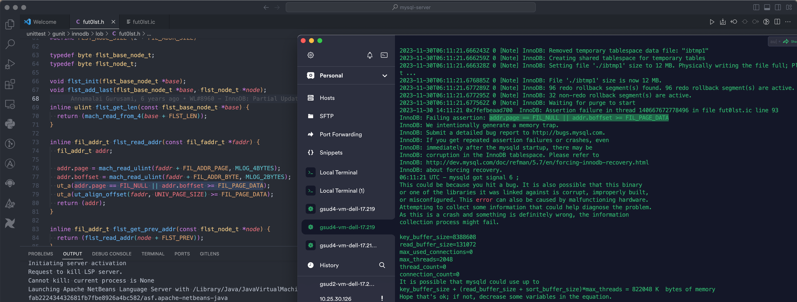
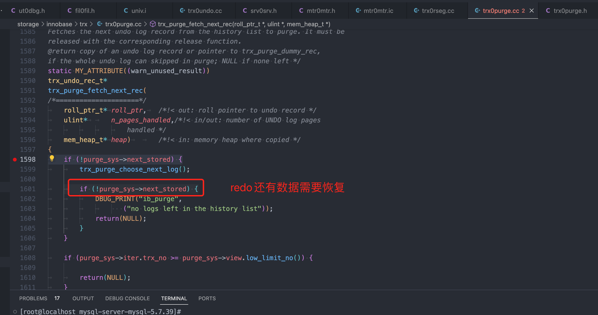
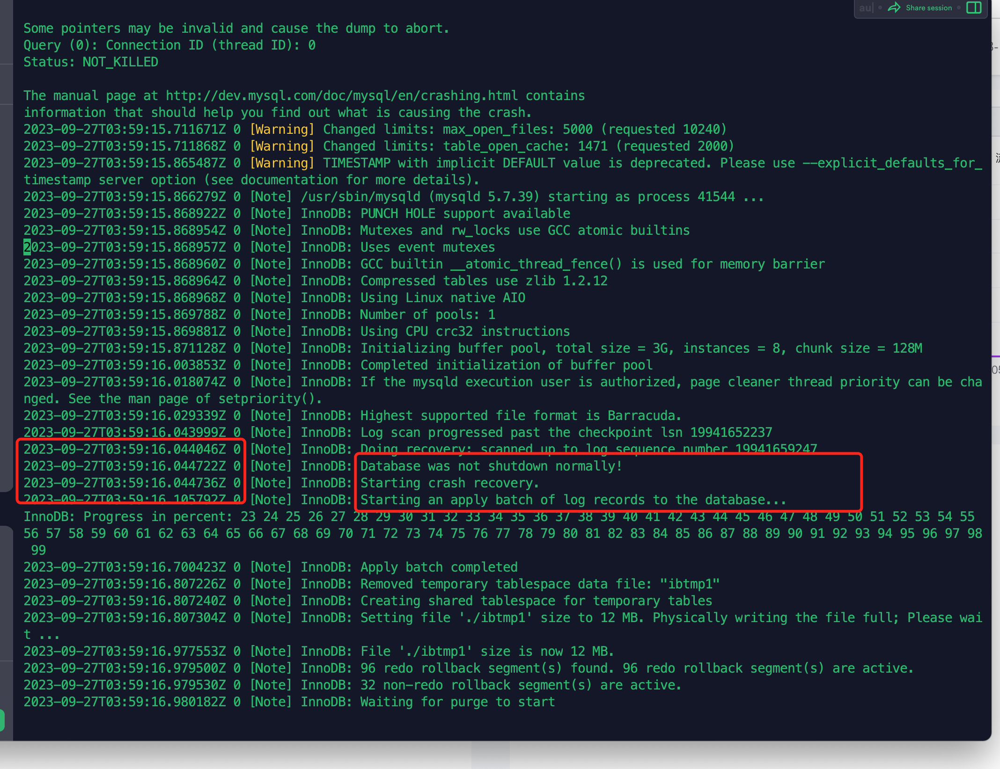

- # mysql 日常问题整理

- [Mysql 表修复](#mysql-表修复)
  - [如何手工复现`表损坏`](#如何手工复现表损坏)
- [centos7 mysql启动问题](#centos7-mysql启动问题)
- [mysql启动异常](#mysql启动异常)
  - [`ibdata1` 损坏](#ibdata1-损坏)
  - [`ib_logfile0`文件损坏](#ib_logfile0文件损坏)
  - [`ibtmp1`文件损坏](#ibtmp1文件损坏)
  - [三个文件都损坏和删除](#三个文件都损坏和删除)
  - [`innodb_force_recovery = 2`](#innodb_force_recovery--2)
  - [源码分析](#源码分析)
- [表锁](#表锁)
  - [表锁异常场景](#表锁异常场景)
  - [mysql表锁测试](#mysql表锁测试)
- [没有磁盘空间](#没有磁盘空间)
- [数据库初始化](#数据库初始化)


## Mysql 表修复  

```sh
Error 145: Table './firewall/log_base_policy' is marked as crashed and should be repaired
```

检查表的情况:
```sh
mysql> CHECK TABLE log_base_policy;
+--------------------------+-------+----------+---------------------------------------------------------------------------------+
| Table                    | Op    | Msg_type | Msg_text                                                                        |
+--------------------------+-------+----------+---------------------------------------------------------------------------------+
| firewall.log_base_policy | check | warning  | Table is marked as crashed                                                      |
| firewall.log_base_policy | check | warning  | 2 clients are using or haven't closed the table properly                        |
| firewall.log_base_policy | check | error    | Can't read key from filepos: 5120                                               |
| firewall.log_base_policy | check | Error    | Incorrect key file for table './firewall/log_base_policy.MYI'; try to repair it |
| firewall.log_base_policy | check | error    | Corrupt                                                                         |
+--------------------------+-------+----------+---------------------------------------------------------------------------------+
5 rows in set (0.37 sec)
```

从检查的情况来看，MyISAM的索引表损坏了，位置` Can't read key from filepos: 5120 `  

修复表
```sh
REPAIR TABLE log_base_policy;
```

修复的时候，会创建临时表中转
```sh
root@ubuntu:~# ls -lh /var/lib/mysql/firewall/log_base_policy.*
-rw-r----- 1 mysql mysql  18K Mar 11 18:15 /var/lib/mysql/firewall/log_base_policy.frm
-rw-r----- 1 mysql mysql  21G Mar 29 11:45 /var/lib/mysql/firewall/log_base_policy.MYD
-rw-r----- 1 mysql mysql 2.5G Mar 29 15:21 /var/lib/mysql/firewall/log_base_policy.MYI
-rw-r----- 1 mysql mysql 6.1G Mar 29 15:38 /var/lib/mysql/firewall/log_base_policy.TMD
```

修复失败后再次检测:
```sh
mysql> CHECK TABLE log_base_policy;
+--------------------------+-------+----------+----------------------------------------------------------+
| Table                    | Op    | Msg_type | Msg_text                                                 |
+--------------------------+-------+----------+----------------------------------------------------------+
| firewall.log_base_policy | check | warning  | Table is marked as crashed and last repair failed        |
| firewall.log_base_policy | check | warning  | 2 clients are using or haven't closed the table properly |
| firewall.log_base_policy | check | warning  | Size of indexfile is: 2674672640      Should be: 1024    |
| firewall.log_base_policy | check | error    | Record-count is not ok; is 184227914   Should be: 0      |
| firewall.log_base_policy | check | warning  | Found 164198520 deleted space.   Should be 0             |
| firewall.log_base_policy | check | warning  | Found 1368321 deleted blocks       Should be: 0          |
| firewall.log_base_policy | check | warning  | Found 185596235 key parts. Should be: 0                  |
| firewall.log_base_policy | check | error    | Corrupt                                                  |
+--------------------------+-------+----------+----------------------------------------------------------+
8 rows in set (1 min 40.85 sec)
```

> 最后发现问题了，如果在优化时`optimizer`，为了减小表的大小，这时突然断电，那就会导致表无法使用了。  

### 如何手工复现`表损坏`  

```sh
dd if=/dev/random of=/path-to-mysql-data-directory/数据库名/表名.ibd bs=1 count=1024 seek=512
```

修改
```sh
$ dd if=/dev/random of=log_threat_1.frm bs=1 count=1024 seek=512
mysql> CHECK TABLE log_threat_1;
+-----------------------+-------+----------+--------------------------------------------------------------+
| Table                 | Op    | Msg_type | Msg_text                                                     |
+-----------------------+-------+----------+--------------------------------------------------------------+
| firewall.log_threat_1 | check | Error    | Incorrect information in file: './firewall/log_threat_1.frm' |
| firewall.log_threat_1 | check | error    | Corrupt                                                      |
+-----------------------+-------+----------+--------------------------------------------------------------+
2 rows in set (0.01 sec)

# 这种表结构的损坏，不能再使用了，也查不到
select * from information_schema.TABLES where table_schema = 'firewall' AND ENGINE = 'MyISAM'  


$ dd if=/dev/random of=log_base_policy_1.MYD bs=1 count=10240 seek=512
10240+0 records in
10240+0 records out
10240 bytes (10 kB, 10 KiB) copied, 0.0107179 s, 955 kB/s


mysql> CHECK TABLE firewall.log_base_policy_1;
+----------------------------+-------+----------+--------------------------------------------------------+
| Table                      | Op    | Msg_type | Msg_text                                               |
+----------------------------+-------+----------+--------------------------------------------------------+
| firewall.log_base_policy_1 | check | warning  | Table is marked as crashed                             |
| firewall.log_base_policy_1 | check | error    | Size of datafile is: 10752         Should be: 68424328 |
| firewall.log_base_policy_1 | check | error    | Corrupt                                                |
+----------------------------+-------+----------+--------------------------------------------------------+
3 rows in set (0.00 sec)

$ 查询语句
mysql> select * from log_base_policy_1 limit 1;
ERROR 145 (HY000): Table './firewall/log_base_policy_1' is marked as crashed and should be repaired
```

> 如果是innoDB引擎，可以修改`table_name.ibd`. 其中包含索引与数据。myisam索引与数据是分离的。  
> select * from information_schema.TABLES where table_schema = 'firewall' AND ENGINE = 'MyISAM' 在`navicat`中执行看不到损坏的表，但是通过mysql命令远程和本地连接都可以看到。   


## centos7 mysql启动问题

之前启动方式从系统更改为`supervisor`,但是发现启动总会异常，mysql起不来，可能是supersor启动机制的问题。现在准备修改为原始方式:  

```sh
$ systemctl enable mysqld.service
mysqld.service is not a native service, redirecting to /sbin/chkconfig.
Executing /sbin/chkconfig mysqld on

# 需要执行命令
/sbin/chkconfig mysqld on

# 查看
$ chkconfig --list

Note: This output shows SysV services only and does not include native
      systemd services. SysV configuration data might be overridden by native
      systemd configuration.

      If you want to list systemd services use 'systemctl list-unit-files'.
      To see services enabled on particular target use
      'systemctl list-dependencies [target]'.

mysqld          0:off   1:off   2:on    3:on    4:on    5:on    6:off
netconsole      0:off   1:off   2:off   3:off   4:off   5:off   6:off
```


## mysql启动异常  
文件大小:
```sh
total 185M
drwxr-xr-x 2 root  root  4.0K Nov  7 16:02 ./
drwx------ 5 root  root  4.0K Nov  7 16:01 ../
-rw-r----- 1 mysql mysql  76M Nov  7 15:59 ibdata1
-rw-r----- 1 mysql mysql  48M Nov  7 15:59 ib_logfile0
-rw-r----- 1 mysql mysql  48M Jun  2 10:39 ib_logfile1
-rw-r----- 1 mysql mysql  12M Nov  7 15:57 ibtmp1
```

正常启动日志:
```sh
2023-11-07T08:08:25.231295Z 0 [Warning] TIMESTAMP with implicit DEFAULT value is deprecated. Please use --explicit_defaults_for_timestamp server option (see documentation for more details).
2023-11-07T08:08:25.231420Z 0 [Warning] Insecure configuration for --secure-file-priv: Current value does not restrict location of generated files. Consider setting it to a valid, non-empty path.
2023-11-07T08:08:25.231436Z 0 [Note] /usr/sbin/mysqld (mysqld 5.7.37) starting as process 9580 ...
2023-11-07T08:08:25.235266Z 0 [Note] InnoDB: PUNCH HOLE support available
2023-11-07T08:08:25.235298Z 0 [Note] InnoDB: Mutexes and rw_locks use GCC atomic builtins
2023-11-07T08:08:25.235305Z 0 [Note] InnoDB: Uses event mutexes
2023-11-07T08:08:25.235308Z 0 [Note] InnoDB: GCC builtin __atomic_thread_fence() is used for memory barrier
2023-11-07T08:08:25.235310Z 0 [Note] InnoDB: Compressed tables use zlib 1.2.11
2023-11-07T08:08:25.235316Z 0 [Note] InnoDB: Using Linux native AIO
2023-11-07T08:08:25.235465Z 0 [Note] InnoDB: Number of pools: 1
2023-11-07T08:08:25.235578Z 0 [Note] InnoDB: Using CPU crc32 instructions
2023-11-07T08:08:25.237727Z 0 [Note] InnoDB: Initializing buffer pool, total size = 128M, instances = 1, chunk size = 128M
2023-11-07T08:08:25.242858Z 0 [Note] InnoDB: Completed initialization of buffer pool
2023-11-07T08:08:25.244473Z 0 [Note] InnoDB: If the mysqld execution user is authorized, page cleaner thread priority can be changed. See the man page of setpriority().
2023-11-07T08:08:25.255753Z 0 [Note] InnoDB: Highest supported file format is Barracuda.
2023-11-07T08:08:25.256701Z 0 [Note] InnoDB: The log sequence number 20792063 in the system tablespace does not match the log sequence number 20801136 in the ib_logfiles!
2023-11-07T08:08:25.256725Z 0 [Note] InnoDB: Database was not shutdown normally!
2023-11-07T08:08:25.256731Z 0 [Note] InnoDB: Starting crash recovery.
2023-11-07T08:08:25.366560Z 0 [Note] InnoDB: Removed temporary tablespace data file: "ibtmp1"
2023-11-07T08:08:25.366598Z 0 [Note] InnoDB: Creating shared tablespace for temporary tables
2023-11-07T08:08:25.366638Z 0 [Note] InnoDB: Setting file './ibtmp1' size to 12 MB. Physically writing the file full; Please wait ...
2023-11-07T08:08:25.375966Z 0 [Note] InnoDB: File './ibtmp1' size is now 12 MB.
2023-11-07T08:08:25.376488Z 0 [Note] InnoDB: 96 redo rollback segment(s) found. 96 redo rollback segment(s) are active.
2023-11-07T08:08:25.376511Z 0 [Note] InnoDB: 32 non-redo rollback segment(s) are active.
2023-11-07T08:08:25.376756Z 0 [Note] InnoDB: Waiting for purge to start
2023-11-07T08:08:25.426965Z 0 [Note] InnoDB: 5.7.37 started; log sequence number 20801136
2023-11-07T08:08:25.427267Z 0 [Note] InnoDB: Loading buffer pool(s) from /var/lib/mysql/ib_buffer_pool
2023-11-07T08:08:25.427286Z 0 [Note] Plugin 'FEDERATED' is disabled.
2023-11-07T08:08:25.430563Z 0 [Note] InnoDB: Buffer pool(s) load completed at 231107 16:08:25
2023-11-07T08:08:25.434451Z 0 [Note] Found ca.pem, server-cert.pem and server-key.pem in data directory. Trying to enable SSL support using them.
2023-11-07T08:08:25.434483Z 0 [Note] Skipping generation of SSL certificates as certificate files are present in data directory.
2023-11-07T08:08:25.434490Z 0 [Warning] A deprecated TLS version TLSv1 is enabled. Please use TLSv1.2 or higher.
2023-11-07T08:08:25.434492Z 0 [Warning] A deprecated TLS version TLSv1.1 is enabled. Please use TLSv1.2 or higher.
2023-11-07T08:08:25.434892Z 0 [Warning] CA certificate ca.pem is self signed.
2023-11-07T08:08:25.434931Z 0 [Note] Skipping generation of RSA key pair as key files are present in data directory.
2023-11-07T08:08:25.435333Z 0 [Note] Server hostname (bind-address): '127.0.0.1'; port: 3306
2023-11-07T08:08:25.435358Z 0 [Note]   - '127.0.0.1' resolves to '127.0.0.1';
2023-11-07T08:08:25.435443Z 0 [Note] Server socket created on IP: '127.0.0.1'.
2023-11-07T08:08:25.456391Z 0 [Note] Event Scheduler: Loaded 0 events
2023-11-07T08:08:25.456977Z 0 [Note] /usr/sbin/mysqld: ready for connections.
Version: '5.7.37'  socket: '/var/run/mysqld/mysqld.sock'  port: 3306  MySQL Community Server (GPL)
```

异常启动日志:
```sh
2023-09-13T07:44:50.032335Z 0 [Warning] Changed limits: max_open_files: 5000 (requested 10240)
2023-09-13T07:44:50.032759Z 0 [Warning] Changed limits: table_open_cache: 1471 (requested 2000)
2023-09-13T07:44:50.180828Z 0 [Warning] TIMESTAMP with implicit DEFAULT value is deprecated. Please use --explicit_defaults_for_timestamp server option (see documentation for more details).
2023-09-13T07:44:50.182114Z 0 [Note] /usr/sbin/mysqld (mysqld 5.7.39) starting as process 12411 ...
2023-09-13T07:44:50.184853Z 0 [Note] InnoDB: PUNCH HOLE support available
2023-09-13T07:44:50.184878Z 0 [Note] InnoDB: Mutexes and rw_locks use GCC atomic builtins
2023-09-13T07:44:50.184882Z 0 [Note] InnoDB: Uses event mutexes
2023-09-13T07:44:50.184885Z 0 [Note] InnoDB: GCC builtin __atomic_thread_fence() is used for memory barrier
2023-09-13T07:44:50.184889Z 0 [Note] InnoDB: Compressed tables use zlib 1.2.12
2023-09-13T07:44:50.184892Z 0 [Note] InnoDB: Using Linux native AIO
2023-09-13T07:44:50.185661Z 0 [Note] InnoDB: Number of pools: 1
2023-09-13T07:44:50.185754Z 0 [Note] InnoDB: Using CPU crc32 instructions
2023-09-13T07:44:50.187492Z 0 [Note] InnoDB: Initializing buffer pool, total size = 3G, instances = 8, chunk size = 128M
2023-09-13T07:44:50.315890Z 0 [Note] InnoDB: Completed initialization of buffer pool
2023-09-13T07:44:50.326666Z 0 [Note] InnoDB: If the mysqld execution user is authorized, page cleaner thread priority can be changed. See the man page of setpriority().
2023-09-13T07:44:50.337993Z 0 [Note] InnoDB: Highest supported file format is Barracuda.
2023-09-13T07:44:50.344536Z 0 [Note] InnoDB: Log scan progressed past the checkpoint lsn 19949026883
2023-09-13T07:44:50.344568Z 0 [Note] InnoDB: Doing recovery: scanned up to log sequence number 19949026939
2023-09-13T07:44:50.344579Z 0 [Note] InnoDB: Database was not shutdown normally!
2023-09-13T07:44:50.344583Z 0 [Note] InnoDB: Starting crash recovery.
2023-09-13T07:44:50.532988Z 0 [Note] InnoDB: Removed temporary tablespace data file: "ibtmp1"
2023-09-13T07:44:50.533036Z 0 [Note] InnoDB: Creating shared tablespace for temporary tables
2023-09-13T07:44:50.533194Z 0 [Note] InnoDB: Setting file './ibtmp1' size to 12 MB. Physically writing the file full; Please wait ...
2023-09-13T07:44:50.682779Z 0 [Note] InnoDB: File './ibtmp1' size is now 12 MB.
2023-09-13T07:44:50.684750Z 0 [Note] InnoDB: 96 redo rollback segment(s) found. 96 redo rollback segment(s) are active.
2023-09-13T07:44:50.684785Z 0 [Note] InnoDB: 32 non-redo rollback segment(s) are active.
2023-09-13T07:44:50.685615Z 0 [Note] InnoDB: Waiting for purge to start
2023-09-13 15:44:50 0x7f1c3ccc0700  InnoDB: Assertion failure in thread 139759255815936 in file fut0lst.ic line 93
InnoDB: Failing assertion: addr.page == FIL_NULL || addr.boffset >= FIL_PAGE_DATA
InnoDB: We intentionally generate a memory trap.
InnoDB: Submit a detailed bug report to http://bugs.mysql.com.
InnoDB: If you get repeated assertion failures or crashes, even
InnoDB: immediately after the mysqld startup, there may be
InnoDB: corruption in the InnoDB tablespace. Please refer to
InnoDB: http://dev.mysql.com/doc/refman/5.7/en/forcing-innodb-recovery.html
InnoDB: about forcing recovery.
07:44:50 UTC - mysqld got signal 6 ;
This could be because you hit a bug. It is also possible that this binary
or one of the libraries it was linked against is corrupt, improperly built,
or misconfigured. This error can also be caused by malfunctioning hardware.
Attempting to collect some information that could help diagnose the problem.
As this is a crash and something is definitely wrong, the information
collection process might fail.

key_buffer_size=8388608
read_buffer_size=131072
max_used_connections=0
max_threads=2048
thread_count=0
connection_count=0
It is possible that mysqld could use up to
key_buffer_size + (read_buffer_size + sort_buffer_size)*max_threads = 822048 K  bytes of memory
Hope that's ok; if not, decrease some variables in the equation.

Thread pointer: 0x7f1c24000900
Attempting backtrace. You can use the following information to find out
where mysqld died. If you see no messages after this, something went
terribly wrong...
stack_bottom = 7f1c3ccbfdb0 thread_stack 0x40000
/usr/sbin/mysqld(my_print_stacktrace+0x3b)[0xf57adb]
/usr/sbin/mysqld(handle_fatal_signal+0x486)[0x7e7d06]
/lib64/libpthread.so.0(+0xf630)[0x7f1d12f58630]
/lib64/libc.so.6(gsignal+0x37)[0x7f1d11940387]
/lib64/libc.so.6(abort+0x148)[0x7f1d11941a78]
/usr/sbin/mysqld[0x7b7c04]
/usr/sbin/mysqld[0x7b7714]
/usr/sbin/mysqld[0x12bb495]
/usr/sbin/mysqld[0x12bde01]
/usr/sbin/mysqld(_Z9trx_purgemmb+0x3e9)[0x12c10e9]
/usr/sbin/mysqld(srv_purge_coordinator_thread+0xded)[0x12968ad]
/lib64/libpthread.so.0(+0x7ea5)[0x7f1d12f50ea5]
/lib64/libc.so.6(clone+0x6d)[0x7f1d11a08b0d]

Trying to get some variables.
Some pointers may be invalid and cause the dump to abort.
Query (0): Connection ID (thread ID): 0
Status: NOT_KILLED
```

四个文件的作用:
MySQL中的这四个文件是InnoDB存储引擎的关键组件，每个文件都有其特定的作用：

1. **`ibdata1`**：
   - 这是InnoDB的主要数据文件，被称为系统表空间文件。
   - 它包含了表的数据、索引、撤销日志（undo logs）、插入缓冲区（insert buffer）、双写缓冲区（doublewrite buffer）等。
   - `ibdata1`对InnoDB的操作至关重要，因为它存储了表结构信息以及一些重要的数据。

2. **`ib_logfile0` 和 `ib_logfile1`**：
   - 这两个文件是InnoDB的重做日志文件（Redo log files），用于实现事务的持久性。
   - 在发生故障时，重做日志文件被用来恢复未提交的事务写入的数据。
   - 一般来说，这两个文件是循环使用的，当一个文件写满后，InnoDB会继续写入另一个文件。

3. **`ibtmp1`**：
   - 这是InnoDB的临时表空间文件。
   - 它主要用于存储临时表和临时索引。
   - 这个文件在MySQL重启时会被重置，其中的数据不会持久化。

这些文件对于InnoDB的正常操作至关重要，任何对这些文件的损坏或误删除都可能导致严重的数据问题。因此，对这些文件的操作应该非常小心谨慎，同时确保定期备份数据库。  

### `ibdata1` 损坏 
先修改`ibdata1`,`dd if=/dev/random of=ibdata1 bs=1 count=1024 seek=512`  
```sh
# 修改前
-rw-r-----  1 mysql mysql  76M Nov  7 15:59 ibdata1

# 修改后
-rw-r-----  1 mysql mysql  524 Nov  7 16:12 ibdata1
```

启动日志
```sh
2023-11-07T08:15:05.903305Z 0 [Note] /usr/sbin/mysqld (mysqld 5.7.37) starting as process 10188 ...
2023-11-07T08:15:05.908023Z 0 [Note] InnoDB: PUNCH HOLE support available
2023-11-07T08:15:05.908056Z 0 [Note] InnoDB: Mutexes and rw_locks use GCC atomic builtins
2023-11-07T08:15:05.908062Z 0 [Note] InnoDB: Uses event mutexes
2023-11-07T08:15:05.908065Z 0 [Note] InnoDB: GCC builtin __atomic_thread_fence() is used for memory barrier
2023-11-07T08:15:05.908068Z 0 [Note] InnoDB: Compressed tables use zlib 1.2.11
2023-11-07T08:15:05.908071Z 0 [Note] InnoDB: Using Linux native AIO
2023-11-07T08:15:05.908361Z 0 [Note] InnoDB: Number of pools: 1
2023-11-07T08:15:05.908596Z 0 [Note] InnoDB: Using CPU crc32 instructions
2023-11-07T08:15:05.911368Z 0 [Note] InnoDB: Initializing buffer pool, total size = 128M, instances = 1, chunk size = 128M
2023-11-07T08:15:05.917554Z 0 [Note] InnoDB: Completed initialization of buffer pool
2023-11-07T08:15:05.919424Z 0 [Note] InnoDB: If the mysqld execution user is authorized, page cleaner thread priority can be changed. See the man page of setpriority().
2023-11-07T08:15:05.929550Z 0 [ERROR] InnoDB: The Auto-extending innodb_system data file './ibdata1' is of a different size 0 pages (rounded down to MB) than specified in the .cnf file: initial 768 pages, max 0 (relevant if non-zero) pages!
2023-11-07T08:15:05.929590Z 0 [ERROR] InnoDB: Plugin initialization aborted with error Generic error
2023-11-07T08:15:06.530259Z 0 [ERROR] Plugin 'InnoDB' init function returned error.
2023-11-07T08:15:06.530297Z 0 [ERROR] Plugin 'InnoDB' registration as a STORAGE ENGINE failed.
2023-11-07T08:15:06.530331Z 0 [ERROR] Failed to initialize builtin plugins.
2023-11-07T08:15:06.530334Z 0 [ERROR] Aborting

2023-11-07T08:15:06.530364Z 0 [Note] Binlog end
2023-11-07T08:15:06.530529Z 0 [Note] Shutting down plugin 'CSV'
2023-11-07T08:15:06.530760Z 0 [Note] /usr/sbin/mysqld: Shutdown complete

2023-11-07T08:15:07.138169Z 0 [Warning] TIMESTAMP with implicit DEFAULT value is deprecated. Please use --explicit_defaults_for_timestamp server option (see documentation for more details).
2023-11-07T08:15:07.138295Z 0 [Warning] Insecure configuration for --secure-file-priv: Current value does not restrict location of generated files. Consider setting it to a valid, non-empty path.
2023-11-07T08:15:07.138313Z 0 [Note] /usr/sbin/mysqld (mysqld 5.7.37) starting as process 10243 ...
2023-11-07T08:15:07.142175Z 0 [Note] InnoDB: PUNCH HOLE support available
2023-11-07T08:15:07.142924Z 0 [Note] InnoDB: Mutexes and rw_locks use GCC atomic builtins
2023-11-07T08:15:07.143006Z 0 [Note] InnoDB: Uses event mutexes
2023-11-07T08:15:07.143031Z 0 [Note] InnoDB: GCC builtin __atomic_thread_fence() is used for memory barrier
2023-11-07T08:15:07.143345Z 0 [Note] InnoDB: Compressed tables use zlib 1.2.11
2023-11-07T08:15:07.143442Z 0 [Note] InnoDB: Using Linux native AIO
2023-11-07T08:15:07.143795Z 0 [Note] InnoDB: Number of pools: 1
2023-11-07T08:15:07.144013Z 0 [Note] InnoDB: Using CPU crc32 instructions
2023-11-07T08:15:07.146034Z 0 [Note] InnoDB: Initializing buffer pool, total size = 128M, instances = 1, chunk size = 128M
2023-11-07T08:15:07.152294Z 0 [Note] InnoDB: Completed initialization of buffer pool
2023-11-07T08:15:07.154215Z 0 [Note] InnoDB: If the mysqld execution user is authorized, page cleaner thread priority can be changed. See the man page of setpriority().
2023-11-07T08:15:07.164431Z 0 [ERROR] InnoDB: The Auto-extending innodb_system data file './ibdata1' is of a different size 0 pages (rounded down to MB) than specified in the .cnf file: initial 768 pages, max 0 (relevant if non-zero) pages!
2023-11-07T08:15:07.164500Z 0 [ERROR] InnoDB: Plugin initialization aborted with error Generic error
2023-11-07T08:15:07.765083Z 0 [ERROR] Plugin 'InnoDB' init function returned error.
2023-11-07T08:15:07.765123Z 0 [ERROR] Plugin 'InnoDB' registration as a STORAGE ENGINE failed.
2023-11-07T08:15:07.765132Z 0 [ERROR] Failed to initialize builtin plugins.
2023-11-07T08:15:07.765135Z 0 [ERROR] Aborting

2023-11-07T08:15:07.765160Z 0 [Note] Binlog end
2023-11-07T08:15:07.765951Z 0 [Note] Shutting down plugin 'CSV'
2023-11-07T08:15:07.766509Z 0 [Note] /usr/sbin/mysqld: Shutdown complete
```

### `ib_logfile0`文件损坏
`dd if=/dev/random of=ib_logfile0 bs=1 count=1024 seek=512`  

```sh
2023-11-07T08:22:56.693652Z 0 [Warning] TIMESTAMP with implicit DEFAULT value is deprecated. Please use --explicit_defaults_for_timestamp server option (see documentation for more details).
2023-11-07T08:22:56.693776Z 0 [Warning] Insecure configuration for --secure-file-priv: Current value does not restrict location of generated files. Consider setting it to a valid, non-empty path.
2023-11-07T08:22:56.693797Z 0 [Note] /usr/sbin/mysqld (mysqld 5.7.37) starting as process 11038 ...
2023-11-07T08:22:56.699209Z 0 [Note] InnoDB: PUNCH HOLE support available
2023-11-07T08:22:56.699313Z 0 [Note] InnoDB: Mutexes and rw_locks use GCC atomic builtins
2023-11-07T08:22:56.699350Z 0 [Note] InnoDB: Uses event mutexes
2023-11-07T08:22:56.699367Z 0 [Note] InnoDB: GCC builtin __atomic_thread_fence() is used for memory barrier
2023-11-07T08:22:56.699378Z 0 [Note] InnoDB: Compressed tables use zlib 1.2.11
2023-11-07T08:22:56.699458Z 0 [Note] InnoDB: Using Linux native AIO
2023-11-07T08:22:56.699748Z 0 [Note] InnoDB: Number of pools: 1
2023-11-07T08:22:56.699956Z 0 [Note] InnoDB: Using CPU crc32 instructions
2023-11-07T08:22:56.703446Z 0 [Note] InnoDB: Initializing buffer pool, total size = 128M, instances = 1, chunk size = 128M
2023-11-07T08:22:56.709030Z 0 [Note] InnoDB: Completed initialization of buffer pool
2023-11-07T08:22:56.710653Z 0 [Note] InnoDB: If the mysqld execution user is authorized, page cleaner thread priority can be changed. See the man page of setpriority().
2023-11-07T08:22:56.721768Z 0 [ERROR] InnoDB: Log file ./ib_logfile0 size 2048 is not a multiple of innodb_page_size
2023-11-07T08:22:56.721851Z 0 [ERROR] InnoDB: Plugin initialization aborted with error Generic error
2023-11-07T08:22:57.324301Z 0 [ERROR] Plugin 'InnoDB' init function returned error.
2023-11-07T08:22:57.324400Z 0 [ERROR] Plugin 'InnoDB' registration as a STORAGE ENGINE failed.
2023-11-07T08:22:57.324425Z 0 [ERROR] Failed to initialize builtin plugins.
2023-11-07T08:22:57.324442Z 0 [ERROR] Aborting

2023-11-07T08:22:57.324478Z 0 [Note] Binlog end
2023-11-07T08:22:57.325134Z 0 [Note] Shutting down plugin 'CSV'
2023-11-07T08:22:57.325364Z 0 [Note] /usr/sbin/mysqld: Shutdown complete
```

### `ibtmp1`文件损坏  
`dd if=/dev/random of=ibtmp1 bs=1 count=1024 seek=512`  

正常启动，临时表的空间会重新生成并占用  

### 三个文件都损坏和删除  

修改三个文件的日志
```sh
23-11-07T08:27:44.451807Z 0 [Warning] TIMESTAMP with implicit DEFAULT value is deprecated. Please use --explicit_defaults_for_timestamp server option (see documentation for more details).
2023-11-07T08:27:44.451930Z 0 [Warning] Insecure configuration for --secure-file-priv: Current value does not restrict location of generated files. Consider setting it to a valid, non-empty path.
2023-11-07T08:27:44.451948Z 0 [Note] /usr/sbin/mysqld (mysqld 5.7.37) starting as process 11765 ...
2023-11-07T08:27:44.455790Z 0 [Note] InnoDB: PUNCH HOLE support available
2023-11-07T08:27:44.455896Z 0 [Note] InnoDB: Mutexes and rw_locks use GCC atomic builtins
2023-11-07T08:27:44.456061Z 0 [Note] InnoDB: Uses event mutexes
2023-11-07T08:27:44.456144Z 0 [Note] InnoDB: GCC builtin __atomic_thread_fence() is used for memory barrier
2023-11-07T08:27:44.456224Z 0 [Note] InnoDB: Compressed tables use zlib 1.2.11
2023-11-07T08:27:44.456330Z 0 [Note] InnoDB: Using Linux native AIO
2023-11-07T08:27:44.456559Z 0 [Note] InnoDB: Number of pools: 1
2023-11-07T08:27:44.456718Z 0 [Note] InnoDB: Using CPU crc32 instructions
2023-11-07T08:27:44.458211Z 0 [Note] InnoDB: Initializing buffer pool, total size = 128M, instances = 1, chunk size = 128M
2023-11-07T08:27:44.463610Z 0 [Note] InnoDB: Completed initialization of buffer pool
2023-11-07T08:27:44.465233Z 0 [Note] InnoDB: If the mysqld execution user is authorized, page cleaner thread priority can be changed. See the man page of setpriority().
2023-11-07T08:27:44.475561Z 0 [ERROR] InnoDB: The Auto-extending innodb_system data file './ibdata1' is of a different size 0 pages (rounded down to MB) than specified in the .cnf file: initial 768 pages, max 0 (relevant if non-zero) pages!
2023-11-07T08:27:44.475925Z 0 [ERROR] InnoDB: Plugin initialization aborted with error Generic error
2023-11-07T08:27:45.076814Z 0 [ERROR] Plugin 'InnoDB' init function returned error.
2023-11-07T08:27:45.076986Z 0 [ERROR] Plugin 'InnoDB' registration as a STORAGE ENGINE failed.
2023-11-07T08:27:45.077072Z 0 [ERROR] Failed to initialize builtin plugins.
2023-11-07T08:27:45.077122Z 0 [ERROR] Aborting

2023-11-07T08:27:45.077207Z 0 [Note] Binlog end
2023-11-07T08:27:45.077839Z 0 [Note] Shutting down plugin 'CSV'
2023-11-07T08:27:45.078093Z 0 [Note] /usr/sbin/mysqld: Shutdown complete
```

删除三个文件的日志
```sh
2023-11-07T08:28:49.342599Z 0 [Warning] Gtid table is not ready to be used. Table 'mysql.gtid_executed' cannot be opened.
2023-11-07T08:28:49.344360Z 0 [Note] Found ca.pem, server-cert.pem and server-key.pem in data directory. Trying to enable SSL support using them.
2023-11-07T08:28:49.344441Z 0 [Note] Skipping generation of SSL certificates as certificate files are present in data directory.
2023-11-07T08:28:49.344451Z 0 [Warning] A deprecated TLS version TLSv1 is enabled. Please use TLSv1.2 or higher.
2023-11-07T08:28:49.344454Z 0 [Warning] A deprecated TLS version TLSv1.1 is enabled. Please use TLSv1.2 or higher.
2023-11-07T08:28:49.345469Z 0 [Warning] CA certificate ca.pem is self signed.
2023-11-07T08:28:49.345516Z 0 [Note] Skipping generation of RSA key pair as key files are present in data directory.
2023-11-07T08:28:49.346250Z 0 [Note] Server hostname (bind-address): '127.0.0.1'; port: 3306
2023-11-07T08:28:49.346281Z 0 [Note]   - '127.0.0.1' resolves to '127.0.0.1';
2023-11-07T08:28:49.346440Z 0 [Note] Server socket created on IP: '127.0.0.1'.
2023-11-07T08:28:49.346794Z 0 [Warning] InnoDB: Cannot open table mysql/server_cost from the internal data dictionary of InnoDB though the .frm file for the table exists. Please refer to http://dev.mysql.com/doc/refman/5.7/en/innodb-troubleshooting.html for how to resolve the issue.
2023-11-07T08:28:49.346819Z 0 [Warning] Failed to open optimizer cost constant tables

2023-11-07T08:28:49.347679Z 0 [Warning] InnoDB: Cannot open table mysql/time_zone_leap_second from the internal data dictionary of InnoDB though the .frm file for the table exists. Please refer to http://dev.mysql.com/doc/refman/5.7/en/innodb-troubleshooting.html for how to resolve the issue.
2023-11-07T08:28:49.347981Z 0 [Warning] Can't open and lock time zone table: Table 'mysql.time_zone_leap_second' doesn't exist trying to live without them
2023-11-07T08:28:49.348571Z 0 [Warning] InnoDB: Cannot open table mysql/servers from the internal data dictionary of InnoDB though the .frm file for the table exists. Please refer to http://dev.mysql.com/doc/refman/5.7/en/innodb-troubleshooting.html for how to resolve the issue.
2023-11-07T08:28:49.348611Z 0 [ERROR] Can't open and lock privilege tables: Table 'mysql.servers' doesn't exist
2023-11-07T08:28:49.354285Z 0 [Note] Event Scheduler: Loaded 0 events
2023-11-07T08:28:49.354430Z 0 [Note] /usr/sbin/mysqld: ready for connections.
Version: '5.7.37'  socket: '/var/run/mysqld/mysqld.sock'  port: 3306  MySQL Community Server (GPL)
```


### `innodb_force_recovery = 2`  
innodb_force_recovery = 2 ，mysql就可以正常启动了  

但是应用程序无法使用mysql
```sh
update equip status error:Error 1881: Operation not allowed when innodb_forced_recovery > 0.
```

`innodb_force_recovery` 是一个MySQL配置选项，用于在InnoDB存储引擎无法正常启动时进行紧急恢复。设置这个选项可以强制InnoDB在损坏或不一致的状态下启动，以便于进行数据恢复或转移。`innodb_force_recovery`的设置值从1到6不等，每个级别代表不同的恢复操作：

1. **值 1 (SRV_FORCE_IGNORE_CORRUPT)**：
   - 强制InnoDB忽略表空间中的某些检测到的数据错误。
   - 仅用于尝试读取损坏表的数据。

2. **值 2 (SRV_FORCE_NO_BACKGROUND)**：
   - 阻止InnoDB启动后台线程，如主线程（负责脏页清洗、合并插入缓冲区等）。
   - 有助于防止可能引起进一步损坏的背景活动。

3. **值 3 (SRV_FORCE_NO_TRX_UNDO)**：
   - 禁止事务回滚。
   - 这在数据库损坏时可能有助于读取数据。

4. **值 4 (SRV_FORCE_NO_IBUF_MERGE)**：
   - 阻止插入缓冲区合并操作。
   - 插入缓冲区用于优化二级索引的更新，禁用这一点可以避免潜在的错误。

5. **值 5 (SRV_FORCE_NO_UNDO_LOG_SCAN)**：
   - 不执行撤销日志的扫描。
   - 这将阻止InnoDB尝试恢复未完成的事务。

6. **值 6 (SRV_FORCE_NO_LOG_REDO)**：
   - 禁用重做日志应用。
   - 这可以防止在恢复过程中应用可能损坏的日志记录。

使用`innodb_force_recovery`时需谨慎，因为高级别的设置可能导致数据丢失或进一步损坏。一般建议从较低的级别开始尝试，并逐步增加级别直到可以启动MySQL。启动后，应尽快转移或备份重要数据，并尽可能避免对数据库进行写操作。在恢复操作完成后，务必将此选项值重置为0，以恢复正常的数据库操作。

正常启动后的告警:
```sh
2023-11-07T08:44:20.739880Z 3 [Warning] InnoDB: Cannot open table smp/tables from the internal data dictionary of InnoDB though the .frm file for the table exists. Please refer to http://dev.mysql.com/doc/refman/5.7/en/innodb-troubleshooting.html for how to resolve the issue.
2023-11-07T08:44:20.739997Z 3 [Warning] InnoDB: Cannot open table smp/tb_demo from the internal data dictionary of InnoDB though the .frm file for the table exists. Please refer to http://dev.mysql.com/doc/refman/5.7/en/innodb-troubleshooting.html for how to resolve the issue.
2023-11-07T08:44:20.740095Z 3 [Warning] InnoDB: Cannot open table smp/test_init from the internal data dictionary of InnoDB though the .frm file for the table exists. Please refer to http://dev.mysql.com/doc/refman/5.7/en/innodb-troubleshooting.html for how to resolve the issue.
2023-11-07T08:44:20.740190Z 3 [Warning] InnoDB: Cannot open table smp/test_table from the internal data dictionary of InnoDB though the .frm file for the table exists. Please refer to http://dev.mysql.com/doc/refman/5.7/en/innodb-troubleshooting.html for how to resolve the issue.
2023-11-07T08:44:20.742285Z 3 [Warning] InnoDB: Cannot open table smp/   from the internal data dictionary of InnoDB though the .frm file for the table exists. Please refer to http://dev.mysql.com/doc/refman/5.7/en/innodb-troubleshooting.html for how to resolve the issue.
2023-11-07T08:44:20.747023Z 3 [Warning] InnoDB: Cannot open table smp/usb_system_setting from the internal data dictionary of InnoDB though the .frm file for the table exists. Please refer to http://dev.mysql.com/doc/refman/5.7/en/innodb-troubleshooting.html for how to resolve the issue.
2023-11-07T08:44:20.747132Z 3 [Warning] InnoDB: Cannot open table smp/usb_white_list from the internal data dictionary of InnoDB though the .frm file for the table exists. Please refer to http://dev.mysql.com/doc/refman/5.7/en/innodb-troubleshooting.html for how to resolve the issue.
2023-11-07T08:47:47.076119Z 3 [Warning] InnoDB: Cannot open table smp/tables from the internal data dictionary of InnoDB though the .frm file for the table exists. Please refer to http://dev.mysql.com/doc/refman/5.7/en/innodb-troubleshooting.html for how to resolve the issue.
2023-11-07T08:47:47.076172Z 3 [Warning] InnoDB: Cannot open table smp/tb_demo from the internal data dictionary of InnoDB though the .frm file for the table exists. Please refer to http://dev.mysql.com/doc/refman/5.7/en/innodb-troubleshooting.html for how to resolve the issue.
2023-11-07T08:47:47.076198Z 3 [Warning] InnoDB: Cannot open table smp/test_init from the internal data dictionary of InnoDB though the .frm file for the table exists. Please refer to http://dev.mysql.com/doc/refman/5.7/en/innodb-troubleshooting.html for how to resolve the issue.
2023-11-07T08:47:47.076224Z 3 [Warning] InnoDB: Cannot open table smp/test_table from the internal data dictionary of InnoDB though the .frm file for the table exists. Please refer to http://dev.mysql.com/doc/refman/5.7/en/innodb-troubleshooting.html for how to resolve the issue.
```

通过`show tables`能够查看到表名，但是`check`与`select`都提示表不存在  
```sh
mysql> check table usb_black_list;
+--------------------+-------+----------+------------------------------------------+
| Table              | Op    | Msg_type | Msg_text                                 |
+--------------------+-------+----------+------------------------------------------+
| smp.usb_black_list | check | Error    | Table 'smp.usb_black_list' doesn't exist |
| smp.usb_black_list | check | status   | Operation failed                         |
+--------------------+-------+----------+------------------------------------------+
```

删除这些表的文件也无法正常启动.  

启动日志
```sh
2023-11-07T09:25:13.694856Z 0 [Note] InnoDB: File './ibtmp1' size is now 12 MB.
2023-11-07T09:25:13.696822Z 0 [Note] InnoDB: 96 redo rollback segment(s) found. 96 redo rollback segment(s) are active.
2023-11-07T09:25:13.696857Z 0 [Note] InnoDB: 32 non-redo rollback segment(s) are active.
2023-11-07T09:25:13.697507Z 0 [Note] InnoDB: 5.7.39 started; log sequence number 20541218524
2023-11-07T09:25:13.697545Z 0 [Note] InnoDB: !!! innodb_force_recovery is set to 2 !!!
2023-11-07T09:25:13.697743Z 0 [Note] InnoDB: Loading buffer pool(s) from /data/mysql/data/ib_buffer_pool
2023-11-07T09:25:13.698458Z 0 [Note] Plugin 'FEDERATED' is disabled.
2023-11-07T09:25:13.701445Z 0 [Note] InnoDB: Buffer pool(s) load completed at 231107 17:25:13
2023-11-07T09:25:13.712200Z 0 [Note] Found ca.pem, server-cert.pem and server-key.pem in data directory. Trying to enable SSL support using them.
2023-11-07T09:25:13.712245Z 0 [Note] Skipping generation of SSL certificates as certificate files are present in data directory.
2023-11-07T09:25:13.712258Z 0 [Warning] A deprecated TLS version TLSv1 is enabled. Please use TLSv1.2 or higher.
2023-11-07T09:25:13.712266Z 0 [Warning] A deprecated TLS version TLSv1.1 is enabled. Please use TLSv1.2 or higher.
2023-11-07T09:25:13.714395Z 0 [Warning] CA certificate ca.pem is self signed.
2023-11-07T09:25:13.714542Z 0 [Note] Skipping generation of RSA key pair as key files are present in data directory.
2023-11-07T09:25:13.715722Z 0 [Note] Server hostname (bind-address): '*'; port: 3306
```

查看引擎状态:
```sh
mysql> show engines;
+--------------------+---------+----------------------------------------------------------------+--------------+------+------------+
| Engine             | Support | Comment                                                        | Transactions | XA   | Savepoints |
+--------------------+---------+----------------------------------------------------------------+--------------+------+------------+
| InnoDB             | DEFAULT | Supports transactions, row-level locking, and foreign keys     | YES          | YES  | YES        |
| MRG_MYISAM         | YES     | Collection of identical MyISAM tables                          | NO           | NO   | NO         |
| MEMORY             | YES     | Hash based, stored in memory, useful for temporary tables      | NO           | NO   | NO         |
| BLACKHOLE          | YES     | /dev/null storage engine (anything you write to it disappears) | NO           | NO   | NO         |
| MyISAM             | YES     | MyISAM storage engine                                          | NO           | NO   | NO         |
| CSV                | YES     | CSV storage engine                                             | NO           | NO   | NO         |
| ARCHIVE            | YES     | Archive storage engine                                         | NO           | NO   | NO         |
| PERFORMANCE_SCHEMA | YES     | Performance Schema                                             | NO           | NO   | NO         |
| FEDERATED          | NO      | Federated MySQL storage engine                                 | NULL         | NULL | NULL       |
+--------------------+---------+----------------------------------------------------------------+--------------+------+------------+
9 rows in set (0.00 sec)
```

正常的引擎状态:
```sh
+--------------------+---------+----------------------------------------------------------------+--------------+------+------------+
| Engine             | Support | Comment                                                        | Transactions | XA   | Savepoints |
+--------------------+---------+----------------------------------------------------------------+--------------+------+------------+
| InnoDB             | DEFAULT | Supports transactions, row-level locking, and foreign keys     | YES          | YES  | YES        |
| MRG_MYISAM         | YES     | Collection of identical MyISAM tables                          | NO           | NO   | NO         |
| MEMORY             | YES     | Hash based, stored in memory, useful for temporary tables      | NO           | NO   | NO         |
| BLACKHOLE          | YES     | /dev/null storage engine (anything you write to it disappears) | NO           | NO   | NO         |
| MyISAM             | YES     | MyISAM storage engine                                          | NO           | NO   | NO         |
| CSV                | YES     | CSV storage engine                                             | NO           | NO   | NO         |
| ARCHIVE            | YES     | Archive storage engine                                         | NO           | NO   | NO         |
| PERFORMANCE_SCHEMA | YES     | Performance Schema                                             | NO           | NO   | NO         |
| FEDERATED          | NO      | Federated MySQL storage engine                                 | NULL         | NULL | NULL       |
+--------------------+---------+----------------------------------------------------------------+--------------+------+------------+
9 rows in set (0.00 sec)
```

网上给的修改方案为`删除重建`:  
```sh
根据查到的方法，我的修复步骤如下：

因为我无法启动mysql，所以首先要想办法启动mysql，然后dump数据。从innodb_force_recovery的值1开始尝试，看mysql能否在该修复模式下启动，不到万不得已，不要尝试值为4及以上。
在我这里，mysql在值为2时可以启动，这是stop掉数据库，然后备份数据
sudo service mysql stop
mysqldump -u root -p --all-databases > all-databases.sql

删除掉出错的数据文件
mv ib_logfile0 ib_logfile0.bak
mv ib_logfile1 ib_logfile1.bak
mv ibdata1 ibdata1.bak

启动mysql，然后从备份文件恢复数据
sudo service mysql start
mysql -u root -p < all-databases.sql

因为在修复模式下，在插入数据时报错，也就是说此时是不能写入数据的。所以就关闭掉了修复模式
[mysqld]
innodb_force_recovery = 0

restart mysql后，再次恢复数据

sudo service mysql restart
mysql -u root -p < all-databases.sql

再次重启下mysql，现在mysql可以正常启动了，并且数据也恢复成功。
```

数据量也不是很大,最大的表应该有200万的数据。  
```sh
505M    log_1.MYD
432K    sys_casbin_rule.ibd
240K    sys_api.ibd
224K    t_apps_data_source_init_sql.ibd
208K    t_func_list.ibd
176K    sys_menu.ibd
160K    t_app_auth_child.ibd
160K    sys_user.ibd
160K    sys_report_file.ibd
160K    sys_opera_log.ibd
160K    report_file.ibd
157M    log_1.MYI
148M    event_warn_detail.ibd
```

```sh
ll -lh tables.* tb_demo* test_init* test_table* usb_black_list* usb_white_list* tb_demo* test_init* 
-rw-r-----. 1 mysql mysql 8.5K Aug 21  2022 tables.frm
-rw-r-----. 1 mysql mysql  96K Aug 21  2022 tables.ibd
-rw-r-----. 1 mysql mysql 8.7K Aug 21  2022 tb_demo.frm
-rw-r-----. 1 mysql mysql 8.7K Aug 21  2022 tb_demo.frm
-rw-r-----. 1 mysql mysql 144K Aug 21  2022 tb_demo.ibd
-rw-r-----. 1 mysql mysql 144K Aug 21  2022 tb_demo.ibd
-rw-r-----. 1 mysql mysql 8.4K Aug 21  2022 test_init.frm
-rw-r-----. 1 mysql mysql 8.4K Aug 21  2022 test_init.frm
-rw-r-----. 1 mysql mysql  96K Aug 21  2022 test_init.ibd
-rw-r-----. 1 mysql mysql  96K Aug 21  2022 test_init.ibd
-rw-r-----. 1 mysql mysql 8.4K Aug 21  2022 test_table.frm
-rw-r-----. 1 mysql mysql  96K Aug 21  2022 test_table.ibd
-rw-r-----. 1 mysql mysql 8.7K Sep 22  2022 usb_black_list.frm
-rw-r-----. 1 mysql mysql 112K Sep 22  2022 usb_black_list.ibd
-rw-r-----. 1 mysql mysql 8.7K Sep 22  2022 usb_white_list.frm
-rw-r-----. 1 mysql mysql 112K Sep 22  2022 usb_white_list.ibd
```

```sh
du -sh mysql/
1.1G    mysql/
```

查看所有历史日志，发现崩溃前有几个问题:
```sh


2023-11-02T12:07:56.241644Z 20 [Warning] InnoDB: Cannot open table smp/test_table from the internal data dictionary of InnoDB though the .frm file for the table exists. Please refer to http://dev.mysql.com/doc/refman/5.7/en/innodb-troubleshooting.html for how to resolve the issue.
2023-11-02T12:07:56.241712Z 20 [Warning] InnoDB: Cannot open table smp/usb_black_list from the internal data dictionary of InnoDB though the .frm file for the table exists. Please refer to http://dev.mysql.com/doc/refman/5.7/en/innodb-troubleshooting.html for how to resolve the issue.
2023-11-02T12:07:56.241888Z 20 [Warning] InnoDB: Cannot open table smp/usb_system_setting from the internal data dictionary of InnoDB though the .frm file for the table exists. Please refer to http://dev.mysql.com/doc/refman/5.7/en/innodb-troubleshooting.html for how to resolve the issue.
2023-11-02T12:07:56.241908Z 20 [Warning] InnoDB: Cannot open table smp/usb_white_list from the internal data dictionary of InnoDB though the .frm file for the table exists. Please refer to http://dev.mysql.com/doc/refman/5.7/en/innodb-troubleshooting.html for how to resolve the issue.


2023-11-03T06:11:39.043587Z 0 [Warning] A deprecated TLS version TLSv1 is enabled. Please use TLSv1.2 or higher.
2023-11-03T06:11:39.043590Z 0 [Warning] A deprecated TLS version TLSv1.1 is enabled. Please use TLSv1.2 or higher.
2023-11-03T06:11:39.053293Z 0 [Warning] CA certificate ca.pem is self signed.
2023-11-03T06:11:39.062239Z 0 [Note] Skipping generation of RSA key pair as key files are present in data directory.
2023-11-03T06:11:39.062700Z 0 [Note] Server hostname (bind-address): '*'; port: 3306
2023-11-03T06:11:39.062735Z 0 [Note] IPv6 is available.
2023-11-03T06:11:39.062743Z 0 [Note]   - '::' resolves to '::';
2023-11-03T06:11:39.062762Z 0 [Note] Server socket created on IP: '::'.
2023-11-03T06:11:39.175439Z 0 [Note] Event Scheduler: Loaded 0 events
2023-11-03T06:11:39.182017Z 0 [Note] /usr/sbin/mysqld: ready for connections.
Version: '5.7.39'  socket: '/var/lib/mysql/mysql.sock'  port: 3306  MySQL Community Server (GPL)
2023-11-03T06:11:39.264188Z 0 [Note] InnoDB: Buffer pool(s) load completed at 231103 14:11:39
2023-11-03T06:11:39.346855Z 4 [Note] Aborted connection 4 to db: 'smp' user: 'root' host: 'localhost' (Got an error reading communication packets)
2023-11-03T07:28:36.764418Z 9 [ERROR] /usr/sbin/mysqld: Incorrect key file for table './smp/log_1.MYI'; try to repair it
2023-11-03T07:28:36.764441Z 9 [ERROR] /usr/sbin/mysqld: Incorrect key file for table './smp/log_1.MYI'; try to repair it
2023-11-03T07:28:36.764446Z 9 [ERROR] /usr/sbin/mysqld: Incorrect key file for table './smp/log_1.MYI'; try to repair it
2023-11-03T07:28:36.764462Z 9 [ERROR] /usr/sbin/mysqld: Incorrect key file for table './smp/log_1.MYI'; try to repair it
```

### 源码分析

错误提示:`ut_a(addr.page == FIL_NULL || addr.boffset >= FIL_PAGE_DATA);`
<br>
<div align=center>
</img>  
</div>
<br>

提示加载的地址都为0(`page`,`boffset`), 调用栈如下:
```sh
libc.so.6!raise (Unknown Source:0)
libc.so.6!abort (Unknown Source:0)
ut_dbg_assertion_failed(const char * expr, const char * file, ulint line) (storage/innobase/ut/ut0dbg.cc:75)
flst_read_addr(const fil_faddr_t * faddr, mtr_t * mtr) (storage/innobase/include/fut0lst.ic:93)
flst_get_prev_addr(const flst_node_t * node, mtr_t * mtr) (storage/innobase/include/fut0lst.ic:176)
trx_purge_rseg_get_next_history_log(trx_rseg_t * rseg, ulint * n_pages_handled) (storage/innobase/trx/trx0purge.cc:1299)
trx_purge_get_next_rec(ulint * n_pages_handled, mem_heap_t * heap) (storage/innobase/trx/trx0purge.cc:1493)
trx_purge_fetch_next_rec(roll_ptr_t * roll_ptr, ulint * n_pages_handled, mem_heap_t * heap) (storage/innobase/trx/trx0purge.cc:1623)
trx_purge_attach_undo_recs(ulint n_purge_threads, trx_purge_t * purge_sys, ulint batch_size) (storage/innobase/trx/trx0purge.cc:1698)
trx_purge(ulint n_purge_threads, ulint batch_size, bool truncate) (storage/innobase/trx/trx0purge.cc:1862)
srv_do_purge(ulint n_threads, ulint * n_total_purged) (storage/innobase/srv/srv0srv.cc:2646)
srv_purge_coordinator_thread(void * arg) (storage/innobase/srv/srv0srv.cc:2818)
libpthread.so.0!start_thread (Unknown Source:0)
libc.so.6!clone (Unknown Source:0)
```

是一个独立的线程检测:
```sh
/********************************************************************
Starts InnoDB and creates a new database if database files
are not found and the user wants.
@return DB_SUCCESS or error code */
dberr_t
innobase_start_or_create_for_mysql(void)
/*====================================*/
{

os_thread_create(
			srv_purge_coordinator_thread,
			NULL, thread_ids + 5 + SRV_MAX_N_IO_THREADS);
```

从目前来看就是mysql启动时，发现有些历史数据没有恢复，要从日志中恢复数据，读取要恢复的数据时，发现`addr.boffset`为0，所以就失败了。  

```sh
---
LOG
---
Log sequence number 19942129274
Log flushed up to   19942129274
Pages flushed up to 19942129274
Last checkpoint at  19942129246
0 pending log flushes, 0 pending chkp writes
8 log i/o's done, 0.00 log i/o's/second
```
> 查看日志序列，是否有未恢复的日志  

<br>
<div align=center>
</img>  
</div>
<br>

```sh
2023-12-05T01:53:34.910153Z 0 [Note] InnoDB: Highest supported file format is Barracuda.
2023-12-05T01:53:34.924691Z 0 [Note] InnoDB: Log scan progressed past the checkpoint lsn 19942129164
2023-12-05T01:53:34.924710Z 0 [Note] InnoDB: Doing recovery: scanned up to log sequence number 19942129173
2023-12-05T01:53:34.924713Z 0 [Note] InnoDB: Database was not shutdown normally!
2023-12-05T01:53:34.924715Z 0 [Note] InnoDB: Starting crash recovery.
2023-12-05T01:53:34.935581Z 0 [ERROR] InnoDB: Page [page id: space=0, page number=7] log sequence number 19942129237 is in the future! Current system log sequence number 19942129182.
2023-12-05T01:53:34.935596Z 0 [ERROR] InnoDB: Your database may be corrupt or you may have copied the InnoDB tablespace but not the InnoDB log files. Please refer to http://dev.mysql.com/doc/refman/5.7/en/forcing-innodb-recovery.html for information about forcing recovery.
2023-12-05T01:53:34.935766Z 0 [ERROR] InnoDB: Page [page id: space=0, page number=5] log sequence number 19942129237 is in the future! Current system log sequence number 19942129182.
2023-12-05T01:53:34.935771Z 0 [ERROR] InnoDB: Your database may be corrupt or you may have copied the InnoDB tablespace but not the InnoDB log files. Please refer to http://dev.mysql.com/doc/refman/5.7/en/forcing-innodb-recovery.html for information about forcing recovery.
2023-12-05T01:53:35.072065Z 0 [Note] InnoDB: Removed temporary tablespace data file: "ibtmp1"
2023-12-05T01:53:35.072083Z 0 [Note] InnoDB: Creating shared tablespace for temporary tables
2023-12-05T01:53:35.072126Z 0 [Note] InnoDB: Setting file './ibtmp1' size to 12 MB. Physically writing the file full; Please wait ...
```
这里是启动发现`LSN`对不上，还有些数据没有恢复，但是`InnoDB log files`没有了  

https://dev.mysql.com/doc/refman/5.7/en/innodb-on-disk-structures.html
```sh
14.6 InnoDB On-Disk Structures
14.6.1 Tables                        .frm Files
14.6.2 Indexes                       .ibd Files
14.6.3 Tablespaces                   System/File-Per-Table/General/Undo/Temporary Tablespace
14.6.4 InnoDB Data Dictionary         
14.6.5 Doublewrite Buffer
14.6.6 Redo Log
14.6.7 Undo Logs
```

<br>
<div align=center>
</img>  
</div>
<br>

**最终确定初始环境有问题，就存在异常断电保存的问题。**

## 表锁  
### 表锁异常场景  
出现异常时会锁表，无法释放
```sh
BEGIN;
LOCK TABLES `firewall`.`user_setting` WRITE;
INSERT INTO `firewall`.`user_setting` (`id`, `setting_code`, `setting_name`, `description`, `args`, `created_at`, `updated_at`, `deleted_at`) 
VALUES (25, 'ct_status', '状态检测', '基于状态检测的防火墙', '0', NULL, NULL, NULL);
INSERT INTO `firewall`.`user_setting` (`id`, `setting_code`, `setting_name`, `description`, `args`, `created_at`, `updated_at`, `deleted_at`) 
VALUES (26, 'ct_status', '状态检测', '基于状态检测的防火墙', '0', NULLd, NULL, NULL);
UNLOCK TABLES
```
> NULLd 故意出错,无法释放锁, 如果增加INSERT IGNORE , 即使重复也不会报错  


msyqdump导出时，提示有问题:  
```sh
mysqldump: [Warning] Using a password on the command line interface can be insecure.
mysqldump: Got error: 1146: Table 'audit.flow_datas_pop3' doesn't exist when using LOCK TABLES
```

该表确实不存你在:  
```sh
mysql> select * from audit.flow_datas_pop3;
ERROR 1146 (42S02): Table 'audit.flow_datas_pop3' doesn't exist
```

但是`show tables`中还存在
```sh
| proto_detail_relation         |
| proto_dnp3                    |
| proto_ethercat                |
| proto_fins                    |
```

数据库的文件:  权限也是正常的  
```sh
-rw-r----- 1 mysql mysql   13188 Jul 25  2022 flow_datas_pop3.frm
-rw-r----- 1 mysql mysql  114688 Jul 25  2022 flow_datas_pop3.ibd
```

也没有看到表损坏的信息
```sh
mysql> select * from information_schema.TABLES where table_name='flow_datas_pop3';
Empty set (0.00 sec)
```

### mysql表锁测试  

MySQL 的 MyISAM 和 InnoDB 是两种常用的存储引擎，它们在表锁的机制上存在显著的差异：

- ### MyISAM:
- **锁定机制**: MyISAM 只支持`表级锁`（`table-level locking`），不支持行级锁。
- **影响**: 当一个用户对 MyISAM 表执行写操作（如 `INSERT`, `UPDATE`, `DELETE`）时，其他用户不能向表中插入新的记录，直到第一个用户完成操作。
- **适用场景**: 由于这种锁定机制，MyISAM 更适合读取频繁但更新不太频繁的应用程序。

- ### InnoDB:
- **锁定机制**: InnoDB 支持`行级锁`（row-level locking）和外键约束。
- **影响**: 这意味着当某个用户正在写某一行时，其他用户仍然可以写其他行。
- **适用场景**: InnoDB 适合于需要频繁更新操作的应用。

- ### 测试用例:

1. **MyISAM 锁定测试**:
   ```sql
   -- 在 Session A:
   CREATE TABLE test_myisam (id INT) ENGINE=MyISAM;
   INSERT INTO test_myisam VALUES (1), (2), (3);
   
   LOCK TABLES table_name WRITE;
   DELETE FROM test_myisam WHERE id=2; -- 这里我们不提交事务

   -- 在 Session B:
   INSERT INTO test_myisam VALUES (4); -- 这里会被阻塞，直到 Session A 提交或回滚事务。

   -- 解锁 
   UNLOCK TABLES;
   ```

2. **InnoDB 锁定测试**:
   ```sql
   -- 在 Session A:
   DROP TABLE IF EXISTS test_innodb;
   CREATE TABLE test_innodb (id INT PRIMARY KEY, value VARCHAR(50)) ENGINE=InnoDB;
   INSERT INTO test_innodb VALUES (1, 'one'), (2, 'two'), (3, 'three');

   
   BEGIN;
   DELETE FROM test_innodb WHERE id=2; -- 这里我们不提交事务
   UPDATE test_innodb SET `value` = 'one_update' WHERE `id` = 1;

   -- 在 Session B:
   INSERT INTO test_innodb VALUES (4,'four'); -- 这里能够成功插入，因为 InnoDB 使用的是行级锁。
   
   UPDATE test_innodb SET `value` = 'one_update' WHERE `id` = 2;  -- 也是没问题的

  
   ```

- ### 结果:
- 在 MyISAM 的测试中，Session B 中的 `INSERT` 会被阻塞，直到 Session A 提交或回滚事务。
- 在 InnoDB 的测试中，Session B 中的 `INSERT` 能够立即执行并插入记录，因为它锁定的只是正在修改的行。

这些例子展示了 MyISAM 和 InnoDB 在并发环境下的行为差异，选择适当的存储引擎非常重要，这取决于应用的具体需求和使用情境。


查看锁表的结果:
```sh
show processlist;
+----+------+--------------------+----------+---------+-------+---------------------------------+------------------------------------+
| Id | User | Host               | db       | Command | Time  | State                           | Info                               |
+----+------+--------------------+----------+---------+-------+---------------------------------+------------------------------------+
|  5 | root | 10.25.17.211:59211 | firewall | Sleep   | 20676 |                                 | NULL                               |
|  6 | root | localhost:41456    | firewall | Sleep   | 20895 |                                 | NULL                               |
|  7 | root | 10.25.17.211:60718 | NULL     | Sleep   | 20558 |                                 | NULL                               |
|  8 | root | 10.25.17.211:60809 | firewall | Sleep   |    11 |                                 | NULL                               |
|  9 | root | localhost          | NULL     | Query   |     0 | starting                        | show processlist                   |
| 10 | root | 10.25.17.211:62953 | firewall | Query   |     5 | Waiting for table metadata lock | INSERT INTO test_myisam VALUES (7) |
| 11 | root | 10.25.17.211:62954 | firewall | Sleep   |    94 |                                 | NULL                               |
| 12 | root | 10.25.17.211:63086 | firewall | Sleep   |    94 |                                 | NULL                               |
+----+------+--------------------+----------+---------+-------+---------------------------------+------------------------------------+
8 rows in set (0.00 sec)
```


```sh
mysql> show processlist;
+----+------+--------------------+----------+---------+------+----------+--------------------------------------------------------------+
| Id | User | Host               | db       | Command | Time | State    | Info                                                         |
+----+------+--------------------+----------+---------+------+----------+--------------------------------------------------------------+
|  2 | root | localhost:43492    | firewall | Sleep   |    1 |          | NULL                                                         |
|  6 | root | 10.25.17.211:63894 | firewall | Sleep   |  173 |          | NULL                                                         |
|  7 | root | 10.25.17.211:63895 | firewall | Query   |    2 | updating | UPDATE test_innodb SET `value` = 'one_update' WHERE `id` = 1 |
|  8 | root | 10.25.17.211:63999 | firewall | Sleep   |  108 |          | NULL                                                         |
|  9 | root | 10.25.17.211:64000 | firewall | Sleep   |  108 |          | NULL                                                         |
| 10 | root | localhost          | NULL     | Query   |    0 | starting | show processlist                                             |
+----+------+--------------------+----------+---------+------+----------+--------------------------------------------------------------+
6 rows in set (0.00 sec)
```

这个示例确实展示了，尽管 InnoDB 使用行级锁，操作同一行记录会等待，时间长了，会超时。
> 1205 - Lock wait timeout exceeded; try restarting transaction, Time: 51.024000s    

## 没有磁盘空间
测试在磁盘没有空间时，mysql存储会有什么问题? 

要快速填充磁盘空间，你可以使用 `dd` 命令。

以下是使用 `dd` 命令快速填充磁盘的方法：

1. 使用 `/dev/zero` 作为输入文件，并使用 `of` 选项指定输出文件：

```bash
dd if=/dev/zero of=/path/to/outputfile bs=1M count=1024
```

这会创建一个 1GB 的文件。你可以增加 `count` 的值以创建更大的文件。

2. 如果你想持续地写入文件，直到磁盘满，你可以这样做：

```bash
dd if=/dev/zero of=/path/to/outputfile bs=1M
```

没有 `count` 选项，`dd` 会继续写入直到发生错误，通常是因为磁盘已满。


mysql 测试程序:
安装依赖
- `go get -u gorm.io/gorm`  
- `go get -u gorm.io/driver/mysql`  

```go
package main

import (
	"fmt"
	"gorm.io/driver/mysql"
	"gorm.io/gorm"
)

const (
	dsn = "root:123456@tcp(10.25.17.233:3306)/testdb?charset=utf8mb4&parseTime=True&loc=Local"
)

type User struct {
	ID   uint   `gorm:"primaryKey"`
	Name string `gorm:"size:50"`
}

func setupDB() *gorm.DB {
	db, err := gorm.Open(mysql.Open(dsn), &gorm.Config{})
	if err != nil {
		fmt.Errorf("Open%s", err)
	}

	// Create table
	if err := db.AutoMigrate(&User{}); err != nil {
		fmt.Errorf("Open%s", err)
	}

	return db
}

func TestGormInsertAndSelect(size int) {
	db := setupDB()

	for i := 0; i < size; i++ {
		db.Create(&User{Name: "John" + strconv.Itoa(i)})
	}

}

func main() {
	TestGormInsertAndSelect(100_000)
}
```

通过`dd`命令已经写满磁盘  
```sh
dd if=/dev/zero of=/root/test bs=1M
dd: error writing 'test': No space left on device
85777+0 records in
85776+0 records out
89942695936 bytes (90 GB, 84 GiB) copied, 776.217 s, 116 MB/s
```

mysql错误日志
```sh
2023-10-28T04:12:49.171696Z 271 [ERROR] InnoDB: posix_fallocate(): Failed to preallocate data for file ./testdb/users.ibd, desired size 32768 bytes. Operating system error number 28. Check that the disk is not full or a disk quota exceeded. Make sure the file system supports this function. Some operating system error numbers are described at http://dev.mysql.com/doc/refman/5.7/en/operating-sys
```

sql语句报错
```sh
2023/10/28 12:14:09 main.go:37 Error 1114 (HY000): The table 'users' is full
[14.766ms] [rows:0] INSERT INTO `users` (`name`) VALUES ('John4899')

2023/10/28 12:14:09 main.go:37 Error 1114 (HY000): The table 'users' is full
[14.967ms] [rows:0] INSERT INTO `users` (`name`) VALUES ('John4900')

2023/10/28 12:14:09 main.go:37 Error 1114 (HY000): The table 'users' is full
[14.047ms] [rows:0] INSERT INTO `users` (`name`) VALUES ('John4901')
```


redis也已经无法新增,但是可以读取数据
```sh
 set ddd bbb
(error) MISCONF Redis is configured to save RDB snapshots, but it is currently not able to persist on disk. Commands that may modify the data set are disabled, because this instance is configured to report errors during writes if RDB snapshotting fails (stop-writes-on-bgsave-error option). Please check the Redis logs for details about the RDB error.
```

redis-server日志
```sh
220513:M 28 Oct 2023 12:26:42.012 * 1 changes in 900 seconds. Saving...
220513:M 28 Oct 2023 12:26:42.014 * Background saving started by pid 223374
223374:C 28 Oct 2023 12:26:42.015 # Write error saving DB on disk: No space left on device
220513:M 28 Oct 2023 12:26:42.115 # Background saving error
```

磁盘空间满时，redis ping失败
```sh
127.0.0.1:6379> ping
(error) MISCONF Redis is configured to save RDB snapshots, but it is currently not able to persist on disk. Commands that may modify the data set are disabled, because this instance is configured to report errors during writes if RDB snapshotting fails (stop-writes-on-bgsave-error option). Please check the Redis logs for details about the RDB error.
```

## 数据库初始化

```sh
CREATE DATABASE IF NOT EXISTS RUNOOB DEFAULT CHARSET utf8mb4 COLLATE utf8mb4_general_ci;
```

## mysql 导入报错问题

```sh
mysql -uroot -p -D audit --verbose < init_v1.0.0.sql 
```

> `--verbose`  可以显示出执行每个sql语句的状态

```sh
--------------
CREATE TABLE `jwt_blacklists`
(
    `id`         bigint(20) UNSIGNED NOT NULL AUTO_INCREMENT,
    `jwt`        text CHARACTER SET utf8mb4 COLLATE utf8mb4_general_ci NULL COMMENT 'jwt',
    `created_at` datetime(3) NULL DEFAULT NULL,
    `updated_at` datetime(3) NULL DEFAULT NULL,
    `deleted_at` datetime(3) NULL DEFAULT NULL,
    PRIMARY KEY (`id`) USING BTREE,
    INDEX        `idx_jwt_blacklists_deleted_at`(`deleted_at`) USING BTREE
) ENGINE = InnoDB AUTO_INCREMENT = 1 CHARACTER SET = utf8mb4 COLLATE = utf8mb4_general_ci ROW_FORMAT = Dynamic
--------------

--------------
DROP TABLE IF EXISTS `license_record`
--------------

PAGER set to stdout
PAGER set to stdout
PAGER set to stdout
PAGER set to stdout
PAGER set to stdout
PAGER set to stdout
PAGER set to stdout
PAGER set to stdout
PAGER set to stdout
PAGER set to stdout
PAGER set to stdout
PAGER set to stdout
PAGER set to stdout
ERROR at line 349: Unknown command '\"'.
```

> 这就表明执行到 DROP TABLE IF EXISTS `license_record` 语句之后就报错了  

## mysqldump备份参数  

`mysqldump` 是一个常用的 MySQL 数据库备份工具，可以用来生成数据库的一个完整的 SQL 脚本文件。以下是一些常用的 `mysqldump` 参数：

1. **-u 或 --user**：指定连接数据库的用户名。
2. **-p 或 --password**：用于提供要连接的数据库用户的密码。如果单独使用 `-p`，将会在执行命令后提示输入密码，以避免在命令行中显示密码。
3. **-h 或 --host**：连接到远程主机上的 MySQL 服务器时使用的主机名或IP地址。
4. **--port**：连接到 MySQL 服务器时使用的端口号。
5. **-B 或 --databases**：跟在其后的是要备份的数据库名称，可以备份多个数据库。
6. **--all-databases**：备份所有的数据库。
7. **-t 或 --no-create-info**：不导出创建表的语句（即只导出数据）。
8. **-d 或 --no-data**：不导出任何数据，只导出数据库结构（即只导出表结构）。
9. **--skip-lock-tables**：禁用锁表操作。这允许你在某些只读事务模式下运行 `mysqldump`。
10. **--single-transaction**：在导出过程中使用单一事务，这对于 InnoDB 表格是一个一致性的选择。
11. **--quick**：对于大表，直接从服务器传输结果，而不是先把它们缓存在内存中，这有助于减少内存使用。
12. **--hex-blob**：导出 BLOB 字段时使用十六进制语法。
13. **--set-gtid-purged**：设置在输出文件中包含 GTID 信息的方式，选项通常有 `OFF`，`ON` 和 `AUTO`。
14. **--ignore-table**：忽略备份某个特定的表。
15. **--where**：只导出符合特定条件的行。
16. **-r 或 --result-file**：将输出直接写入文件，而不是标准输出。
17. **--opt**：这是默认开启的选项，包含了多个用于优化备份的参数，如 `--add-drop-table`，`--add-locks`，`--create-options`，`--disable

keys`，`--extended-insert`，`--lock-tables`，`--quick`，`--set-charset` 等。

18. **--add-drop-table**：在每个 `CREATE TABLE` 语句之前增加一个 `DROP TABLE IF EXISTS` 语句，以便在恢复时首先删除表格（如果存在）。
19. **--complete-insert**：生成包含列名称的 `INSERT` 语句，这样的 SQL 文件更易于阅读。
20. **--compress**：在客户端和服务器之间传输数据时使用压缩。
21. **--default-character-set**：指定用于连接 MySQL 服务器的默认字符集。
22. **--routines**：包括存储过程和函数在内的备份。
23. **--triggers**：包括触发器的备份。
24. **--events**：备份事件调度器中的事件。
25. **--master-data**：将二进制日志位置和文件名添加到输出中，这在设置复制环境时很有用。
26. **--ssl-***：各种 SSL 选项，用于通过 SSL 连接到服务器。

这些参数可以组合使用来满足备份需求。例如，如果你想备份整个数据库结构和数据到一个文件中，可以使用如下命令：

```bash
mysqldump -u username -p --all-databases > all_databases.sql
```

备份一个数据库:
```bash
mysqldump -u username -p -B test > all_databases.sql
```
> 备份`test`数据库  

如果你只想备份数据库结构，不包括数据：

```bash
mysqldump -u username -p --no-data --all-databases > all_databases_structure.sql
```

请务必根据自己的具体需求选择合适的参数组合。在使用 `mysqldump` 时，也要注意对生成的备份文件进行适当的安全存储和管理，因为它们包含了数据库的敏感信息。