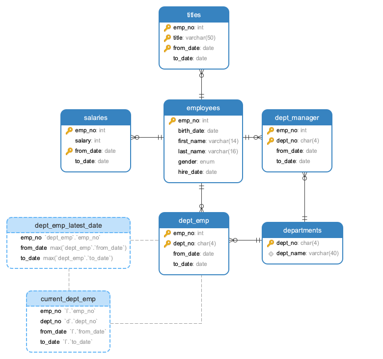

# mysql 5.7 视图原理 

[mysql优化官方文档](https://dev.mysql.com/doc/refman/5.7/en/optimization.html)  

## 视图介绍  
MySQL从5.0.1版本开始提供视图功能。  

`视图`（`view`）是一种虚拟存在的表，是一个逻辑表，本身并不包含数据。作为一个select语句保存在数据字典中的。  
通过视图，可以展现基表的部分数据；视图数据来自定义视图的查询中使用的表，使用视图动态生成。  
`基表`：用来创建视图的表叫做基表 `base table` 


Q：为什么要使用视图？  

A：因为视图的诸多优点，如下  

- 1）简单：使用视图的用户完全不需要关心后面对应的表的结构、关联条件和筛选条件，对用户来说已经是过滤好的复合条件的结果集。

- 2）安全：使用视图的用户只能访问他们被允许查询的结果集，对表的权限管理并不能限制到某个行某个列，但是通过视图就可以简单的实现。

- 3）数据独立：一旦视图的结构确定了，可以屏蔽表结构变化对用户的影响，源表增加列对视图没有影响；源表修改列名，则可以通过修改视图来解决，不会造成对访问者的影响。


## 视图的操作  

- ### 测试数据准备  

`https://github.com/datacharmer/test_db` 测试数据来源， 导入`employees.sql`数据  

关系如下: 

<br>
<div align=center>
    </img>  
</div>
<br>

其中表格和视图如下:  
```shell
mysql> show tables;
+----------------------+
| Tables_in_employees  |
+----------------------+
| current_dept_emp     |
| departments          |
| dept_emp             |
| dept_emp_latest_date |
| dept_manager         |
| employees            |
| salaries             |
| titles               |
+----------------------+
8 rows in set (0.00 sec)

mysql> show table status where comment='view';
+----------------------+--------+---------+------------+------+----------------+-------------+-----------------+--------------+-----------+----------------+-------------+-------------+------------+-----------+----------+----------------+---------+
| Name                 | Engine | Version | Row_format | Rows | Avg_row_length | Data_length | Max_data_length | Index_length | Data_free | Auto_increment | Create_time | Update_time | Check_time | Collation | Checksum | Create_options | Comment |
+----------------------+--------+---------+------------+------+----------------+-------------+-----------------+--------------+-----------+----------------+-------------+-------------+------------+-----------+----------+----------------+---------+
| current_dept_emp     | NULL   |    NULL | NULL       | NULL |           NULL |        NULL |            NULL |         NULL |      NULL |           NULL | NULL        | NULL        | NULL       | NULL      |     NULL | NULL           | VIEW    |
| dept_emp_latest_date | NULL   |    NULL | NULL       | NULL |           NULL |        NULL |            NULL |         NULL |      NULL |           NULL | NULL        | NULL        | NULL       | NULL      |     NULL | NULL           | VIEW    |
+----------------------+--------+---------+------------+------+----------------+-------------+-----------------+--------------+-----------+----------------+-------------+-------------+------------+-----------+----------+----------------+---------+
2 rows in set (0.01 sec)
```


导入`load_employees.dump`近30万条数据  

- ### 创建视图  

```shell
CREATE [OR REPLACE] [ALGORITHM = {UNDEFINED | MERGE | TEMPTABLE}]
    VIEW view_name [(column_list)]
    AS select_statement
   [WITH [CASCADED | LOCAL] CHECK OPTION]
```  

单表视图示例-同一天入职的  
```shell
create view count_emp_hire (聘用日期, 员工个数) 
as (select hire_date, count(*) from employees GROUP BY hire_date ORDER BY hire_date) 
```

数据示例: 
```shell
mysql> select * from count_emp_hire limit 2;
+--------------+--------------+
| 聘用日期     | 员工个数     |
+--------------+--------------+
| 1985-01-01   |            9 |
| 1985-01-14   |            1 |
+--------------+--------------+
2 rows in set (3.89 sec)
```


## 视图性能分析  
- ### explain 

```shell
mysql> EXPLAIN select * from count_emp_hire limit 2;
+----+-------------+------------+------------+------+---------------+------+---------+------+--------+----------+---------------------------------+
| id | select_type | table      | partitions | type | possible_keys | key  | key_len | ref  | rows   | filtered | Extra                           |
+----+-------------+------------+------------+------+---------------+------+---------+------+--------+----------+---------------------------------+
|  1 | PRIMARY     | <derived2> | NULL       | ALL  | NULL          | NULL | NULL    | NULL | 299335 |   100.00 | NULL                            |
|  2 | DERIVED     | employees  | NULL       | ALL  | NULL          | NULL | NULL    | NULL | 299335 |   100.00 | Using temporary; Using filesort |
+----+-------------+------------+------------+------+---------------+------+---------+------+--------+----------+---------------------------------+
2 rows in set, 1 warning (0.01 sec)
```

通过分析，说明每次视图都会全表扫描，并使用了临时表和文件排序，那视图仅仅是`sql语句别名`，最终还是要查看视图对应的语句 :sob:   


