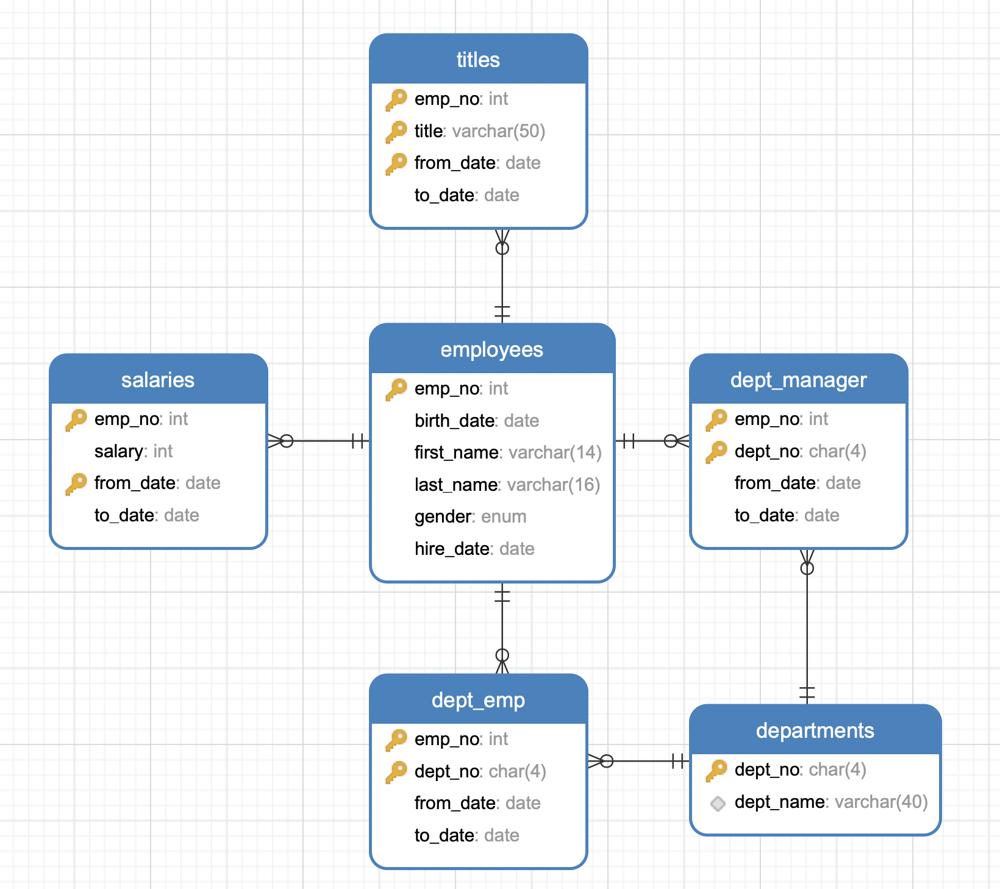

- # mysql8 性能优化

- [ubuntu基础环境搭建](#ubuntu基础环境搭建)
  - [本地安装](#本地安装)
  - [docker](#docker)
    - [数据准备](#数据准备)
- [慢查询发现与分析](#慢查询发现与分析)
- [数据库调优原理](#数据库调优原理)
  - [explain与耗时分析](#explain与耗时分析)
  - [load data 语句优化](#load-data-语句优化)
  - [B-Tree与B+Tree](#b-tree与btree)
  - [MyISAM与InnoDB](#myisam与innodb)
- [特定语句的原理与调优](#特定语句的原理与调优)
  - [JOIN](#join)
- [内存占用分析](#内存占用分析)
    - [统计分析](#统计分析)
    - [grafana  监测](#grafana--监测)
    - [mysql tabview](#mysql-tabview)
    - [mysql 基本信息](#mysql-基本信息)
    - [perf 监测mysql 内存](#perf-监测mysql-内存)


## ubuntu基础环境搭建
### 本地安装
下载apt源

`wget https://dev.mysql.com/get/mysql-apt-config_0.8.24-1_all.deb`  

```sh
sudo dpkg -i mysql-apt-config_0.8.24-1_all.deb
```

> 直接选择OK  

```sh
sudo apt update
sudo apt-get install mysql-server
```

安装过程中会要求输入`root`密码, 这里输入`root`  
另外选择密码加密方式，选择8.0的加密方式，而不是5.x  

`mysql -uroot -p`, 输入密码进入说明已经安装成功了。  


查看版本
```sh
mysql> select version();
+-----------+
| version() |
+-----------+
| 8.0.31    |
+-----------+
1 row in set (0.00 sec)
```

root远程连接
```sh
# 查看用户权限
mysql> select User,authentication_string,Host from mysql.user;
+------------------+------------------------------------------------------------------------+-----------+
| User             | authentication_string                                                  | Host      |
+------------------+------------------------------------------------------------------------+-----------+
| mysql.infoschema | $A$005$THISISACOMBINATIONOFINVALIDSALTANDPASSWORDTHATMUSTNEVERBRBEUSED | localhost |
| mysql.session    | $A$005$THISISACOMBINATIONOFINVALIDSALTANDPASSWORDTHATMUSTNEVERBRBEUSED | localhost |
| mysql.sys        | $A$005$THISISACOMBINATIONOFINVALIDSALTANDPASSWORDTHATMUSTNEVERBRBEUSED | localhost |
| root             | $A$005$rZ/PN\<N,6,IPG	&#O6CytVBkox0f0a1O/txLEEmCn6UuOGuj3U1mo/zu6P9 | localhost |
+------------------+------------------------------------------------------------------------+-----------+
4 rows in set (0.00 sec)

# 修改用户密码
alter user 'root'@'localhost' identified with mysql_native_password by 'root';

# 创建用户
create user 'root'@'%' identified by 'root'; 

# 授权
grant all privileges on *.* to 'root'@'%' with grant option;
flush privileges; 
```


身份验证插件
```sh
mysql> select user,host,plugin from mysql.user;    
+------------------+-----------+-----------------------+
| user             | host      | plugin                |
+------------------+-----------+-----------------------+
| root             | %         | caching_sha2_password |
| mysql.infoschema | localhost | caching_sha2_password |
| mysql.session    | localhost | caching_sha2_password |
| mysql.sys        | localhost | caching_sha2_password |
| root             | localhost | mysql_native_password |
+------------------+-----------+-----------------------+
5 rows in set (0.00 sec)
```

### docker  

#### 数据准备  

测试数据:  https://github.com/ymm135/mysql-test-db    

```sql
CREATE TABLE employees (
    emp_no      INT             NOT NULL,
    birth_date  DATE            NOT NULL,
    first_name  VARCHAR(14)     NOT NULL,
    last_name   VARCHAR(16)     NOT NULL,
    gender      ENUM ('M','F')  NOT NULL,    
    hire_date   DATE            NOT NULL,
    PRIMARY KEY (emp_no)
);

CREATE TABLE departments (
    dept_no     CHAR(4)         NOT NULL,
    dept_name   VARCHAR(40)     NOT NULL,
    PRIMARY KEY (dept_no),
    UNIQUE  KEY (dept_name)
);

CREATE TABLE dept_manager (
   emp_no       INT             NOT NULL,
   dept_no      CHAR(4)         NOT NULL,
   from_date    DATE            NOT NULL,
   to_date      DATE            NOT NULL,
   FOREIGN KEY (emp_no)  REFERENCES employees (emp_no)    ON DELETE CASCADE,
   FOREIGN KEY (dept_no) REFERENCES departments (dept_no) ON DELETE CASCADE,
   PRIMARY KEY (emp_no,dept_no)
); 

CREATE TABLE dept_emp (
    emp_no      INT             NOT NULL,
    dept_no     CHAR(4)         NOT NULL,
    from_date   DATE            NOT NULL,
    to_date     DATE            NOT NULL,
    FOREIGN KEY (emp_no)  REFERENCES employees   (emp_no)  ON DELETE CASCADE,
    FOREIGN KEY (dept_no) REFERENCES departments (dept_no) ON DELETE CASCADE,
    PRIMARY KEY (emp_no,dept_no)
);

CREATE TABLE titles (
    emp_no      INT             NOT NULL,
    title       VARCHAR(50)     NOT NULL,
    from_date   DATE            NOT NULL,
    to_date     DATE,
    FOREIGN KEY (emp_no) REFERENCES employees (emp_no) ON DELETE CASCADE,
    PRIMARY KEY (emp_no,title, from_date)
);

CREATE TABLE salaries (
    emp_no      INT             NOT NULL,
    salary      INT             NOT NULL,
    from_date   DATE            NOT NULL,
    to_date     DATE            NOT NULL,
    FOREIGN KEY (emp_no) REFERENCES employees (emp_no) ON DELETE CASCADE,
    PRIMARY KEY (emp_no, from_date)
);
```

关系图

<br>
<div align=center>
    </img>  
</div>
<br>

## 慢查询发现与分析

查看慢查询状态
```sql
mysql> show variables like 'slow_query_log'; 
+----------------+-------+
| Variable_name  | Value |
+----------------+-------+
| slow_query_log | OFF   |
+----------------+-------+
1 row in set (0.25 sec)
```

临时开启

```sql
SET GLOBAL slow_query_log = 'ON';
SET GLOBAL slow_query_log_file = '/var/log/mysql/mysql-slow.log';
SET GLOBAL log_queries_not_using_indexes = 'ON';
SET SESSION long_query_time = 1;
SET SESSION min_examined_row_limit = 100;
```

结果查询
```sql
mysql> show variables like '%quer%';
+----------------------------------------+-------------------------------+
| Variable_name                          | Value                         |
+----------------------------------------+-------------------------------+
| binlog_rows_query_log_events           | OFF                           |
| ft_query_expansion_limit               | 20                            |
| have_query_cache                       | NO                            |
| log_queries_not_using_indexes          | ON                            |
| log_throttle_queries_not_using_indexes | 0                             |
| long_query_time                        | 2.000000                      |
| query_alloc_block_size                 | 8192                          |
| query_prealloc_size                    | 8192                          |
| slow_query_log                         | ON                            |
| slow_query_log_file                    | /var/log/mysql/mysql-slow.log |
+----------------------------------------+-------------------------------+
```

永久开启


## 数据库调优原理
### explain与耗时分析
打开耗时统计
```sql
set profiling=1;
```

查看结果
```sql
mysql> select @@profiling;
+-------------+
| @@profiling |
+-------------+
|           1 |
+-------------+
```

查看sql耗时
```sql
mysql> show profiles; 
+----------+------------+------------------------------+
| Query_ID | Duration   | Query                        |
+----------+------------+------------------------------+
|        1 | 0.27903625 | select * from employees      |
|        2 | 0.10113750 | select emp_no from employees |
+----------+------------+------------------------------+
```

explain分析
```sql
mysql> explain select * from employees ;
+----+-------------+-----------+------------+------+---------------+------+---------+------+--------+----------+-------+
| id | select_type | table     | partitions | type | possible_keys | key  | key_len | ref  | rows   | filtered | Extra |
+----+-------------+-----------+------------+------+---------------+------+---------+------+--------+----------+-------+
|  1 | SIMPLE      | employees | NULL       | ALL  | NULL          | NULL | NULL    | NULL | 292025 |   100.00 | NULL  |
+----+-------------+-----------+------------+------+---------------+------+---------+------+--------+----------+-------+
1 row in set, 1 warning (0.01 sec)

mysql> explain select emp_no from employees;
+----+-------------+-----------+------------+-------+---------------+---------+---------+------+--------+----------+-------------+
| id | select_type | table     | partitions | type  | possible_keys | key     | key_len | ref  | rows   | filtered | Extra       |
+----+-------------+-----------+------------+-------+---------------+---------+---------+------+--------+----------+-------------+
|  1 | SIMPLE      | employees | NULL       | index | NULL          | PRIMARY | 4       | NULL | 292025 |   100.00 | Using index |
+----+-------------+-----------+------------+-------+---------------+---------+---------+------+--------+----------+-------------+
1 row in set, 1 warning (0.00 sec)
```

| 字段 | 含义  | 说明 | 
| ---- | ---- | ---- |
| id | select查询的序列号，包含一组数字，表示查询中执行select子句或操作表的顺序 |  | 
| select_type | 查询类型 或者是 其他操作类型 | `SIMPLE`简单查询,`PRIMARY`主查询,`SUBQUERY`子查询，`UNION`连接查询 |
| table | 正在访问哪个表 |  | 
| partitions | 匹配的分区 | | 
| type| 访问的类型 | NULL > system > const > eq_ref > ref > ref_or_null > index_merge > range > index > ALL | 
| possible_keys| 显示可能应用在这张表中的索引，一个或多个，但不一定实际使用到 | | 
| key | 实际使用到的索引，如果为NULL，则没有使用索引 | 
| key_len | 表示索引中使用的字节数，可通过该列计算查询中使用的索引的长度 | | 
| ref | 显示索引的哪一列被使用了，如果可能的话，是一个常数，哪些列或常量被用于查找索引列上的值 | | 
| rows | 根据表统计信息及索引选用情况，大致估算出找到所需的记录所需读取的行数
| filtered | 查询的表行占表的百分比 | | 
| Extra | 包含不适合在其它列中显示但十分重要的额外信息| | 

### load data 语句优化

> LOAD DATA INFILE语句用于高速地从一个文本文件中读取行，并写入一个表中。文件名称必须为一个文字字符串。
LOAD DATA INFILE 是 SELECT ... INTO OUTFILE 的相对语句。把表的数据备份到文件使用SELECT ... INTO OUTFILE，从备份文件恢复表数据，使用 LOAD DATA INFILE。  

测试:
```sh
# 创建表格
create table testLoadData(
 id bigint(20) not null auto_increment,
 username char(10) not null,
 age tinyint(3) UNSIGNED not null,
 description  text not null,
 primary key(id),
 unique key(username)
)engine=myisam default charset=utf8;
```

> 注意：charset为utf8,下面在创建txt时，字符编码应该也为utf8，不然导入数据的中文会出现乱码。  

编辑数据`loaddata.txt`:
```sh
"李明","20","相貌好，人品好！哈哈"
"黎明","21","人好心善！哈哈"
"李静","20","相貌平常！哈哈"
"赵明","24","很强"
"赵敏","34","XXXXX"
"赵鑫","52","***%*￥*￥*￥*￥"
"钱鑫","45","都是钱啊。。。"
"几米","12","棒棒哒小说家"
"李毅","21","小学同学呢"
"皮皮","52","乖巧的孩子一个"
"周州","96","非常英俊"
"李浩","10","不知道说什么好"
"韦唯","20","美美的的姑娘"
"郑伊","20","的确是好个好人"
"周丽","10","学习很好"
"马青","60","大家的评价很高啊"
"华克","100","威武的不行了"
"邹平邑","63","吃货一个"
"喆力","15","想到的都是吃"
```

导入数据:
```sh
LOAD DATA local INFILE '/root/loaddata.txt' IGNORE INTO TABLE testLoadData FIELDS TERMINATED BY ',' ENCLOSED BY '"' LINES TERMINATED BY '\n' ignore 1 lines (username, age, description);
```

查询数量:
```sh
mysql> select count(*) from testLoadData;
+----------+
| count(*) |
+----------+
|       18 |
+----------+
1 row in set (0.00 sec)
```

> 虽然mysql写数据不会立刻写入到磁盘，但是需要注意磁盘的IO占用及磁盘类型(机械或固态，是否有READ卡)  

### B-Tree与B+Tree
一般说MySQL的索引，都清楚其索引主要以B+树为主，此外还有Hash、RTree、FullText。  

mysql innodb b+树索引  


<br>
<div align=center>
    </img>  
</div>
<br>

> 传统数据库使用 B+树方式存储.B+树 ==> 排序树（索引树）==> 每个节点存储文件块。 每个`磁盘块`存储多个数据。多个`磁盘块`构成 B+树。连续读写能力强,随机读写能力弱。  

### MyISAM与InnoDB

## 特定语句的原理与调优
### JOIN
```sql
select emp.emp_no,emp.first_name,emp.last_name 
from employees as emp
left join dept_emp on emp.emp_no = dept_emp.emp_no
where dept_emp.dept_no='d005'
limit 10,10

+--------+------------+-----------+
| emp_no | first_name | last_name |
+--------+------------+-----------+
|  10027 | Divier     | Reistad   |
|  10028 | Domenick   | Tempesti  |
|  10031 | Karsten    | Joslin    |
|  10037 | Pradeep    | Makrucki  |
|  10040 | Weiyi      | Meriste   |
|  10043 | Yishay     | Tzvieli   |
|  10048 | Florian    | Syrotiuk  |
|  10056 | Brendon    | Bernini   |
|  10057 | Ebbe       | Callaway  |
|  10062 | Anoosh     | Peyn      |
+--------+------------+-----------+
```

explain
```sql
mysql> explain select emp.emp_no,emp.first_name,emp.last_name 
    -> from employees as emp
    -> left join dept_emp on emp.emp_no = dept_emp.emp_no
    -> where dept_emp.dept_no='d005'
    -> limit 10,10;
+----+-------------+----------+------------+--------+-----------------+---------+---------+----------------------+--------+----------+--------------------------+
| id | select_type | table    | partitions | type   | possible_keys   | key     | key_len | ref                  | rows   | filtered | Extra                    |
+----+-------------+----------+------------+--------+-----------------+---------+---------+----------------------+--------+----------+--------------------------+
|  1 | SIMPLE      | dept_emp | NULL       | ref    | PRIMARY,dept_no | dept_no | 12      | const                | 148054 |   100.00 | Using where; Using index |
|  1 | SIMPLE      | emp      | NULL       | eq_ref | PRIMARY         | PRIMARY | 4       | test.dept_emp.emp_no |      1 |   100.00 | NULL                     |
+----+-------------+----------+------------+--------+-----------------+---------+---------+----------------------+--------+----------+--------------------------+
```


## 内存占用分析  

首先分析进程:  
```sh
ps -ef | grep mysql
mysql     1656     1  2 Aug19 ?        05:28:25 /usr/sbin/mysqld --daemonize --pid-file=/var/run/mysqld/mysqld.pid

top -p 1656
top - 19:14:55 up 10 days,  2:24,  5 users,  load average: 0.03, 0.09, 0.12
Tasks:   1 total,   0 running,   1 sleeping,   0 stopped,   0 zombie
%Cpu(s):  0.4 us,  0.2 sy,  0.0 ni, 99.3 id,  0.1 wa,  0.0 hi,  0.0 si,  0.0 st
KiB Mem : 15234328 total,  9257480 free,  3519424 used,  2457424 buff/cache
KiB Swap:  7733244 total,  7733244 free,        0 used. 11363192 avail Mem 

  PID USER      PR  NI    VIRT    RES    SHR S  %CPU %MEM     TIME+ COMMAND                                                           
 1656 mysql     20   0 5946756   1.1g  10904 S   0.0  7.3 328:25.64 mysqld 

# 查看进程信息
cat /proc/1656/status 
Name:   mysqld
Umask:  0026
State:  S (sleeping)
Tgid:   1656
Ngid:   0
Pid:    1656
PPid:   1
TracerPid:      0
Uid:    997     997     997     997
Gid:    1000    1000    1000    1000
FDSize: 256
Groups: 1000 
VmPeak:  5946756 kB
VmSize:  5946756 kB
VmLck:         0 kB
VmPin:         0 kB
VmHWM:   1104852 kB
VmRSS:   1104852 kB       # 占用的真实内存  
RssAnon:         1093948 kB
RssFile:           10904 kB
RssShmem:              0 kB
VmData:  5866980 kB
VmStk:       132 kB
VmExe:     25184 kB
VmLib:      5180 kB
VmPTE:      2496 kB
VmSwap:        0 kB
Threads:        72

```

占用内存是:`1.1g`  

https://dev.mysql.com/doc/refman/8.0/en/memory-use.html  

> 需要统计各个组件占用的内存，然后汇总总大小，是否符合预期.  


查看内存,整体使用内存，并只展示2级，2级以下已经合并:
```sh
use sys;

SELECT SUBSTRING_INDEX(event_name,'/',2) AS code_area,
   format_bytes(SUM(current_alloc)) AS current_alloc
FROM sys.x$memory_global_by_current_bytes
GROUP BY SUBSTRING_INDEX(event_name,'/',2)
ORDER BY SUM(current_alloc) DESC

+---------------------------+---------------+
| code_area                 | current_alloc |
+---------------------------+---------------+
| memory/performance_schema | 154.17 MiB    |
| memory/sql                | 3.18 MiB      |
| memory/innodb             | 412.50 KiB    |
| memory/memory             | 174.01 KiB    |
| memory/mysys              | 86.41 KiB     |
| memory/myisam             | 39.46 KiB     |
+---------------------------+---------------+
6 rows in set (0.00 sec)

SELECT SUBSTRING_INDEX(event_name,'/',2) AS code_area,
   format_bytes(SUM(current_alloc)) AS current_alloc
FROM sys.memory_global_by_current_bytes
GROUP BY SUBSTRING_INDEX(event_name,'/',2)
ORDER BY SUM(current_alloc) DESC;

+---------------------------+---------------+
| code_area                 | current_alloc |
+---------------------------+---------------+
| memory/sql                | 8.73 KiB      |
| memory/performance_schema | 7.16 KiB      |
| memory/innodb             | 4.03 KiB      |
| memory/myisam             | 1.10 KiB      |
| memory/vio                | 1000 bytes    |
| memory/mysys              | 911 bytes     |
| memory/blackhole          | 512 bytes     |
| memory/csv                | 512 bytes     |
| memory/memory             | 218 bytes     |
+---------------------------+---------------+
9 rows in set (0.00 sec)
```

buffer_pool占用比:
```sh
SELECT CONCAT(FORMAT(A.num * 100.0 / B.num,2),'%') `BufferPool %` FROM
    (SELECT variable_value num FROM performance_schema.global_status
    WHERE variable_name = 'Innodb_buffer_pool_pages_data') A,
    (SELECT variable_value num FROM performance_schema.global_status
    WHERE variable_name = 'Innodb_buffer_pool_pages_total') B;

+--------------+
| BufferPool % |
+--------------+
| 14.43%       |
+--------------+
1 row in set (0.00 sec)
```

```sh
mysql> show global variables like '%buffer%';
+-------------------------------------+----------------+
| Variable_name                       | Value          |
+-------------------------------------+----------------+
| bulk_insert_buffer_size             | 8388608        |
| innodb_buffer_pool_chunk_size       | 134217728      |
| innodb_buffer_pool_dump_at_shutdown | ON             |
| innodb_buffer_pool_dump_now         | OFF            |
| innodb_buffer_pool_dump_pct         | 25             |
| innodb_buffer_pool_filename         | ib_buffer_pool |
| innodb_buffer_pool_instances        | 8              |
| innodb_buffer_pool_load_abort       | OFF            |
| innodb_buffer_pool_load_at_startup  | ON             |
| innodb_buffer_pool_load_now         | OFF            |
| innodb_buffer_pool_size             | 3221225472     |
| innodb_change_buffer_max_size       | 25             |
| innodb_change_buffering             | all            |
| innodb_log_buffer_size              | 16777216       |
| innodb_sort_buffer_size             | 1048576        |
| join_buffer_size                    | 262144         |
| key_buffer_size                     | 8388608        |
| myisam_sort_buffer_size             | 8388608        |
| net_buffer_length                   | 16384          |
| preload_buffer_size                 | 32768          |
| read_buffer_size                    | 131072         |
| read_rnd_buffer_size                | 262144         |
| sort_buffer_size                    | 262144         |
| sql_buffer_result                   | OFF            |
+-------------------------------------+----------------+
24 rows in set (0.00 sec)
```

占用大小为:  `3221225472 * 0.14 = 430M` 左右  

查看引擎的状态:`SHOW ENGINE INNODB STATUS;`   

```sh
SELECT 
    'innodb_buffer_pool_size' AS `Parameter`,
    ROUND((@@innodb_buffer_pool_size / 1024 / 1024), 2) AS `Value in MB`
UNION
SELECT 
    'query_cache_size',
    ROUND((@@query_cache_size / 1024 / 1024), 2) AS `Value in MB`
UNION
SELECT 
    'thread_cache_size',
    ROUND((@@thread_cache_size * 16 * 1024) / 1024 / 1024, 2) -- 估算，基于每个线程大约占用 16KB
UNION
SELECT 
    'table_open_cache',
    ROUND((@@table_open_cache * 2 * 1024) / 1024 / 1024, 2) -- 估算，基于每个表打开占用大约 2KB
UNION
SELECT 
    'innodb_log_buffer_size',
    ROUND((@@innodb_log_buffer_size / 1024 / 1024), 2)
UNION
SELECT 
    'sort_buffer_size',
    ROUND((@@sort_buffer_size / 1024 / 1024), 2)
UNION
SELECT 
    'read_buffer_size',
    ROUND((@@read_buffer_size / 1024 / 1024), 2)
UNION
SELECT 
    'read_rnd_buffer_size',
    ROUND((@@read_rnd_buffer_size / 1024 / 1024), 2)
UNION
SELECT 
    'key_buffer_size',
    ROUND((@@key_buffer_size / 1024 / 1024), 2)
UNION
SELECT 
    'read_buffer_size',
    ROUND((@@read_buffer_size / 1024 / 1024), 2);

```

统计各个模块的占用:
```sh
+-------------------------+-------------+
| Parameter               | Value in MB |
+-------------------------+-------------+
| innodb_buffer_pool_size |     3072.00 |
| query_cache_size        |        1.00 |
| thread_cache_size       |        0.44 |
| table_open_cache        |        2.87 |
| innodb_log_buffer_size  |       16.00 |
| sort_buffer_size        |        0.25 |
| read_buffer_size        |        0.13 |
| read_rnd_buffer_size    |        0.25 |
+-------------------------+-------------+
```


开启分析视图:`SHOW VARIABLES LIKE 'performance_schema';`  


```sh
memory_summary_by_account_by_event_name：账号的内存监控表
memory_summary_by_host_by_event_name：主机的内存监控表
memory_summary_by_thread_by_event_name：线程的内存监控表
memory_summary_by_user_by_event_name：用户的内存监控表
memory_summary_global_by_event_name：全局的内存监控表

```


`memory_summary_by_host_by_event_name：主机的内存监控表`
```sh
select EVENT_NAME,SUM_NUMBER_OF_BYTES_ALLOC/1024/1024 as `total(M)`, CURRENT_NUMBER_OF_BYTES_USED/1024/1024 as `used(M)` from memory_summary_by_host_by_event_name where CURRENT_NUMBER_OF_BYTES_USED > 1024*1024;
```
结果:
```sh
+-------------------+-------------+------------+
| EVENT_NAME        | total(M)    | used(M)    |
+-------------------+-------------+------------+
| memory/innodb/std | 57.42578888 | 4.07171631 |
+-------------------+-------------+------------+
```


`memory_summary_global_by_event_name：全局的内存监控表`
```sh
use performance_schema;

select EVENT_NAME,SUM_NUMBER_OF_BYTES_ALLOC/1024/1024 as `total(M)`, CURRENT_NUMBER_OF_BYTES_USED/1024/1024 as `used(M)` from memory_summary_global_by_event_name where CURRENT_NUMBER_OF_BYTES_USED > 1024*1024;
```

结果看山去没有异常
```sh
+------------------------------------------------------------------------------+-------------+-------------+
| EVENT_NAME                                                                   | total(M)    | used(M)     |
+------------------------------------------------------------------------------+-------------+-------------+
| memory/performance_schema/mutex_instances                                    |  1.37500000 |  1.37500000 |
| memory/performance_schema/file_instances                                     |  2.75000000 |  2.75000000 |
| memory/performance_schema/events_waits_summary_by_account_by_event_name      |  1.69531250 |  1.69531250 |
| memory/performance_schema/events_statements_summary_by_account_by_event_name |  4.33496094 |  4.33496094 |
| memory/performance_schema/memory_summary_by_account_by_event_name            |  2.81250000 |  2.81250000 |
```


#### 统计分析

```sh
select TABLE_NAME,sys.format_bytes(SUM(data_size)) AS data
from information_schema.innodb_buffer_page
where TABLE_NAME LIKE '%smp%'
GROUP BY TABLE_NAME
```
> smp 是表名称  

所以大小占用:  
```sh
+-------------------------------------------+------------+
| TABLE_NAME                                | data       |
+-------------------------------------------+------------+
| `smp`.`audit_ip_mac_bind`                 | 0 bytes    |
| `smp`.`audit_network_attack`              | 0 bytes    |
| `smp`.`t_equip_code`                      | 297 bytes  |
| `smp`.`t_forward_child_task`              | 448.41 MiB |
| `smp`.`t_forward_task`                    | 777.20 KiB |
| `smp`.`t_func_list`                       | 5.82 KiB   |
| `smp`.`t_manufacturer`                    | 38 bytes   |
| `smp`.`t_safe_baseline`                   | 0 bytes    |
| `smp`.`t_safe_event_define`               | 186 bytes  |
```

> t_forward_child_task 占用索引448M  

01.innodb_buffer_stats_by_schema,x$innodb_buffer_stats_by_schema
按照schema分组的 InnoDB buffer pool统计信息，默认按照分配的buffer size大小降序排序--allocated字段。数据来源：information_schema.innodb_buffer_page 

```sql
SELECT IF(LOCATE('.', ibp.table_name) = 0, 'InnoDB System', REPLACE(SUBSTRING_INDEX(ibp.table_name, '.', 1), '`', '')) AS object_schema,
  sys.format_bytes(SUM(IF(ibp.compressed_size = 0, 16384, compressed_size))) AS allocated,
  sys.format_bytes(SUM(ibp.data_size)) AS data,
  COUNT(ibp.page_number) AS pages,
  COUNT(IF(ibp.is_hashed = 'YES', 1, NULL)) AS pages_hashed,
  COUNT(IF(ibp.is_old = 'YES', 1, NULL)) AS pages_old,
  ROUND(SUM(ibp.number_records)/COUNT(DISTINCT ibp.index_name)) AS rows_cached
FROM information_schema.innodb_buffer_page ibp
WHERE table_name IS NOT NULL
GROUP BY object_schema
ORDER BY SUM(IF(ibp.compressed_size = 0, 16384, compressed_size)) DESC;
```

```sh
+---------------+------------+------------+-------+--------------+-----------+-------------+
| object_schema | allocated  | data       | pages | pages_hashed | pages_old | rows_cached |
+---------------+------------+------------+-------+--------------+-----------+-------------+
| smp           | 423.09 MiB | 385.03 MiB | 27078 |          387 |      9291 |      108112 |
| InnoDB System | 14.42 MiB  | 13.10 MiB  |   923 |            1 |        57 |       12561 |
| mysql         | 832.00 KiB | 365.78 KiB |    52 |            9 |        52 |        2033 |
+---------------+------------+------------+-------+--------------+-----------+-------------+
```

> object_schema：schema级别对象的名称，如果该表属于Innodb存储引擎，则该字段显示为InnoDB System，如果是其他引擎，则该字段显示为每个schema name.
allocated：当前已分配给schema的总内存字节数
data：当前已分配给schema的数据部分使用的内存字节总数
pages：当前已分配给schema内存总页数
pages_hashed：当前已分配给schema的自适应hash索引页总数
pages_old：当前已分配给schema的旧页总数（位于LRU列表中的旧块子列表中的页数）
rows_cached：buffer pool中为schema缓冲的总数据行数


02.innodb_buffer_stats_by_table,x$innodb_buffer_stats_by_table
按照schema和表分组的 InnoDB buffer pool 统计信息，与sys.innodb_buffer_stats_by_schema视图类似，但是本视图是按照schema name和table name分组。数据来源：information_schema.innodb_buffer_page

```sql
SELECT IF(LOCATE('.', ibp.table_name) = 0, 'InnoDB System', REPLACE(SUBSTRING_INDEX(ibp.table_name, '.', 1), '`', '')) AS object_schema,
  REPLACE(SUBSTRING_INDEX(ibp.table_name, '.', -1), '`', '') AS object_name,
  sys.format_bytes(SUM(IF(ibp.compressed_size = 0, 16384, compressed_size))) AS allocated,
  sys.format_bytes(SUM(ibp.data_size)) AS data,
  COUNT(ibp.page_number) AS pages,
  COUNT(IF(ibp.is_hashed = 'YES', 1, NULL)) AS pages_hashed,
  COUNT(IF(ibp.is_old = 'YES', 1, NULL)) AS pages_old,
  ROUND(SUM(ibp.number_records)/COUNT(DISTINCT ibp.index_name)) AS rows_cached
FROM information_schema.innodb_buffer_page ibp
WHERE table_name IS NOT NULL
GROUP BY object_schema, object_name
ORDER BY SUM(IF(ibp.compressed_size = 0, 16384, compressed_size)) DESC;
```

```sh
+---------------+-----------------------------------+------------+------------+-------+--------------+-----------+-------------+
| object_schema | object_name                       | allocated  | data       | pages | pages_hashed | pages_old | rows_cached |
+---------------+-----------------------------------+------------+------------+-------+--------------+-----------+-------------+
| smp           | t_forward_child_task              | 409.52 MiB | 377.16 MiB | 26209 |           17 |      9120 |     5163169 |
| InnoDB System | SYS_TABLES                        | 35.22 MiB  | 32.44 MiB  |  2254 |            0 |        36 |      108367 |
| smp           | t_equipment                       | 8.42 MiB   | 5.81 MiB   |   539 |          289 |       439 |        8042 |
| smp           | sys_opera_log                     | 800.00 KiB | 653.43 KiB |    50 |           39 |        16 |        1619 |
| smp           | t_forward_task                    | 736.00 KiB | 653.42 KiB |    46 |            0 |        17 |        3771 |
| smp           | sys_casbin_rule                   | 544.00 KiB | 335.26 KiB |    34 |           13 |        11 |        2094 |
| mysql         | help_topic                        | 224.00 KiB | 151.53 KiB |    14 |            0 |        14 |         353 |
```


object_name：表级别对象名称，通常是表名
其他字段含义与sys.innodb_buffer_stats_by_schema视图字段含义相同，详见 innodb_buffer_stats_by_schema,x$innodb_buffer_stats_by_schema视图解释部分。但这些字段是按照object_name表级别统计的


03.memory_by_host_by_current_bytes,x$memory_by_host_by_current_bytes
按照客户端主机名分组的内存使用统计信息，默认情况下按照当前内存使用量降序排序，数据来源：performance_schema.memory_summary_by_host_by_event_name

```sql
select * from performance_schema.memory_by_host_by_current_bytes limit 3;
```

详细的sql语句:
```sh
select * from sys.x$memory_by_host_by_current_bytes;
select * from sys.x$memory_by_thread_by_current_bytes;
select * from sys.x$memory_by_user_by_current_bytes;
select * from sys.x$memory_global_by_current_bytes;
select * from sys.x$memory_global_total;
select * from performance_schema.memory_summary_by_account_by_event_name;
select * from performance_schema.memory_summary_by_host_by_event_name;
select * from performance_schema.memory_summary_by_thread_by_event_name;
select * from performance_schema.memory_summary_by_user_by_event_name;
select * from performance_schema.memory_summary_global_by_event_name;
select event_name,
       current_alloc
from sys.memory_global_by_current_bytes
where event_name like '%innodb%';
select event_name,current_alloc from sys.memory_global_by_current_bytes limit 5;
select m.thread_id tid,
       USER,
       esc.DIGEST_TEXT,
       total_allocated
FROM sys.memory_by_thread_by_current_bytes m,
     performance_schema.events_statements_current esc
WHERE m.`thread_id` = esc.THREAD_ID \G
```

#### grafana  监测  
https://grafana.com/grafana/dashboards/13266-mysql-memory-usage-details-designed-for-pmm2/  

<br>
<div align=center>
</img>  
</div>
<br>


#### mysql tabview  
https://dev.mysql.com/doc/mysql-monitor/8.0/en/mem-reports-memory-usage-ref.html  


performance-schema-instrument='memory/%=ON'

#### mysql 基本信息

`主机的当前连接数`,`主机的连接总数`,`当前为主机分配的内存量`  
```sh
select * from host_summary;
+-----------+------------+-------------------+-----------------------+-------------+----------+-----------------+---------------------+-------------------+--------------+----------------+------------------------+
| host      | statements | statement_latency | statement_avg_latency | table_scans | file_ios | file_io_latency | current_connections | total_connections | unique_users | current_memory | total_memory_allocated |
+-----------+------------+-------------------+-----------------------+-------------+----------+-----------------+---------------------+-------------------+--------------+----------------+------------------------+
| localhost |       3183 | 107.78 ms         | 33.86 us              |           5 |     1229 | 10.00 ms        |                   2 |                 2 |            1 | 2.79 MiB       | 31.85 MiB              |
+-----------+------------+-------------------+-----------------------+-------------+----------+-----------------+---------------------+-------------------+--------------+----------------+------------------------+
```

mysql 中文文档  
https://www.docs4dev.com/docs/zh/mysql/5.7/reference/sys-memory-global-by-current-bytes.html  


#### perf 监测mysql 内存  
