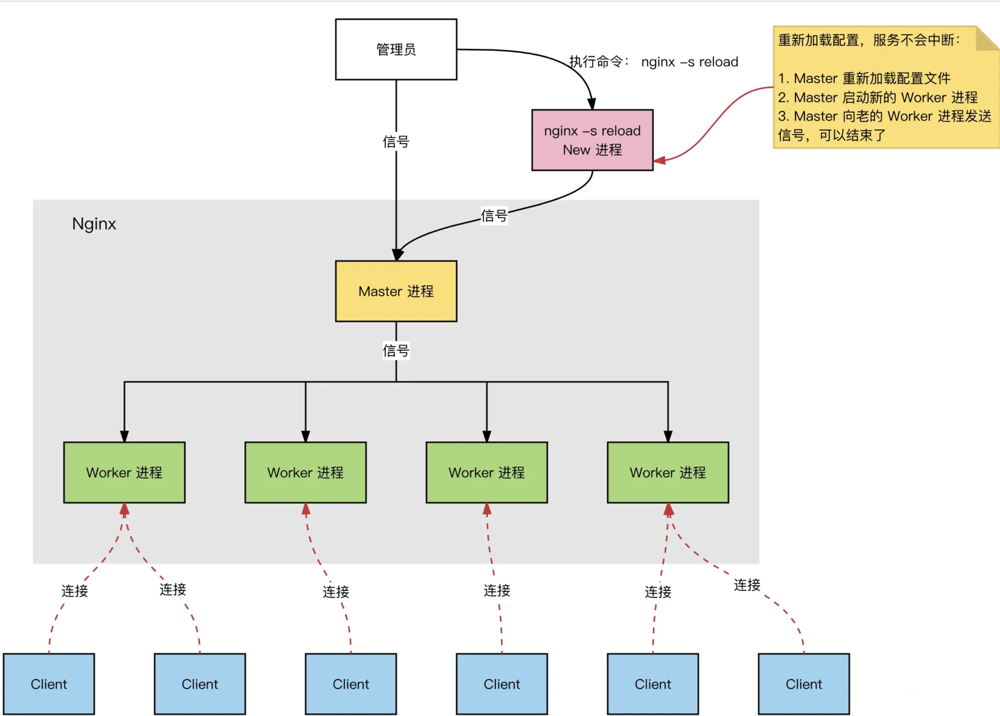

- # nginx-1.24.0 调试  

目录:  

## 源码调试  
### 环境搭建  

https://github.com/nginx/nginx  

在 Ubuntu 20.04 上编译 Nginx 源码，您需要按照以下步骤操作：

1. **安装依赖库**：安装编译 Nginx 所需的依赖库。打开终端，使用以下命令：
   ```
   sudo apt update
   sudo apt install build-essential libpcre3 libpcre3-dev zlib1g zlib1g-dev libssl-dev
   ```

2. **获取 Nginx 源码**：从 [Nginx 的 GitHub 仓库](https://github.com/nginx/nginx) 克隆或下载源代码。

3. **配置编译选项**：解压源码（如果是压缩包），然后进入源码目录。运行 `./configure` 脚本，根据需要指定选项。例如：
   ```
   ./configure --with-debug
   ```
   `--with-debug` 选项会开启调试支持。

4. **编译源码**：运行以下命令来编译 Nginx：
   ```
   make
   ```

5. **安装 Nginx**（可选）：编译完成后，可以选择安装 Nginx。使用以下命令安装：
   ```
   sudo make install
   ```

nginx是多进程架构：一个Master进程，若干个Worker进程。  

Master进程负责管理 Worker 进程，处理nginx命令行指令  

Worker进程负责接收处理客户端请求  

<br>
<div align=center>
    </img>  
</div>
<br>

### master 进程调试  

```sh
# 关闭Master守护进程的功能
daemon off;
# 便于调试只启动一个Worker进程
worker_processes  1;
```

`vscode`配置  
```json
{
  "version": "0.2.0",
  "configurations": [
    {
      "name": "(gdb) Launch",
      "type": "cppdbg",
      "request": "launch",
      "program": "${workspaceFolder}/objs/nginx",
      "args": [
        "-c",
        "${workspaceFolder}/conf/nginx.conf"
      ],
      "stopAtEntry": false,
      "cwd": "${workspaceFolder}",
      "environment": [],
      "MIMode": "gdb",
      "miDebuggerPath": "/usr/bin/gdb",
      "setupCommands": [
        {
          "description": "Enable pretty-printing for gdb",
          "text": "-enable-pretty-printing",
          "ignoreFailures": true
        }
      ]
    }
  ]
}
```


### worker进程调试  

`ps aux | grep nginx`  查看nginx work进程id  


```json
{
  "version": "0.2.0",
  "configurations": [
	/* ... */
    {
      "name": "(gdb) Attach Worker",
      "type": "cppdbg",
      "request": "attach",
      "program": "${workspaceFolder}/objs/nginx",
      "MIMode": "gdb",
      "miDebuggerPath": "/usr/bin/gdb",
      "processId": "9133"
    }
  ]
}
```

> 这里的进程id填进去就行了  


## 配置调试  

通过调试,配置是否生效  


