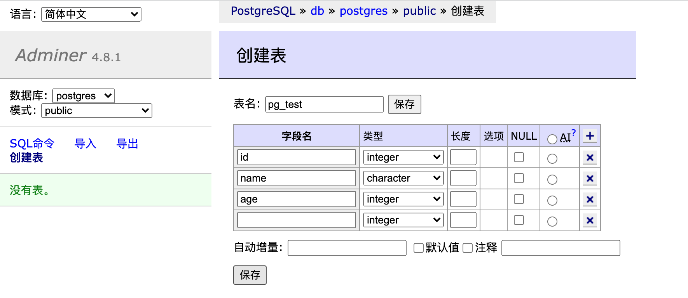

# pgsql 基础

## [官网](https://www.postgresql.org/)  

## docker install  
[镜像文档](https://hub.docker.com/_/postgres)  

```
docker run -d -p 5432:5432 --name postgres -e POSTGRES_PASSWORD=root  postgres   
```

> 默认数据库postgres, 默认用户postgres, 默认端口5432  

docker-compose.yml 示例
```
# Use postgres/example user/password credentials
version: '3.1'

services:
  db:
    image: postgres
    # restart: always
    environment:
      POSTGRES_PASSWORD: root
    ports:
      - 5432:5432

  adminer:
    image: adminer
    # restart: always
    ports:
      - 8980:8080
```  

测试启动`docker-compose up` 或者后台运行`docker-compose up -d` 
访问`http://localhost:8980/`  登录pgsql  

  
<br>


<br>


<br> 

## 流式计算  


