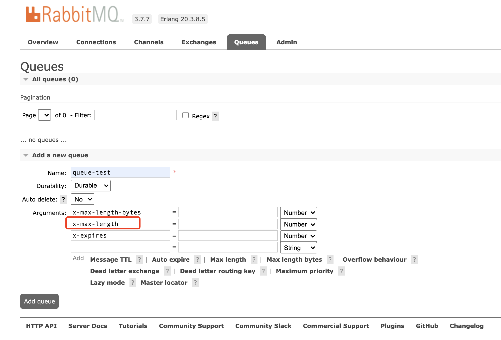
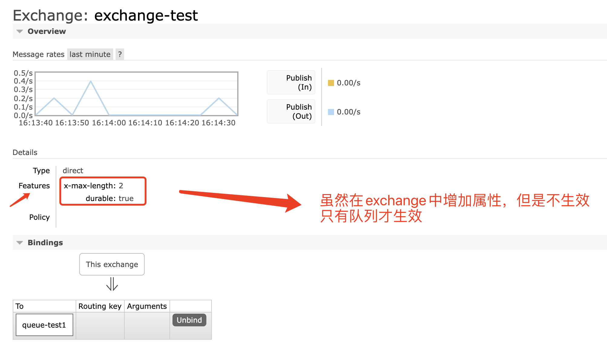

# rabbitmq 基础  
[官网](https://www.rabbitmq.com/)  

## docker 安装

```
# 携带管理界面的
docker run -d --name rabbitmq -p 5672:5672 -p 15672:15672  -e RABBITMQ_DEFAULT_USER=admin -e RABBITMQ_DEFAULT_PASS=admin rabbitmq:3.7.7-management  

# 进入管理界面
http://localhost:15672
```  

## java 发送与订阅  

[java spring demo](https://www.rabbitmq.com/tutorials/tutorial-three-spring-amqp.html)    
```
@Configuration
public class MQConfig {

    public final static String QUEUE_NAME = "queue.test";
    public final static String TOPIC_ROUTINGKEY = "exchange.topic.stream";
    public final static String EXCHANGE_STREAM = "exchange.stream";

    @Bean
    public TopicExchange topic() {
        return new TopicExchange(EXCHANGE_STREAM);
    }

    @Bean
    public Queue packetQueue() {
        return new AnonymousQueue();
    }


    @Bean
    public Binding binding1a(TopicExchange topic, Queue packetQueue) {
        return BindingBuilder.bind(packetQueue).to(topic).with(TOPIC_ROUTINGKEY);
    }


    @Profile("receiver")
    @Bean
    public PacketRecvHandler receiver() {
        return new PacketRecvHandler();
    }

}
```  

> 可以直接订阅 `exchange`，但是在绑定时，仍要增加一个`queue name`  

```
 @RabbitListener(queues = MQConfig.QUEUE_NAME)
    public void rawPackerRecv(String msg) { //(byte[] msg)
    
    }
```  

> 结束数据的类型要根据发送的数据类型变化，如果发送的是`byte[]`,接收的是`String`，接收的数据可能会有逗号分割符  


## go 发送与订阅  
[官网demo](https://www.rabbitmq.com/tutorials/tutorial-three-go.html)   

## 队列上线配置  
目前使用MQ作为网络数据包缓存，可能瞬间流量超过10w+/s，直接导致程序队列溢出，JVM-OOM，通过设置队列大小
超过队列上线后，直接丢弃早期数据  

[设置参数及策略](https://www.rabbitmq.com/parameters.html#policies)  
[队列上线设置](https://www.rabbitmq.com/maxlength.html)  

修改策略配置(队列最大消息个数为2):
```
rabbitmqctl set_policy my-pol "^two-messages$" \
  '{"max-length":2,"overflow":"reject-publish"}' \
  --apply-to queues
```

manager ui

<br>
<div align=center>
    </img>  
</div>
<br>

通过ui往队列中push playload为`1,2,3`的三条数据，获取第一条数据是`2` 

  

exchange设置参数不生效，虽然显示`Lim`  


