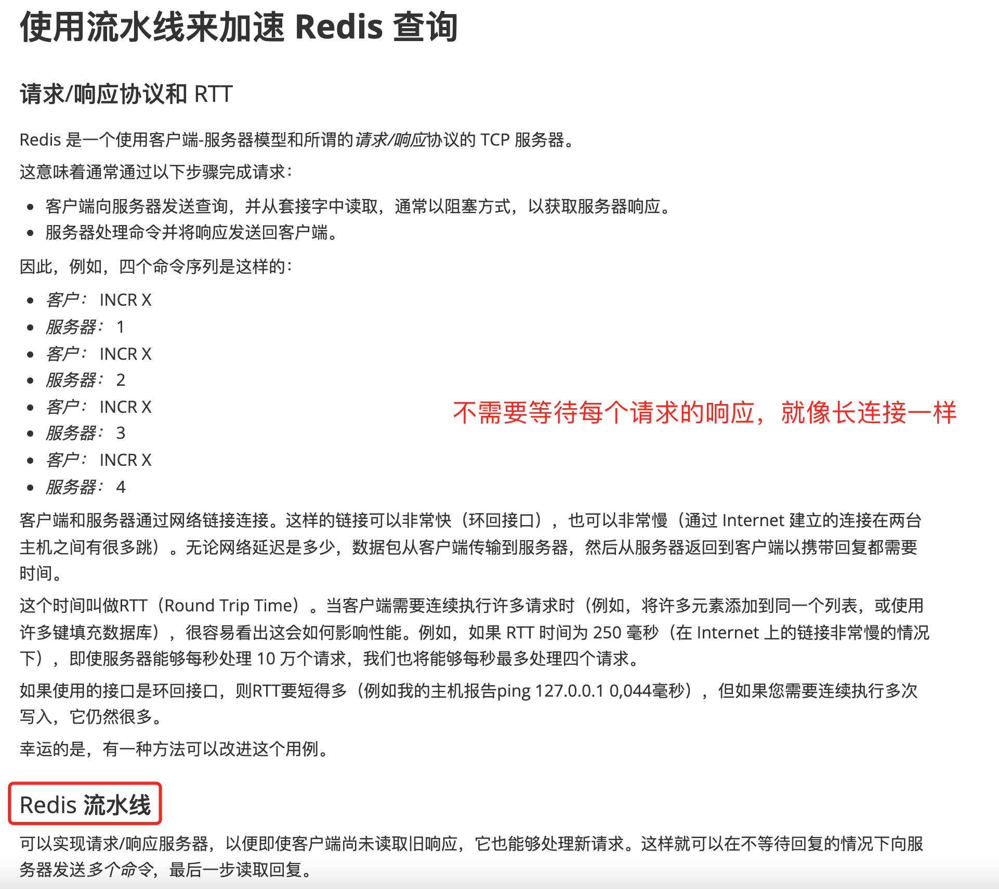
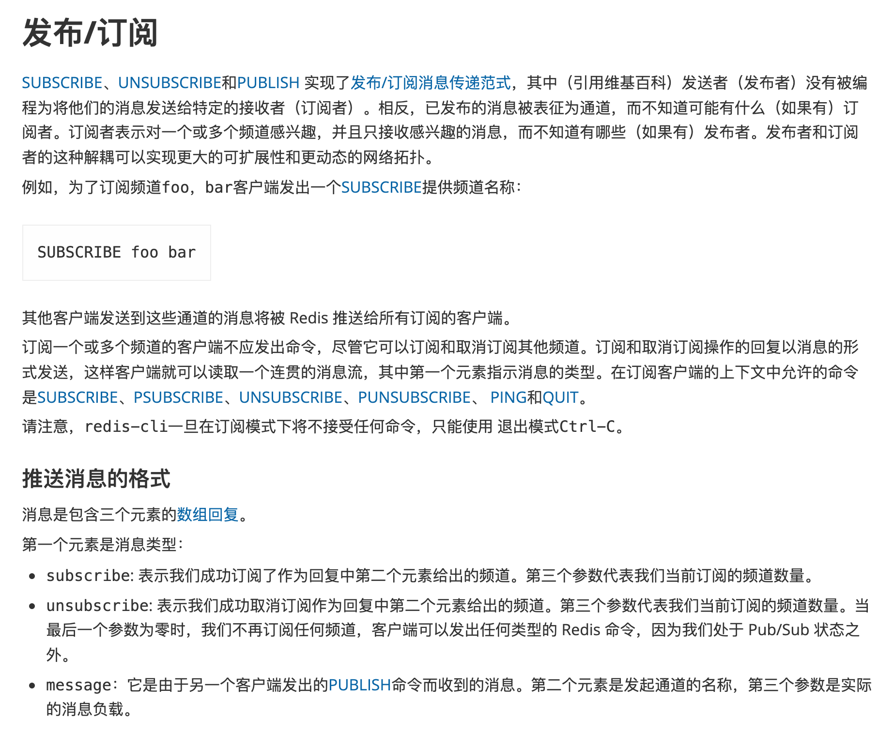

# redis基础
## [官网](https://redis.io/)  
### [在线redis](https://try.redis.io/)  
### [所有指令](https://redis.io/commands)  

- ## 目录
- [redis基础](#redis基础)
  - [官网](#官网)
    - [在线redis](#在线redis)
    - [所有指令](#所有指令)
  - [docker 安装](#docker-安装)
  - [容器](#容器)
    - [基本操作](#基本操作)
    - [keys](#keys)
    - [list](#list)
    - [hash](#hash)
    - [sets](#sets)
  - [pipeline](#pipeline)
  - [Redis Pub/Sub](#redis-pubsub)
  - [Using Redis as an LRU cache](#using-redis-as-an-lru-cache)
  - [过期键删除策略](#过期键删除策略)


## docker 安装

```shell
docker run -p 6379:6379 --name redis -d redis:5.0 --requirepass 'redis'

> config set requirepass redis
```

## 容器
### 基本操作
```sh
# 查看数据类型
> type cpu_used:17:15:17
string

# 测试与服务器的连接
> ping
PONG

# 选择数据库
> SELECT 1
OK

# 清空当前数据库中的所有数据
> FLUSHDB
OK

# 清空所有数据库中的数据
> FLUSHALL
OK
```

### keys

`KEYS` 命令用于查找所有符合给定模式的键。Redis 使用以下的一些模式匹配运算符：

- `*` ：匹配所有键。
- `?` ：匹配任意一个字符。
- `[]` ：匹配括号内的任意一个字符。
- `[a-z]` ：匹配 a 到 z 之间的任意一个字符。

下面是一些示例：

1. **查找所有键**：
   ```
   > KEYS *
   ```

2. **查找以 `user` 开头的所有键**：
   ```
   > KEYS user*
   ```

3. **查找以 `user` 开头，接着是任意一个字符，然后以 `data` 结尾的所有键**：
   ```
   > KEYS user?data
   ```

4. **查找以 `user` 开头，接着是数字（0-9）的所有键**：
   ```
   > KEYS user[0-9]*
   ```

5. **查找以 `a` 或 `b` 开头的所有键**：
   ```
   > KEYS [ab]*
   ```

请注意，`KEYS` 命令在生产环境中应当谨慎使用，特别是当 Redis 实例中有大量的键时。这是因为 `KEYS` 是一个阻塞性命令，可能会对性能产生影响。为了避免这种情况，在生产环境中，你应该考虑使用 `SCAN` 命令进行迭代操作。


### [list](https://redis.io/commands#list)  
```shell
127.0.0.1:6379> LPUSH mylist "world"
(integer) 1
127.0.0.1:6379> LPUSH mylist "hello"
(integer) 2
127.0.0.1:6379> LRANGE mylist 0 -1
1) "hello"
2) "world"
127.0.0.1:6379> LPOP mylist
"hello"
127.0.0.1:6379> RPUSH mylist "one"
(integer) 2
127.0.0.1:6379> RPUSH mylist "two"
(integer) 3
127.0.0.1:6379> 
```

### [hash](https://redis.io/commands#hash)  

```shell
127.0.0.1:6379> HMSET myhash field1 "Hello" field2 "World"
OK
127.0.0.1:6379> HGET myhash field1
"Hello"
127.0.0.1:6379> HKEYS myhash
1) "field1"
2) "field2"
127.0.0.1:6379> HVALS myhash
1) "Hello"
2) "World"
127.0.0.1:6379> HLEN myhash
(integer) 2
```

### [sets](https://redis.io/commands#set)  

```shell
127.0.0.1:6379> SADD myset "one"
(integer) 1
127.0.0.1:6379> SADD myset "two"
(integer) 1
127.0.0.1:6379> SADD myset "three"
(integer) 1
127.0.0.1:6379> SPOP myset
"two"
127.0.0.1:6379> SMEMBERS myset
1) "three"
2) "one"
127.0.0.1:6379> SADD myotherset "three"
(integer) 1
127.0.0.1:6379> SADD myset "two"
(integer) 1
127.0.0.1:6379> SMEMBERS myset
1) "two"
2) "three"
3) "one"
127.0.0.1:6379> SMOVE myset myotherset "two"
(integer) 1
127.0.0.1:6379> SMEMBERS myset
1) "three"
2) "one"
```


## [pipeline](https://redis.io/topics/pipelining)  



## [Redis Pub/Sub](https://redis.io/topics/pubsub)  
  

- 订阅的不是字段/key, 而是channel

```shell
SUBSCRIBE foo bar [channel ...]
```

- 如果没有订阅，发布消息到channel会失败
```shell
127.0.0.1:6379> PUBLISH foo redis
(integer) 1
127.0.0.1:6379> PUBLISH foo 2
(integer) 1
127.0.0.1:6379> PUBLISH foo 2
(integer) 0
127.0.0.1:6379> PUBLISH foo 3       //执行 SUBSCRIBE foo 
(integer) 0
127.0.0.1:6379> PUBLISH foo 3
(integer) 1
127.0.0.1:6379> 
```

## [Using Redis as an LRU cache](https://redis.io/topics/lru-cache)  
在Redis的配置文件redis.conf文件中，配置maxmemory的大小参数如下所示：
```
maxmemory 100mb
```

命令行设置
```shell
127.0.0.1:6379> config get maxmemory
1) "maxmemory"
2) "0"
127.0.0.1:6379> config set maxmemory 100mb
OK
127.0.0.1:6379> config get maxmemory
1) "maxmemory"
2) "104857600"
```  

倘若实际的存储中超出了Redis的配置参数的大小时，Redis中有淘汰策略，把需要淘汰的key给淘汰掉，整理出干净的一块内存给新的key值使用。  

Redis提供了6种的淘汰策略，其中默认的是noeviction，这6中淘汰策略如下：

- noeviction(默认策略)：若是内存的大小达到阀值的时候，所有申请内存的**指令都会报错**。
- allkeys-lru：所有key都是使用LRU算法进行淘汰。
- volatile-lru：所有设置了过期时间的key使用LRU算法进行淘汰。
- allkeys-random：所有的key使用随机淘汰的方式进行淘汰。
- volatile-random：所有设置了过期时间的key使用随机淘汰的方式进行淘汰。
- volatile-ttl：所有设置了过期时间的key根据过期时间进行淘汰，越早过期就越快被淘汰。

假如在Redis中的数据有一部分是热点数据，而剩下的数据是冷门数据，或者我们不太清楚我们应用的缓存访问分布状况，这时可以使用allkeys-lru。  

假如所有的数据访问的频率大概一样，就可以使用allkeys-random的淘汰策略。  

假如要配置具体的淘汰策略，可以在redis.conf配置文件中配置，具体配置如下所示：  
```
maxmemory-policy noeviction
```

命令行设置:
```shell
127.0.0.1:6379> config get maxmemory-policy
1) "maxmemory-policy"
2) "noeviction"
127.0.0.1:6379> config set maxmemory-policy allkeys-lru
OK
127.0.0.1:6379> config get maxmemory-policy
1) "maxmemory-policy"
2) "allkeys-lru"
```

## 过期键删除策略  

```shell
127.0.0.1:6379> set name xiaoming
OK
127.0.0.1:6379> get name
"xiaoming"
127.0.0.1:6379> TTL name  # 没有过期时间, 返回值为-1  
(integer) -1
127.0.0.1:6379> EXPIRE name 10 
(integer) 1
127.0.0.1:6379> TTL name  # 设置过期时间后，返回过期剩余时间  
(integer) 8
127.0.0.1:6379> TTL name
(integer) 7
127.0.0.1:6379> TTL name
(integer) 6
127.0.0.1:6379> TTL name
(integer) 5
127.0.0.1:6379> TTL name
(integer) 4
127.0.0.1:6379> TTL name
(integer) 1
127.0.0.1:6379> TTL name  # 如果过去后，就会返回-2  
(integer) -2
```

Redis的过期删除策略就是：惰性删除和定期删除两种策略配合使用。  
惰性删除：Redis的惰性删除策略由 `db.c/expireIfNeeded` 函数实现，所有键读写命令执行之前都会调用 expireIfNeeded 函数对其进行检查，如果过期，则删除该键，然后执行键不存在的操作；未过期则不作操作，继续执行原有的命令。  

定期删除：由`redis.c/activeExpireCycle` 函数实现，函数以一定的频率运行，每次运行时，都从一定数量的数据库中取出一定数量的随机键进行检查，并删除其中的过期键。  

注意：并不是一次运行就检查所有的库，所有的键，而是随机检查一定数量的键。  

定期删除函数的运行频率，在Redis2.6版本中，规定每秒运行10次，大概100ms运行一次。在Redis2.8版本后，可以通过修改配置文件redis.conf 的 `hz` 选项来调整这个次数。  


过期删除还是需要到对应数据结构中清除`dictDelete(db->dict,key->ptr)`    
```js
/* Delete a key, value, and associated expiration entry if any, from the DB */
int dbSyncDelete(redisDb *db, robj *key) {
    /* Deleting an entry from the expires dict will not free the sds of
     * the key, because it is shared with the main dictionary. */
    if (dictSize(db->expires) > 0) dictDelete(db->expires,key->ptr);
    if (dictDelete(db->dict,key->ptr) == DICT_OK) {
        if (server.cluster_enabled) slotToKeyDel(key);
        return 1;
    } else {
        return 0;
    }
}
```  


