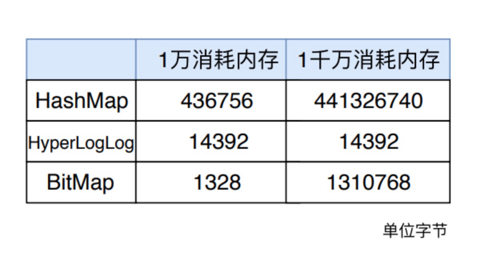

# redis 数据统计分析
常情况下，我们面临的用户数量以及访问量都是巨大的，比如百万、千万级别的用户数量，或者千万级别、甚至亿级别的访问信息。  
所以，我们必须要选择能够非常高效地统计大量数据（例如亿级）的集合类型。  
如何选择合适的数据集合，我们首先要了解常用的统计模式，并运用合理的数据来解决实际问题。   

四种统计类型：  

1. 二值状态统计；
2. 聚合统计；
3. 排序统计；
4. 基数统计。  

本文将用到 String、Set、Zset、List、hash 以外的拓展数据类型 Bitmap、HyperLogLog来实现。  

今天我们来看下剩下的三种统计类型。

文章涉及到的指令可以通过在线 Redis 客户端运行调试，地址：https://try.redis.io/，超方便的说。  

## 基数统计
`基数统计：统计一个集合中不重复元素的个数，常见于计算独立用户数（UV）`  

- PV(访问量)：即Page View, 即页面浏览量或点击量，用户每次刷新即被计算一次。
- UV(独立访客)：即Unique Visitor,访问您网站的一台电脑客户端为一个访客。00:00-24:00内相同的客户端只被计算一次。  
- IP(独立IP)：即Internet Protocol,指独立IP数。00:00-24:00内相同IP地址之被计算一次。  

实现基数统计最直接的方法，就是采用集合（Set）这种数据结构，当一个元素从未出现过时，便在集合中增加一个元素；如果出现过，那么集合仍保持不变。  

当页面访问量巨大，就需要一个超大的 Set 集合来统计，将会浪费大量空间。另外，这样的数据也**不需要很精确**，到底有没有更好的方案呢？  

这个问题问得好，`Redis` 提供了 `HyperLogLog` 数据结构就是用来解决种种场景的统计问题。  

`HyperLogLog` 是一种不精确的去重基数方案，它的统计规则是基于概率实现的，标准误差 `0.81%`，这样的精度足以满足 UV 统计需求了。  

### Set方案  

```shell
> sadd uv-set xiao
(integer) 1
> sadd uv-set ming
(integer) 1
> sadd uv-set hong
(integer) 1
> sadd uv-set lan
(integer) 1
> SMEMBERS uv-set
1) "xiao"
2) "lan"
3) "hong"
4) "ming"
```

### Hash 方案

`利用 Hash 类型实现，将用户 ID 作为 Hash 集合的 key，访问页面则执行 HSET 命令将 value 设置成 1。`  

即使用户重复访问，重复执行命令，也只会把这个 userId 的值设置成 “1"。

最后，利用 HLEN 命令统计 Hash 集合中的元素个数就是 UV。  


```
> hset uv-hset xiao:id5 1
1
> hset uv-hset ming:id5 1
1
> hset uv-hset hong:id7 1
1
> hlen uv-hset
3
> hkeys uv-hset
1) "xiao:id5"
2) "ming:id5"
3) "hong:id7"
```  

### HyperLogLog 方案  

利用  Redis 提供的 HyperLogLog 高级数据结构（不要只知道 Redis 的五种基础数据类型了）。这是一种用于基数统计的数据集合类型，即使数据量很大，计算基数需要的空间也是固定的。

每个 HyperLogLog 最多只需要花费 12KB 内存就可以计算 2 的 64 次方个元素的基数。

Redis 对 HyperLogLog 的存储进行了优化，在计数比较小的时候，存储空间采用系数矩阵，占用空间很小。

只有在计数很大，稀疏矩阵占用的空间超过了阈值才会转变成稠密矩阵，占用 12KB 空间。  

> 什么是基数?
> 比如数据集 {1, 3, 5, 7, 5, 7, 8}， 那么这个数据集的基数集为 {1, 3, 5 ,7, 8}, 基数(不重复元素)为5。 基数估计就是在误差可接受的范围内，快速计算基数。  

```shell
> PFADD hll1 foo bar zap a
(integer) 1
> PFADD hll2 a b c foo
(integer) 1
> PFMERGE hll3 hll1 hll2    
"OK"
> PFCOUNT hll3
(integer) 6
```

> PFMERGE 可以合并多个

<br>
<div align=center>
    </img>  
</div>
<br>  

> 三种方式的内存消耗对比。  


## 排序统计  

Redis 的 4 个集合类型中（List、Set、Hash、Sorted Set），List 和 Sorted Set 就是有序的。  

- List：按照元素插入 List 的顺序排序，使用场景通常可以作为 消息队列、最新列表、排行榜；

- Sorted Set：根据元素的 score 权重排序，我们可以自己决定每个元素的权重值。使用场景（排行榜，比如按照播放量、点赞数）。

最新评论列表:
```
> LPUSH l-sort 1 2 3 4 5 6
(integer) 6
> LRANGE l-sort 0 4
1) "6"
2) "5"
3) "4"
4) "3"
5) "2"
```

排行榜:

`ZADD`  
比如我们将《青花瓷》和《花田错》播放量添加到 musicTop 集合中：
```shell
ZADD musicTop 100000000 青花瓷 8999999 花田错
```

`ZINCRBY`
《青花瓷》每播放一次就通过 ZINCRBY指令将 score + 1。  
```
ZINCRBY musicTop 1 青花瓷
100000001
```

`ZRANGEBYSCORE`
语法为:
```
ZRANGEBYSCORE key min max [WITHSCORES] [LIMIT offset count]
```
我们需要获取 musicTop 前十播放量音乐榜单，目前最大播放量是 N ，可通过如下指令获取： 
```
# 所有的
> ZRANGEBYSCORE musicTop -inf +inf WITHSCORES
1) "花田错"
2) 8999999.0
3) "青花瓷"
4) 100000001.0

# top 
ZRANGEBYSCORE musicTop N-9 N WITHSCORES 

```

`ZREVRANGE`  
可通过 `ZREVRANGE key start stop [WITHSCORES]`指令。其中元素的排序按 score 值递减(从大到小)来排列。具有相同 score 值的成员按字典序的逆序(reverse lexicographical order)排列。  

```
# 获取第一个
> ZREVRANGE musicTop 0 0 WITHSCORES  
```

> 在面对需要展示最新列表、排行榜等场景时，如果数据更新频繁或者需要分页显示，建议优先考虑使用 Sorted Set。  

## 聚合统计
聚合统计就是统计多个集合元素的聚合结果，比如说：

- 统计多个元素的共有数据（交集）；
- 统计两个集合其中的一个独有元素（差集统计）；
- 统计多个集合的所有元素（并集统计）。

Redis 的 Set 类型支持集合内的增删改查，底层使用了 Hash 数据结构，无论是 add、remove 都是 O(1) 时间复杂度。

并且支持多个集合间的交集、并集、差集操作，利用这些集合操作，解决上边提到的统计问题。  

### 交集-共同好友

比如 QQ 中的共同好友正是聚合统计中的交集。我们将账号作为 Key，该账号的好友作为 Set 集合的 value。

```
> SADD user-ming "hello"
(integer) 1
> SADD user-ming "foo"
(integer) 1
> SADD user-ming "bar"
(integer) 1
> SADD user-hong "hello"
(integer) 1
> SADD user-hong "world"
(integer) 1
> SINTERSTORE commom user-ming user-hong
(integer) 1
> SMEMBERS commom
1) "hello"
```

> Redis Sinterstore 命令将给定集合之间的交集存储在指定的集合中。如果指定的集合已经存在，则将其覆盖。  

### 差集-每日新增好友数
> Redis Sdiffstore 命令将给定集合之间的差集存储在指定的集合中。如果指定的集合 key 已存在，则会被覆盖。  

语法: `SDIFFSTORE DESTINATION_KEY KEY1..KEYN`

```
> SADD user-ming "hello"
(integer) 1
> SADD user-ming "foo"
(integer) 1
> SADD user-ming "bar"
(integer) 1
> SADD  user-hong "hello"
(integer) 1
> SADD  user-hong "world"
(integer) 1

# 用 user-ming 与  user-hong
> SDIFFSTORE diff1 user-ming user-hong
(integer) 2
> SMEMBERS diff1
1) "foo"
2) "bar"

# 用 user-hong 与  user-ming
> SDIFFSTORE diff2 user-hong user-ming
(integer) 2
> SMEMBERS diff2
1) "world"
```

> key的顺序会对结果有影响  


### 并集-总共新增好友

先求差集，再求并集。  

> Redis Sunionstore 命令将给定集合的并集存储在指定的集合 destination 中。如果 destination 已经存在，则将其覆盖。  

语法: `SUNIONSTORE destination key [key ...]`

```
> SADD key1 "a"
(integer) 1
> SADD key1 "b"
(integer) 1
> SADD key1 "c"
(integer) 1
> SADD key2 "c"
(integer) 1
> SADD key2 "d"
(integer) 1
> SADD key2 "e"
(integer) 1
> SUNIONSTORE key key1 key2
(integer) 5
> SMEMBERS key
1) "c"
2) "b"
3) "e"
4) "d"
5) "a"
```


Set 的差集、并集和交集的计算复杂度较高，在数据量较大的情况下，如果直接执行这些计算，会导致 Redis 实例阻塞。

所以，可以专门部署一个集群用于统计，让它专门负责聚合计算，或者是把数据读取到客户端，在客户端来完成聚合统计，这样就可以规避由于阻塞导致其他服务无法响应。  


