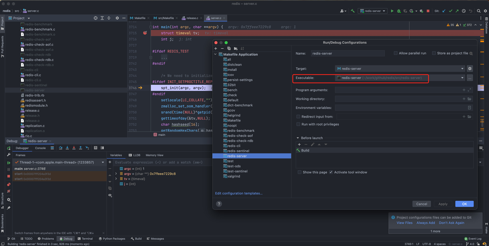
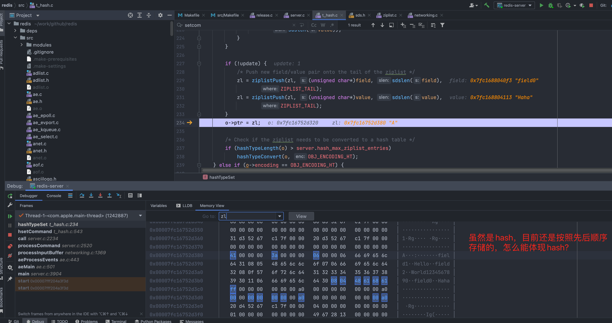
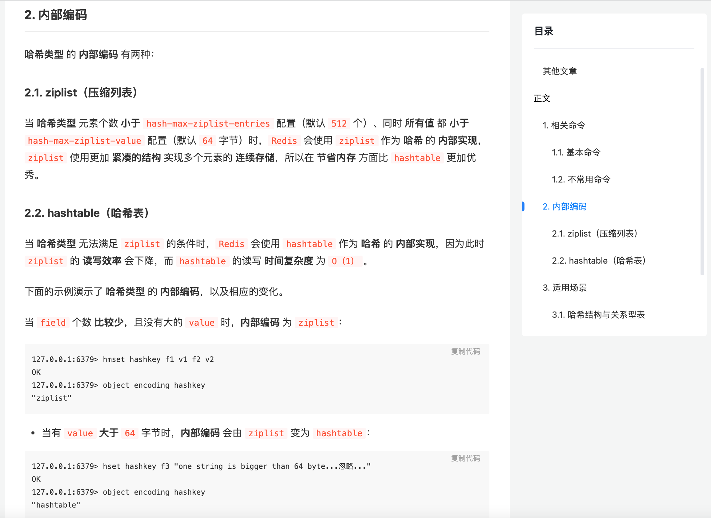
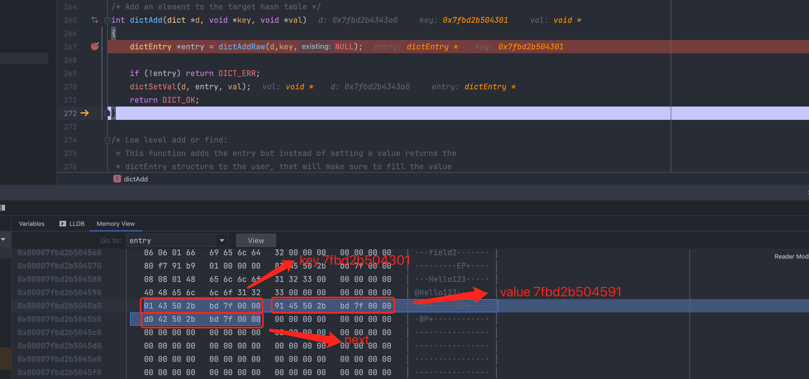
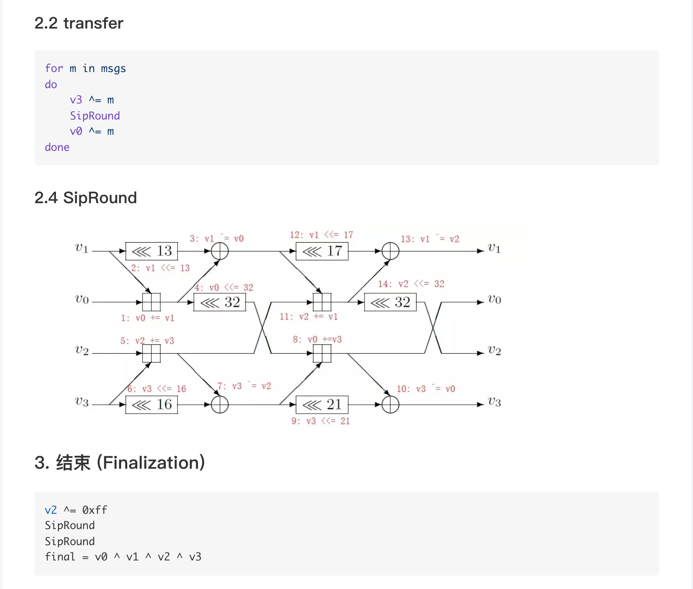
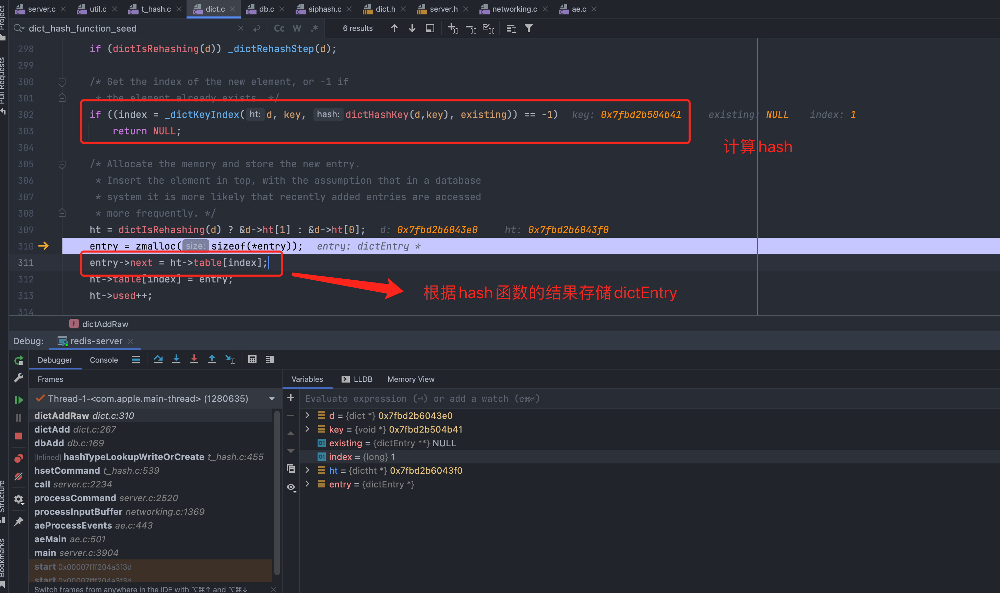
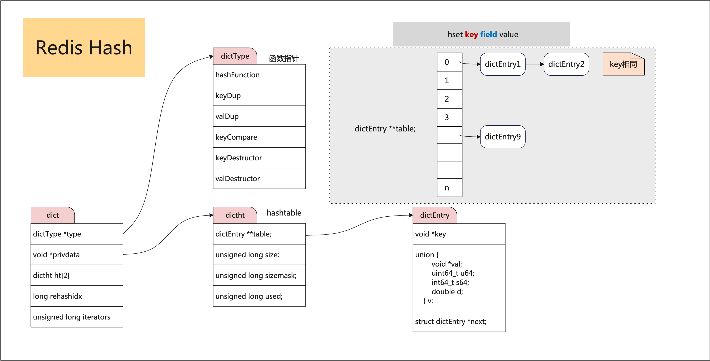

# redis4.0 数据结构
下载源码  
```shell
git clone https://github.com/redis/redis -b 4.0  
```

具体模块可以查看src/Makefile
```shell
比如调试redis-server
REDIS_SERVER_NAME=redis-server  

REDIS_SERVER_OBJ=adlist.o quicklist.o ae.o anet.o dict.o server.o sds.o ...

```

server `main()`方法在`src/server.c`中，首先编译源码`make -j4`,然后在debug的配置`Executable`中选择编译完成的
`redis-sever`文件，然后debug   

  

## hash
```shell
127.0.0.1:6379> HMSET myhash field1 "Hello" field2 "World"
OK
(351.50s)
127.0.0.1:6379> HMSET myhash field2 "World1234567890"
OK
(321.42s)
127.0.0.1:6379> HMSET myhash field0 "Haha"
```

  

看到的数据结构和网上文章不一样，没有hash过程及存储呀~~??  hash中的key并不是经过hash存储的。  

编码选项:  
```
/* Objects encoding. Some kind of objects like Strings and Hashes can be
 * internally represented in multiple ways. The 'encoding' field of the object
 * is set to one of this fields for this object. */
#define OBJ_ENCODING_RAW 0     /* Raw representation */
#define OBJ_ENCODING_INT 1     /* Encoded as integer */
#define OBJ_ENCODING_HT 2      /* Encoded as hash table */
#define OBJ_ENCODING_ZIPMAP 3  /* Encoded as zipmap */
#define OBJ_ENCODING_LINKEDLIST 4 /* No longer used: old list encoding. */
#define OBJ_ENCODING_ZIPLIST 5 /* Encoded as ziplist */
#define OBJ_ENCODING_INTSET 6  /* Encoded as intset */
#define OBJ_ENCODING_SKIPLIST 7  /* Encoded as skiplist */
#define OBJ_ENCODING_EMBSTR 8  /* Embedded sds string encoding */
#define OBJ_ENCODING_QUICKLIST 9 /* Encoded as linked list of ziplists */
```

[网文](https://juejin.cn/post/6844903693075103757)  

  

修改`redis.conf`配置
```
############################### ADVANCED CONFIG ###############################

# Hashes are encoded using a memory efficient data structure when they have a
# small number of entries, and the biggest entry does not exceed a given
# threshold. These thresholds can be configured using the following directives.
hash-max-ziplist-entries 512 # 最大存储多少对key value 
hash-max-ziplist-value 64   # value超过多少字节之后使用hashtable
```  

修改为
```shell
hash-max-ziplist-entries 512 
hash-max-ziplist-value 1  
``` 

启动时增加redis.conf配置，只要存储的value大于一个字节，就会启用hashtable存储 
```shell
/Users/xxx/work/github/redis/src/redis-server /Users/xxx/work/github/redis/redis.conf
14496:C 15 Dec 11:37:10.798 # oO0OoO0OoO0Oo Redis is starting oO0OoO0OoO0Oo
14496:C 15 Dec 11:37:10.798 # Redis version=4.0.14, bits=64, commit=ff6db5f1, modified=1, pid=14496, just started
14496:C 15 Dec 11:37:10.798 # Configuration loaded  
```

存储指令:`127.0.0.1:6379> HMSET myhash field1 "Hello"`  

首选会判断存储类型是ziplist还是ht?
```js
void hashTypeConvertZiplist(robj *o, int enc) {
    serverAssert(o->encoding == OBJ_ENCODING_ZIPLIST);

    if (enc == OBJ_ENCODING_ZIPLIST) {
        /* Nothing to do... */

    } else if (enc == OBJ_ENCODING_HT) {
        hashTypeIterator *hi;
        dict *dict;
        int ret;

        hi = hashTypeInitIterator(o);
        dict = dictCreate(&hashDictType, NULL);

        /* 省略部分 */
    } else {
        serverPanic("Unknown hash encoding");
    }
}
```  

数据结构是个字典`dict`  
```
typedef struct dict {
    dictType *type;
    void *privdata;
    dictht ht[2];    # hashtable具体实现，有两个ht，方便rehashing
    long rehashidx; /* rehashing not in progress if rehashidx == -1 */
    unsigned long iterators; /* number of iterators currently running */
} dict;

/* This is our hash table structure. Every dictionary has two of this as we
 * implement incremental rehashing, for the old to the new table. */
typedef struct dictht {
    dictEntry **table;
    unsigned long size;
    unsigned long sizemask;
    unsigned long used;
} dictht;

# 键值对存储实体
typedef struct dictEntry {
    void *key;
    union {
        void *val;
        uint64_t u64;
        int64_t s64;
        double d;
    } v;
    struct dictEntry *next;
} dictEntry;

```  

首先查看`dictEntry`:  

  

> `hset`单个，`hmset`多个，在4.0以后hmset不提倡使用。  
> As per Redis 4.0.0, HMSET is considered deprecated. Please use HSET in new code.  
> 根据Redis 4.0.0，HMSET被视为已弃用。请在新代码中使用HSET。

```shell
$ HMSET myhash field1 "Hello"
$ HMSET myhash field2 "Hello123"

entry 

key 0x7fbd2b504301 => field2 
0x00007fbd2b504300  |   30 66 69 65   6c 64 32 00   00 00 00 00   00 00 00 00   │ 0field2········· │

value 0x7fbd2b504591 => Hello123
0x00007fbd2b504590  |   40 48 65 6c   6c 6f 31 32   33 00 00 00   00 00 00 00   │ @Hello123······· │

next 0x7fbd2b5042d0 => 0x7fbd2c0041e1
0x00007fbd2b5042d0  |   e1 41 00 2c   bd 7f 00 00   f1 42 50 2b   bd 7f 00 00   │ ·A·,·····BP+···· │

0x7fbd2c0041e1 => 
0x00007fbd2c0041e0  |  30 66 69 65   6c 64 31 00   00 00 ff 00   00 00 00 00   │ 0field1········· │

```

通过表达式查看table
```
t_hash.c // int hashTypeSet(r 函数
(dictht)(((dict*)(o->ptr))->ht[0])

result = {dictht} 
 table = {dictEntry **} 0x7fbd2b504510 
 size = {unsigned long} 8
 sizemask = {unsigned long} 7
 used = {unsigned long} 6
``` 

如果一直使用一个`key`，那么所有的数据都会使用链表存储，只有使用不同的`key`才会涉及到hash表  
```shell
# 相当于关系型数据库中用户表的两条记录
hmset user:1 name tom age 23 city beijing
hmset user:2 name tim age 18 city beijing
```  

比如执行一下命令，查看hash函数及如何存储  
```shell
 hmset user:2 name tom age 23 city beijing
```

`hash`函数  
```
# 
uint64_t dictGenHashFunction(const void *key, int len) {  
    return siphash(key,len,dict_hash_function_seed);
}

key => 0x00007fbd2b504b41 => 存储内容是user:2
0x00007fbd2b504b40  |  30 75 73 65   72 3a 32 00   00 00 00 00   00 00 00 00   │ 0user:2········· │

# 种子由util.c中void getRandomHexChars(char *p, unsigned int len) 函数生成。是基于/dev/random
# /dev/random在类UNIX系统中是一个特殊的设备文件，可以用作随机数发生器或伪随机数发生器。
dict_hash_function_seed => 0x0000000102e41b10
0x0000000102e41b10  |  65 32 61 63   38 30 34 39   62 37 37 33   32 33 32 38   │ e2ac8049b7732328 │
0x0000000102e41b20  |  00 00 00 00   40 aa 00 00   00 00 00 00   00 00 00 00   │ ····@··········· │
   
```

从中可以看出`4.0`使用`SipHash`哈希算法，之前使用的是`MurmurHash2`哈希算法  
[参考文章1](https://my.oschina.net/tigerBin/blog/3038044)  
[参考文章2](http://cr.yp.to/siphash/siphash-20120918.pdf)
<br>

算法部分流程截图:  

   

根据hash函数结果存储dictEntry  

  

整体结构如下：  



## sets  

## zsets  
