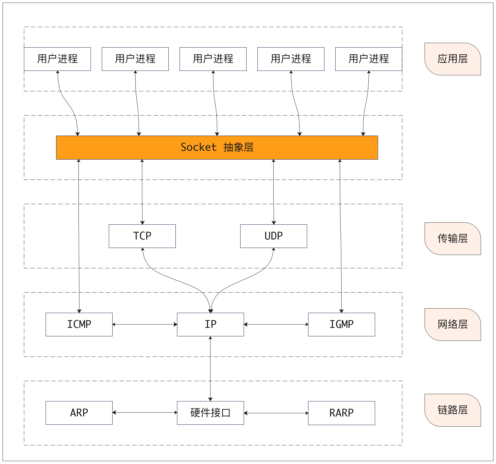
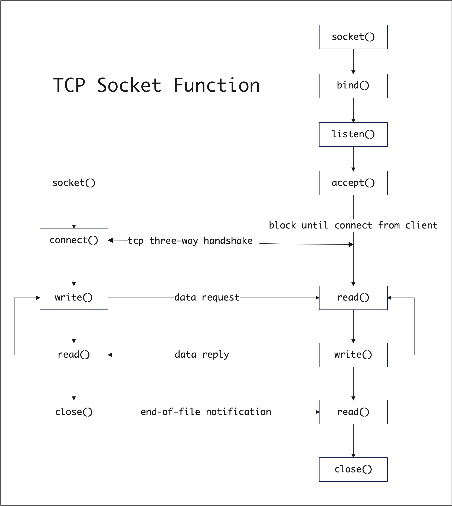

# Socket通信  
[维基百科](https://zh.wikipedia.org/wiki/%E7%B6%B2%E8%B7%AF%E6%8F%92%E5%BA%A7)  
网络套接字（英语：Network socket；又译网络套接字、网络接口、网络插槽）在计算机科学中是电脑网络中进程间资料流的端点。使用以网际协议（Internet Protocol）为通信基础的网络套接字，称为网际套接字（Internet socket）。因为网际协议的流行，现代绝大多数的网络套接字，都是属于网际套接字。

socket是一种操作系统提供的进程间通信机制。    

在操作系统中，通常会为应用程序提供一组应用程序接口（API），称为套接字接口（英语：socket API）。应用程序可以通过套接字接口，来使用网络套接字，以进行资料交换。最早的套接字接口来自于4.2 BSD，因此现代常见的套接字接口大多源自Berkeley套接字（Berkeley sockets）标准。在套接字接口中，以IP地址及端口组成套接字地址（socket address）。远程的套接字地址，以及本地的套接字地址完成连线后，再加上使用的协议（protocol），这个五元组（five-element tuple），作为套接字对（socket pairs），之后就可以彼此交换资料。例如，在同一台计算机上，TCP协议与UDP协议可以同时使用相同的port而互不干扰。 操作系统根据套接字地址，可以决定应该将资料送达特定的行程或线程。这就像是电话系统中，以电话号码加上分机号码，来决定通话对象一般。  

- #### [IO多路复用器实现原理](https://github.com/ymm135/IO-Multiplexing)  

## socket架构及流程  
- socket整体架构 

<br>
<div align=center>
    </img>  
</div>
<br>

- ### tcp 

<br>
<div align=center>
    </img>  
</div>
<br>

## socket 数据结构  

- #### [内核调试方法](../../../md/other/ubuntu-kernel-debug.md)  

`include/linux/socket.h`  
```c
/*
 *	1003.1g requires sa_family_t and that sa_data is char.
 */

struct sockaddr {
	sa_family_t	sa_family;	/* address family, AF_xxx	*/
	char		sa_data[14];	/* 14 bytes of protocol address	*/
};
```

| Family | Description |  
| ----- | ---------- |  
| AF_INET | IPv4 protocols |   
| AF_INET6 | IPv6 protocols |  
| AF_LOCAL | Unix domain protocols |
| AF_ROUTE | Routing Sockets |  
| AF_KEY | Ket socket |   

通信类型:   
| Type | Description |   
| ---- | ----------- |
| SOCK_STREAM | Stream socket |  
| SOCK_DGRAM | Datagram socket |  
| SOCK_SEQPACKET | Sequenced packet socket |  
| SOCK_RAW | Raw socket |   


当两个对等点位于同一主机上时，Unix 域套接字的速度通常是 TCP 套接字的两倍.  

- #### AF_INET 结构  `/usr/include/netinet/in.h`
```c
/* Structure describing an Internet socket address.  */
struct sockaddr_in
  {
    __SOCKADDR_COMMON (sin_);
    in_port_t sin_port;			    /* Port number.  */
    struct in_addr sin_addr;		/* Internet address.  */

    /* Pad to size of `struct sockaddr'.  */
    unsigned char sin_zero[sizeof (struct sockaddr)
			   - __SOCKADDR_COMMON_SIZE
			   - sizeof (in_port_t)
			   - sizeof (struct in_addr)];
  };
```

```c

 /* INET		An implementation of the TCP/IP protocol suite for the LINUX
 *		operating system.  INET is implemented using the  BSD Socket
 *		interface as the means of communication with the user level.
 *
 *		PF_INET protocol family socket handler.
 */

 const struct proto_ops inet_stream_ops = {
	.family		   = PF_INET,
	.owner		   = THIS_MODULE,
	.release	   = inet_release,
	.bind		   = inet_bind,
	.connect	   = inet_stream_connect,
	.socketpair	   = sock_no_socketpair,
	.accept		   = inet_accept,
	.getname	   = inet_getname,
	.poll		   = tcp_poll,
	.ioctl		   = inet_ioctl,
	.gettstamp	   = sock_gettstamp,
	.listen		   = inet_listen,
	.shutdown	   = inet_shutdown,
	.setsockopt	   = sock_common_setsockopt,
	.getsockopt	   = sock_common_getsockopt,
	.sendmsg	   = inet_sendmsg,
	.recvmsg	   = inet_recvmsg,
#ifdef CONFIG_MMU
	.mmap		   = tcp_mmap,
#endif
	.sendpage	   = inet_sendpage,
	.splice_read	   = tcp_splice_read,
	.read_sock	   = tcp_read_sock,
	.sendmsg_locked    = tcp_sendmsg_locked,
	.sendpage_locked   = tcp_sendpage_locked,
	.peek_len	   = tcp_peek_len,
#ifdef CONFIG_COMPAT
	.compat_ioctl	   = inet_compat_ioctl,
#endif
	.set_rcvlowat	   = tcp_set_rcvlowat,
};
EXPORT_SYMBOL(inet_stream_ops);

const struct proto_ops inet_dgram_ops = {
	.family		   = PF_INET,
	.owner		   = THIS_MODULE,
	.release	   = inet_release,
	.bind		   = inet_bind,
	.connect	   = inet_dgram_connect,
	.socketpair	   = sock_no_socketpair,
	.accept		   = sock_no_accept,
	.getname	   = inet_getname,
	.poll		   = udp_poll,
	.ioctl		   = inet_ioctl,
	.gettstamp	   = sock_gettstamp,
	.listen		   = sock_no_listen,
	.shutdown	   = inet_shutdown,
	.setsockopt	   = sock_common_setsockopt,
	.getsockopt	   = sock_common_getsockopt,
	.sendmsg	   = inet_sendmsg,
	.read_sock	   = udp_read_sock,
	.recvmsg	   = inet_recvmsg,
	.mmap		   = sock_no_mmap,
	.sendpage	   = inet_sendpage,
	.set_peek_off	   = sk_set_peek_off,
#ifdef CONFIG_COMPAT
	.compat_ioctl	   = inet_compat_ioctl,
#endif
};
EXPORT_SYMBOL(inet_dgram_ops);

/*
 * For SOCK_RAW sockets; should be the same as inet_dgram_ops but without
 * udp_poll
 */
static const struct proto_ops inet_sockraw_ops = {
	.family		   = PF_INET,
	.owner		   = THIS_MODULE,
	.release	   = inet_release,
	.bind		   = inet_bind,
	.connect	   = inet_dgram_connect,
	.socketpair	   = sock_no_socketpair,
	.accept		   = sock_no_accept,
	.getname	   = inet_getname,
	.poll		   = datagram_poll,
	.ioctl		   = inet_ioctl,
	.gettstamp	   = sock_gettstamp,
	.listen		   = sock_no_listen,
	.shutdown	   = inet_shutdown,
	.setsockopt	   = sock_common_setsockopt,
	.getsockopt	   = sock_common_getsockopt,
	.sendmsg	   = inet_sendmsg,
	.recvmsg	   = inet_recvmsg,
	.mmap		   = sock_no_mmap,
	.sendpage	   = inet_sendpage,
#ifdef CONFIG_COMPAT
	.compat_ioctl	   = inet_compat_ioctl,
#endif
};

``` 

> `.poll`方式有三种 `tcp_poll`、 `udp_poll`、`datagram_poll`  发送消息 `.sendmsg =	inet_sendmsg,`  接收消息`.recvmsg =	inet_recvmsg,`  

- #### AF_UNIX结构 `/usr/include/linux/un.h`
```c
struct sockaddr_un {
	__kernel_sa_family_t sun_family; /* AF_UNIX */
	char sun_path[UNIX_PATH_MAX];	/* pathname */
};
```

`net/unix/af_unix.c`  
```c
static const struct proto_ops unix_stream_ops = {
	.family =	PF_UNIX,
	.owner =	THIS_MODULE,
	.release =	unix_release,
	.bind =		unix_bind,
	.connect =	unix_stream_connect,
	.socketpair =	unix_socketpair,
	.accept =	unix_accept,
	.getname =	unix_getname,
	.poll =		unix_poll,
	.ioctl =	unix_ioctl,
#ifdef CONFIG_COMPAT
	.compat_ioctl =	unix_compat_ioctl,
#endif
	.listen =	unix_listen,
	.shutdown =	unix_shutdown,
	.sendmsg =	unix_stream_sendmsg,
	.recvmsg =	unix_stream_recvmsg,
	.mmap =		sock_no_mmap,
	.sendpage =	unix_stream_sendpage,
	.splice_read =	unix_stream_splice_read,
	.set_peek_off =	unix_set_peek_off,
	.show_fdinfo =	unix_show_fdinfo,
};

static const struct proto_ops unix_dgram_ops = {
	.family =	PF_UNIX,
	.owner =	THIS_MODULE,
	.release =	unix_release,
	.bind =		unix_bind,
	.connect =	unix_dgram_connect,
	.socketpair =	unix_socketpair,
	.accept =	sock_no_accept,
	.getname =	unix_getname,
	.poll =		unix_dgram_poll,
	.ioctl =	unix_ioctl,
#ifdef CONFIG_COMPAT
	.compat_ioctl =	unix_compat_ioctl,
#endif
	.listen =	sock_no_listen,
	.shutdown =	unix_shutdown,
	.sendmsg =	unix_dgram_sendmsg,
	.recvmsg =	unix_dgram_recvmsg,
	.mmap =		sock_no_mmap,
	.sendpage =	sock_no_sendpage,
	.set_peek_off =	unix_set_peek_off,
	.show_fdinfo =	unix_show_fdinfo,
};

static const struct proto_ops unix_seqpacket_ops = {
	.family =	PF_UNIX,
	.owner =	THIS_MODULE,
	.release =	unix_release,
	.bind =		unix_bind,
	.connect =	unix_stream_connect,
	.socketpair =	unix_socketpair,
	.accept =	unix_accept,
	.getname =	unix_getname,
	.poll =		unix_dgram_poll,
	.ioctl =	unix_ioctl,
#ifdef CONFIG_COMPAT
	.compat_ioctl =	unix_compat_ioctl,
#endif
	.listen =	unix_listen,
	.shutdown =	unix_shutdown,
	.sendmsg =	unix_seqpacket_sendmsg,
	.recvmsg =	unix_seqpacket_recvmsg,
	.mmap =		sock_no_mmap,
	.sendpage =	sock_no_sendpage,
	.set_peek_off =	unix_set_peek_off,
	.show_fdinfo =	unix_show_fdinfo,
};

static struct proto unix_proto = {
	.name			= "UNIX",
	.owner			= THIS_MODULE,
	.obj_size		= sizeof(struct unix_sock),
};
``` 

> `.poll`的两种方式 `unix_poll` 、 `unix_dgram_poll` ; 发送消息 `.sendmsg =	unix_stream_sendmsg,`  接收消息`.recvmsg =	unix_stream_recvmsg,`

## 测试数据  

client.c 
```c
/**************************************************************************/
/* This sample program provides code for a client application that uses     */
/* AF_UNIX address family                                                 */
/**************************************************************************/
/**************************************************************************/
/* Header files needed for this sample program                            */
/**************************************************************************/
#include <stdio.h>
#include <string.h>
#include <sys/types.h>
#include <sys/socket.h>
#include <sys/un.h>

/**************************************************************************/
/* Constants used by this program                                         */
/**************************************************************************/
#define SERVER_PATH     "/tmp/server"
#define BUFFER_LENGTH    250
#define FALSE              0

/* Pass in 1 parameter which is either the */
/* path name of the server as a UNICODE    */
/* string, or set the server path in the   */
/* #define SERVER_PATH which is a CCSID    */
/* 500 string.                             */
void main(int argc, char *argv[])
{
   /***********************************************************************/
   /* Variable and structure definitions.                                 */
   /***********************************************************************/
   int    sd=-1, rc, bytesReceived;
   char   buffer[BUFFER_LENGTH];
   struct sockaddr_un serveraddr;

   /***********************************************************************/
   /* A do/while(FALSE) loop is used to make error cleanup easier.  The   */
   /* close() of the socket descriptor is only done once at the very end  */
   /* of the program.                                                     */
   /***********************************************************************/
   do
   {
      /********************************************************************/
      /* The socket() function returns a socket descriptor, which represents   */
      /* an endpoint.  The statement also identifies that the UNIX  */
      /* address family with the stream transport (SOCK_STREAM) will be   */
      /* used for this socket.                                            */
      /********************************************************************/
      sd = socket(AF_UNIX, SOCK_STREAM, 0);
      if (sd < 0)
      {
         perror("socket() failed");
         break;
      }

      /********************************************************************/
      /* If an argument was passed in, use this as the server, otherwise  */
      /* use the #define that is located at the top of this program.      */
      /********************************************************************/
      memset(&serveraddr, 0, sizeof(serveraddr));
      serveraddr.sun_family = AF_UNIX;
      if (argc > 1)
         strcpy(serveraddr.sun_path, argv[1]);
      else
         strcpy(serveraddr.sun_path, SERVER_PATH);

      /********************************************************************/
      /* Use the connect() function to establish a connection to the      */
      /* server.                                                          */
      /********************************************************************/
      rc = connect(sd, (struct sockaddr *)&serveraddr, SUN_LEN(&serveraddr));
      if (rc < 0)
      {
         perror("connect() failed");
         break;
      }

      /********************************************************************/
      /* Send 250 bytes of a's to the server                              */
      /********************************************************************/
      memset(buffer, 'a', sizeof(buffer));
      rc = send(sd, buffer, sizeof(buffer), 0);
      if (rc < 0)
      {
         perror("send() failed");
         break;
      }

      /********************************************************************/
      /* In this example we know that the server is going to respond with */
      /* the same 250 bytes that we just sent.  Since we know that 250    */
      /* bytes are going to be sent back to us, we can use the          */
      /* SO_RCVLOWAT socket option and then issue a single recv() and     */
      /* retrieve all of the data.                                        */
      /*                                                                  */
      /* The use of SO_RCVLOWAT is already illustrated in the server      */
      /* side of this example, so we will do something different here.    */
      /* The 250 bytes of the data may arrive in separate packets,        */
      /* therefore we will issue recv() over and over again until all     */
      /* 250 bytes have arrived.                                          */
      /********************************************************************/
      bytesReceived = 0;
      while (bytesReceived < BUFFER_LENGTH)
      {
         rc = recv(sd, & buffer[bytesReceived],
                   BUFFER_LENGTH - bytesReceived, 0);
         if (rc < 0)
         {
            perror("recv() failed");
            break;
         }
         else if (rc == 0)
         {
            printf("The server closed the connection\n");
            break;
         }

         /*****************************************************************/
         /* Increment the number of bytes that have been received so far  */
         /*****************************************************************/
         bytesReceived += rc;
      }

   } while (FALSE);

   /***********************************************************************/
   /* Close down any open socket descriptors                              */
   /***********************************************************************/
   if (sd != -1)
      close(sd);
}
``` 
server.c
```c
/**************************************************************************/
/* This example program provides code for a server application that uses     */
/* AF_UNIX address family                                                 */
/**************************************************************************/

/**************************************************************************/
/* Header files needed for this sample program                            */
/**************************************************************************/
#include <stdio.h>
#include <string.h>
#include <sys/types.h>
#include <sys/socket.h>
#include <sys/un.h>

/**************************************************************************/
/* Constants used by this program                                         */
/**************************************************************************/
#define SERVER_PATH     "/tmp/server"
#define BUFFER_LENGTH    250
#define FALSE              0

void main()
{
   /***********************************************************************/
   /* Variable and structure definitions.                                 */
   /***********************************************************************/
   int    sd=-1, sd2=-1;
   int    rc, length;
   char   buffer[BUFFER_LENGTH];
   struct sockaddr_un serveraddr;

   /***********************************************************************/
   /* A do/while(FALSE) loop is used to make error cleanup easier.  The   */
   /* close() of each of the socket descriptors is only done once at the  */
   /* very end of the program.                                            */
   /***********************************************************************/
   do
   {
      /********************************************************************/
      /* The socket() function returns a socket descriptor, which represents   */
      /* an endpoint.  The statement also identifies that the UNIX        */
      /* address family with the stream transport (SOCK_STREAM) will be   */
      /* used for this socket.                                            */
      /********************************************************************/
      sd = socket(AF_UNIX, SOCK_STREAM, 0);
      if (sd < 0)
      {
         perror("socket() failed");
         break;
      }

      /********************************************************************/
      /* After the socket descriptor is created, a bind() function gets a */
      /* unique name for the socket.                                      */
      /********************************************************************/
      memset(&serveraddr, 0, sizeof(serveraddr));
      serveraddr.sun_family = AF_UNIX;
      strcpy(serveraddr.sun_path, SERVER_PATH);

      rc = bind(sd, (struct sockaddr *)&serveraddr, SUN_LEN(&serveraddr));
      if (rc < 0)
      {
         perror("bind() failed");
         break;
      }

      /********************************************************************/
      /* The listen() function allows the server to accept incoming       */
      /* client connections.  In this example, the backlog is set to 10.  */
      /* This means that the system will queue 10 incoming connection     */
      /* requests before the system starts rejecting the incoming         */
      /* requests.                                                        */
      /********************************************************************/
      rc = listen(sd, 10);
      if (rc< 0)
      {
         perror("listen() failed");
         break;
      }

      printf("Ready for client connect().\n");

      /********************************************************************/
      /* The server uses the accept() function to accept an incoming      */
      /* connection request.  The accept() call will block indefinitely   */
      /* waiting for the incoming connection to arrive.                   */
      /********************************************************************/
      sd2 = accept(sd, NULL, NULL);
      if (sd2 < 0)
      {
         perror("accept() failed");
         break;
      }

      /********************************************************************/
      /* In this example we know that the client will send 250 bytes of   */
      /* data over.  Knowing this, we can use the SO_RCVLOWAT socket      */
      /* option and specify that we don't want our recv() to wake up      */
      /* until all 250 bytes of data have arrived.                        */
      /********************************************************************/
      length = BUFFER_LENGTH;
      rc = setsockopt(sd2, SOL_SOCKET, SO_RCVLOWAT,
                                          (char *)&length, sizeof(length));
      if (rc < 0)
      {
         perror("setsockopt(SO_RCVLOWAT) failed");
         break;
      }
      /****************************************************/
      /* Receive that 250 bytes data from the client */
      /****************************************************/
      rc = recv(sd2, buffer, sizeof(buffer), 0);
      if (rc < 0)
      {
         perror("recv() failed");
         break;
      } 
      printf("%d bytes of data were received\n", rc);
      if (rc == 0 ||
          rc < sizeof(buffer))
      {
         printf("The client closed the connection before all of the\n");
         printf("data was sent\n");
         break;
      }

      /********************************************************************/
      /* Echo the data back to the client                                 */
      /********************************************************************/
      rc = send(sd2, buffer, sizeof(buffer), 0);
      if (rc < 0)
      {
         perror("send() failed");
         break;
      }

      /********************************************************************/
      /* Program complete                                                 */
      /********************************************************************/

   } while (FALSE);

   /***********************************************************************/
   /* Close down any open socket descriptors                              */
   /***********************************************************************/
   if (sd != -1)
      close(sd);

   if (sd2 != -1)
      close(sd2);

    /***********************************************************************/
   /* Remove the UNIX path name from the file system                      */
   /***********************************************************************/
   unlink(SERVER_PATH);
}
```


- ### AF_UNIX 实现原理 
- unix - sockets for local interprocess communication  

```c
#include <sys/socket.h>
#include <sys/un.h>

unix_socket = socket(AF_UNIX, type, 0);
error = socketpair(AF_UNIX, type, 0, int *sv);
```  

AF_UNIX（也称为 AF_LOCAL ）套接字用于同一台机器上的进程之间进行通信。
传统上，UNIX 域套接字可以是未命名的，或者绑定到文件系统路径名（标记为套接字类型）。UNIX 域中的有效套接字类型是：
- SOCK_STREAM 有保障的(即能保证数据正确传送到对方)面向连接的SOCKET，多用于资料(如文件)传送  
- SOCK_DGRAM 是无保障的面向消息的socket，主要用于在网络上发广播信息  

[Demo实例](https://docs.oracle.com/cd/E19504-01/802-5886/6i9k5sgsl/index.html)  

- ### AF_PACKET 实现原理 


