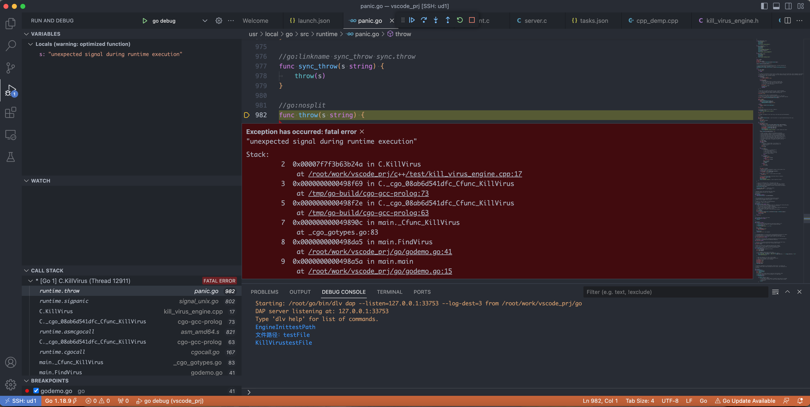
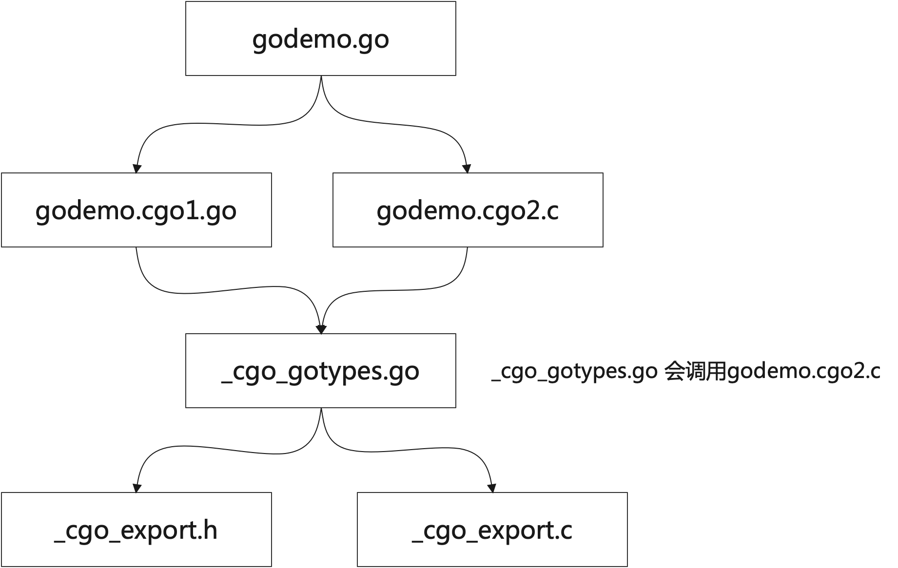

- cgo

## demo

`kill_virus_engine.h`
```c
#ifndef  __KILL_VIRUS_ENGINE_H__
#define  __KILL_VIRUS_ENGINE_H__

#ifdef __cplusplus
extern "C" {
#endif

extern int EngineInit(char *key_file_path);

extern int KillVirus(char *full_file_name, char *virus_name);

#ifdef __cplusplus
};
#endif

#endif // ! __KILL_VIRUS_ENGINE_H__
```

`kill_virus_engine.cpp`  
```c++
#include <stdio.h>
#include "kill_virus_engine.h"

int EngineInit(char *key_file_path)
{    
    AviraEngine *avira_instance = AviraEngine::GetInstance();
    return avira_instance->InitEngine(key_file_path);
}


int KillVirus(char *full_file_name, char *virus_name)
{
    
    return avira_instance->KillVirus(virus_name, full_file_name);
}
```

编译动态库`libkill_virus.so`: 
```sh
g++ -g kill_virus_engine.cpp -fPIC -shared -o libkill_virus.so
```

so文件路径为: `/root/work/vscode_prj/c++/test`  
增加`/etc/ld.so.conf.d/test.conf` 文件内容是`/root/work/vscode_prj/c++/test`, 最后执行`ldconfig`刷新  

查看依赖库是否添加成功:  
```sh
ldconfig -v | grep -i kill
/sbin/ldconfig.real: Path `/usr/lib' given more than once
        libkill_virus.so -> libkill_virus.so
```

当前的目录结构:  
```sh
~/work/vscode_prj/c++/test  ls -l
total 48
-rw-r--r-- 1 root root   350 Apr 27 03:19 kill_virus_engine.cpp
-rw-r--r-- 1 root root   280 Apr 27 03:14 kill_virus_engine.h
-rwxr-xr-x 1 root root 39152 Apr 27 03:20 libkill_virus.so
```

CGO文件编写:  
```go
package main

// #include "/root/work/vscode_prj/c++/test/kill_virus_engine.h"
// #cgo LDFLAGS: -L/root/work/vscode_prj/c++/test -lkill_virus
import "C"

import (
	"fmt"
)

func main() {
	InitVirusEngine("testPath")

	// 崩溃测试, CGO 异常无法捕获
	FindVirus("testFile")

	fmt.Println("Done!")
}

// InitVirusEngine 初始化病毒引擎，比较耗时，初始化一次即可
func InitVirusEngine(path string) {
	initPathString := C.CString(path)
	C.EngineInit(initPathString)
}

// FindVirus 从文件中查找病毒, 单线程，可以使用队列
// 如果没有病毒，返回空
// 如果发现病毒，有返回值，比如 PUA/CryptoMiner.Gen
func FindVirus(file string) string {
	defer func() {
		if err := recover(); err != nil {
			fmt.Println("捕获异常", err)
		}
	}()

	fmt.Println("文件路径：" + file)

	filePath := C.CString(file)
	result := C.CString("")

	C.KillVirus(filePath, result)
	return C.GoString(result)
}
```
> // #include  包含头文件路径  
> // #cgo LDFLAGS: -L 填写依赖库位置  


目前在测试CGO的同时，也测试如果C程序崩溃，GO能够捕获异常，测试结果是无法捕获异常。  

<br>
<div align=center>
    </img>  
</div>
<br>

可以看到调用栈:  
```sh
Exception has occurred: fatal error
"unexpected signal during runtime execution"
Stack:
	 2  0x00007f4b4d16f24a in C.KillVirus
	     at /root/work/vscode_prj/c++/test/kill_virus_engine.cpp:17
	 3  0x000000000049ef46 in C._cgo_aa8bfdfd1feb_Cfunc_KillVirus
	     at /tmp/go-build/cgo-gcc-prolog:73
	 5  0x000000000049ef0b in C._cgo_aa8bfdfd1feb_Cfunc_KillVirus
	     at /tmp/go-build/cgo-gcc-prolog:63
	 7  0x000000000049e8ec in main._Cfunc_KillVirus
	     at _cgo_gotypes.go:96
	 8  0x000000000049eca5 in main.FindVirus
	     at /root/work/vscode_prj/go/godemo.go:41
	 9  0x000000000049ea3a in main.main
	     at /root/work/vscode_prj/go/godemo.go:15
```

打开coredump之后，也没有core dumps文件生成。  

另外内存管理也不一样:  

> C 的内存需要用户控制申请和释放的时机  
> go 中用户申请内存后，由 GC 机制控制内存释放的策略

## cgo的原理

go build 参数:
```sh
        -a
                force rebuilding of packages that are already up-to-date.
        -work
                print the name of the temporary work directory and
                do not delete it when exiting.
        -x
                print the commands.
```

> 编译时最好加上`-a`,强制编译  保留临时文件:`-work`


```sh
go build -o demo -work -a 
WORK=/tmp/go-build2982106749
```

增加`-x`可以查看编译指令:  
```sh
/usr/local/go/pkg/tool/linux_amd64/link -o $WORK/b001/exe/a.out -importcfg $WORK/b001/importcfg.link -buildmode=exe -buildid=a4E4_ZlvzYTc1Wc1WarZ/ebEi9tR1Xo5xnHDK9SUw/Z376aeQYrte7OpzycLUY/a4E4_ZlvzYTc1Wc1WarZ -extld=gcc $WORK/b001/_pkg_.a
/usr/local/go/pkg/tool/linux_amd64/buildid -w $WORK/b001/exe/a.out # internal
mv $WORK/b001/exe/a.out demo
```

使用`go tool cgo godemo.go` 生成中间文件:  

```sh
ls -l _obj/
total 36
-rw-r--r-- 1 root root  886 Apr 27 06:39 _cgo_export.c
-rw-r--r-- 1 root root 1627 Apr 27 06:39 _cgo_export.h
-rw-r--r-- 1 root root   13 Apr 27 06:39 _cgo_flags
-rw-r--r-- 1 root root 3384 Apr 27 06:39 _cgo_gotypes.go
-rw-r--r-- 1 root root  611 Apr 27 06:39 _cgo_main.c
-rw-r--r-- 1 root root 5616 Apr 27 06:39 _cgo_.o
-rw-r--r-- 1 root root 1279 Apr 27 06:39 godemo.cgo1.go
-rw-r--r-- 1 root root 2975 Apr 27 06:39 godemo.cgo2.c
```

> 也可以到临时目录中查找   

<br>
<div align=center>
    </img>  
</div>
<br>

> 相当于go会包装一层，所有方法的调用都在:`_cgo_gotypes.go`  


`godemo.cgo2.c`  
```c
CGO_NO_SANITIZE_THREAD
void
_cgo_79dedd6cea9a_Cfunc_EngineInit(void *v)
{
	struct {
		char* p0;
		int r;
		char __pad12[4];
	} __attribute__((__packed__, __gcc_struct__)) *_cgo_a = v;
	char *_cgo_stktop = _cgo_topofstack();
	__typeof__(_cgo_a->r) _cgo_r;
	_cgo_tsan_acquire();
	_cgo_r = EngineInit(_cgo_a->p0);
	_cgo_tsan_release();
	_cgo_a = (void*)((char*)_cgo_a + (_cgo_topofstack() - _cgo_stktop));
	_cgo_a->r = _cgo_r;
	_cgo_msan_write(&_cgo_a->r, sizeof(_cgo_a->r));
}

CGO_NO_SANITIZE_THREAD
void
_cgo_79dedd6cea9a_Cfunc_KillVirus(void *v)
{
	struct {
		char* p0;
		char* p1;
		int r;
		char __pad20[4];
	} __attribute__((__packed__, __gcc_struct__)) *_cgo_a = v;
	char *_cgo_stktop = _cgo_topofstack();
	__typeof__(_cgo_a->r) _cgo_r;
	_cgo_tsan_acquire();
	_cgo_r = KillVirus(_cgo_a->p0, _cgo_a->p1);
	_cgo_tsan_release();
	_cgo_a = (void*)((char*)_cgo_a + (_cgo_topofstack() - _cgo_stktop));
	_cgo_a->r = _cgo_r;
	_cgo_msan_write(&_cgo_a->r, sizeof(_cgo_a->r));
}
```

`_cgo_gotypes.go`  
```c
//go:cgo_unsafe_args
func _Cfunc_EngineInit(p0 *_Ctype_char) (r1 _Ctype_int) {
	_cgo_runtime_cgocall(_cgo_79dedd6cea9a_Cfunc_EngineInit, uintptr(unsafe.Pointer(&p0)))
	if _Cgo_always_false {
		_Cgo_use(p0)
	}
	return
}

//go:linkname _cgo_runtime_gostring runtime.gostring
func _cgo_runtime_gostring(*_Ctype_char) string

// GoString converts the C string p into a Go string.
func _Cfunc_GoString(p *_Ctype_char) string {
	return _cgo_runtime_gostring(p)
}
//go:cgo_import_static _cgo_79dedd6cea9a_Cfunc_KillVirus
//go:linkname __cgofn__cgo_79dedd6cea9a_Cfunc_KillVirus _cgo_79dedd6cea9a_Cfunc_KillVirus
var __cgofn__cgo_79dedd6cea9a_Cfunc_KillVirus byte
var _cgo_79dedd6cea9a_Cfunc_KillVirus = unsafe.Pointer(&__cgofn__cgo_79dedd6cea9a_Cfunc_KillVirus)

//go:cgo_unsafe_args
func _Cfunc_KillVirus(p0 *_Ctype_char, p1 *_Ctype_char) (r1 _Ctype_int) {
	_cgo_runtime_cgocall(_cgo_79dedd6cea9a_Cfunc_KillVirus, uintptr(unsafe.Pointer(&p0)))
	if _Cgo_always_false {
		_Cgo_use(p0)
		_Cgo_use(p1)
	}
	return
}
```
