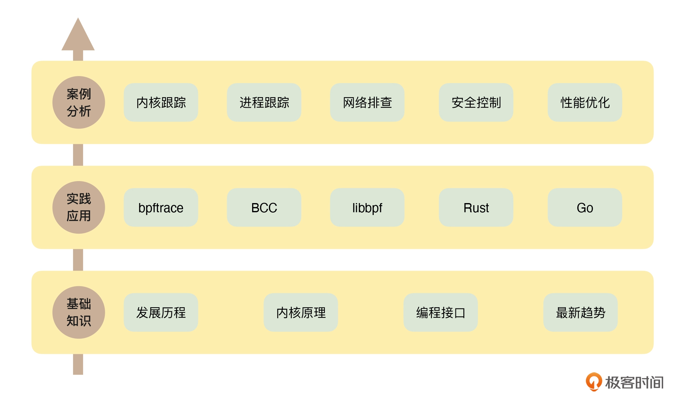

- # go-ebpf  

目录:  
- [ebpf](#ebpf)
  - [原理](#原理)
- [go-ebpf](#go-ebpf)
  - [demo-xdp-connect](#demo-xdp-connect)


## ebpf 
近年来，eBPF 在`故障诊断`、`网络优化`、`安全控制`、`性能监控`等领域获得大量应用，项目数量呈爆炸式增长。2021年8月12日， Linux 基金会旗下成立了 eBPF 基金会，一个激动人心的未来正在展开。  

作为一项革命性的技术，eBPF 的“魔力”在哪里？简单来说，`eBPF 使我们能够在不更改内核代码的前提下，实时获取和修改操作系统的行为。`这就意味着，eBPF 可以帮我们洞悉系统底层的“黑盒”，重新定义了我们思考操作系统的方式。  


ebpf的学习路线
<br>
<div align=center>
    </img>  
</div>
<br>

### 原理  
[what-is-ebpf](https://ebpf.io/what-is-ebpf)  

eBPF是一项革命性的技术，起源于 Linux 内核，可以在操作系统内核等特权上下文中运行`沙盒`程序。它用于安全有效地扩展内核的功能，而无需更改内核源代码或加载内核模块。  

从历史上看，由于内核具有监督和控制整个系统的特权能力，操作系统一直是实现可观察性、安全性和网络功能的理想场所。同时，操作系统内核由于其核心地位以及对稳定性和安全性的高要求，难以演进。因此，与在操作系统之外实现的功能相比，操作系统级别的创新率传统上较低。  

<br>
<div align=center>
    </img>  
</div>
<br>

eBPF 从根本上改变了这个公式。通过允许在操作系统中运行沙盒程序，应用程序开发人员可以运行 eBPF 程序以在运行时向操作系统添加额外的功能。然后，操作系统保证安全性和执行效率，就好像在即时 (JIT) 编译器和验证引擎的帮助下本地编译一样。这引发了一波基于 eBPF 的项目，涵盖了广泛的用例，包括下一代网络、可观察性和安全功能。

如今，eBPF 被广泛用于驱动各种用例：在现代数据中心和云原生环境中提供高性能网络和负载均衡，以低开销提取细粒度的安全可观察性数据，帮助应用程序开发人员跟踪应用程序，为性能故障排除、预防性应用程序和容器运行时安全实施等提供见解。可能性是无限的，eBPF 解锁的创新才刚刚开始。  


## go-ebpf  
ebpf-go 是一个纯 Go 库，可以加载、编译和调试 eBPF 程序。  

[github仓库](https://github.com/cilium/ebpf)   


### demo-xdp-connect   

编译环境配置
```shell
# Build all ELF binaries using a containerized LLVM toolchain.
container-all:
        ${CONTAINER_ENGINE} run --rm ${CONTAINER_RUN_ARGS} \
                -v "${REPODIR}":/ebpf -w /ebpf --env MAKEFLAGS \
                --env CFLAGS="-fdebug-prefix-map=/ebpf=." \
                --env HOME="/tmp" \
                --env GO111MODULE="on" \
                --env GOPROXY="https://goproxy.cn" \
                "${IMAGE}:${VERSION}" \
                $(MAKE) all
``` 

> 需要配置go proxy， 不然依赖库无法下载  

运行方法
```shell
cd ebpf/examples/
go run -exec sudo [./kprobe, ./uretprobe, ./ringbuffer, ...]
```

[demo参考文章](https://www.ebpf.top/post/ebpf_go_translation/)  

