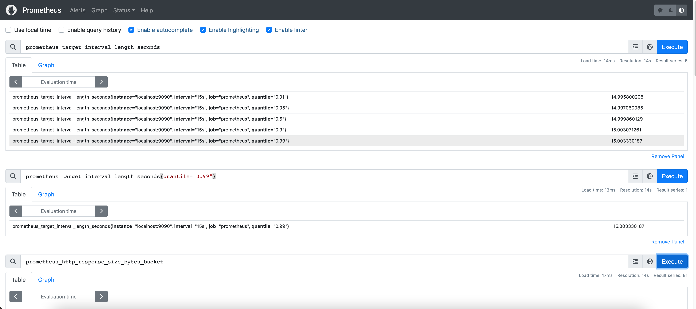
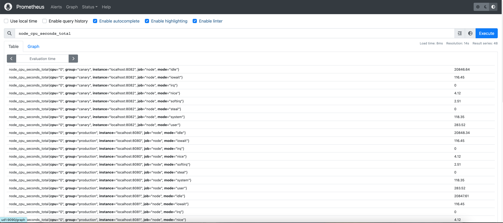
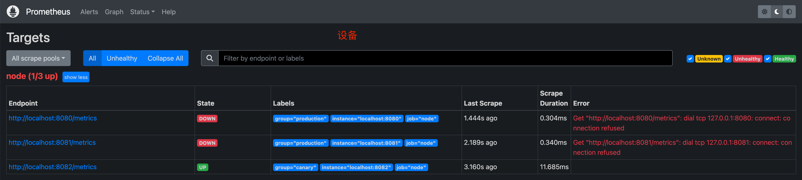
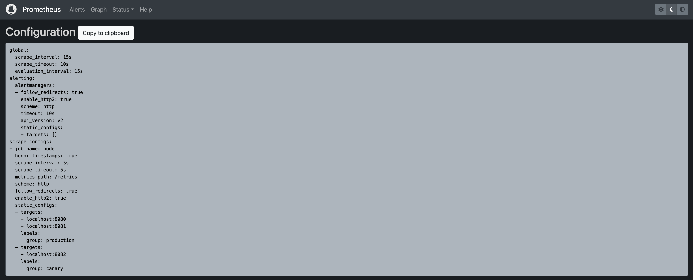
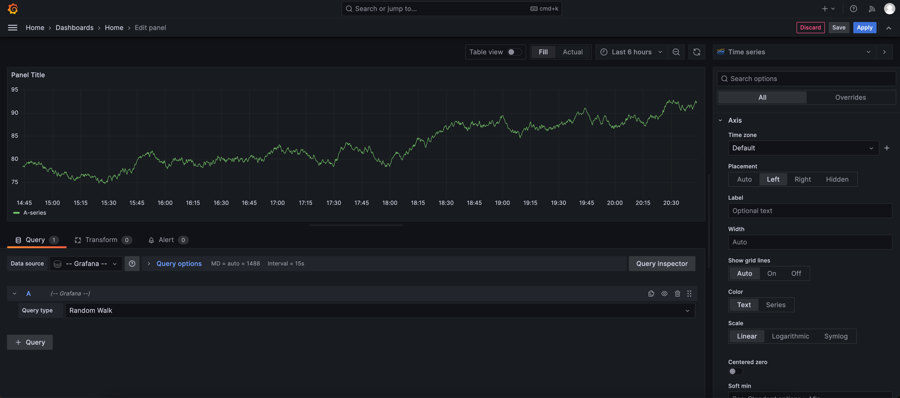
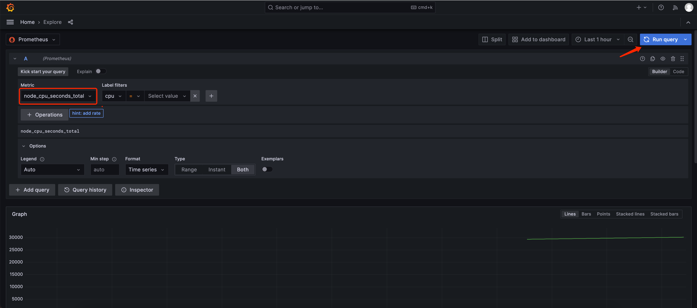
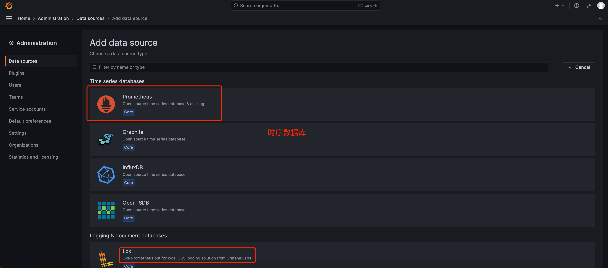
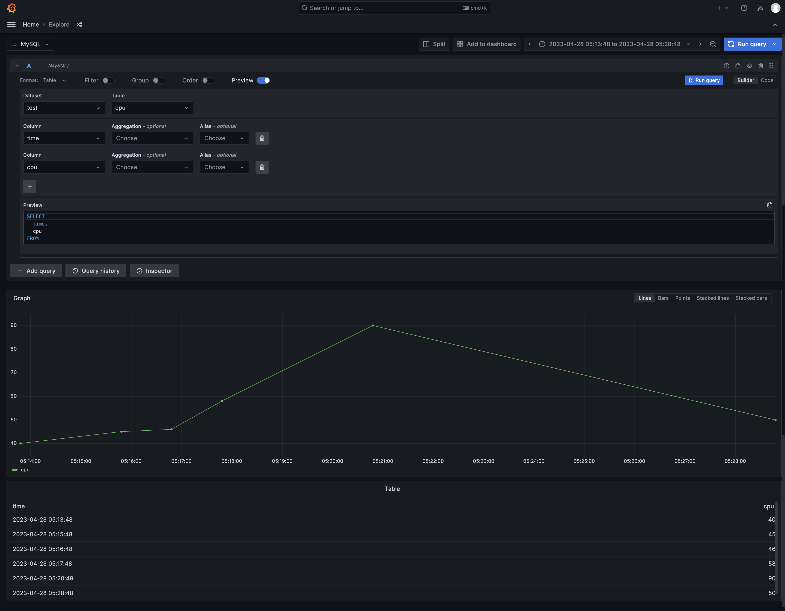

- # prometheus-grafana  

- [环境搭建](#环境搭建)
  - [prometheus](#prometheus)
  - [grafana](#grafana)


## 环境搭建  
### prometheus
https://prometheus.io/  

https://prometheus.io/docs/prometheus/latest/getting_started/  

```sh
wget https://github.com/prometheus/prometheus/releases/download/v2.44.0-rc.0/prometheus-2.44.0-rc.0.linux-amd64.tar.gz  
tar xvfz prometheus-*.tar.gz
cd prometheus-*
```

配置`prometheus.yml`  
```yml
global:
  scrape_interval:     15s # By default, scrape targets every 15 seconds.

  # Attach these labels to any time series or alerts when communicating with
  # external systems (federation, remote storage, Alertmanager).
  external_labels:
    monitor: 'codelab-monitor'

# A scrape configuration containing exactly one endpoint to scrape:
# Here it's Prometheus itself.
scrape_configs:
  # The job name is added as a label `job=<job_name>` to any timeseries scraped from this config.
  - job_name: 'prometheus'

    # Override the global default and scrape targets from this job every 5 seconds.
    scrape_interval: 5s

    static_configs:
      - targets: ['localhost:9090']
```

启动  
```sh
./prometheus --config.file=prometheus.yml
```

`http://localhost:9090/metrics`查看所有的数据  


<br>
<div align=center>
    </img>  
</div>
<br>


https://github.com/prometheus/node_exporter  
https://github.com/prometheus/mysqld_exporter  

```sh
tar -xzvf node_exporter-*.*.tar.gz
cd node_exporter-*.*

# Start 3 example targets in separate terminals:
./node_exporter --web.listen-address 0.0.0.0:8080
./node_exporter --web.listen-address 0.0.0.0:8081
./node_exporter --web.listen-address 0.0.0.0:8082
```

可以查看配置  
http://localhost:8080/metrics  
http://localhost:8081/metrics  
http://localhost:8082/metrics  

配置Prometheus监听这些数据:  

```sh
scrape_configs:
  - job_name:       'node'

    # Override the global default and scrape targets from this job every 5 seconds.
    scrape_interval: 5s

    static_configs:
      - targets: ['localhost:8080', 'localhost:8081']
        labels:
          group: 'production'

      - targets: ['localhost:8082']
        labels:
          group: 'canary'
```

<br>
<div align=center>
    </img>  
</div>
<br>

`node_cpu_seconds_total{instance="localhost:8080"}` 查到的数据:  
```sh
node_cpu_seconds_total{cpu="0", group="production", instance="localhost:8080", job="node", mode="idle"}
20986.74
node_cpu_seconds_total{cpu="0", group="production", instance="localhost:8080", job="node", mode="iowait"}
117.21
node_cpu_seconds_total{cpu="0", group="production", instance="localhost:8080", job="node", mode="irq"}
0
node_cpu_seconds_total{cpu="0", group="production", instance="localhost:8080", job="node", mode="nice"}
4.12
node_cpu_seconds_total{cpu="0", group="production", instance="localhost:8080", job="node", mode="softirq"}
2.53
node_cpu_seconds_total{cpu="0", group="production", instance="localhost:8080", job="node", mode="steal"}
0
node_cpu_seconds_total{cpu="0", group="production", instance="localhost:8080", job="node", mode="system"}
118.47
node_cpu_seconds_total{cpu="0", group="production", instance="localhost:8080", job="node", mode="user"}
283.84
node_cpu_seconds_total{cpu="1", group="production", instance="localhost:8080", job="node", mode="idle"}
20941.04
node_cpu_seconds_total{cpu="1", group="production", instance="localhost:8080", job="node", mode="iowait"}
153.79
node_cpu_seconds_total{cpu="1", group="production", instance="localhost:8080", job="node", mode="irq"}
0
node_cpu_seconds_total{cpu="1", group="production", instance="localhost:8080", job="node", mode="nice"}
4.38
node_cpu_seconds_total{cpu="1", group="production", instance="localhost:8080", job="node", mode="softirq"}
3.65
node_cpu_seconds_total{cpu="1", group="production", instance="localhost:8080", job="node", mode="steal"}
0
node_cpu_seconds_total{cpu="1", group="production", instance="localhost:8080", job="node", mode="system"}
118.49
node_cpu_seconds_total{cpu="1", group="production", instance="localhost:8080", job="node", mode="user"}
286.06
```

节点状态:  
<br>
<div align=center>
    </img>  
</div>
<br>

系统配置:  
<br>
<div align=center>
    </img>  
</div>
<br>

### grafana

https://grafana.com/docs/grafana/latest/  

https://grafana.com/docs/grafana/latest/setup-grafana/installation/debian/  
```sh
sudo apt-get install -y adduser libfontconfig1
wget https://dl.grafana.com/enterprise/release/grafana-enterprise_9.5.1_amd64.deb
sudo dpkg -i grafana-enterprise_9.5.1_amd64.deb
```

启动
```sh
sudo systemctl daemon-reload
sudo systemctl start grafana-server
sudo systemctl status grafana-server
```

启动参数:  
```sh
/usr/share/grafana/bin/grafana server --config=/etc/grafana/grafana.ini --pidfile=/run/grafana/grafana-server.pid
```

访问:`http://localhost:3000`, 用户名和密码: `admin`  


<br>
<div align=center>
    </img>  
</div>
<br>

grafana配置  

https://grafana.com/docs/grafana/latest/setup-grafana/configure-grafana/  

> 也需要配置时区  

## 应用  
### prometheus+grafana 

启动prometheus之后，在启动一个节点，监听`./node_exporter --web.listen-address 0.0.0.0:8082`   

grafana首页，点击`Add data source`，选择`Prometheus`, 

<br>
<div align=center>
    </img>  
</div>
<br>


### prometheus  

<br>
<div align=center>
    </img>  
</div>
<br>

>  prometheus 时序数据库  


### mysql  

在数据源配置mysql  

<br>
<div align=center>
    </img>  
</div>
<br>

mysql后台更新数据,granfana其实已经同步了数据,只是视图范围没有更新`zoom`


### logging  日志统计  

- ELK ：用Logstash收集和处理日志；将数据存储到ElasticSearch进行索引；用Kibana进行可视化显示；  
- Loki:   Loki 操作更简单，运行成本更低，promtail收集日志，Grafana不用多说，界面酷炫！  
- Graylog: Elasticsearch用来持久化存储和检索日志文件数据(IO 密集), MongoDb用来存储关于 Graylog 的相关配置, Graylog来提供 Web 界面和对外接口的(CPU 密集)。 

> 还有一个日志中间件备选:  Fluentd  

可以把不同设备、系统、应用的日志收集在一起，包含coredumps文件等。统一存储及管理，方便分析及定位问题。  

<br>
<div align=center>
    </img>  
</div>
<br>

- Installing Loki
- Installing Promtail

https://github.com/grafana/loki   

```sh
$ curl -O -L "https://github.com/grafana/loki/releases/download/v2.8.1/loki-linux-amd64.zip"
# extract the binary
$ unzip "loki-linux-amd64.zip"
# make sure it is executable
$ chmod a+x "loki-linux-amd64"
```

<br>
<div align=center>
    </img>  
</div>
<br>

