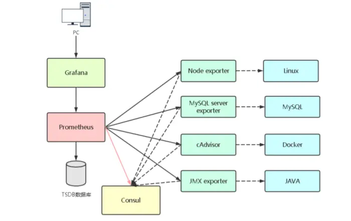
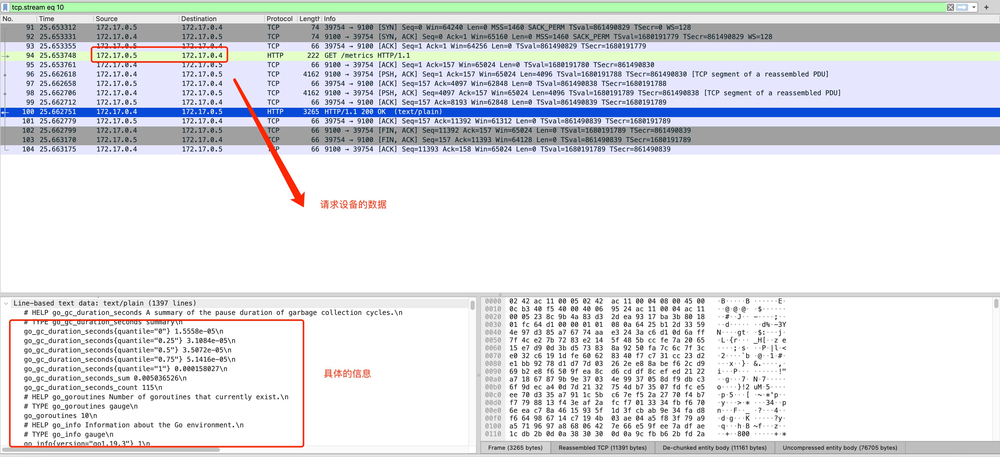

- # prometheus-grafana  

https://github.com/yunlzheng/prometheus-book

- [环境搭建](#环境搭建)
  - [prometheus](#prometheus)
  - [prometheus-docker](#prometheus-docker)
  - [grafana](#grafana)
  - [grafana-docker](#grafana-docker)
- [应用](#应用)
  - [prometheus+grafana](#prometheusgrafana)
  - [prometheus](#prometheus-1)
    - [自定义监控指标](#自定义监控指标)
    - [prometheus.yml](#prometheusyml)
  - [mysql](#mysql)
  - [logging  日志统计](#logging--日志统计)

## 环境搭建  
### prometheus
https://prometheus.io/  

https://prometheus.io/docs/prometheus/latest/getting_started/  

```sh
wget https://github.com/prometheus/prometheus/releases/download/v2.44.0-rc.0/prometheus-2.44.0-rc.0.linux-amd64.tar.gz  
tar xvfz prometheus-*.tar.gz
cd prometheus-*
```

配置`prometheus.yml`  
```yml
global:
  scrape_interval:     15s # By default, scrape targets every 15 seconds.

  # Attach these labels to any time series or alerts when communicating with
  # external systems (federation, remote storage, Alertmanager).
  external_labels:
    monitor: 'codelab-monitor'

# A scrape configuration containing exactly one endpoint to scrape:
# Here it's Prometheus itself.
scrape_configs:
  # The job name is added as a label `job=<job_name>` to any timeseries scraped from this config.
  - job_name: 'prometheus'

    # Override the global default and scrape targets from this job every 5 seconds.
    scrape_interval: 5s

    static_configs:
      - targets: ['localhost:9090']
```

启动  
```sh
./prometheus --config.file=prometheus.yml
```

`http://localhost:9090/metrics`查看所有的数据  


<br>
<div align=center>
    </img>  
</div>
<br>


https://github.com/prometheus/node_exporter  
https://github.com/prometheus/mysqld_exporter  

```sh
tar -xzvf node_exporter-*.*.tar.gz
cd node_exporter-*.*

# Start 3 example targets in separate terminals:
./node_exporter --web.listen-address 0.0.0.0:8080
./node_exporter --web.listen-address 0.0.0.0:8081
./node_exporter --web.listen-address 0.0.0.0:8082
```

可以查看配置  
http://localhost:8080/metrics  
http://localhost:8081/metrics  
http://localhost:8082/metrics  

配置Prometheus监听这些数据:  

```sh
scrape_configs:
  - job_name:       'node'

    # Override the global default and scrape targets from this job every 5 seconds.
    scrape_interval: 5s

    static_configs:
      - targets: ['localhost:8080', 'localhost:8081']
        labels:
          group: 'production'

      - targets: ['localhost:8082']
        labels:
          group: 'canary'
```

<br>
<div align=center>
    </img>  
</div>
<br>

`node_cpu_seconds_total{instance="localhost:8080"}` 查到的数据:  
```sh
node_cpu_seconds_total{cpu="0", group="production", instance="localhost:8080", job="node", mode="idle"}
20986.74
node_cpu_seconds_total{cpu="0", group="production", instance="localhost:8080", job="node", mode="iowait"}
117.21
node_cpu_seconds_total{cpu="0", group="production", instance="localhost:8080", job="node", mode="irq"}
0
node_cpu_seconds_total{cpu="0", group="production", instance="localhost:8080", job="node", mode="nice"}
4.12
node_cpu_seconds_total{cpu="0", group="production", instance="localhost:8080", job="node", mode="softirq"}
2.53
node_cpu_seconds_total{cpu="0", group="production", instance="localhost:8080", job="node", mode="steal"}
0
node_cpu_seconds_total{cpu="0", group="production", instance="localhost:8080", job="node", mode="system"}
118.47
node_cpu_seconds_total{cpu="0", group="production", instance="localhost:8080", job="node", mode="user"}
283.84
node_cpu_seconds_total{cpu="1", group="production", instance="localhost:8080", job="node", mode="idle"}
20941.04
node_cpu_seconds_total{cpu="1", group="production", instance="localhost:8080", job="node", mode="iowait"}
153.79
node_cpu_seconds_total{cpu="1", group="production", instance="localhost:8080", job="node", mode="irq"}
0
node_cpu_seconds_total{cpu="1", group="production", instance="localhost:8080", job="node", mode="nice"}
4.38
node_cpu_seconds_total{cpu="1", group="production", instance="localhost:8080", job="node", mode="softirq"}
3.65
node_cpu_seconds_total{cpu="1", group="production", instance="localhost:8080", job="node", mode="steal"}
0
node_cpu_seconds_total{cpu="1", group="production", instance="localhost:8080", job="node", mode="system"}
118.49
node_cpu_seconds_total{cpu="1", group="production", instance="localhost:8080", job="node", mode="user"}
286.06
```

节点状态:  
<br>
<div align=center>
    </img>  
</div>
<br>

系统配置:  
<br>
<div align=center>
    </img>  
</div>
<br>

### prometheus-docker
https://hub.docker.com/r/prom/prometheus/  

独立安装:
```sh
docker run \
    -p 9090:9090 \
    --name prometheus \
    -itd \
    prom/prometheus
```

```sh
docker run \
    -p 9090:9090 \
    --name prometheus \
    -itd \
    -v /path/to/prometheus.yml:/etc/prometheus/prometheus.yml \
    prom/prometheus
```

http://localhost:9090/  

使用docker启动一个ubuntu容器，`docker run --privileged=true -itd --name ssh-ubuntu -p 9100:9100 -p 222:22 atxiaoming/ssh-ubuntu:20.04`, 连接使用`ssh -p 222 root@localhost`, 密码123456  
安装一个node  
https://github.com/prometheus/node_exporter  

```sh
wget https://github.com/prometheus/node_exporter/releases/download/v1.5.0/node_exporter-1.5.0.linux-amd64.tar.gz  

tar -zxvf node_exporter-*linux-amd64.tar.gz
```

查看帮助指令:
```sh
usage: node_exporter [<flags>]

Flags:
  -h, --help                     Show context-sensitive help (also try --help-long and --help-man).
      --collector.arp.device-include=COLLECTOR.ARP.DEVICE-INCLUDE  
                                 Regexp of arp devices to include (mutually exclusive to device-exclude).
      --collector.cpu.info       Enables metric cpu_info
      --collector.diskstats.device-include=COLLECTOR.DISKSTATS.DEVICE-INCLUDE  
                                 Regexp of diskstats devices to include (mutually exclusive to device-exclude).
      --collector.ethtool.device-include=COLLECTOR.ETHTOOL.DEVICE-INCLUDE 
```

运行客户端:`./node_exporter --web.listen-address 0.0.0.0:9100`  

静态配置的局限性，可以使用自动发现:  
- 基于文件的服务发现
- 基于API的服务发现  

这里使用基于`Consul`服务发现  

<br>
<div align=center>
    </img>  
</div>
<br>

启动单节点consul服务:  
https://hub.docker.com/_/consul  
```sh
$ docker run --name consul -d -p 8500:8500 consul
```

访问: http://localhost:8500  , ip地址为:`172.17.0.5`  

通过api注册node_exporter, 在node节点运行:  
```sh
$ curl -X PUT -d '{"id": "node-exporter","name": "node-exporter-172.17.0.5","address": "172.17.0.5","port": 9100,"tags": ["test"],"checks": [{"http": "http://172.17.0.5:9100/metrics", "interval": "5s"}]}'  http://172.17.0.4:8500/v1/agent/service/register
```

这是可以在`consul`看见`node-exporter-172.17.0.4`节点  

注销服务:`$ curl -X PUT http://172.17.0.5:8500/v1/agent/service/deregister/node-exporter`  


配置 Prometheus 实现自动服务发现`prometheus.yml`  
```sh
...
- job_name: 'consul-prometheus'
  consul_sd_configs:
  - server: '172.17.0.5:8500'
    services: []  
```

使用`http:localhost:9090/targets`
```
可以看到设备: http://172.17.0.4:9100/metrics UP instance="172.17.0.4:9100" job="consul-prometheus"  
```

通过`http://localhost:9090/service-discovery?search=`可以看到`consul-prometheus`注册了多少服务  

http://localhost:9100/metrics  可以看到数据  

<br>
<div align=center>
    </img>  
</div>
<br>

### grafana

https://grafana.com/docs/grafana/latest/  

https://grafana.com/docs/grafana/latest/setup-grafana/installation/debian/  
```sh
sudo apt-get install -y adduser libfontconfig1
wget https://dl.grafana.com/enterprise/release/grafana-enterprise_9.5.1_amd64.deb
sudo dpkg -i grafana-enterprise_9.5.1_amd64.deb
```

启动
```sh
sudo systemctl daemon-reload
sudo systemctl start grafana-server
sudo systemctl status grafana-server
```

启动参数:  
```sh
/usr/share/grafana/bin/grafana server --config=/etc/grafana/grafana.ini --pidfile=/run/grafana/grafana-server.pid
```

访问:`http://localhost:3000`, 用户名和密码: `admin`  


<br>
<div align=center>
    </img>  
</div>
<br>

grafana配置  

https://grafana.com/docs/grafana/latest/setup-grafana/configure-grafana/  

> 也需要配置时区  

### grafana-docker
```sh
docker run -itd \
  -p 3000:3000 \
  --name=grafana \
  grafana/grafana-enterprise
```

>   -e "GF_INSTALL_PLUGINS=grafana-clock-panel,grafana-simple-json-datasource" \  

## 应用  
### prometheus+grafana 

启动prometheus之后，在启动一个节点，监听`./node_exporter --web.listen-address 0.0.0.0:8082`   

grafana首页，点击`Add data source`，选择`Prometheus`, 

<br>
<div align=center>
    </img>  
</div>
<br>


### prometheus  

<br>
<div align=center>
    </img>  
</div>
<br>

>  prometheus 时序数据库  

如果使用docker搭建，直接填写容器ip地址`http://172.17.0.2:9090`  

时序数据库 (Time Series Database, TSDB) 是数据库大家庭中的一员，专门存储随时间变化的数据，如股票价格、传感器数据、机器状态监控等等。时序 (Time Series) 指的是某个变量随时间变化的所有历史，而样本 (Sample) 指的是历史中该变量的瞬时值。  

prometheus数据存储结构:  
https://www.vldb.org/pvldb/vol8/p1816-teller.pdf  
https://xie.infoq.cn/article/9071f261190acbdf73dfcf4d7  


```sh
# HELP node_cpu_seconds_total Seconds the CPUs spent in each mode.
# TYPE node_cpu_seconds_total counter
node_cpu_seconds_total{cpu="0",mode="idle"} 2413.11
node_cpu_seconds_total{cpu="0",mode="iowait"} 3.68
node_cpu_seconds_total{cpu="0",mode="irq"} 0
node_cpu_seconds_total{cpu="0",mode="nice"} 0
node_cpu_seconds_total{cpu="0",mode="softirq"} 0.78
node_cpu_seconds_total{cpu="0",mode="steal"} 0
node_cpu_seconds_total{cpu="0",mode="system"} 16.6
node_cpu_seconds_total{cpu="0",mode="user"} 14.25
node_cpu_seconds_total{cpu="1",mode="idle"} 2416.71
node_cpu_seconds_total{cpu="1",mode="iowait"} 3.73
node_cpu_seconds_total{cpu="1",mode="irq"} 0
node_cpu_seconds_total{cpu="1",mode="nice"} 0
node_cpu_seconds_total{cpu="1",mode="softirq"} 0.73
node_cpu_seconds_total{cpu="1",mode="steal"} 0
node_cpu_seconds_total{cpu="1",mode="system"} 15.12
node_cpu_seconds_total{cpu="1",mode="user"} 14.24
node_cpu_seconds_total{cpu="2",mode="idle"} 2412.79
node_cpu_seconds_total{cpu="2",mode="iowait"} 2.78
node_cpu_seconds_total{cpu="2",mode="irq"} 0
node_cpu_seconds_total{cpu="2",mode="nice"} 0
node_cpu_seconds_total{cpu="2",mode="softirq"} 0.81
node_cpu_seconds_total{cpu="2",mode="steal"} 0
node_cpu_seconds_total{cpu="2",mode="system"} 16.95
node_cpu_seconds_total{cpu="2",mode="user"} 13.82
```

过滤:`node_cpu_seconds_total{mode="system"}`

NodeExporter 业务数据源, 业务数据源通过 Pull/Push 两种方式推送数据到 Prometheus Server。  

Prometheus 通过配置报警规则，如果符合报警规则，那么就将报警推送到 AlertManager，由其进行报警处理。  


```sh
node_boot_time：系统启动时间
node_cpu：系统CPU使用量
nodedisk*：磁盘IO
nodefilesystem*：文件系统用量
node_load1：系统负载
node_memeory*：内存使用量
node_network*：网络带宽
node_time：当前系统时间
go_*：node exporter中go相关指标
process_*：node exporter自身进程相关运行指标
```

节点的数据的说明: https://github.com/prometheus/node_exporter  

#### 自定义监控指标  

可以通过github种的`Textfile Collector`章节查看详情。  

demo: https://github.com/prometheus-community/node-exporter-textfile-collector-scripts/blob/master/directory-size.sh  

格式:  https://prometheus.io/docs/instrumenting/exposition_formats/  

`node_exporter` 除了本身可以收集系统指标之外，还可以通过 `textfile` 模块来采集我们自定义的监控指标，这对于系统监控提供了更灵活的使用空间，比如我们通过脚本采集的监控数据就可以通过该模块暴露出去，用于 Prometheus 进行监控报警。  

默认情况下 node_exporter 会启用 textfile 组建，但是需要使用 `--collector.textfile.directory` 参数设置一个用于采集的路径，所有生成的监控指标将放在该目录下，并以 .prom 文件名后缀结尾。  

创建文件夹`/var/lib/node_exporter`, 修改启动参数:`./node_exporter --collector.textfile.directory=/var/lib/node_exporter`

`directory-size.sh`
```sh
#!/bin/sh
#
# Expose directory usage metrics, passed as an argument.
#
# Usage: add this to crontab:
#
# */5 * * * * prometheus directory-size.sh /var/lib/prometheus | sponge /var/lib/node_exporter/directory_size.prom
#
# sed pattern taken from https://www.robustperception.io/monitoring-directory-sizes-with-the-textfile-collector/
#
# Author: Antoine Beaupré <anarcat@debian.org>
echo "# HELP node_directory_size_bytes Disk space used by some directories"
echo "# TYPE node_directory_size_bytes gauge"
du --block-size=1 --summarize "$@" \
  | sed -ne 's/\\/\\\\/;s/"/\\"/g;s/^\([0-9]\+\)\t\(.*\)$/node_directory_size_bytes{directory="\2"} \1/p'
```

安装`apt install cron`, 增加定时任务:  
```sh
$ crontab -l -u root
no crontab for root

systemctl start cron.service 
systemctl enable cron.service 
systemctl status cron.service 

chmod +x /root/directory-size.sh

apt install moreutils

crontab -e 
*/5 * * * * /root/directory-size.sh /var/lib/prometheus | sponge /var/lib/node_exporter/directory_size.prom  

# 移除
crontab -r
```

查看文件:  
```sh
# HELP node_directory_size_bytes Disk space used by some directories
# TYPE node_directory_size_bytes gauge
node_directory_size_bytes{directory="/var/lib/prometheus"} 4096
```

> http://localhost:9100/metrics 显示的信息是一样的  

#### prometheus.yml  
```yaml
# my global config
global:
  scrape_interval: 15s # Set the scrape interval to every 15 seconds. Default is every 1 minute.
  evaluation_interval: 15s # Evaluate rules every 15 seconds. The default is every 1 minute.
  # scrape_timeout is set to the global default (10s).

# Alertmanager configuration
alerting:
  alertmanagers:
    - static_configs:
        - targets:
          # - alertmanager:9093

# Load rules once and periodically evaluate them according to the global 'evaluation_interval'.
rule_files:
  # - "first_rules.yml"
  # - "second_rules.yml"

# A scrape configuration containing exactly one endpoint to scrape:
# Here it's Prometheus itself.
scrape_configs:
  # The job name is added as a label `job=<job_name>` to any timeseries scraped from this config.
  - job_name: "prometheus"

    # metrics_path defaults to '/metrics'
    # scheme defaults to 'http'.

    static_configs:
      - targets: ["localhost:9090"]
  - job_name: 'consul-prometheus'
    consul_sd_configs:
      - server: '172.17.0.4:8500'
        services: []  

```

### mysql  

在数据源配置mysql  

<br>
<div align=center>
    </img>  
</div>
<br>

mysql后台更新数据,granfana其实已经同步了数据,只是视图范围没有更新`zoom`


### logging  日志统计  

- ELK ：用Logstash收集和处理日志；将数据存储到ElasticSearch进行索引；用Kibana进行可视化显示；  
- Loki:   Loki 操作更简单，运行成本更低，promtail收集日志，Grafana不用多说，界面酷炫！  
- Graylog: Elasticsearch用来持久化存储和检索日志文件数据(IO 密集), MongoDb用来存储关于 Graylog 的相关配置, Graylog来提供 Web 界面和对外接口的(CPU 密集)。 

> 还有一个日志中间件备选:  Fluentd  

可以把不同设备、系统、应用的日志收集在一起，包含coredumps文件等。统一存储及管理，方便分析及定位问题。  

<br>
<div align=center>
    </img>  
</div>
<br>

- Installing Loki
- Installing Promtail

https://github.com/grafana/loki   

```sh
$ curl -O -L "https://github.com/grafana/loki/releases/download/v2.8.1/loki-linux-amd64.zip"
# extract the binary
$ unzip "loki-linux-amd64.zip"
# make sure it is executable
$ chmod a+x "loki-linux-amd64"
```

<br>
<div align=center>
    </img>  
</div>
<br>

