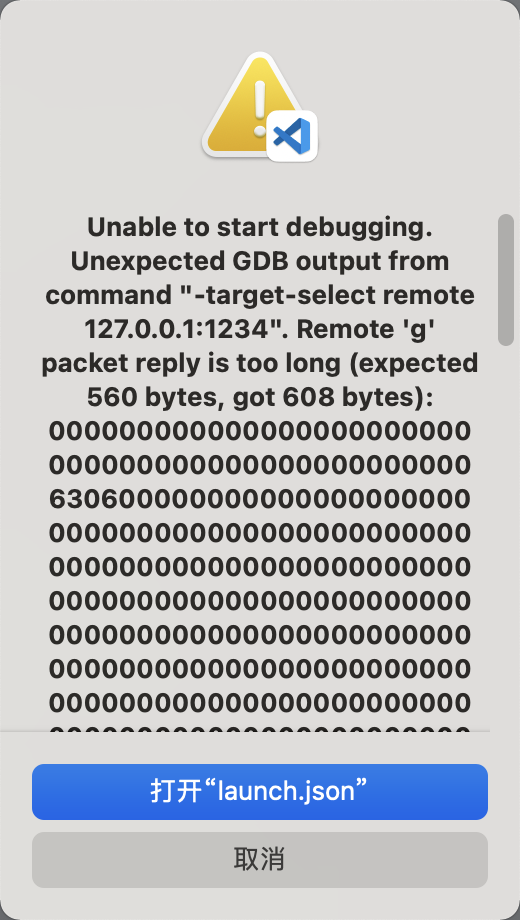
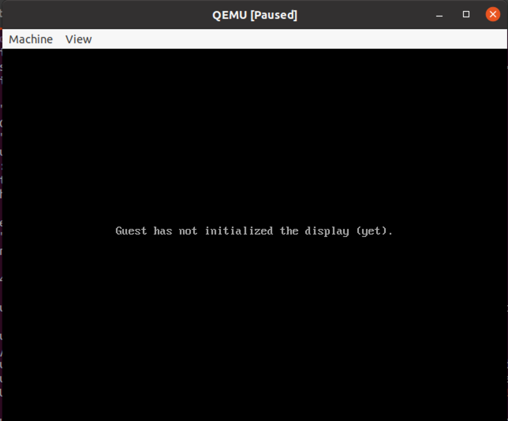
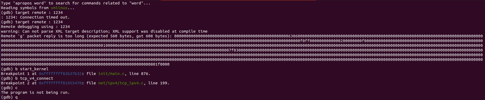
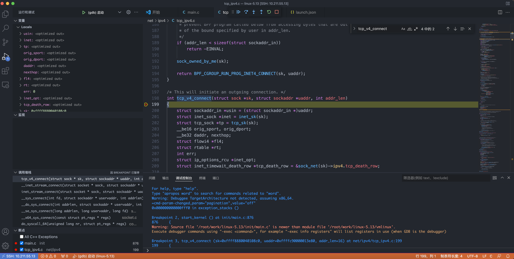

# ubuntu20 搭建内核调试环境  

搭建 linux 内核的调试环境
- 编译内核  
- 制作文件系统及启动程序 
- qemu 模拟器运行linux 
- 通过gdb或vscode调试内核源码

整体环境: macos + pd(vmware) + ubuntu + gdb + qemu + linux kernel 

## 安装ubuntu系统  
> 目前需要安装桌面版本，服务器版本不能启动虚拟机界面。  

下载镜像，安装系统。 我这里使用的是 `parallels desktop`,其他虚拟机也行。  

## 配置基础环境  

```shell
# 设置 root 密码。
sudo passwd root
# 切换 root 用户。
su root 

# 安装部分工具。
apt-get install vim git tmux openssh-server -y

vi /etc/ssh/sshd_config

# root用户远程登录。
PermitRootLogin yes 

# 重启sshd 
service sshd restart 

```

## 下载编译 linux 内核 
[github内核仓库]
```
# 下载源码
mkdir /root/work
wget https://github.com/torvalds/linux/archive/refs/tags/v5.13.tar.gz -O linux-5.13.tar.gz
tar -zxvf linux-5.13.tar.gz
cd linux-5.13 

# 安装编译依赖组件。
apt install build-essential flex bison libssl-dev libelf-dev libncurses-dev -y

# 设置调试的编译菜单。
make x86_64_defconfig
make menuconfig

# 下面选项如果没有选上的，选上（点击空格键），然后 save 保存设置，退出 exit。
##################################################################
Kernel hacking  --->
    Compile-time checks and compiler options  ---> 
        [*] Compile the kernel with debug info
            [*] Provide GDB scripts for kernel debugging
##################################################################

# 编译内核。
make -j4
```

## 源码安装 gdb
> 为什么要源码安装呢？后面使用qemu启动内核时，通过gdb调试时，会有一个错误，我们需要屏蔽它。  

<br>
<div align=center>
    </img>  
</div>
<br>

源码安装高版本的 gdb 8.3.1 

```shell
# 如果已安装gdb，请删除 gdb
gdb -v | grep gdb
apt remove gdb -y

# 下载解压 gdb
cd /root/work
wget http://ftp.gnu.org/gnu/gdb/gdb-8.3.1.tar.gz
tar -zxvf gdb-8.3.1.tar.gz

# 修改 gdb/remote.c 代码。
cd gdb-8.3.1
vim gdb/remote.c

```

注释一部分代码: 
```
/* Further sanity checks, with knowledge of the architecture.  */
// if (buf_len > 2 * rsa->sizeof_g_packet)
//   error (_("Remote 'g' packet reply is too long (expected %ld bytes, got %d "
//      "bytes): %s"),
//    rsa->sizeof_g_packet, buf_len / 2,
//    rs->buf.data ());

// 其他代码不动
  /* Save the size of the packet sent to us by the target.  It is used
     as a heuristic when determining the max size of packets that the
     target can safely receive.  */
  if (rsa->actual_register_packet_size == 0)
    rsa->actual_register_packet_size = buf_len;  
    ...
```

编译安装
```shell
./configure
make -j4
make install

# 校验一下版本对不对 
gcc -v
```

## gdb 调试内核 
因为linux内核是运行在虚拟中的，需要通过gdb远程调试。  

```shell
# 安装 qemu 模拟器，以及相关组件。 
qemu qemu-utils qemu-kvm virt-manager libvirt-daemon-system libvirt-clients bridge-utils -y

# 虚拟机进入 linux 内核源码目录。
cd /root/work/linux-5.13  

# 从 github 下载内核测试源码, 如果虚拟机无法访问github，下载离线包即可  
# git clone https://github.com/ymm135/kernel_test.git
wget https://github.com/ymm135/kernel_test/archive/refs/tags/v1.0.tar.gz -O kernel_test.tar.gz
# tar -zxvf kernel_test.tar.gz
# mv kernel_test

# 进入测试源码目录。
cd kernel_test/test_epoll_thundering_herd
# make 编译
make
# 通过 qemu 启动内核测试用例。
make rootfs
# 在 qemu 窗口输入小写字符 's', 启动测试用例服务程序。
s
# 在 qemu 窗口输入小写字符 'c', 启动测试用例客户端程序。
c
```

<br>
<div align=center>
    </img>  
</div>
<br>


```shell
# 通过 qemu 命令启动内核测试用例进行调试。
qemu-system-x86_64 -kernel ../../arch/x86/boot/bzImage -initrd ../rootfs.img -append nokaslr -S -s
# 在 qemu 窗口输入小写字符 's', 启动测试用例服务程序。
s
# 在 qemu 窗口输入小写字符 'c', 启动测试用例客户端程序。
c
```

> 界面会出现 `guest has not initialized the display(yet)` ，这个不影响，因为我们增加`-S`参数，所以启动时暂停了  

<br>
<div align=center>
    </img>  
</div>
<br>

```
# gdb 调试命令。
gdb vmlinux
target remote :1234
b start_kernel
b tcp_v4_connect
c
focus
bt
```

<br>
<div align=center>
    </img>  
</div>
<br>

> 有时 `c` 会提示`The program is not being run`, 但是使用vscode远程调试就不会，可以直接进入IDE调试  

## vscode 远程调试  
首选vscode需要安装`remote-ssh`插件，配置好链接: 
`10.211.55.13` 虚拟机IP地址  
```shell
Host 10.211.55.13
HostName 10.211.55.13
User root
```

安装调试插件`C/C++ Extension Pack`, 打开ubuntu虚拟机目录: `/root/work/linux-5.13`

写好配置文件: 
```json
{
    "version": "0.2.0",
    "configurations": [
        {
            "name": "gdb内核启动",
            "type": "cppdbg",
            "request": "launch",
            "miDebuggerServerAddress": "127.0.0.1:1234",
            "program": "${workspaceFolder}/vmlinux",
            "args": [],
            "stopAtEntry": false,
            "cwd": "${fileDirname}",
            "environment": [],
            "externalConsole": false,
            "MIMode": "gdb",
            "setupCommands": [
                {
                    "description": "为 gdb 启用整齐打印",
                    "text": "-enable-pretty-printing",
                    "ignoreFailures": true
                },
                {
                    "description":  "将反汇编风格设置为 Intel",
                    "text": "-gdb-set disassembly-flavor intel",
                    "ignoreFailures": true
                }
            ]
        }
    ]
}
```

增加好断点: `init/main.c:876 start_kernel函数`和`net/ipv4/tcp_ipv4.c:199 tcp_v4_connect函数`  
然后在qemu启动的内核窗口中输入`s`和`c`启动服务端和客户端   

<br>
<div align=center>
    </img>  
</div>
<br>

> 输入`s`和`c`启动服务端和客户端的含义  
`test_epoll_thundering_herd/main.c`中，最终被打包为: `rootfs.img`
```c
int main(int argc, char **argv) {
    char buf[64] = {0};
    int port = SERVER_PORT;
    const char *ip = SERVER_IP;

    if (argc >= 3) {
        ip = argv[1];
        port = atoi(argv[2]);
    }

    LOG("pls input 's' to run server or 'c' to run client!");

    while (1) {
        scanf("%s", buf);

        if (strcmp(buf, "s") == 0) {
            proc(ip, port);
        } else if (strcmp(buf, "c") == 0) {
            proc_client(ip, port, SEND_DATA);
        } else {
            LOG("pls input 's' to run server or 'c' to run client!");
        }
    }

    return 0;
}
```

把自己的程序编译成`init`二进制文件，然后打包为`rootfs.img`,最终内核运行时，会启动该文件  
```shell
$(CC) $(CFLAGS) $(INC) $(SRCS) -o init -static -lpthread # 把程序编译为init
find init | cpio -o -Hnewc | gzip -9 > ../rootfs.img     # 把init打包为img
```

> vscode 全局配置文件json 调出命令行，输入`Preferences: Configure language specific settings` 可直接编辑setting.json配置文件  


- #### 参考文章1 [搭建 Linux 内核网络调试环境](https://zhuanlan.zhihu.com/p/445453676)  
- #### 参考文章2 [使用 GDB + Qemu 调试 Linux 内核](https://z.itpub.net/article/detail/9CCD29B78F55B5BEA664AD7045915411)  
- #### [linux内核其他调试环境](../../md/other/linux-core-debug.md) 