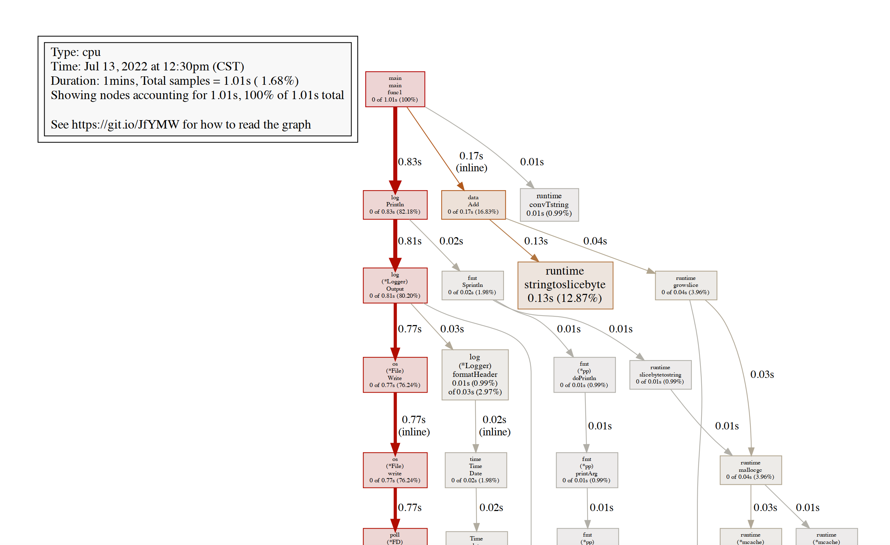
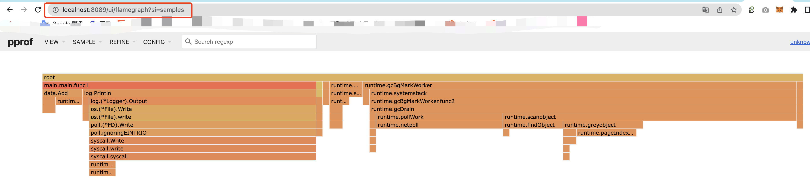
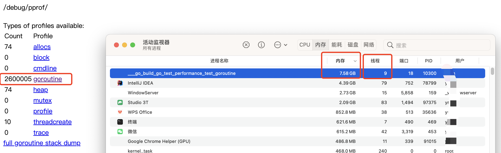
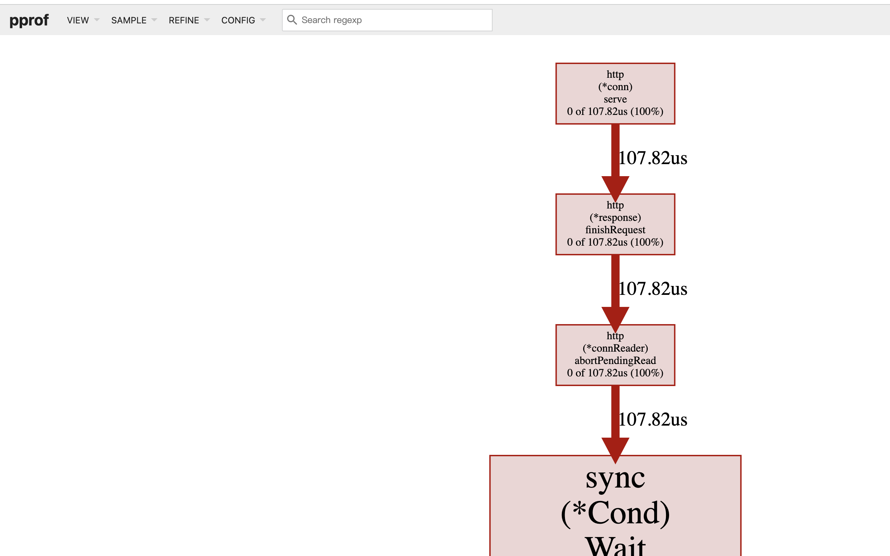
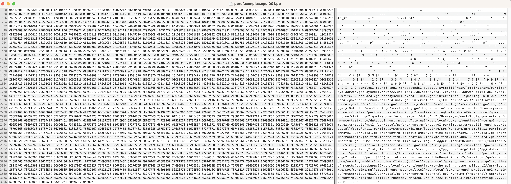
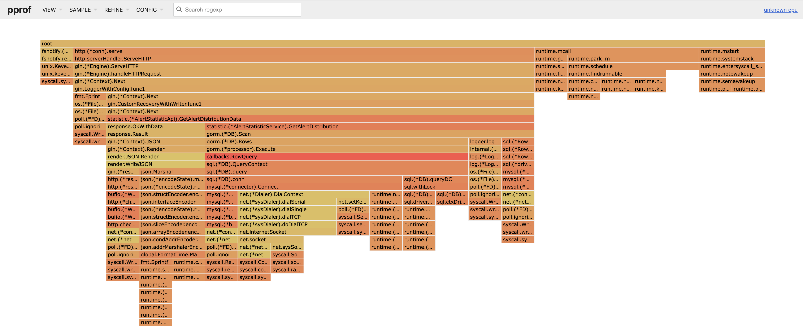

# go 性能测试
## go 单机程序测试
示例程序
```go
package main

import (
	"go-test/performance-test/data"
	"log"
	"net/http"
	_ "net/http/pprof"
)

func main() {
	go func() {
		for {
			log.Println(data.Add("https://github.com/EDDYCJY"))
		}
	}()

	http.ListenAndServe("0.0.0.0:6060", nil)
}

```

`data/data.go`
```go
package data

var datas []string

func Add(str string) string {
	data := []byte(str)
	sData := string(data)
	datas = append(datas, sData)

	return sData
}
```

- ### 通过 Web 界面  
查看当前总览：访问 `http://127.0.0.1:6060/debug/pprof/` 

```shell
/debug/pprof/

Types of profiles available:
Count	Profile
31	allocs
0	block
0	cmdline
20	goroutine
31	heap
0	mutex
0	profile
11	threadcreate
0	trace
full goroutine stack dump
```

这个页面中有许多子页面，咱们继续深究下去，看看可以得到什么？  
- cpu（CPU Profiling）: $HOST/debug/pprof/profile，默认进行 30s 的 CPU Profiling，得到一个分析用的 profile 文件
- block（Block Profiling）：$HOST/debug/pprof/block，查看导致阻塞同步的堆栈跟踪
- goroutine：$HOST/debug/pprof/goroutine，查看当前所有运行的 goroutines 堆栈跟踪
- heap（Memory Profiling）: $HOST/debug/pprof/heap，查看活动对象的内存分配情况
- mutex（Mutex Profiling）：$HOST/debug/pprof/mutex，查看导致互斥锁的竞争持有者的堆栈跟踪
- threadcreate：$HOST/debug/pprof/threadcreate，查看创建新OS线程的堆栈跟踪


- ### 通过交互式终端使用

### 排查CPU占用过高问题  

`go tool pprof http://localhost:6060/debug/pprof/profile\?seconds\=60`  
> 统计60s cpu使用情况  

```shell
Fetching profile over HTTP from http://localhost:6060/debug/pprof/profile?seconds=60
Saved profile in /Users/ymm/pprof/pprof.samples.cpu.001.pb.gz
Type: cpu
Time: Jul 13, 2022 at 12:30pm (CST)
Duration: 1mins, Total samples = 1.01s ( 1.68%)
Entering interactive mode (type "help" for commands, "o" for options)
```

```shell
(pprof) top
Showing nodes accounting for 1.01s, 100% of 1.01s total
Showing top 10 nodes out of 44
      flat  flat%   sum%        cum   cum%
     0.72s 71.29% 71.29%      0.76s 75.25%  syscall.syscall
     0.13s 12.87% 84.16%      0.13s 12.87%  runtime.stringtoslicebyte
     0.04s  3.96% 88.12%      0.04s  3.96%  runtime.memclrNoHeapPointers
     0.03s  2.97% 91.09%      0.04s  3.96%  runtime.exitsyscallfast
     0.03s  2.97% 94.06%      0.03s  2.97%  runtime.memmove
     0.02s  1.98% 96.04%      0.02s  1.98%  time.tzsetOffset
     0.01s  0.99% 97.03%      0.01s  0.99%  internal/poll.(*fdMutex).rwlock
     0.01s  0.99% 98.02%      0.03s  2.97%  log.(*Logger).formatHeader
     0.01s  0.99% 99.01%      0.01s  0.99%  runtime.convTstring
     0.01s  0.99%   100%      0.01s  0.99%  runtime.exitsyscallfast.func1
```

```shell
(pprof) traces
Type: cpu
Time: Jul 13, 2022 at 12:30pm (CST)
Duration: 1mins, Total samples = 1.01s ( 1.68%)
-----------+-------------------------------------------------------
     720ms   syscall.syscall
             syscall.write
             syscall.Write (inline)
             internal/poll.ignoringEINTRIO (inline)
             internal/poll.(*FD).Write
             os.(*File).write (inline)
             os.(*File).Write
             log.(*Logger).Output
             log.Println
             main.main.func1
-----------+-------------------------------------------------------
     130ms   runtime.stringtoslicebyte
             go-test/performance-test/data.Add (inline)
             main.main.func1
-----------+-------------------------------------------------------
      10ms   runtime.convTstring
             main.main.func1
-----------+-------------------------------------------------------
```

查看`Add`函数详情
```shell
(pprof) list Add
Total: 1.01s
ROUTINE ======================== go-test/performance-test/data.Add in /Users/ymm/work/tools/go-test/performance-test/data/data.go
         0      170ms (flat, cum) 16.83% of Total
         .          .      1:package data
         .          .      2:
         .          .      3:var datas []string
         .          .      4:
         .          .      5:func Add(str string) string {
         .      130ms      6:	data := []byte(str)
         .          .      7:	sData := string(data)
         .       40ms      8:	datas = append(datas, sData)
         .          .      9:
         .          .     10:	return sData
         .          .     11:}
```

导出pdf，需要安装`Graphviz`  
```shell
brew install graphviz # for macos
apt install graphviz # for ubuntu
yum install graphviz # for centos
```  

```shell
(pprof) pdf
Generating report in profile001.pdf
```

[pdf文件](res/files/profile001.pdf)  

<br>
<div align=center>
    </img>  
</div>
<br>

#### pprof 离线数据及分析  
准备火焰图数据:  
`go tool pprof http://localhost:6060/debug/pprof/profile -seconds 60`, 生成文件 `pprof.samples.cpu.001.pb.gz`文件  

生成火焰图:  
`go tool pprof -http=:8089 /path/to/pprof.samples.cpu.001.pb.gz`   


火焰图
<br>
<div align=center>
    </img>  
</div>
<br>


离线数据预览  
<br>
<div align=center>
    </img>  
</div>
<br>

help信息
```shell
Commands:
    callgrind        Outputs a graph in callgrind format              
    comments         Output all profile comments
    disasm           Output assembly listings annotated with samples
    dot              Outputs a graph in DOT format
    eog              Visualize graph through eog
    evince           Visualize graph through evince
    gif              Outputs a graph image in GIF format
    gv               Visualize graph through gv
    kcachegrind      Visualize report in KCachegrind
    list             Output annotated source for functions matching regexp
    pdf              Outputs a graph in PDF format
    peek             Output callers/callees of functions matching regexp
    png              Outputs a graph image in PNG format
    proto            Outputs the profile in compressed protobuf format
    ps               Outputs a graph in PS format
    raw              Outputs a text representation of the raw profile
    svg              Outputs a graph in SVG format
    tags             Outputs all tags in the profile
    text             Outputs top entries in text form
    top              Outputs top entries in text form
    topproto         Outputs top entries in compressed protobuf format
    traces           Outputs all profile samples in text form
    tree             Outputs a text rendering of call graph
    web              Visualize graph through web browser
    weblist          Display annotated source in a web browser
    o/options        List options and their current values
    q/quit/exit/^D   Exit pprof
```

### 排查内存占用过高 

`go tool pprof http://localhost:6060/debug/pprof/heap`  生成文件 

```shell
▶ go tool pprof http://localhost:6060/debug/pprof/heap
Fetching profile over HTTP from http://localhost:6060/debug/pprof/heap
Saved profile in /pprof/pprof.alloc_objects.alloc_space.inuse_objects.inuse_space.003.pb.gz
Type: inuse_space
Time: Jul 13, 2022 at 3:33pm (CST)
Entering interactive mode (type "help" for commands, "o" for options)
```

本地浏览器预览`go tool pprof -http=:8089 /pprof/pprof.alloc_objects.alloc_space.inuse_objects.inuse_space.003.pb.gz`  

<br>
<div align=center>
    </img>  
</div>
<br>

```shell
main.main.func1
/Users/ymm/work/tools/go-test/performance-test/main.go

  Total:      3.60GB     4.44GB (flat, cum) 99.81%
      8            .          .           ) 
      9            .          .            
     10            .          .           func main() { 
     11            .          .           	go func() { 
     12            .          .           		for { 
     13       3.60GB     4.44GB           			log.Println(data.Add("https://github.com/EDDYCJY")) 
     14            .          .           		} 
     15            .          .           	}() 
     16            .          .            
     17            .          .           	http.ListenAndServe("0.0.0.0:6060", nil) 
     18            .          .           } 

```

top信息  
```
Flat	Flat%	Sum%	Cum	Cum%	Name	Inlined?
3271.82MB	71.83%	71.83%	3271.82MB	71.83%	go-test/performance-test/data.Add	(inline)
860.03MB	18.88%	90.72%	860.03MB	18.88%	fmt.Sprintln	
414.01MB	9.09%	99.81%	4545.85MB	99.81%	main.main.func1	
0	0.00%	99.81%	860.03MB	18.88%	log.Println
```

### 排查频繁内存回收  

程序运行增加调试变量`GODEBUG=gctrace=1`  
```
gc 1 @0.015s 1%: 0.013+1.1+0.022 ms clock, 0.053+0.22/0.63/0+0.090 ms cpu, 4->4->0 MB, 5 MB goal, 4 P
gc 2 @0.044s 1%: 0.030+2.9+0.080 ms clock, 0.12+0.74/1.0/0+0.32 ms cpu, 4->4->0 MB, 5 MB goal, 4 P
gc 3 @0.073s 1%: 0.069+4.7+0.044 ms clock, 0.27+0.75/1.0/0+0.17 ms cpu, 4->4->0 MB, 5 MB goal, 4 P
gc 4 @0.115s 3%: 1.9+3.1+0.004 ms clock, 7.6+0.84/0.99/0+0.019 ms cpu, 4->4->0 MB, 5 MB goal, 4 P
gc 5 @0.162s 3%: 0.16+5.5+0.042 ms clock, 0.64+1.2/4.0/0+0.17 ms cpu, 4->4->0 MB, 5 MB goal, 4 P
gc 6 @0.202s 4%: 0.69+16+0.003 ms clock, 2.7+1.2/15/0.83+0.015 ms cpu, 4->4->1 MB, 5 MB goal, 4 P
gc 7 @0.244s 4%: 0.10+2.3+0.003 ms clock, 0.40+1.5/1.4/1.5+0.013 ms cpu, 4->4->1 MB, 5 MB goal, 4 P
gc 8 @0.270s 4%: 0.062+6.1+0.049 ms clock, 0.24+0.15/4.5/3.9+0.19 ms cpu, 4->4->1 MB, 5 MB goal, 4 P
gc 9 @0.287s 4%: 0.10+5.3+0.059 ms clock, 0.40+0.44/3.3/0+0.23 ms cpu, 4->4->1 MB, 5 MB goal, 4 P
gc 10 @0.299s 4%: 0.16+2.2+0.039 ms clock, 0.64+0.59/1.9/0.088+0.15 ms cpu, 4->4->1 MB, 5 MB goal, 4 P
gc 11 @0.312s 5%: 0.20+19+0.14 ms clock, 0.80+0.32/10/0+0.56 ms cpu, 4->4->2 MB, 5 MB goal, 4 P
gc 12 @0.389s 6%: 7.8+18+1.7 ms clock, 31+0.68/7.2/0.51+7.1 ms cpu, 4->4->2 MB, 5 MB goal, 4 P

```

`go tool pprof http://localhost:6060/debug/pprof/allocs`  

可以使用`top`,`list`,`web`等方法，我直接使用web页面查看  

采集样本分为三种类型:`alloc_objects`、`alloc_space`、`inuse_objects`、`inuse_space`  
```shell
      Type: inuse_objects
Time: Jul 13, 2022 at 3:55pm (CST)
Showing nodes accounting for 98308, 100% of 98308 total
----------------------------------------------------------+-------------
      flat  flat%   sum%        cum   cum%   calls calls% + context 	 	 
----------------------------------------------------------+-------------
                                             98307   100% |   main.main.func1 /Users/ymm/work/tools/go-test/performance-test/main.go:13 (inline)
     98307   100%   100%      98307   100%                | go-test/performance-test/data.Add /Users/ymm/work/tools/go-test/performance-test/data/data.go:7
----------------------------------------------------------+-------------
                                                 1   100% |   main.main.func1 /Users/ymm/work/tools/go-test/performance-test/main.go:13 (inline)
         1 0.001%   100%          1 0.001%                | go-test/performance-test/data.Add /Users/ymm/work/tools/go-test/performance-test/data/data.go:8
----------------------------------------------------------+-------------
         0     0%   100%      98308   100%                | main.main.func1 /Users/ymm/work/tools/go-test/performance-test/main.go:13
                                             98307   100% |   go-test/performance-test/data.Add /Users/ymm/work/tools/go-test/performance-test/data/data.go:7 (inline)
                                                 1 0.001% |   go-test/performance-test/data.Add /Users/ymm/work/tools/go-test/performance-test/data/data.go:8 (inline)
----------------------------------------------------------+-------------
```

### 排查协程泄露  

由于 golang 自带内存回收，所以一般不会发生内存泄露。但凡事都有例外，在 golang 中，协程本身是可能泄露的，或者叫协程失控，进而导致内存泄露。  

申请多个协程，又不释放，试想一下，如果创建的的协程会永久阻塞，那么泄露的协程数便会持续增加，内存的占用也会持续增加，那迟早是会被操作系统杀死的。  

`go tool pprof http://localhost:6060/debug/pprof/goroutine`  

示例
```go
package main

import (
	"log"
	"net/http"
	_ "net/http/pprof"
	"time"
)

func main() {
	go func() {
		create()
	}()

	http.ListenAndServe("0.0.0.0:6060", nil)
}

func create() {
	for {
		log.Println("goroutine")
		for i := 0; i < 100000; i++ {
			go func() {
				time.Sleep(30 * time.Second)
			}()
		}
		time.Sleep(time.Second)
	}
}

```

查看网站`http://localhost:6060/debug/pprof`   

协程数一直增加
```shell
Types of profiles available:
Count	Profile
0	allocs
0	block
0	cmdline
305	goroutine
0	heap
0	mutex
0	profile
8	threadcreate
0	trace
full goroutine stack dump
```

其中300个都是等待的协程
```shell
goroutine profile: total 305
300 @ 0x103b8a5 0x106e6b2 0x128e210 0x10715e1
#	0x106e6b1	time.Sleep+0xd1		/usr/local/go/src/runtime/time.go:193
#	0x128e20f	main.create.func1+0x2f	/Users/ymm/work/tools/go-test/performance-test/goroutine/main.go:23

1 @ 0x103b8a5 0x103421b 0x106bb95 0x10bf1a5 0x10bfdd5 0x10bfdb7 0x11540cf 0x115f951 0x1224cf9 0x1125128 0x1125e1d 0x1126074 0x11d3cb6 0x1220eca 0x1220ecb 0x122619d 0x122ada5 0x10715e1
#	0x106bb94	internal/poll.runtime_pollWait+0x54		/usr/local/go/src/runtime/netpoll.go:222
#	0x10bf1a4	internal/poll.(*pollDesc).wait+0x44		/usr/local/go/src/internal/poll/fd_poll_runtime.go:87
#	0x10bfdd4	internal/poll.(*pollDesc).waitRead+0x1d4	/usr/local/go/src/internal/poll/fd_poll_runtime.go:92
#	0x10bfdb6	internal/poll.(*FD).Read+0x1b6			/usr/local/go/src/internal/poll/fd_unix.go:166
#	0x11540ce	net.(*netFD).Read+0x4e				/usr/local/go/src/net/fd_posix.go:55
#	0x115f950	net.(*conn).Read+0x90				/usr/local/go/src/net/net.go:183
#	0x1224cf8	net/http.(*connReader).Read+0x1b8		/usr/local/go/src/net/http/server.go:780
#	0x1125127	bufio.(*Reader).fill+0x107			/usr/local/go/src/bufio/bufio.go:101
#	0x1125e1c	bufio.(*Reader).ReadSlice+0x3c			/usr/local/go/src/bufio/bufio.go:360
#	0x1126073	bufio.(*Reader).ReadLine+0x33			/usr/local/go/src/bufio/bufio.go:389
#	0x11d3cb5	net/textproto.(*Reader).readLineSlice+0xd5	/usr/local/go/src/net/textproto/reader.go:57
#	0x1220ec9	net/textproto.(*Reader).ReadLine+0xa9		/usr/local/go/src/net/textproto/reader.go:38
#	0x1220eca	net/http.readRequest+0xaa			/usr/local/go/src/net/http/request.go:1027
#	0x122619c	net/http.(*conn).readRequest+0x19c		/usr/local/go/src/net/http/server.go:966
#	0x122ada4	net/http.(*conn).serve+0x704			/usr/local/go/src/net/http/server.go:1858

```

最终累计线程是2百6十万左右，占用9个线程 

 
<br>
<div align=center>
    </img>  
</div>
<br>

### 排查锁的争用 

`go tool pprof http://localhost:6060/debug/pprof/mutex`  


示例
```go
package main

import (
	"net/http"
	_ "net/http/pprof"
	"runtime"
	"sync"
)

func main() {
	create()
	http.ListenAndServe("0.0.0.0:6060", nil)
}

func create() {
	var mu sync.Mutex
	var items = make(map[int]struct{})

	runtime.SetMutexProfileFraction(5)
	for i := 0; i < 1000*1000; i++ {
		go func(i int) {
			mu.Lock()
			defer mu.Unlock()

			items[i] = struct{}{}
		}(i)
	}
}

```

```shell
--- mutex:
cycles/second=3095995318
sampling period=5
809946051 130021 @ 0x107a688 0x128e0f9 0x10715e1
#	0x107a687	sync.(*Mutex).Unlock+0x47	/usr/local/go/src/sync/mutex.go:190
#	0x128e0f8	main.create.func1+0x98		/Users/ymm/work/tools/go-test/performance-test/goroutine/main.go:26
```

### 排查阻塞操作  
在程序中，除了锁的争用会导致阻塞之外，很多逻辑都会导致阻塞。  

`go tool pprof http://localhost:6060/debug/pprof/block`  

示例代码
```go
package main

import (
	"net/http"
	_ "net/http/pprof"
	"runtime"
	"time"
)

func main() {
	
	runtime.GOMAXPROCS(1) // 限制 CPU 使用数，避免过载
	runtime.SetMutexProfileFraction(5) // 开启对锁调用的跟踪
	runtime.SetBlockProfileRate(1) // 开启对阻塞操作的跟踪

	var chanTest chan string
	go func(test chan string) {
		for {
			create(test)
			time.Sleep(time.Second)
		}
	}(chanTest)

	http.ListenAndServe("0.0.0.0:6060", nil)
}

func create(test chan string) {
	<-test
}

```

```shell
Types of profiles available:
Count	Profile
0	allocs
1	block
0	cmdline
5	goroutine
0	heap
0	mutex
0	profile
7	threadcreate
0	trace
full goroutine stack dump
```


```shell
--- contention:
cycles/second=3096002774
301989 19 @ 0x1078bf9 0x12248d2 0x1229efa 0x122af0b 0x1071681
#	0x1078bf8	sync.(*Cond).Wait+0x98				/usr/local/go/src/sync/cond.go:56
#	0x12248d1	net/http.(*connReader).abortPendingRead+0xb1	/usr/local/go/src/net/http/server.go:720
#	0x1229ef9	net/http.(*response).finishRequest+0x99		/usr/local/go/src/net/http/server.go:1613
#	0x122af0a	net/http.(*conn).serve+0x90a			/usr/local/go/src/net/http/server.go:1937
```

<br>
<div align=center>
    </img>  
</div>
<br>

### pprof文件内容  

`pprof.samples.cpu.001.pb.gz`解压后的文件是`pprof.samples.cpu.001.pb`  


<br>
<div align=center>
    </img>  
</div>
<br>


## go web程序测试

## 集成pprof 
[github.com/gin-contrib/pprof](https://github.com/gin-contrib/pprof)  

```go
go get github.com/gin-contrib/pprof
```

导入:
```go
import "github.com/gin-contrib/pprof"
```

示例:
```go
package main

import (
	"github.com/gin-contrib/pprof"
	"github.com/gin-gonic/gin"
)

func main() {
  router := gin.Default()
  pprof.Register(router)
  router.Run(":3333")
}
```

另外还需要设置超时时间，如果小于采样时间，会有`timeout`错误
```shell
RegisterRoutes(engine)

err := engine.StartServer(&http.Server{
   Addr:              addr,
   ReadTimeout:       time.Second * 90,
   ReadHeaderTimeout: time.Second * 90,
   WriteTimeout:      time.Second * 90,
})
```

查看pprof信息
```shell
$ go tool pprof http://localhost:3333/debug/pprof/profile -seconds 60

Fetching profile over HTTP from http://localhost:3333/debug/pprof/profile
-seconds: open -seconds: no such file or directory
60: open 60: no such file or directory
Fetched 1 source profiles out of 3
Saved profile in /Users/ymm/pprof/pprof.samples.cpu.004.pb.gz
Type: cpu
Time: Jul 14, 2022 at 2:28pm (CST)
Duration: 30s, Total samples = 220ms ( 0.73%)
Entering interactive mode (type "help" for commands, "o" for options)
``` 
<br>

查看数据
```shell
▶ go tool pprof -http=:8089 /pprof/pprof.samples.cpu.004.pb.gz      
Serving web UI on http://localhost:8089
```

<br>
<div align=center>
    </img>  
</div>
<br>


